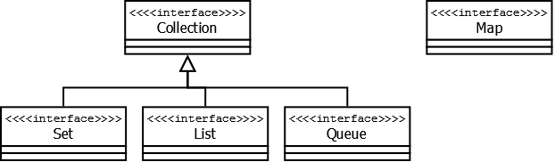
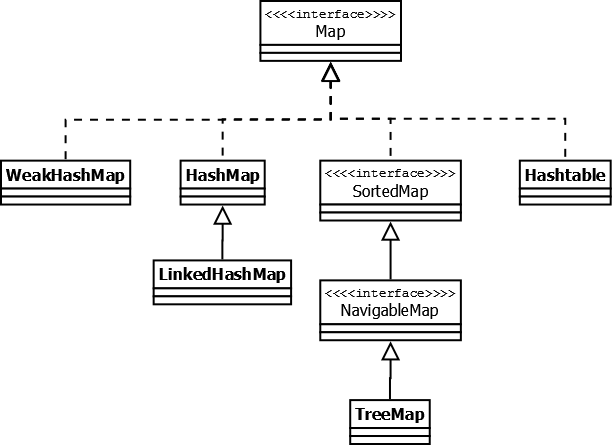
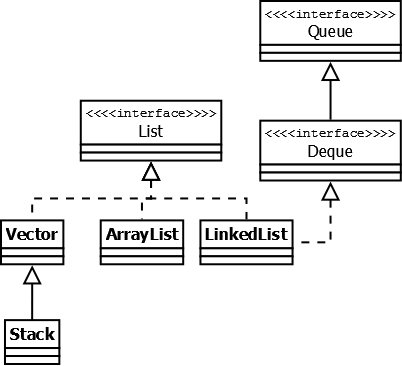
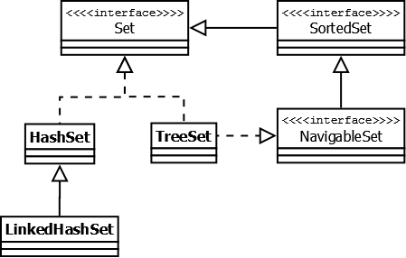
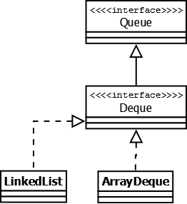
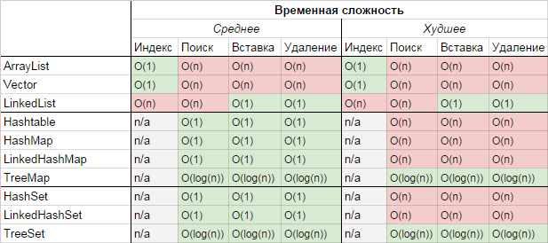
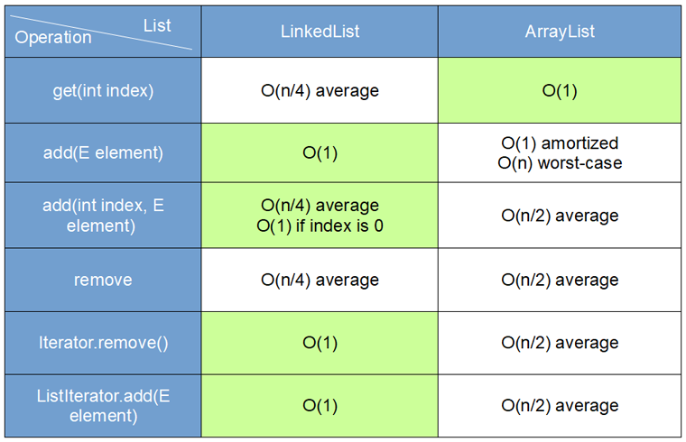

# 1. Что представляют собой дженерики в Java?

Дженерики (Generics) в Java — это механизм, позволяющий создавать классы, интерфейсы и методы с параметризованными типами. Они обеспечивают безопасность типов во время компиляции и позволяют писать более гибкий и переиспользуемый код. Дженерики были введены в Java начиная с версии 5.0.

## Основные аспекты дженериков:

### 1. **Параметризация типов**

Дженерики позволяют создавать классы, интерфейсы и методы, которые могут работать с различными типами данных без необходимости писать код для каждого типа отдельно. Типы данных указываются как параметры в угловых скобках `<>`. Например:

```java
// Обобщенный класс с параметром типа T
class Box<T> {
    private T value;

    public void setValue(T value) {
        this.value = value;
    }

    public T getValue() {
        return value;
    }
}
```

### 2. **Безопасность типов**

Дженерики позволяют обнаруживать ошибки типов на этапе компиляции, а не во время выполнения. Это делает код более безопасным и позволяет избежать ошибок, связанных с неправильными преобразованиями типов.

```java
Box<Integer> intBox = new Box<>();
intBox.setValue(123); // Корректно

// intBox.setValue("Hello"); // Ошибка компиляции: несоответствие типов
```

### 3. **Параметризация методов**

Методы также могут быть параметризованы. Это означает, что типы данных могут быть указаны как параметры метода:

```java
public <T> void printArray(T[] array) {
    for (T element : array) {
        System.out.println(element);
    }
}
```

### 4. **Wildcards (подстановочные знаки)**

Wildcards используются, когда точный тип параметра неизвестен. Существует три вида wildcard'ов:
- `?` — любой тип (unbounded wildcard).
- `? extends T` — тип T или его подтипы (bounded wildcard).
- `? super T` — тип T или его супертипы (lower bounded wildcard).

Пример использования wildcard'ов:

```java
public void processElements(List<? extends Number> list) {
    for (Number n : list) {
        System.out.println(n);
    }
}
```

### 5. **Стирание типов (Type Erasure)**

Java использует механизм стирания типов, что означает, что информация о типах дженериков удаляется во время компиляции. Это необходимо для обеспечения совместимости с версиями Java, существовавшими до появления дженериков. В результате после компиляции дженерики не имеют явной информации о типе, с которым они работают.

```java
List<String> list = new ArrayList<>();
List<Integer> intList = new ArrayList<>();

// Во время выполнения они оба представляют собой просто List:
if (list.getClass() == intList.getClass()) {
    System.out.println("Типы одинаковы");
}
```

### 6. **Ограничения дженериков**

Из-за стирания типов дженерики имеют определенные ограничения, например:
- Нельзя создать экземпляр параметризованного типа: `T obj = new T();` — ошибка компиляции.
- Нельзя использовать примитивные типы в дженериках: `List<int> list = new ArrayList<>();` — ошибка компиляции.
- Нельзя создавать массивы параметризованных типов: `List<String>[] listArray = new List<String>[10];` — ошибка компиляции.

## Заключение

Дженерики в Java предоставляют мощный инструмент для написания универсального, безопасного и повторно используемого кода. Они помогают избегать ошибок, связанных с преобразованием типов, и делают код более читаемым и поддерживаемым.

# 2. Какова цель использования дженериков?

Цель использования дженериков в Java заключается в повышении безопасности типов, улучшении читаемости кода и создании более универсальных и переиспользуемых компонентов. Дженерики помогают разработчикам писать код, который может работать с различными типами данных, обеспечивая при этом строгую типизацию и предотвращая множество ошибок, связанных с преобразованием типов.

## Основные цели использования дженериков:

### 1. **Безопасность типов во время компиляции**

Дженерики обеспечивают проверку типов во время компиляции, что позволяет избежать ошибок, связанных с неправильными преобразованиями типов, которые могли бы проявиться только на этапе выполнения программы. Это делает код более надежным.

Пример:
```java
List<String> strings = new ArrayList<>();
strings.add("Hello");
// strings.add(123); // Ошибка компиляции: типы не соответствуют
```

### 2. **Повторное использование кода**

С помощью дженериков можно создавать универсальные классы, методы и интерфейсы, которые могут работать с любыми типами данных. Это способствует повторному использованию кода и уменьшает дублирование.

Пример:
```java
class Box<T> {
    private T value;

    public void setValue(T value) {
        this.value = value;
    }

    public T getValue() {
        return value;
    }
}

// Класс Box можно использовать для различных типов:
Box<Integer> intBox = new Box<>();
Box<String> strBox = new Box<>();
```

### 3. **Улучшение читаемости и поддерживаемости кода**

Дженерики делают код более читаемым, так как явно указывают на тип данных, с которым работает тот или иной класс или метод. Это облегчает понимание кода, что особенно важно в крупных проектах.

Пример:
```java
Map<String, Integer> map = new HashMap<>();
// Легко понять, что карта хранит строки в качестве ключей и целые числа в качестве значений
```

### 4. **Избежание явных преобразований типов**

Без дженериков разработчики вынуждены были использовать явные преобразования типов, что могло приводить к ошибкам времени выполнения. Дженерики позволяют избежать таких преобразований, делая код более безопасным.

Пример:
```java
// Без дженериков:
List list = new ArrayList();
list.add("Hello");
String str = (String) list.get(0); // Явное приведение типа

// С дженериками:
List<String> list = new ArrayList<>();
list.add("Hello");
String str = list.get(0); // Приведение типа не требуется
```

## Заключение

Использование дженериков в Java направлено на создание более безопасного, универсального и удобного в использовании кода. Дженерики повышают надежность программ за счет строгой проверки типов на этапе компиляции и делают код более чистым и понятным.

# 3. Что такое сырые типы (raw type)?

**Сырые типы** (*raw types*) в Java — это типы, используемые в обобщенных классах и интерфейсах без указания параметров типа. Они представляют собой возможность использования обобщений (дженериков) без фактической типизации.

## Пример сырого типа

Рассмотрим пример обобщенного класса `Box`:

```java
class Box<T> {
    private T value;

    public void setValue(T value) {
        this.value = value;
    }

    public T getValue() {
        return value;
    }
}
```

В нормальной ситуации вы бы использовали этот класс с конкретным типом:

```java
Box<String> stringBox = new Box<>();
stringBox.setValue("Hello");
String value = stringBox.getValue();
```

Однако, вы можете использовать `Box` без указания типа, как показано ниже:

```java
Box rawBox = new Box(); // Сырой тип
rawBox.setValue("Hello");
Object value = rawBox.getValue();
```

В этом случае `rawBox` является экземпляром `Box` с сырым типом.

## Проблемы использования сырых типов

Использование сырых типов может привести к следующим проблемам:

### 1. **Потеря безопасности типов**

Сырые типы позволяют обойти проверку типов на этапе компиляции, что увеличивает вероятность возникновения ошибок времени выполнения. Например:

```java
Box rawBox = new Box();
rawBox.setValue("Hello");
rawBox.setValue(123); // Компилятор не предупреждает о смешении типов
```

Здесь нет предупреждений компилятора о том, что в `rawBox` сначала добавлена строка, а затем целое число, что может привести к неожиданным ошибкам.

### 2. **Неявные преобразования типов**

Поскольку сырые типы не знают о конкретных типах данных, с которыми они работают, возвращаемые значения приходится приводить к нужному типу вручную:

```java
Box rawBox = new Box();
rawBox.setValue("Hello");
String value = (String) rawBox.getValue(); // Необходимо приведение типа
```

Такое приведение типов может привести к исключениям `ClassCastException` на этапе выполнения.

### 3. **Предупреждения компилятора**

При использовании сырых типов компилятор Java обычно генерирует предупреждения (*unchecked warnings*), указывающие на то, что использование обобщенного типа без указания типа небезопасно:

```java
Box rawBox = new Box(); // Предупреждение: unchecked assignment
```

## Когда использовать сырые типы?

Использование сырых типов настоятельно не рекомендуется, так как они снижают безопасность типов и делают код менее понятным и поддерживаемым. Однако, в некоторых случаях, например, при работе с устаревшим кодом или библиотеками, не использующими дженерики, использование сырых типов может быть неизбежным.

## Заключение

Сырые типы в Java позволяют использовать обобщенные классы и интерфейсы без указания конкретных параметров типа. Однако их использование сопряжено с рисками, связанными с потерей безопасности типов и возможными ошибками времени выполнения. Поэтому в современном коде рекомендуется избегать использования сырых типов и всегда указывать параметры типов при работе с дженериками.

# 4. Что такое стирание типов?

**Стирание типов** (*type erasure*) — это процесс, при котором информация о типах дженериков (обобщений) удаляется или "стирается" во время компиляции в Java. Это позволяет сохранить обратную совместимость с кодом, написанным до появления дженериков.

## Основная идея стирания типов

Когда вы используете обобщения (дженерики) в Java, типы, указанные в коде (например, `T` в `List<T>`), существуют только на этапе компиляции. Однако, когда код компилируется в байт-код, JVM не сохраняет информацию о конкретных типах. Вместо этого дженерики заменяются своим основным типом (обычно это `Object`), а при необходимости добавляются проверки типов и приведения.

## Пример стирания типов

Рассмотрим следующий обобщенный класс:

```java
class Box<T> {
    private T value;

    public void setValue(T value) {
        this.value = value;
    }

    public T getValue() {
        return value;
    }
}
```

После компиляции класс `Box<T>` может выглядеть примерно так:

```java
class Box {
    private Object value;

    public void setValue(Object value) {
        this.value = value;
    }

    public Object getValue() {
        return value;
    }
}
```

Тип `T` заменяется на `Object`, что позволяет использовать класс `Box` для любых типов данных. Однако информация о конкретном типе, указанном при создании объекта, теряется.

## Последствия стирания типов

### 1. **Отсутствие информации о типе во время выполнения**

После стирания типов невозможно узнать, с каким конкретным типом работал обобщенный класс или метод. Например:

```java
List<String> stringList = new ArrayList<>();
List<Integer> intList = new ArrayList<>();
```

После компиляции оба списка будут представлены как `List`, и JVM не сможет различить их во время выполнения.

### 2. **Ограничения на использование дженериков с примитивными типами**

Поскольку стирание типов приводит к замене дженериков на объектные типы, вы не можете использовать примитивные типы (например, `int`, `char`) в качестве параметров типа:

```java
List<int> intList = new ArrayList<>(); // Ошибка компиляции
```

### 3. **Ограничения на перегрузку методов**

Из-за стирания типов перегрузка методов с разными параметрами типа может быть невозможна, так как они будут компилироваться в методы с одинаковой сигнатурой:

```java
public void printList(List<String> list) { ... }
public void printList(List<Integer> list) { ... } 
```

Оба метода будут представлены как `printList(List list)`, что приведет к ошибке компиляции.

### 4. **Реализация ограничений на типы (Bounded Types)**

Java поддерживает ограниченные типы, например:

```java
class NumberBox<T extends Number> {
    private T value;
}
```

В этом случае после стирания типов `T` будет заменен на `Number`, что ограничит типы данных, с которыми можно работать.

## Заключение

Стирание типов в Java — это механизм, позволяющий дженерикам сохранять совместимость с устаревшим кодом, не использующим обобщения. Несмотря на преимущества, такие как обратная совместимость, стирание типов приводит к некоторым ограничениям и нюансам, которые необходимо учитывать при разработке. Например, вы не можете получить информацию о типе во время выполнения и должны быть осторожны при перегрузке методов и использовании примитивных типов.

# 5. Как работают вайлдкарды в контексте дженериков?

**Вайлдкарды** (*wildcards*) в дженериках Java — это специальные символы, которые позволяют работать с различными типами параметров обобщенных классов или методов, не указывая конкретный тип. Основной символ вайлдкарда — `?` (вопросительный знак), который означает "любой тип".

## Типы вайлдкардов

### 1. **Неограниченный вайлдкард (`?`)**

Неограниченный вайлдкард `?` позволяет параметризовать тип любым объектным типом. Это удобно, когда конкретный тип значения не важен, но важно, чтобы он был объектным.

Пример использования:

```java
public void printList(List<?> list) {
    for (Object elem : list) {
        System.out.println(elem);
    }
}
```

В данном случае метод `printList` может принимать любой тип списка: `List<String>`, `List<Integer>`, `List<Object>` и так далее.

### 2. **Ограниченный сверху вайлдкард (`? extends Type`)**

Ограниченный сверху вайлдкард `? extends Type` означает, что параметр типа должен быть либо `Type`, либо его подклассом. Это полезно, когда метод должен работать с типами, которые являются наследниками определенного класса или реализуют определенный интерфейс.

Пример использования:

```java
public void processNumbers(List<? extends Number> list) {
    for (Number number : list) {
        System.out.println(number.doubleValue());
    }
}
```

В данном случае метод `processNumbers` может принимать список любых подклассов `Number`, таких как `List<Integer>`, `List<Double>`, `List<Float>` и так далее. Но вы не сможете добавлять элементы в этот список, так как конкретный тип неизвестен.

### 3. **Ограниченный снизу вайлдкард (`? super Type`)**

Ограниченный снизу вайлдкард `? super Type` означает, что параметр типа должен быть либо `Type`, либо его суперклассом. Это полезно, когда нужно добавить элементы в коллекцию, но важно, чтобы все добавляемые элементы были как минимум экземплярами указанного типа.

Пример использования:

```java
public void addIntegers(List<? super Integer> list) {
    list.add(1);
    list.add(2);
    list.add(3);
}
```

Здесь метод `addIntegers` может работать со списками типа `List<Integer>`, `List<Number>`, `List<Object>`, так как `Integer` — это подкласс `Number`, а `Number` — это подкласс `Object`. Можно безопасно добавлять элементы типа `Integer`, так как гарантируется, что список принимает этот тип или его суперклассы.

## Когда использовать вайлдкарды

### 1. **Производство и потребление (PECS)**

Правило **PECS** (*Producer Extends, Consumer Super*) помогает определить, какой тип вайлдкарда использовать:

- Если параметр типа **производит** объекты для вас (например, из него можно получить элементы), используйте `? extends`.
- Если параметр типа **потребляет** объекты от вас (например, вы добавляете элементы в него), используйте `? super`.

### 2. **Гибкость методов**

Вайлдкарды делают методы более гибкими, позволяя использовать их с более широким набором типов. Например, метод `List<? extends Number>` будет работать с любым типом числа, не ограничиваясь конкретным типом `Number`.

## Заключение

Вайлдкарды позволяют работать с дженериками более гибко, предоставляя возможность использовать обобщенные методы и классы с различными типами. Используя неограниченные, ограниченные сверху и ограниченные снизу вайлдкарды, можно создавать методы, которые могут обрабатывать широкий спектр типов, обеспечивая при этом безопасность типов и простоту использования.

# 6. Объясните принцип PECS в контексте дженериков.

**PECS** — это акроним, который расшифровывается как **Producer Extends, Consumer Super**. Этот принцип помогает правильно выбирать типы дженериков с использованием вайлдкардов (`? extends T` и `? super T`), когда создаются обобщенные методы или классы.

## Основная идея PECS

- **Producer Extends** (`? extends T`) — если параметр типа **производит** данные, то используйте ограничение сверху `extends`. Это означает, что метод или класс предоставляет (возвращает) элементы типа `T` или его подтипов.

- **Consumer Super** (`? super T`) — если параметр типа **потребляет** данные, то используйте ограничение снизу `super`. Это означает, что метод или класс принимает (добавляет) элементы типа `T` или его супертипов.

## Примеры использования PECS

### 1. **Producer Extends** (`? extends T`)

Предположим, что у нас есть метод, который возвращает элементы из коллекции:

```java
public static void copy(List<? extends Number> source, List<? super Number> dest) {
    for (Number num : source) {
        dest.add(num);
    }
}
```

В этом примере `source` — это производитель (Producer), и он использует `? extends Number`. Это значит, что мы можем передать `List<Integer>`, `List<Double>`, `List<Float>` и любые другие списки, содержащие подклассы `Number`, чтобы получить элементы из этой коллекции.

### 2. **Consumer Super** (`? super T`)

Предположим, что у нас есть метод, который добавляет элементы в коллекцию:

```java
public static void addNumbers(List<? super Integer> list) {
    list.add(1);
    list.add(2);
    list.add(3);
}
```

В этом примере `list` — это потребитель (Consumer), и он использует `? super Integer`. Это значит, что мы можем передать `List<Integer>`, `List<Number>`, `List<Object>` и любые другие списки, в которые можно добавлять объекты типа `Integer`.

## Почему PECS важен?

PECS помогает избежать ошибок компиляции и неправильного использования типов, делая код с дженериками более безопасным и понятным. Например:

- **Producer Extends** (`? extends T`) гарантирует, что мы не будем пытаться добавить элемент в коллекцию, так как конкретный тип неизвестен.
- **Consumer Super** (`? super T`) гарантирует, что мы можем безопасно добавлять элементы в коллекцию, так как она принимает типы `T` или их суперклассы.

## Заключение

Принцип PECS — это простой, но мощный инструмент для правильного использования дженериков и вайлдкардов в Java. Он помогает определить, какие типы должны использоваться в обобщенных методах или классах, в зависимости от того, являются ли параметры типа производителями или потребителями данных. Соблюдение этого принципа позволяет писать более безопасный и гибкий код.

### 7. Что означает термин "коллекция" в Java?

В Java термин "коллекция" (`Collection`) обозначает структуру данных, которая представляет собой группу объектов, называемых элементами. Коллекции предоставляют стандартный способ работы с группами объектов, позволяя добавлять, удалять, перебирать элементы и выполнять другие операции.

Коллекции являются частью Java Collections Framework, которая предоставляет унифицированную архитектуру для хранения и манипуляции группами объектов. Коллекции в Java делятся на несколько категорий, таких как списки (`List`), множества (`Set`), очереди (`Queue`) и карты (`Map`), каждая из которых служит для разных задач и реализует различные интерфейсы.

#### Основные интерфейсы коллекций:
- **`Collection<E>`**: Основной интерфейс, от которого наследуются большинство других коллекций.
  - **`List<E>`**: Интерфейс для коллекций, упорядоченных в виде последовательности элементов, которые могут дублироваться. Примеры: `ArrayList`, `LinkedList`.
  - **`Set<E>`**: Интерфейс для коллекций, которые не содержат повторяющихся элементов. Примеры: `HashSet`, `TreeSet`.
  - **`Queue<E>`**: Интерфейс для коллекций, организованных по принципу очереди. Примеры: `LinkedList`, `PriorityQueue`.

#### Карты:
- **`Map<K, V>`**: Интерфейс, представляющий отображение (ассоциативный массив) ключей на значения. Примеры: `HashMap`, `TreeMap`.

Коллекции облегчают работу с данными, предоставляя стандартные операции и методы для управления группами объектов, такими как добавление, удаление, поиск, сортировка и фильтрация.

# 8. Расскажите про иерархию коллекций в Java.

Источник: https://habr.com/ru/articles/237043/

## Что такое Java Collections Framework?

Java Collection Framework — иерархия интерфейсов и их реализаций, которая является частью JDK и позволяет разработчику пользоваться большим количесвом структур данных из «коробки».

## Базовые понятия

На вершине иерархии JCF располагаются два интерфейса: `Collection` и `Map`. Эти интерфейсы разделяют все коллекции на две группы:

1. **Простые последовательные наборы элементов**
2. **Наборы пар "ключ — значение" (словари)**

### Интерфейс `Collection`



- **Описание:** Этот интерфейс находится в составе JDK c версии **Java 1.2** и определяет основные методы работы с простыми наборами элементов, которые будут общими для всех его реализаций (например `size()`, `isEmpty()`, `add(E e)` и др.). Интерфейс был слегка доработан с приходом дженериков в **Java 1.5**. Также, в версии **Java 8**, было добавлено несколько новых методов для работы с лямбдами (такие как `stream()`, `parallelStream()`, `removeIf(Predicate<? super E> filter)` и др.).

Важно также отметить, что эти методы были реализованы непосредственно в интерфейсе как `default`-методы.

### Интерфейс `Map`



- **Описание:** Данный интерфейс также находится в составе JDK c версии **Java 1.2** и предоставляет разработчику базовые методы для работы с данными вида «ключ — значение».Также как и `Collection`, он был дополнен дженериками в версии **Java 1.5** и в версии **Java 8** появились дополнительные методы для работы с лямбдами, а также методы, которые зачастую реализовались в логике приложения (`getOrDefault(Object key, V defaultValue)`, `putIfAbsent(K key, V value)`).

## Реализации интерфейса `Map`

### `Hashtable`

- **Описание:** Реализация такой структуры данных, как хэш-таблица. Она не позволяет использовать `null` в качестве значения или ключа. Эта коллекция была реализована раньше, чем **Java Collection Framework**, но в последствии была включена в его состав. Как и другие коллекции из **Java 1.0**, `Hashtable` является синхронизированной (почти все методы помечены как `synchronized`). Из-за этой особенности у неё имеются существенные проблемы с производительностью и, начиная с **Java 1.2**, в большинстве случаев рекомендуется использовать другие реализации интерфейса `Map` ввиду отсутствия у них синхронизации.

### `HashMap`

- **Описание:** Коллекция является альтернативой `Hashtable`. Двумя основными отличиями от `Hashtable` являются то, что `HashMap` не синхронизирована и `HashMap` позволяет использовать `null` как в качестве ключа, так и значения. Так же как и `Hashtable`, данная коллекция не является упорядоченной: порядок хранения элементов зависит от хэш-функции. Добавление элемента выполняется за константное время `O(1)`, но время удаления, получения зависит от распределения хэш-функции. В идеале является константным, но может быть и линейным `O(n)`.

### `LinkedHashMap`

- **Описание:** Это упорядоченная реализация хэш-таблицы. Здесь, в отличии от `HashMap`, порядок итерирования равен порядку добавления элементов. Данная особенность достигается благодаря двунаправленным связям между элементами (аналогично `LinkedList`). Но это преимущество имеет также и недостаток — увеличение памяти, которое занимет коллекция. 

### `TreeMap`

- **Описание:** Реализация `Map` основанная на **красно-чёрных деревьях**. Как и `LinkedHashMap` является упорядоченной. По-умолчанию, коллекция сортируется по ключам с использованием принципа **"natural ordering"**, но это поведение может быть настроено под конкретную задачу при помощи объекта `Comparator`, который указывается в качестве параметра при создании объекта `TreeMap`.

### `WeakHashMap`

- **Описание:** Реализация хэш-таблицы, которая организована с использованием **weak references**. Другими словами, **Garbage Collector** автоматически удалит элемент из коллекции при следующей сборке мусора, если на ключ этого элеметна нет жёстких ссылок. 

## Реализации интерфейса `List`



Реализации этого интерфейса представляют собой упорядоченные коллекции. Кроме того, разработчику предоставляется возможность доступа к элементам коллекции по индексу и по значению (так как реализации позволяют хранить дубликаты, результатом поиска по значению будет первое найденное вхождение).

### `Vector`

- **Описание:** Реализация динамического массива объектов. Позволяет хранить любые данные, включая `null` в качестве элемента. `Vector` появился в JDK версии **Java 1.0**, но как и `Hashtable`, эту коллекцию не рекомендуется использовать, если не требуется достижения потокобезопасности. Потому как в `Vector`, в отличии от других реализаций `List`, все операции с данными являются синхронизированными. В качестве альтернативы часто применяется аналог — `ArrayList`.

### `Stack`

- **Описание:** Данная коллекция является расширением коллекции `Vector`. Была добавлена в **Java 1.0** как реализация стека **LIFO (last-in-first-out)**. Является частично синхронизированной коллекцией (кроме метода добавления `push()`). После добавления в **Java 1.6** интерфейса `Deque`, рекомендуется использовать именно реализации этого интерфейса, например `ArrayDeque`.

### `ArrayList`

- **Описание:** Как и `Vector` является реализацией динамического массива объектов. Позволяет хранить любые данные, включая `null` в качестве элемента. Как можно догадаться из названия, его реализация основана на обычном массиве. Данную реализацию следует применять, если в процессе работы с коллекцией предплагается частое обращение к элементам по индексу. Из-за особенностей реализации поиндексное обращение к элементам выполняется за константное время `O(1)`. Но данную коллекцию рекомендуется избегать, если требуется частое удаление/добавление элементов в середину коллекции.

### `LinkedList`

- **Описание:** Ещё одна реализация `List`. Позволяет хранить любые данные, включая `null`. Особенностью реализации данной коллекции является то, что в её основе лежит двунаправленный связный список (каждый элемент имеет ссылку на предыдущий и следующий). Благодаря этому, добавление и удаление из середины, доступ по индексу, значению происходит за линейное время `O(n)`, а из начала и конца за константное `O(1)`. Так же, ввиду реализации, данную коллекцию можно использовать как стек или очередь. Для этого в ней реализованы соответствующие методы. 

## Реализации интерфейса `Set`



Представляет собой неупорядоченную коллекцию, которая не может содержать дублирующиеся данные. Является программной моделью математического понятия «множество».

### `HashSet`

- **Описание:** Реализация интерфейса `Set`, базирующаяся на `HashMap`. Внутри использует объект `HashMap` для хранения данных. В качестве ключа используется добавляемый элемент, а в качестве значения — объект-пустышка (`new Object()`). Из-за особенностей реализации порядок элементов не гарантируется при добавлении.

### `LinkedHashSet`

- **Описание:** Отличается от `HashSet` только тем, что в основе лежит `LinkedHashMap` вместо `HashMap`. Благодаря этому отличию порядок элементов при обходе коллекции является идентичным порядку добавления элементов.

### `TreeSet`

- **Описание:** Аналогично другим классам-реализациям интерфейса `Set` содержит в себе объект `NavigableMap`, что и обуславливает его поведение. Предоставляет возможность управлять порядком элементов в коллекции при помощи объекта `Comparator`, либо сохраняет элементы с использованием **"natural ordering"**.

## Реализации интерфейса `Queue`



Этот интерфейс описывает коллекции с предопределённым способом вставки и извлечения элементов, а именно — очереди **FIFO (first-in-first-out)**. Помимо методов, определённых в интерфейсе `Collection`, определяет дополнительные методы для извлечения и добавления элементов в очередь. Большинство реализаций данного интерфейса находится в пакете `java.util.concurrent`.

### `PriorityQueue`

- **Описание:** Является единственной прямой реализацией интерфейса `Queue` (была добавлена, как и интерфейс `Queue`, в **Java 1.5**), не считая класса `LinkedList`, который так же реализует этот интерфейс, но был реализован намного раньше. Особенностью данной очереди является возможность управления порядком элементов. По-умолчанию, элементы сортируются с использованием **«natural ordering»**, но это поведение может быть переопределено при помощи объекта `Comparator`, который задаётся при создании очереди. Данная коллекция не поддерживает `null` в качестве элементов.

### `ArrayDeque`

- **Описание:** Реализация интерфейса `Deque`, который расширяет интерфейс `Queue` методами, позволяющими реализовать конструкцию вида **LIFO (last-in-first-out)**. Интерфейс `Deque` и реализация `ArrayDeque` были добавлены в **Java 1.6**. Эта коллекция представляет собой реализацию с использованием массивов, подобно `ArrayList`, но не позволяет обращаться к элементам по индексу и хранение `null`. Как заявлено в документации, коллекция работает быстрее чем `Stack`, если используется как **LIFO** коллекция, а также быстрее чем `LinkedList`, если используется как **FIFO**.

## Заключение

**Java Collections Framework** содержит большое количество различных структур данных, доступных в JDK «из коробки», которые в большинстве случаев покрывают все потребности при реализации логики приложения. Сравнение временных характеристик основных коллекций, которые зачастую используются в разработке приложений приведено в таблице:



При необходимости, разработчик может создать собственную реализацию, расширив или переопределив существующую логику, либо создав свою собственную реализацию подходящего интерфейса с нуля. Также существует некоторое количество готовых решений, которые являются альтернативой или дополнением к **Java Collections Framework**. Наиболее популярными являются **Google Guava** и **Commons Collections**.

Для создания собственных реализаций или использования альтернативных решений можно рассмотреть библиотеки, такие как **Google Guava** и **Commons Collections**.

# 9. Почему Map не является подтипом Collection, в отличие от List и Set?

Интерфейс `Map<K, V>` в Java не является подтипом интерфейса `Collection<E>` по нескольким важным причинам, связанным с различиями в структуре данных и их предназначением.

## 1. **Различие в структуре данных**

- **`Collection<E>`**: 
  - Интерфейс `Collection` представляет собой набор элементов (объектов), где каждый элемент имеет единственное значение. Примеры подтипов `Collection` включают `List`, `Set` и `Queue`. Эти коллекции оперируют над отдельными объектами, и ключевым понятием является "элемент".
  
- **`Map<K, V>`**: 
  - Интерфейс `Map` представляет собой набор пар "ключ-значение", где каждый ключ сопоставлен с одним значением. В отличие от `Collection`, ключевым понятием здесь является "пара ключ-значение". В `Map` важен не только объект, но и его связь с другим объектом через ключ.

## 2. **Отсутствие общей структуры**

- В интерфейсе `Collection` предусмотрены методы, такие как `add`, `remove`, `contains`, которые работают с единичными элементами. Однако эти методы не применимы к `Map`, так как операции над `Map` включают манипуляции с парами "ключ-значение", а не с отдельными объектами.
- В `Map`, например, операции `put`, `get`, `remove` требуют ключа для выполнения операции, что фундаментально отличается от работы с коллекциями, которые оперируют над одиночными элементами.

## 3. **Разные интерфейсы для разных задач**

- **`Collection`**: Основная цель — предоставление унифицированного интерфейса для работы с группами объектов, где каждый объект независим.
- **`Map`**: Основная цель — предоставление интерфейса для работы с ассоциативными массивами, где каждый объект связан с другим через ключ.

## Заключение

Интерфейсы `Map<K, V>` и `Collection<E>` решают разные задачи и имеют различные модели работы с данными. Это структурное различие делает невозможным реализацию `Map` как подтипа `Collection`, так как это привело бы к некорректным или неопределенным операциям над данными.

# 10. Какие различия между `java.util.Collection` и `java.util.Collections`?

`java.util.Collection` и `java.util.Collections` — это два разных компонента в Java, которые выполняют различные функции и играют разные роли в работе с коллекциями. Рассмотрим их отличия:

## 1. **`java.util.Collection`**

### Описание
- **`Collection`** — это интерфейс, который является основой для всех коллекций в Java. Он определяет методы для работы с наборами объектов.

### Основные характеристики:
- **Часть иерархии коллекций**: `Collection` является базовым интерфейсом для других интерфейсов коллекций, таких как `List`, `Set`, и `Queue`.
- **Методы интерфейса**: Интерфейс `Collection` определяет основные методы, такие как `add()`, `remove()`, `size()`, `contains()`, `isEmpty()` и другие, которые реализуются всеми коллекциями.
- **Реализация коллекций**: Конкретные коллекции, такие как `ArrayList`, `HashSet`, и `LinkedList`, реализуют интерфейс `Collection` или его подтипы (`List`, `Set`, и т.д.).

### Пример:
```java
Collection<String> list = new ArrayList<>();
list.add("Hello");
list.add("World");
```

## 2. **`java.util.Collections`**

### Описание
- **`Collections`** — это класс утилит, который предоставляет статические методы для работы с коллекциями. Этот класс не содержит данных и не может быть использован для хранения элементов, а только для выполнения операций над коллекциями.

### Основные характеристики:
- **Методы-утилиты**: Класс `Collections` предоставляет множество статических методов, таких как `sort()`, `reverse()`, `shuffle()`, `min()`, `max()`, `synchronizedList()`, и другие.
- **Модификация и создание коллекций**: С помощью методов класса `Collections` можно выполнять операции над коллекциями, такие как сортировка, обратный порядок, синхронизация и создание неизменяемых коллекций (`unmodifiableList()`).
- **Обеспечение безопасности потоков**: Некоторые методы в классе `Collections` предоставляют потоко-безопасные версии коллекций, такие как `synchronizedList()` или `synchronizedMap()`.

### Пример:
```java
List<String> list = new ArrayList<>();
list.add("Hello");
list.add("World");

// Сортировка списка
Collections.sort(list);

// Создание неизменяемого списка
List<String> unmodifiableList = Collections.unmodifiableList(list);
```

## Заключение

- **`Collection`** — это интерфейс, определяющий поведение коллекций, таких как `List`, `Set`, и `Queue`. Он служит основой для всех коллекций в Java.
- **`Collections`** — это класс утилит, предоставляющий статические методы для работы с коллекциями, такими как сортировка, синхронизация, создание неизменяемых коллекций и другие операции.

Эти два компонента, хотя и связаны с коллекциями, выполняют совершенно разные роли в языке Java.

# 11. Как отличается итератор с `fail-fast` от итератора с `fail-safe` поведением? Приведите примеры.

В Java существуют два типа поведения итераторов при изменении коллекции во время итерации: `fail-fast` и `fail-safe`. Они отличаются тем, как они реагируют на изменения коллекции (например, добавление или удаление элементов) во время итерации.

## 1. **Итератор с поведением `fail-fast`**

### Описание
- Итераторы с `fail-fast` поведением бросают исключение `ConcurrentModificationException`, если во время итерации по коллекции структура коллекции изменяется. Под "изменением структуры" понимаются такие операции, как добавление, удаление или изменение элементов коллекции.

### Характеристики
- **Высокая производительность**: Эти итераторы очень быстры, так как они работают напрямую с коллекцией без создания её копии.
- **Не потокобезопасны**: Эти итераторы не безопасны для использования в многопоточной среде без внешней синхронизации.
- **Примеры коллекций**: Все коллекции из `java.util`, такие как `ArrayList`, `HashSet`, `HashMap`, используют `fail-fast` итераторы.

### Пример использования:
```java
List<String> list = new ArrayList<>();
list.add("A");
list.add("B");
list.add("C");

Iterator<String> iterator = list.iterator();
while (iterator.hasNext()) {
    String value = iterator.next();
    System.out.println(value);

    // Попытка изменения коллекции во время итерации
    if (value.equals("B")) {
        list.remove(value); // Это вызовет ConcurrentModificationException
    }
}
```

### Поведение:
- В приведенном примере будет выброшено исключение `ConcurrentModificationException`, когда программа попытается удалить элемент `B` из списка во время его итерации.

## 2. **Итератор с поведением `fail-safe`**

### Описание
- Итераторы с `fail-safe` поведением не бросают исключение при изменении коллекции во время итерации. Вместо этого они работают с копией оригинальной коллекции, что позволяет избежать проблем с модификацией.

### Характеристики
- **Низкая производительность**: Из-за создания копии коллекции такие итераторы менее эффективны по сравнению с `fail-fast` итераторами.
- **Потокобезопасность**: Эти итераторы безопасны для использования в многопоточной среде.
- **Примеры коллекций**: Коллекции из `java.util.concurrent`, такие как `CopyOnWriteArrayList`, `ConcurrentHashMap`, используют `fail-safe` итераторы.

### Пример использования:
```java
CopyOnWriteArrayList<String> list = new CopyOnWriteArrayList<>();
list.add("A");
list.add("B");
list.add("C");

Iterator<String> iterator = list.iterator();
while (iterator.hasNext()) {
    String value = iterator.next();
    System.out.println(value);

    // Попытка изменения коллекции во время итерации
    if (value.equals("B")) {
        list.remove(value); // Это не вызовет исключение
    }
}
```

### Поведение:
- В этом примере удаление элемента `B` из списка не вызовет исключение, и итерация будет продолжена без каких-либо проблем, так как итератор работает с копией списка.

## Заключение

- **Итераторы с `fail-fast` поведением** бросают исключение `ConcurrentModificationException` при попытке модификации коллекции во время итерации. Это поведение характерно для большинства стандартных коллекций в Java.
- **Итераторы с `fail-safe` поведением** работают с копией коллекции и позволяют модифицировать коллекцию во время итерации без выбрасывания исключений. Такие итераторы обычно используются в многопоточных коллекциях из пакета `java.util.concurrent`.

# 12. В чем разница между `Enumeration` и `Iterator`?

`Enumeration` и `Iterator` — это интерфейсы, используемые для обхода элементов коллекций в Java. Несмотря на то, что они служат схожей цели, они обладают различиями как в функциональности, так и в применении. Ниже приведено сравнение этих двух интерфейсов:

## 1. **Происхождение и использование**
- **`Enumeration`**:
  - Введен в JDK 1.0.
  - Используется в основном в старых коллекциях, таких как `Vector` и `Hashtable`.
  - Считается устаревшим в современном программировании на Java, хотя все еще используется в некоторых специфических сценариях.
  
- **`Iterator`**:
  - Введен в JDK 1.2 как часть фреймворка коллекций Java.
  - Поддерживается всеми современными коллекциями, такими как `ArrayList`, `HashSet`, и `HashMap`.
  - Рекомендуется для использования в новых разработках.

## 2. **Функциональность**
- **`Enumeration`**:
  - Предоставляет две основные операции:
    - `hasMoreElements()`: проверяет, есть ли еще элементы для итерации.
    - `nextElement()`: возвращает следующий элемент.
  - **Не поддерживает** операции модификации коллекции (например, удаление элементов) во время итерации.

- **`Iterator`**:
  - Предоставляет три основные операции:
    - `hasNext()`: проверяет, есть ли еще элементы для итерации.
    - `next()`: возвращает следующий элемент.
    - `remove()`: удаляет последний возвращенный элемент из коллекции.
  - Поддерживает безопасное удаление элементов во время итерации (если коллекция поддерживает удаление).

## 3. **Безопасность**
- **`Enumeration`**:
  - **Не является `fail-fast`**: не бросает исключение, если коллекция изменяется во время итерации.
  - Это делает `Enumeration` менее безопасным в многопоточной среде, так как изменения в коллекции могут привести к непредсказуемым результатам.
  
- **`Iterator`**:
  - **`fail-fast` механизм**: бросает `ConcurrentModificationException`, если коллекция изменяется структурно во время итерации, что делает итерацию более безопасной.
  - Этот механизм помогает выявить ошибки на этапе разработки, если коллекция модифицируется неправомерным образом во время итерации.

## 4. **Пример использования**

### Пример использования `Enumeration`:
```java
Vector<String> vector = new Vector<>();
vector.add("A");
vector.add("B");
vector.add("C");

Enumeration<String> enumeration = vector.elements();
while (enumeration.hasMoreElements()) {
    System.out.println(enumeration.nextElement());
}
```

### Пример использования `Iterator`:
```java
List<String> list = new ArrayList<>();
list.add("A");
list.add("B");
list.add("C");

Iterator<String> iterator = list.iterator();
while (iterator.hasNext()) {
    String element = iterator.next();
    System.out.println(element);
    
    if (element.equals("B")) {
        iterator.remove();  // Удаляет текущий элемент
    }
}
```

## 5. **Совместимость**
- **`Enumeration`**:
  - Применяется в старых API и для обхода элементов `Vector` и `Hashtable`.
  - Менее функционален и удобен, по сравнению с `Iterator`.

- **`Iterator`**:
  - Совместим со всеми новыми коллекциями и используется в современном фреймворке коллекций.
  - Предоставляет более гибкий и безопасный способ итерации по коллекциям.

## Заключение

- `Enumeration` — это устаревший интерфейс, предоставляющий базовую функциональность для итерации по элементам коллекций, без поддержки удаления элементов и механизмов защиты от изменений коллекции.
- `Iterator` — это современный и более функциональный интерфейс, поддерживающий безопасное удаление элементов во время итерации и включающий механизм `fail-fast` для обнаружения изменений коллекции. В новых разработках рекомендуется использовать `Iterator`, а не `Enumeration`.

# 13. Как связаны между собой интерфейсы Iterable, Iterator и "for-each"?

В Java интерфейсы `Iterable`, `Iterator` и конструкция "for-each" тесно связаны между собой и используются для упрощения перебора элементов коллекций.

## 1. Интерфейс `Iterable`

Интерфейс `Iterable` является фундаментальным интерфейсом, который должен реализовать любой класс, чтобы его объекты могли быть использованы в конструкции "for-each". `Iterable` определяет один метод:

```java
public interface Iterable<T> {
    Iterator<T> iterator();
}
```

Этот метод возвращает объект `Iterator`, который предоставляет средства для последовательного перебора элементов коллекции.

## 2. Интерфейс `Iterator`

Интерфейс `Iterator` определяет методы для итерации по элементам коллекции:

```java
public interface Iterator<E> {
    boolean hasNext();  // Проверяет, есть ли следующий элемент
    E next();           // Возвращает следующий элемент
    void remove();      // Удаляет текущий элемент (необязательный метод)
}
```

- **`hasNext()`**: Проверяет, есть ли в коллекции следующий элемент для итерации.
- **`next()`**: Возвращает следующий элемент в коллекции.
- **`remove()`**: Удаляет текущий элемент, который был возвращен методом `next()`. Этот метод является необязательным и может не поддерживаться итератором.

## 3. Конструкция "for-each"

Конструкция "for-each" (`enhanced for-loop`) является синтаксическим сахаром в Java, который позволяет упростить перебор элементов коллекции. Она работает с любым объектом, реализующим интерфейс `Iterable`.

Пример:

```java
List<String> list = new ArrayList<>();
list.add("A");
list.add("B");
list.add("C");

for (String element : list) {
    System.out.println(element);
}
```

Под капотом конструкция "for-each" используется следующим образом:

1. Вызов метода `iterator()` на объекте, который реализует `Iterable`.
2. Последовательный вызов методов `hasNext()` и `next()` на возвращаемом итераторе.
3. Автоматическая обработка исключений и правильное завершение итерации.

Этот цикл эквивалентен следующему коду:

```java
for (Iterator<String> iterator = list.iterator(); iterator.hasNext(); ) {
    String element = iterator.next();
    System.out.println(element);
}
```

## Связь между `Iterable`, `Iterator` и "for-each"

- **`Iterable`**: Интерфейс, который должны реализовать коллекции, чтобы поддерживать "for-each". Он предоставляет метод `iterator()`, который возвращает `Iterator`.
- **`Iterator`**: Интерфейс, который предоставляет методы для итерации по коллекции. Этот интерфейс используется внутри конструкции "for-each".
- **"for-each"**: Синтаксический сахар, который автоматически использует `Iterator` для упрощения перебора коллекций.

## Заключение

- **`Iterable`**: Делает коллекцию итерируемой, предоставляя метод `iterator()`.
- **`Iterator`**: Предоставляет средства для последовательного доступа к элементам коллекции.
- **"for-each"**: Упрощает перебор элементов коллекции, скрывая детали работы с итератором.

# 14. Можно ли удалить элемент, итерируясь по ArrayList? Какая исключительная ситуация может возникнуть?

Да, в Java можно удалять элементы из `ArrayList` во время итерации, но для этого необходимо соблюдать определенные правила, чтобы избежать исключительных ситуаций.

## Удаление элементов с помощью `Iterator`

Если вы хотите удалять элементы из `ArrayList` во время итерации, рекомендуется использовать итератор (`Iterator`). Это единственный безопасный способ удалить элементы из коллекции во время итерации, так как `Iterator` предоставляет метод `remove()` специально для этой цели.

Пример:

```java
import java.util.ArrayList;
import java.util.Iterator;

public class Example {
    public static void main(String[] args) {
        ArrayList<String> list = new ArrayList<>();
        list.add("A");
        list.add("B");
        list.add("C");

        Iterator<String> iterator = list.iterator();
        while (iterator.hasNext()) {
            String element = iterator.next();
            if (element.equals("B")) {
                iterator.remove(); // Удаление элемента
            }
        }

        System.out.println(list); // [A, C]
    }
}
```

## Исключение `ConcurrentModificationException`

Если вы попытаетесь удалить элемент из `ArrayList` во время итерации другим способом, например, напрямую через метод `remove()` у списка, это приведет к выбросу исключения `ConcurrentModificationException`.

Пример кода, который вызывает исключение:

```java
import java.util.ArrayList;

public class Example {
    public static void main(String[] args) {
        ArrayList<String> list = new ArrayList<>();
        list.add("A");
        list.add("B");
        list.add("C");

        for (String element : list) {
            if (element.equals("B")) {
                list.remove(element); // Это вызовет ConcurrentModificationException
            }
        }
    }
}
```

## Причина возникновения `ConcurrentModificationException`

Исключение `ConcurrentModificationException` возникает, когда коллекция изменяется во время итерации над ней обычным циклом, "for-each" или вручную через `Iterator`, но без использования метода `remove()` итератора. Это происходит потому, что большинство коллекций в Java используют механизм fail-fast, который предназначен для обнаружения несогласованных изменений в коллекции и выброса исключения, чтобы предотвратить непредсказуемое поведение.

## Заключение

- **Удаление с помощью `Iterator.remove()`:** Безопасный и рекомендуемый способ удаления элементов во время итерации.
- **Удаление с помощью методов коллекции (например, `remove()`):** Может вызвать `ConcurrentModificationException`, если это происходит во время итерации, поэтому использовать такие методы во время итерации не рекомендуется.

Следуя этим правилам, вы можете безопасно модифицировать коллекции во время их перебора.

# 15. Как ведет себя коллекция при использовании метода `iterator.remove()`?

Метод `iterator.remove()` позволяет удалить текущий элемент из коллекции во время итерации с использованием итератора. Однако его использование требует осторожности, поскольку неправильное применение может привести к исключениям или некорректному поведению коллекции.

## Как работает `iterator.remove()`

Когда вы вызываете метод `iterator.remove()`, он удаляет из коллекции элемент, который был возвращен последним вызовом метода `next()`. Таким образом, порядок вызова методов должен быть следующим:

1. Вызов метода `next()` для получения элемента.
2. Вызов метода `remove()` для удаления этого элемента.

Пример:

```java
List<String> list = new ArrayList<>(Arrays.asList("A", "B", "C"));
Iterator<String> iterator = list.iterator();

while (iterator.hasNext()) {
    String element = iterator.next();
    if (element.equals("B")) {
        iterator.remove();  // Удаление элемента "B" из коллекции
    }
}

System.out.println(list);  // Вывод: [A, C]
```

## Поведение коллекции при вызове `remove()`

- **Удаление элемента**: Метод `remove()` удаляет элемент, который был возвращен последним вызовом метода `next()`. После этого вызов `remove()` больше нельзя использовать до следующего вызова `next()`, иначе будет выброшено исключение `IllegalStateException`.

- **Обновление коллекции**: В зависимости от типа коллекции и реализации итератора, удаление элемента может изменять внутреннее состояние коллекции. Например, в `ArrayList` элементы, находящиеся справа от удаленного, будут смещены влево.

- **Fail-fast поведение**: В некоторых коллекциях (например, в `ArrayList` или `HashSet`) итераторы обладают fail-fast поведением. Это означает, что если структура коллекции изменится после создания итератора (например, добавление или удаление элементов), за исключением метода `remove()` самого итератора, итератор выбросит `ConcurrentModificationException`. Однако удаление элемента с использованием `iterator.remove()` является допустимым изменением, так как оно синхронизировано с итератором.

## Пример:

```java
List<String> list = new ArrayList<>(Arrays.asList("A", "B", "C", "D"));
Iterator<String> iterator = list.iterator();

while (iterator.hasNext()) {
    String element = iterator.next();
    if (element.equals("C")) {
        iterator.remove();  // Удаление элемента "C"
    }
}

// Попытка удалить элемент без вызова next()
try {
    iterator.remove();
} catch (IllegalStateException e) {
    System.out.println("Ошибка: Нельзя вызвать remove() дважды подряд без вызова next().");
}

System.out.println(list);  // Вывод: [A, B, D]
```

## Заключение

Метод `iterator.remove()` предоставляет безопасный способ удаления элементов из коллекции во время итерации. Однако важно правильно соблюдать порядок вызова методов `next()` и `remove()`, чтобы избежать исключений и корректно управлять состоянием коллекции.

# 16. Какие существуют реализации интерфейса Map в Java?

Интерфейс `Map` в Java представляет собой коллекцию пар "ключ-значение", где каждый ключ уникален. Существует несколько реализаций `Map`, каждая из которых обладает своими особенностями и используется в зависимости от конкретных требований.

## Основные реализации Map

### 1. **HashMap**
   - **Описание**: Одна из наиболее часто используемых реализаций `Map`, основанная на хэш-таблице. Обеспечивает быструю вставку, удаление и поиск элементов.
   - **Особенности**:
     - **Порядок элементов не гарантирован**: Вставленные элементы могут располагаться в произвольном порядке.
     - **Поддержка `null` ключей и значений**: В `HashMap` можно использовать `null` в качестве ключа, а также в качестве значения.
     - **Высокая производительность**: Основные операции (`put`, `get`, `remove`) выполняются за время `O(1)` в среднем случае.
   - **Пример использования**:
     ```java
     Map<String, Integer> phoneBook = new HashMap<>();
     phoneBook.put("John", 5551234);
     phoneBook.put("Jane", 5555678);
     phoneBook.put("Alice", null);  // null как значение
     phoneBook.put(null, 5550000);  // null как ключ
     
     System.out.println(phoneBook.get("John")); // Вывод: 5551234
     System.out.println(phoneBook.get(null));   // Вывод: 5550000
     ```

### 2. **LinkedHashMap**
   - **Описание**: Расширение `HashMap`, которое сохраняет порядок вставки элементов.
   - **Особенности**:
     - **Порядок вставки сохраняется**: Элементы возвращаются в порядке их вставки.
     - **Умеренно высокая производительность**: Несколько медленнее, чем `HashMap`, из-за необходимости поддерживать порядок элементов.
     - **Использование в кешах**: LinkedHashMap часто применяется для реализации кешей, например, с алгоритмом LRU (Least Recently Used).
   - **Пример использования**:
     ```java
     Map<String, Integer> accessOrderMap = new LinkedHashMap<>(16, 0.75f, true);
     accessOrderMap.put("First", 1);
     accessOrderMap.put("Second", 2);
     accessOrderMap.put("Third", 3);

     accessOrderMap.get("First"); // Доступ к первому элементу
     System.out.println(accessOrderMap); // Порядок будет изменен на ["Second", "Third", "First"]
     ```

### 3. **TreeMap**
   - **Описание**: Реализация `Map`, основанная на красно-черном дереве, которая сортирует ключи по их естественному порядку или по заданному компаратору.
   - **Особенности**:
     - **Отсортированный порядок ключей**: Гарантирует упорядоченность элементов по ключам.
     - **Не допускает `null` ключи**: Попытка вставить `null` ключ вызовет `NullPointerException`.
     - **Операции выполняются за время `O(log n)`**: Из-за использования дерева, операции такие как вставка, удаление и поиск работают медленнее, чем в `HashMap`.
   - **Пример использования**:
     ```java
     Map<String, Integer> sortedContacts = new TreeMap<>();
     sortedContacts.put("Charlie", 5551122);
     sortedContacts.put("Alice", 5553344);
     sortedContacts.put("Bob", 5555566);

     System.out.println(sortedContacts); // Вывод: {Alice=5553344, Bob=5555566, Charlie=5551122}
     ```

### 4. **Hashtable**
   - **Описание**: Потокобезопасная реализация `Map`, которая, как и `HashMap`, основана на хэш-таблице.
   - **Особенности**:
     - **Потокобезопасность**: Все методы синхронизированы, что позволяет использовать `Hashtable` в многопоточной среде.
     - **Не допускает `null` ключи и значения**: Попытка вставить `null` вызовет `NullPointerException`.
     - **Устаревшая реализация**: `Hashtable` редко используется в современных приложениях из-за своей низкой производительности по сравнению с `ConcurrentHashMap`.
   - **Пример использования**:
     ```java
     Map<String, String> environment = new Hashtable<>();
     environment.put("OS", "Windows");
     environment.put("Version", "10");
     
     System.out.println(environment.get("OS")); // Вывод: Windows
     ```

### 5. **ConcurrentHashMap**
   - **Описание**: Современная потокобезопасная реализация `Map`, предназначенная для использования в многопоточной среде.
   - **Особенности**:
     - **Высокая производительность в многопоточной среде**: Использует сегментацию для уменьшения блокировок и повышения производительности.
     - **Не допускает `null` ключи и значения**.
     - **Преимущества перед `Hashtable`**: Более эффективная и гибкая реализация для многопоточных приложений.
   - **Пример использования**:
     ```java
     Map<String, Integer> concurrentMap = new ConcurrentHashMap<>();
     concurrentMap.put("Task1", 1);
     concurrentMap.put("Task2", 2);

     concurrentMap.computeIfAbsent("Task3", key -> 3); // Вычисление значения, если ключ отсутствует
     System.out.println(concurrentMap); // Вывод: {Task1=1, Task2=2, Task3=3}
     ```

### 6. **WeakHashMap**
   - **Описание**: Реализация `Map`, использующая слабые ссылки для ключей, что позволяет сборщику мусора удалять объекты, если на них нет других сильных ссылок.
   - **Особенности**:
     - **Использование слабых ссылок**: Ключи могут быть автоматически удалены сборщиком мусора, если на них нет других ссылок.
     - **Идеально подходит для кешей**: Полезна для реализации кешей, где объекты должны автоматически удаляться при отсутствии необходимости.
   - **Пример использования**:
     ```java
     Map<Object, String> weakMap = new WeakHashMap<>();
     Object key = new Object();
     weakMap.put(key, "WeakReference");
     
     key = null; // Сбрасываем сильную ссылку на ключ
     System.gc(); // Вызываем сборщик мусора
     
     // Если сборщик мусора удалил ключ, карта будет пустой
     System.out.println(weakMap.size()); // Вывод может быть 0 или 1 в зависимости от того, был ли вызван сборщик мусора
     ```

### 7. **IdentityHashMap**
   - **Описание**: Реализация `Map`, которая использует сравнение ключей по ссылке (`==`), а не по методу `equals()`.
   - **Особенности**:
     - **Сравнение по ссылке**: Два разных объекта с одинаковым содержимым считаются различными ключами.
     - **Применение в специфических случаях**: Используется там, где важно учитывать идентичность объектов, а не их логическое равенство.
   - **Пример использования**:
     ```java
     Map<String, String> identityMap = new IdentityHashMap<>();
     identityMap.put(new String("key"), "value1");
     identityMap.put(new String("key"), "value2");

     System.out.println(identityMap.size()); // Вывод: 2, так как два разных объекта "key" считаются разными ключами
     ```

### 8. **EnumMap**
   - **Описание**: Специализированная реализация `Map`, оптимизированная для использования с ключами типа `enum`.
   - **Особенности**:
     - **Очень высокая производительность**: Основана на массиве, поэтому работает очень быстро.
     - **Отсутствие `null` ключей**: Не допускает `null` в качестве ключей.
     - **Идеально подходит для использования с `enum`**: Упрощает работу с перечислениями и их отображениями.
   - **Пример использования**:
     ```java
     enum Day { MONDAY, TUESDAY, WEDNESDAY, THURSDAY, FRIDAY }

     Map<Day, String> enumMap = new EnumMap<>(Day.class);
     enumMap.put(Day.MONDAY, "Start of the week");
     enumMap.put(Day.FRIDAY, "End of the week");

     System.out.println(enumMap); // Вывод: {MONDAY=Start of the week, FRIDAY=End of the week}
     ```

## Заключение

Различные реализации интерфейса `Map` в Java предоставляют широкий спектр возможностей для хранения и управления данными. Каждая из них имеет свои сильные стороны и подходит для решения конкретных задач, от высокопроизводительных операций до специфических сценариев многопоточной среды или работы с ограниченными ресурсами памяти.

# 17. Как устроена HashMap, и какова сложность ее основных операций (до Java 8 и после)? Объясните принцип корзин.

`HashMap` — одна из наиболее часто используемых коллекций в Java, предоставляющая структуру данных, которая хранит пары "ключ-значение" и позволяет быстро находить значение по ключу. Для этого она использует хэширование.

## Основные принципы работы HashMap

1. **Хэширование и корзины (buckets)**:
   - Каждый объект, который используется в качестве ключа в `HashMap`, проходит через метод `hashCode()`, который возвращает целое число (хэш-код).
   - На основе хэш-кода ключа вычисляется индекс корзины (bucket), в которой будет храниться данная пара "ключ-значение". Индекс рассчитывается по формуле:
     ```java
     int bucketIndex = hashCode(key) & (n - 1);
     ```
     Здесь `n` — это количество корзин, которое всегда является степенью двойки.
   - Корзина — это место хранения всех пар "ключ-значение", которые попали в эту корзину после применения хэш-функции.

2. **Конфликты (collisions)**:
   - Если несколько ключей имеют одинаковый хэш-код или после вычисления индекса попадают в одну и ту же корзину, возникает конфликт (коллизия).
   - До Java 8 все элементы внутри одной корзины хранились в виде связного списка. Это означало, что в худшем случае поиск, вставка или удаление элемента могли иметь сложность `O(n)`, где `n` — количество элементов в корзине.

3. **Изменения в Java 8**:
   - В Java 8 для улучшения производительности в случаях, когда число элементов в корзине становится большим, был введен новый механизм: вместо связного списка корзина начинает использовать сбалансированное бинарное дерево (красно-черное дерево).
   - Когда число элементов в корзине превышает порог (по умолчанию 8), структура данных внутри корзины меняется со связного списка на красно-черное дерево. Это приводит к снижению времени поиска с `O(n)` до `O(log n)` в худшем случае.
   - Если же количество элементов в корзине уменьшается до значения 6 и ниже, дерево обратно преобразуется в связный список для экономии памяти.

## Сложность операций в HashMap

1. **До Java 8**:
   - **Поиск (get)**: Средняя сложность `O(1)`, но в худшем случае `O(n)` (все элементы в одной корзине, приходится перебирать список).
   - **Вставка (put)**: Средняя сложность `O(1)`, в худшем случае `O(n)` (из-за длинного списка при коллизиях).
   - **Удаление (remove)**: Средняя сложность `O(1)`, в худшем случае `O(n)`.

2. **После Java 8**:
   - **Поиск (get)**: Средняя сложность `O(1)`, в худшем случае `O(log n)` (благодаря использованию дерева в случае коллизий).
   - **Вставка (put)**: Средняя сложность `O(1)`, в худшем случае `O(log n)` (если список преобразован в дерево).
   - **Удаление (remove)**: Средняя сложность `O(1)`, в худшем случае `O(log n)`.

## Итог

`HashMap` — это высокоэффективная структура данных для хранения и быстрого доступа к элементам по ключу. Основные операции в среднем имеют сложность `O(1)` благодаря использованию хэширования, но при коллизиях до Java 8 производительность могла существенно падать. Введение красно-черных деревьев в Java 8 позволило улучшить производительность `HashMap` в худших сценариях, обеспечив лучшее время доступа в случае сильных коллизий.

# 18. Как устроена TreeMap, и какова сложность ее основных операций?

`TreeMap` — это одна из реализаций интерфейса `NavigableMap` в Java, которая хранит ключи в отсортированном порядке и позволяет выполнять операции с логарифмической сложностью. В отличие от `HashMap`, где порядок элементов определяется хэш-кодом, в `TreeMap` элементы отсортированы в соответствии с их естественным порядком или с помощью компаратора.

## Основные принципы работы TreeMap

1. **Основная структура данных**:
   - `TreeMap` реализована на основе **красно-черного дерева** (Red-Black Tree), которое является разновидностью самобалансирующегося двоичного дерева поиска.
   - В красно-черном дереве каждый узел имеет цвет (красный или черный), а дерево поддерживает определенные свойства, которые обеспечивают балансировку и гарантируют, что путь от корня до самого дальнего листа будет не более чем в два раза длиннее, чем путь до ближайшего листа.

2. **Порядок ключей**:
   - Ключи в `TreeMap` всегда отсортированы либо по их естественному порядку (определяемому методом `compareTo()` у ключей, которые реализуют интерфейс `Comparable`), либо по порядку, задаваемому компаратором, переданным в конструктор `TreeMap`.
   - Это упорядочение позволяет легко выполнять операции поиска, извлечения минимального или максимального ключа, а также получения подмножеств ключей.

3. **Сложность операций**:
   - Благодаря самобалансирующейся природе красно-черного дерева, основные операции имеют сложность `O(log n)`, где `n` — количество элементов в дереве.

## Основные операции и их сложность

1. **Вставка (put)**:
   - Вставка нового ключа в `TreeMap` осуществляется за `O(log n)` времени. Красно-черное дерево балансируется после каждой вставки, чтобы сохранить свои свойства.

2. **Поиск (get)**:
   - Поиск элемента по ключу также занимает `O(log n)`. В процессе поиска дерево обходится, начиная с корня, и на каждом уровне выполняется сравнение ключа с текущим узлом, что позволяет быстро находить нужный элемент.

3. **Удаление (remove)**:
   - Удаление элемента из `TreeMap` также выполняется за `O(log n)`. После удаления узла дерево перестраивается, чтобы сохранить свои балансирующие свойства.

4. **Итерация**:
   - Итерация по элементам `TreeMap` происходит в отсортированном порядке, и обход всего дерева занимает `O(n)` времени.

## Особенности TreeMap

- **Упорядоченность**: Основное отличие `TreeMap` от других реализаций `Map` — это гарантированная упорядоченность ключей. Она делает `TreeMap` полезной в тех случаях, когда важно поддерживать порядок элементов.
- **Навигационные методы**: `TreeMap` предоставляет методы для поиска ближайших меньших или больших ключей (`floorEntry()`, `ceilingEntry()`, `lowerEntry()`, `higherEntry()`), получения подмножества элементов (`subMap()`, `headMap()`, `tailMap()`), что делает эту структуру данных особенно полезной для задач, связанных с диапазонами значений.

## Итог

`TreeMap` — это мощная структура данных, которая благодаря использованию красно-черного дерева обеспечивает логарифмическую сложность для основных операций вставки, поиска и удаления. Ее ключевое преимущество — хранение элементов в отсортированном порядке, что делает `TreeMap` отличным выбором для задач, требующих упорядочивания данных и быстрого доступа к диапазонам значений.

# 19. Как ведет себя HashMap, если пытаться добавить в нее два элемента с одинаковыми hashCode(), но с различающимися equals()?

В `HashMap` каждый ключ связан с его хэш-кодом, который определяет позицию, в которой будет храниться пара "ключ-значение" в хэш-таблице. Однако, если два разных ключа имеют одинаковый хэш-код, происходит коллизия. Важно понимать, как `HashMap` справляется с такими ситуациями.

## Поведение HashMap при коллизии

1. **Коллизии и цепочки**:
   - В случае коллизии, когда два или более ключа имеют одинаковый хэш-код, `HashMap` сохраняет эти ключи в одной и той же корзине (bucket). В этой корзине элементы будут организованы в виде связанного списка (до Java 8) или в виде сбалансированного дерева (начиная с Java 8) в зависимости от количества элементов в корзине.

2. **Метод equals()**:
   - При добавлении нового элемента `HashMap` сначала вычисляет хэш-код ключа и находит соответствующую корзину. Если корзина уже содержит элементы, `HashMap` использует метод `equals()` для проверки, существует ли уже в корзине ключ, равный новому ключу.
   - Если в корзине найден элемент с таким же хэш-кодом, но метод `equals()` возвращает `false`, новый элемент будет добавлен в список (или дерево) как новый узел, так как `HashMap` определяет, что это разные объекты.

3. **Пример**:
   - Представим, что у нас есть два объекта `key1` и `key2`, у которых одинаковый `hashCode()`, но `equals()` возвращает `false`:
     ```java
     class Key {
         private String name;

         @Override
         public int hashCode() {
             return 42; // допустим, что у обоих объектов один и тот же хэш-код
         }

         @Override
         public boolean equals(Object obj) {
             if (this == obj) return true;
             if (obj == null || getClass() != obj.getClass()) return false;
             Key key = (Key) obj;
             return Objects.equals(name, key.name);
         }
     }

     Key key1 = new Key("A");
     Key key2 = new Key("B");
     ```

     ```java
     Map<Key, String> map = new HashMap<>();
     map.put(key1, "Value1");
     map.put(key2, "Value2");
     ```
   - В этом примере `key1` и `key2` будут помещены в одну и ту же корзину, поскольку их `hashCode()` одинаков. Однако, так как `key1.equals(key2)` возвращает `false`, `HashMap` добавит `key2` в эту корзину как отдельный элемент.

4. **Результат**:
   - В результате в `HashMap` будут находиться оба элемента (`key1` и `key2`), каждый из которых будет связан с различными значениями, несмотря на одинаковый `hashCode()`.

## Итог

Если в `HashMap` добавить два элемента с одинаковыми `hashCode()`, но с различающимися `equals()`, оба элемента будут сохранены в одной корзине. Так как `equals()` определяет, что ключи различны, `HashMap` будет хранить их как отдельные пары "ключ-значение". Это поведение гарантирует, что `HashMap` может корректно управлять ключами, даже если возникают коллизии хэш-кодов.

# 20. Как поведет себя HashMap, если ключ, у которого определены некорректно `equals` и `hashCode`, будет добавлен?

Когда в `HashMap` используются ключи с некорректно реализованными методами `equals` и `hashCode`, это может привести к неожиданному поведению. Рассмотрим несколько возможных сценариев и их последствия.

## 1. **Некорректная реализация `hashCode`**:
   - Если метод `hashCode` реализован некорректно, например, возвращает случайное значение или всегда возвращает одно и то же значение, это приведет к следующим проблемам:
     - **Проблема с производительностью**: Если `hashCode` всегда возвращает одно и то же значение, все элементы будут помещаться в одну и ту же корзину. В результате `HashMap` превратится в связанный список или дерево в зависимости от количества элементов, что приведет к ухудшению производительности. Вместо ожидаемой сложности операций `O(1)` они станут `O(n)` или `O(log n)` для поиска, вставки и удаления.
     - **Неверное распределение ключей**: Если `hashCode` возвращает случайное значение, ключи будут распределяться по разным корзинам, даже если объекты равны по значению (согласно `equals`). Это может привести к тому, что один и тот же объект будет добавлен в `HashMap` несколько раз, что противоречит ожиданиям.

## 2. **Некорректная реализация `equals`**:
   - Если метод `equals` реализован неправильно, например, не учитывает все поля объекта или всегда возвращает `false`, могут возникнуть следующие проблемы:
     - **Неопределяемость равных ключей**: `HashMap` может посчитать два одинаковых объекта разными, если метод `equals` возвращает `false` для объектов, которые должны считаться равными. Это приведет к добавлению нескольких записей с одинаковыми по сути ключами.
     - **Проблемы с поиском элементов**: При попытке поиска значения по ключу `HashMap` может не найти нужный элемент, даже если он был добавлен ранее. Это происходит из-за того, что ключи, которые должны быть равными, не считаются таковыми.

## 3. **Пример с некорректной реализацией**:
   ```java
   class Key {
       private String name;

       @Override
       public int hashCode() {
           return (int)(Math.random() * 1000); // Возвращает случайное значение
       }

       @Override
       public boolean equals(Object obj) {
           return false; // Никогда не считает объекты равными
       }
   }

   Key key1 = new Key("A");
   Key key2 = new Key("A");

   Map<Key, String> map = new HashMap<>();
   map.put(key1, "Value1");
   map.put(key2, "Value2");
   ```

   - В этом примере:
     - Так как `hashCode` возвращает случайное значение, ключи `key1` и `key2` будут помещены в разные корзины, несмотря на то, что они должны быть равны.
     - Метод `equals` всегда возвращает `false`, поэтому `HashMap` будет считать, что `key1` и `key2` — это разные ключи, даже если они идентичны по содержанию.

## 4. **Результат**:
   - В результате `HashMap` может хранить одинаковые ключи несколько раз, что приведет к дублированию данных и нарушению целостности коллекции.
   - Поиск по такому ключу может не сработать, и элемент не будет найден, даже если он существует в карте.
   - В итоге это может привести к труднодиагностируемым ошибкам и неправильной работе программы.

## Итог

Использование ключей с некорректно реализованными методами `equals` и `hashCode` в `HashMap` может привести к дублированию ключей, неправильной работе поиска и значительному снижению производительности. Для корректной работы `HashMap` необходимо обеспечить правильную реализацию этих методов, чтобы они соответствовали контракту, установленному в Java.

# 21. Возможно ли, что `HashMap` превратится в список, даже если ключи имеют разные `hashCode()`?

Да, такая ситуация возможна. `HashMap` может превратиться в список, даже если ключи имеют разные значения `hashCode()`, из-за коллизий хэш-кодов. Коллизии происходят, когда разные хэш-коды попадают в одну и ту же корзину (bucket) в `HashMap`. Давайте рассмотрим это более подробно.

## 1. **Как работает `HashMap`?**

- `HashMap` использует хэширование для распределения ключей по внутренним корзинам. Хэш-код ключа преобразуется в индекс корзины, где будет храниться значение, связанное с этим ключом.
- Если два ключа имеют одинаковые хэш-коды (или если их хэш-коды преобразуются в один и тот же индекс корзины), возникает **коллизия**.

## 2. **Причины превращения в список**:

- Даже если ключи имеют разные хэш-коды, возможно, что их хэш-коды после применения функции преобразования (например, с использованием операции побитового сдвига и маскирования) попадут в один и тот же индекс корзины.
- Если в одну корзину попадает несколько элементов, они будут организованы в связанный список (до Java 8) или в бинарное дерево (в Java 8 и выше, если количество элементов в корзине превышает определенный порог).

## 3. **Пример коллизий**:

Допустим, у нас есть два разных объекта с различными значениями `hashCode()`. Однако, после применения функции преобразования их хэш-коды дают один и тот же индекс корзины.

```java
int hashCode1 = "key1".hashCode();  // Допустим, hashCode1 = 12345
int hashCode2 = "key2".hashCode();  // Допустим, hashCode2 = 67890

// Оба hashCode могут дать один и тот же индекс корзины после преобразования:
int bucketIndex1 = hashCode1 & (n - 1); // n - количество корзин
int bucketIndex2 = hashCode2 & (n - 1); // Если bucketIndex1 == bucketIndex2, произойдет коллизия.
```

## 4. **Список вместо дерева**:

- В версиях Java до 8, когда в одну корзину попадало несколько ключей, их значения хранились в виде связанного списка.
- С Java 8, если количество элементов в одной корзине достигает порога (обычно 8), `HashMap` преобразует этот список в красно-черное дерево для улучшения производительности поиска (`O(log n)` вместо `O(n)`).

## 5. **Когда `HashMap` все еще может оставаться списком**:

- Если коллизий мало или если количество элементов в корзине меньше порога для преобразования в дерево, `HashMap` будет использовать связанный список для хранения элементов в одной корзине.
- Если все ключи, несмотря на разные хэш-коды, попадают в одну и ту же корзину и их количество не превышает порог, корзина будет представлена списком.

## Итог

Даже если ключи имеют разные `hashCode`, `HashMap` может превратиться в список внутри одной корзины из-за коллизий. Чтобы минимизировать коллизии и избежать ситуации, когда множество ключей попадает в одну корзину, важно правильно выбирать и реализовывать `hashCode`, а также следить за балансировкой и количеством корзин в `HashMap`.

# 22. Почему нельзя использовать `byte[]` в качестве ключа в `HashMap`?

Использование массива байтов (`byte[]`) в качестве ключа в `HashMap` проблематично из-за особенностей реализации методов `equals()` и `hashCode()` для массива в Java. 

## 1. **Метод `equals()` в массиве**
- В Java массивы используют реализацию метода `equals()` из класса `Object`, который сравнивает ссылки на объекты, а не их содержимое. Это означает, что два разных массива с одинаковыми элементами будут считаться неравными, если они являются разными объектами в памяти.
  
  ```java
  byte[] key1 = {1, 2, 3};
  byte[] key2 = {1, 2, 3};
  System.out.println(key1.equals(key2)); // false
  ```

- При использовании массива в качестве ключа `HashMap` будет использовать ссылочную идентичность для сравнения ключей, что может привести к ошибкам и неправильному поведению карты. 

## 2. **Метод `hashCode()`**
- В классе `Object`, метод `hashCode()` для массива возвращает значение, основанное на расположении массива в памяти, а не на содержимом массива. Таким образом, даже если два массива содержат одинаковые элементы, их хэш-коды будут разными, если это разные объекты.

  ```java
  System.out.println(key1.hashCode() == key2.hashCode()); // false
  ```

- В результате, при добавлении массивов как ключей в `HashMap`, карта не сможет корректно организовать и найти эти ключи, так как они будут рассматриваться как разные объекты.

## 3. **Решение проблемы**
- Если необходимо использовать массив байтов в качестве ключа, можно обернуть его в специальный класс, который правильно переопределяет методы `equals()` и `hashCode()`.

  ```java
  public class ByteArrayWrapper {
      private final byte[] array;
      
      public ByteArrayWrapper(byte[] array) {
          this.array = array.clone(); // Клонируем массив для безопасности
      }
      
      @Override
      public boolean equals(Object o) {
          if (this == o) return true;
          if (o == null || getClass() != o.getClass()) return false;
          ByteArrayWrapper that = (ByteArrayWrapper) o;
          return Arrays.equals(array, that.array);
      }

      @Override
      public int hashCode() {
          return Arrays.hashCode(array);
      }
  }
  ```

- С помощью такого класса вы сможете корректно использовать массивы байтов в качестве ключей в `HashMap`.

## 4. **Альтернативы**
- Другим подходом может быть использование `List<Byte>` или конкатенации байтов в строку, что позволит обойти ограничения стандартных массивов.

Таким образом, использование `byte[]` в качестве ключа в `HashMap` без дополнительной обертки приведет к некорректному поведению карты, поэтому лучше избегать такого подхода или использовать альтернативные методы.

# 23. Сможет ли работать `HashMap`, если все добавляемые ключи будут иметь одинаковый `hashCode()`?

Да, `HashMap` сможет работать, даже если все добавляемые ключи будут иметь одинаковый `hashCode()`, однако эффективность её работы значительно снизится.

## Как работает `HashMap` при одинаковом `hashCode()`:

1. **Размещение в одной корзине:**
   - Внутри `HashMap` ключи распределяются по корзинам (buckets) на основе их `hashCode()`. Когда у всех ключей одинаковый `hashCode()`, они будут размещены в одной и той же корзине.

2. **Поиск по цепочке (до Java 8):**
   - Если у нескольких ключей одинаковый `hashCode()`, они образуют цепочку в одной корзине. `HashMap` будет использовать метод `equals()` для последовательного сравнения ключей в этой цепочке при операциях поиска, вставки или удаления. Чем длиннее цепочка, тем дольше будет выполняться операция.

3. **Использование сбалансированных деревьев (с Java 8):**
   - Начиная с Java 8, если количество элементов в одной корзине превышает определённый порог (обычно 8), цепочка превращается в сбалансированное красно-черное дерево. Это улучшает производительность операций поиска с O(n) до O(log n) в худших случаях.

## Проблемы при одинаковом `hashCode()`:

1. **Снижение производительности:**
   - При одинаковом `hashCode()` вся нагрузка по распределению ключей ложится на метод `equals()`. В худших случаях (при цепочках) это может привести к ухудшению производительности до O(n) для операций поиска, добавления и удаления, что делает `HashMap` аналогом списка по эффективности.

2. **Увеличение времени поиска:**
   - Если корзина содержит большое количество элементов, а `equals()` реализован неэффективно, время поиска нужного элемента в цепочке может существенно возрасти.

## Заключение:

Хотя `HashMap` будет функционировать при одинаковом `hashCode()` у всех ключей, она потеряет свои основные преимущества, такие как быстрые операции вставки и поиска с амортизированной сложностью O(1). В таких случаях лучше пересмотреть реализацию `hashCode()` для ключей, чтобы избежать коллизий и распределить ключи по разным корзинам, сохраняя производительность на высоком уровне.

# 24. Каково худшее время выполнения метода `get(key)` для ключа, отсутствующего в `HashMap`?

В худшем случае время выполнения метода `get(key)` для ключа, отсутствующего в `HashMap`, может варьироваться в зависимости от версии Java и состояния `HashMap`.

## Худший случай до Java 8:
- **Время выполнения: O(n)**
  - В версиях Java до Java 8, если все ключи в `HashMap` имеют одинаковый `hashCode()`, они будут размещены в одной корзине, и при этом образуется цепочка (связанная структура). Если искомый ключ отсутствует в этой цепочке, то для проверки всех элементов в цепочке потребуется O(n) операций, где n — количество элементов в этой корзине.

## Худший случай начиная с Java 8:
- **Время выполнения: O(log n)**
  - В Java 8 и более поздних версиях, если число элементов в одной корзине превышает определённый порог (обычно 8), цепочка заменяется на сбалансированное красно-черное дерево. В этом случае поиск в дереве выполняется за O(log n) операций.
  - Однако, если цепочка не достигает порога для преобразования в дерево (например, в случае с малым количеством элементов или в небольших `HashMap`), время поиска по-прежнему останется O(n).

## Заключение:
- В **до Java 8** худшее время выполнения `get(key)` для отсутствующего ключа составляет **O(n)**.
- В **Java 8 и выше** при переходе цепочки в дерево худшее время выполнения составляет **O(log n)**, а в случае непреобразованной цепочки — **O(n)**.

# 25. Каково худшее время выполнения метода `get(key)` для ключа, присутствующего в `HashMap`?

Время выполнения метода `get(key)` для ключа, присутствующего в `HashMap`, зависит от организации данных внутри `HashMap`, что, в свою очередь, определяется версией Java и состоянием структуры данных.

## Худший случай до Java 8:
- **Время выполнения: O(n)**
  - Если все ключи в `HashMap` имеют одинаковый `hashCode()` и распределены в одной корзине (в виде цепочки связанных объектов), метод `get(key)` для существующего ключа будет последовательно сравнивать каждый элемент цепочки с искомым ключом. В худшем случае, если искомый ключ находится в конце этой цепочки, сложность составит O(n), где n — количество элементов в корзине.

## Худший случай начиная с Java 8:
- **Время выполнения: O(log n)**
  - В Java 8 и более поздних версиях, если цепочка в корзине достигает определённого порога (обычно 8), она преобразуется в красно-черное дерево. В этом случае сложность поиска становится O(log n), где n — количество элементов в корзине. Это значительно улучшает производительность в худшем случае.
  - Однако, если цепочка не достигает порога для преобразования в дерево, и искомый ключ находится в конце этой цепочки, сложность остаётся O(n).

## Заключение:
- В **до Java 8** худшее время выполнения `get(key)` для присутствующего ключа составляет **O(n)**.
- В **Java 8 и выше** худшее время выполнения составляет **O(log n)**, если цепочка преобразована в дерево, и **O(n)**, если корзина всё ещё хранит элементы в виде цепочки.

# 26. Что такое rehashing?

**Rehashing** — это процесс перераспределения элементов в `HashMap` (или другой хэш-таблице) при изменении размера внутреннего массива корзин. Когда количество элементов в `HashMap` превышает определённый порог, происходит увеличение размера массива корзин и пересчёт индексов для всех ключей, чтобы поддерживать эффективность операций вставки и поиска.

## Как работает rehashing:

1. **Увеличение размера корзин**: Когда количество элементов в `HashMap` превышает её ёмкость (обычно коэффициент загрузки составляет 0.75), массив корзин увеличивается в два раза.

2. **Пересчёт хэш-кодов**: После увеличения размера массива корзин необходимо пересчитать индексы для всех ключей, поскольку новый размер массива влияет на результат операции взятия остатка (`hashCode % newCapacity`).

3. **Перераспределение элементов**: Каждый элемент из старого массива корзин перемещается в новую корзину, которая определяется на основе пересчитанного индекса.

4. **Сохранение производительности**: Процесс rehashing предотвращает слишком большую загрузку отдельных корзин, что могло бы привести к ухудшению производительности (например, к увеличению времени выполнения операций `get()` и `put()`).

## Пример:

Предположим, что у нас есть `HashMap` с массивом корзин размером 16 и коэффициентом загрузки 0.75. Это означает, что после добавления 12-го элемента будет вызвано rehashing, в результате чего размер массива корзин увеличится до 32. Все элементы будут перераспределены в новые корзины в зависимости от их нового хэш-кода и нового размера массива.

## Последствия:

- **Преимущества**: Rehashing помогает поддерживать равномерное распределение элементов по корзинам, что минимизирует время доступа к элементам.
- **Недостатки**: Rehashing — это дорогостоящий процесс с точки зрения вычислительных ресурсов, поскольку требует перераспределения всех элементов в `HashMap`. Поэтому частое увеличение размера корзин может негативно сказаться на производительности.

Rehashing происходит автоматически внутри `HashMap`, и программисту не нужно вручную управлять этим процессом. Однако важно понимать, что это может привести к кратковременному падению производительности, особенно если `HashMap` резко увеличивается в размерах.

# 27. При каких условиях список в бакете перерождается в красно-черное дерево?

В `HashMap` (начиная с Java 8) реализована оптимизация, которая превращает связанный список в бакете (корзине) в красно-черное дерево, если количество элементов в этом бакете превышает определённое пороговое значение.

## Условия для превращения

1. **Количество элементов в бакете**: Если в бакете (корзине) `HashMap` накапливается **8 или более элементов**, связанный список преобразуется в красно-черное дерево. Это делается для того, чтобы улучшить производительность операций поиска и вставки, поскольку время доступа в связном списке растет линейно от количества элементов, тогда как в сбалансированном дереве оно составляет `O(log n)`.

2. **Общее количество элементов в `HashMap`**: Дополнительно, деревообразование происходит только в том случае, если общий размер `HashMap` (количество всех элементов) достигает 64 и более. Этот порог был введён для предотвращения раннего превращения списков в деревья в небольших `HashMap`, где такая оптимизация может быть избыточной и даже вредной для производительности.

## Условия для обратного преобразования

- Если после удаления элементов количество узлов в дереве уменьшается до **6 или меньше**, красно-черное дерево обратно преобразуется в связанный список. Это помогает избежать излишней сложности и дополнительных накладных расходов на поддержание дерева, если количество элементов снизилось.

## Преимущества такой оптимизации

- **Улучшенная производительность**: При большом количестве коллизий (когда много элементов имеют одинаковый хэш-код и попадают в одну корзину) списки могут становиться длинными, что ухудшает время поиска. Превращение в красно-черное дерево снижает время поиска с линейного (`O(n)`) до логарифмического (`O(log n)`).

- **Гибкость**: HashMap динамически переключается между двумя структурами данных (связный список и дерево) в зависимости от размера корзины, что позволяет эффективно обрабатывать различные сценарии загрузки.

Таким образом, превращение списка в красно-черное дерево в `HashMap` помогает сохранять хорошую производительность даже при наличии большого количества коллизий.

# 28. Как Set отличается от Map?

`Set` и `Map` — это две ключевые коллекции в Java, которые служат для хранения данных, но они имеют разные цели и отличаются по своему устройству и функциональности.

## Основные отличия между `Set` и `Map`:

### 1. **Структура данных**
   - **Set**: Коллекция, которая хранит только уникальные элементы. Внутри `Set` отсутствуют пары "ключ-значение". Это просто множество объектов, каждый из которых уникален.
   - **Map**: Коллекция, которая хранит элементы в виде пар "ключ-значение" (`key-value`). Ключи в `Map` должны быть уникальными, но значения могут повторяться.

### 2. **Примеры реализации**
   - **Set**: Примеры реализаций включают `HashSet`, `TreeSet`, `LinkedHashSet`.
   - **Map**: Примеры реализаций включают `HashMap`, `TreeMap`, `LinkedHashMap`.

### 3. **Добавление элементов**
   - **Set**: При добавлении элемента в `Set`, проверяется его уникальность. Если такой элемент уже существует в множестве, операция добавления будет проигнорирована.
   - **Map**: Добавление элемента происходит в виде пары "ключ-значение". Если в `Map` уже существует запись с таким ключом, старое значение будет заменено новым.

### 4. **Доступ к элементам**
   - **Set**: Поскольку в `Set` хранятся только значения, доступ к элементам осуществляется только по значению. В `Set` нельзя получить доступ к элементу по индексу или ключу.
   - **Map**: Доступ к элементам в `Map` осуществляется по ключу. Например, можно легко получить значение, зная ключ, с помощью метода `get(key)`.

### 5. **Хранение пар "ключ-значение"**
   - **Set**: Не поддерживает пары "ключ-значение". Он просто хранит набор уникальных объектов.
   - **Map**: Специально предназначен для хранения пар "ключ-значение". Ключи используются для быстрого поиска соответствующих значений.

### 6. **Примеры использования**
   - **Set**: Используется, когда необходимо хранить уникальные элементы, например, для удаления дубликатов из коллекции или проверки принадлежности элемента множеству.
   - **Map**: Используется, когда необходимо сопоставить одно значение с другим, например, для хранения телефонной книги, где ключами могут быть имена, а значениями — телефонные номера.

### 7. **Методы**
   - **Set**: Основные методы включают `add()`, `remove()`, `contains()`, `size()`.
   - **Map**: Основные методы включают `put()`, `get()`, `remove()`, `containsKey()`, `containsValue()`, `size()`.

## Заключение

`Set` и `Map` служат разным целям: `Set` используется для хранения уникальных значений, а `Map` — для сопоставления ключей с их значениями. Эти коллекции имеют разные структуры и предлагают разные методы работы с данными, что позволяет эффективно решать широкий спектр задач в программировании на Java.

# 29. Как Set отличается от List?

`Set` и `List` — это два основных интерфейса в Java, предназначенные для хранения коллекций объектов. Они имеют разные цели и функциональность, что отражается в их ключевых различиях.

## Основные отличия между `Set` и `List`:

### 1. **Уникальность элементов**
   - **Set**: Гарантирует, что все элементы в коллекции уникальны. Повторяющиеся элементы не допускаются.
   - **List**: Позволяет хранить дубликаты. Один и тот же элемент может появляться несколько раз.

### 2. **Порядок элементов**
   - **Set**: Не гарантирует порядка элементов. В зависимости от реализации порядок может быть непредсказуемым (`HashSet`), упорядоченным в соответствии с их естественным порядком или заданным компаратором (`TreeSet`), или же может сохранять порядок вставки (`LinkedHashSet`).
   - **List**: Гарантирует сохранение порядка вставки. Элементы хранятся и доступны в том порядке, в котором они были добавлены.

### 3. **Доступ к элементам по индексу**
   - **Set**: Не поддерживает доступ к элементам по индексу, так как элементы в `Set` не имеют определенного положения.
   - **List**: Поддерживает доступ к элементам по индексу. Можно получить, изменить или удалить элемент по его индексу с помощью методов `get(index)`, `set(index, element)`, `remove(index)`.

### 4. **Примеры реализации**
   - **Set**: Примеры реализаций включают `HashSet`, `TreeSet`, `LinkedHashSet`.
   - **List**: Примеры реализаций включают `ArrayList`, `LinkedList`, `Vector`.

### 5. **Производительность**
   - **Set**: Операции добавления, удаления и поиска обычно выполняются быстрее в `Set` (например, в `HashSet`), поскольку `Set` оптимизирован для быстрого поиска уникальных элементов.
   - **List**: Операции поиска по индексу (`get(index)`) в `ArrayList` выполняются за константное время, но операции вставки и удаления могут быть медленнее, особенно если элементы находятся в середине списка (вставка/удаление требует сдвига элементов).

### 6. **Примеры использования**
   - **Set**: Используется, когда необходимо хранить уникальные элементы без дубликатов. Примеры включают хранение множества уникальных идентификаторов или ключей.
   - **List**: Используется, когда порядок элементов важен или когда нужны дубликаты. Примеры включают списки задач, истории операций или последовательные данные.

### 7. **Методы**
   - **Set**: Основные методы включают `add()`, `remove()`, `contains()`. Но такие методы, как `get(index)`, отсутствуют.
   - **List**: Основные методы включают `add(index, element)`, `get(index)`, `set(index, element)`, `remove(index)`, что делает `List` идеальным для работы с элементами, привязанными к конкретному индексу.

## Заключение

`Set` и `List` имеют различия в целях и применении. `Set` используется для хранения уникальных элементов без повторений, тогда как `List` сохраняет порядок вставки и позволяет дубликаты. Выбор между ними зависит от требований к уникальности, порядку и доступу к элементам коллекции.

# 30. Объясните интерфейс Set в Java

`Set` — это интерфейс в Java, который представляет собой коллекцию уникальных элементов. В отличие от `List`, `Set` не допускает дубликатов и не гарантирует порядок хранения элементов (за исключением некоторых его реализаций).

## Основные характеристики интерфейса `Set`

### 1. **Уникальность элементов**
   - В `Set` каждый элемент может быть добавлен только один раз. Если попытаться добавить уже существующий элемент, коллекция не изменится.
   - Проверка на уникальность осуществляется с использованием методов `equals()` и `hashCode()`, которые определяют, считается ли объект эквивалентным уже существующему в коллекции.

### 2. **Порядок элементов**
   - Порядок элементов в `Set` зависит от конкретной реализации:
     - **`HashSet`**: Не гарантирует какого-либо порядка элементов.
     - **`LinkedHashSet`**: Сохраняет порядок вставки элементов.
     - **`TreeSet`**: Упорядочивает элементы в соответствии с их естественным порядком или компаратором, предоставленным при создании `TreeSet`.

### 3. **Отсутствие индексов**
   - В отличие от `List`, элементы `Set` не имеют индексов. Нельзя обратиться к элементу по его позиции, как это делается в списках (`List`).

### 4. **Производительность**
   - Основные операции (вставка, удаление, проверка наличия элемента) обычно выполняются быстро, особенно в `HashSet`, где они выполняются за амортизированное константное время. Однако производительность зависит от конкретной реализации `Set`.

### 5. **Основные методы**
   - **`add(E e)`**: Добавляет элемент в `Set`, если он отсутствует.
   - **`remove(Object o)`**: Удаляет указанный элемент из `Set`, если он присутствует.
   - **`contains(Object o)`**: Проверяет, присутствует ли указанный элемент в `Set`.
   - **`size()`**: Возвращает количество элементов в `Set`.
   - **`iterator()`**: Возвращает итератор для обхода элементов в `Set`.

## Основные реализации интерфейса `Set`

### 1. **`HashSet`**
   - Основан на хэш-таблице.
   - Не гарантирует порядок элементов.
   - Элементы должны корректно переопределять методы `equals()` и `hashCode()`.

### 2. **`LinkedHashSet`**
   - Поддерживает порядок вставки элементов.
   - Работает медленнее, чем `HashSet`, из-за дополнительных затрат на поддержание порядка.

### 3. **`TreeSet`**
   - Реализует интерфейс `NavigableSet`.
   - Элементы хранятся в отсортированном порядке, определяемом естественным порядком или компаратором, заданным при создании.
   - Основан на структуре данных красно-черного дерева (Red-Black Tree).

## Примеры использования `Set`

- **Множество уникальных значений**: Использование `Set` оправдано, когда важно обеспечить отсутствие дубликатов в коллекции, например, для хранения уникальных идентификаторов или имен пользователей.
- **Математические операции**: `Set` можно использовать для выполнения операций над множествами, таких как объединение, пересечение и разность.

## Заключение

Интерфейс `Set` в Java — мощный инструмент для работы с коллекциями уникальных элементов. В зависимости от конкретной реализации он может поддерживать разные требования к производительности и порядку элементов, предоставляя разработчикам гибкость при решении задач.

# 31. Расскажите о реализациях интерфейса Set


Интерфейс `Set` в Java представляет собой коллекцию, которая не допускает дубликатов и не гарантирует порядок хранения элементов. На изображении выше показана диаграмма иерархии основных реализаций интерфейса `Set` в Java. Давайте рассмотрим эти реализации подробнее.

## Основные реализации интерфейса `Set`

### 1. **`HashSet`**
   - **Описание**: `HashSet` — это одна из наиболее часто используемых реализаций `Set`, основанная на хэш-таблице. 
   - **Порядок элементов**: Не сохраняет порядок элементов. Элементы могут быть размещены в произвольном порядке.
   - **Производительность**: Основные операции, такие как добавление, удаление и проверка наличия элемента, выполняются за амортизированное постоянное время (O(1)).
   - **Особенности**:
     - `HashSet` требует, чтобы элементы корректно переопределяли методы `hashCode()` и `equals()`.
     - Не допускает дубликатов: если два элемента имеют одинаковый `hashCode` и считаются равными по `equals`, второй элемент не будет добавлен.

### 2. **`LinkedHashSet`**
   - **Описание**: `LinkedHashSet` — это расширение `HashSet`, которое сохраняет порядок вставки элементов.
   - **Порядок элементов**: Сохраняет порядок вставки элементов.
   - **Производительность**: Производительность несколько ниже, чем у `HashSet`, из-за необходимости поддержания порядка вставки, но основные операции все равно выполняются за O(1).
   - **Особенности**:
     - Поддерживает упорядоченную вставку, что делает его подходящим для кэшей и других структур данных, где порядок элементов имеет значение.
     - Потребляет больше памяти по сравнению с `HashSet` из-за хранения связей между элементами.

### 3. **`TreeSet`**
   - **Описание**: `TreeSet` — это реализация `Set`, основанная на красно-черном дереве (`Red-Black Tree`), которая поддерживает сортированный порядок элементов.
   - **Порядок элементов**: Элементы хранятся в отсортированном порядке согласно их естественному порядку (реализация интерфейса `Comparable`) или заданному компаратору.
   - **Производительность**: Основные операции выполняются за время O(log n), что медленнее, чем у `HashSet`, но при этом предоставляется возможность работы с отсортированными данными.
   - **Особенности**:
     - Поддерживает автоматическую сортировку элементов.
     - Является частью интерфейса `NavigableSet`, который предоставляет дополнительные методы для работы с диапазонами элементов.

### 4. **`EnumSet`**
   - **Описание**: `EnumSet` — это специализированная реализация `Set`, предназначенная для использования с перечислениями (`enum`).
   - **Порядок элементов**: Сохраняет порядок элементов в соответствии с их порядком в перечислении.
   - **Производительность**: Очень эффективен, так как используется битовая векторная структура.
   - **Особенности**:
     - Не поддерживает `null` элементы.
     - Ограничен типом перечислений и не может содержать элементы других типов.

### 5. **`SortedSet` и `NavigableSet`**
   - **Описание**: `SortedSet` — это интерфейс, который расширяет `Set` и гарантирует порядок элементов на основе их естественного порядка или компаратора. `NavigableSet` — это расширение `SortedSet`, предоставляющее методы для навигации по множеству, например, получение ближайших элементов.
   - **Реализация**: Единственная стандартная реализация этих интерфейсов в Java — это `TreeSet`.

## Заключение

Различные реализации интерфейса `Set` предоставляют гибкость для различных задач в Java. Выбор конкретной реализации зависит от требований к порядку элементов, производительности и особенностям обработки данных в коллекции.

# 32. Каковы отличия между `TreeSet` и `HashSet`?

`TreeSet` и `HashSet` — это две ключевые реализации интерфейса `Set` в Java, каждая из которых имеет свои особенности и применяется в различных сценариях. Вот основные отличия между ними:

## 1. **Структура данных**
   - **`HashSet`**:
     - Построен на основе **хэш-таблицы**.
     - Для хранения элементов используется механизм хэширования.
   - **`TreeSet`**:
     - Построен на основе **красно-черного дерева** (Red-Black Tree).
     - Элементы хранятся в виде отсортированного двоичного дерева.

## 2. **Порядок элементов**
   - **`HashSet`**:
     - **Не гарантирует** сохранения порядка элементов. Порядок может быть произвольным и изменяться при добавлении новых элементов.
   - **`TreeSet`**:
     - **Гарантирует** сортировку элементов. Элементы автоматически упорядочиваются по их естественному порядку (реализация интерфейса `Comparable`) или по предоставленному компаратору.

## 3. **Сложность операций**
   - **`HashSet`**:
     - Операции добавления, удаления и поиска выполняются в среднем за **O(1)**.
   - **`TreeSet`**:
     - Операции добавления, удаления и поиска выполняются за **O(log n)** из-за необходимости поддержания структуры дерева.

## 4. **Использование памяти**
   - **`HashSet`**:
     - Менее требователен к памяти, так как использует хэш-таблицу.
   - **`TreeSet`**:
     - Требует больше памяти для поддержания структуры дерева и обеспечения упорядоченности элементов.

## 5. **Функциональность**
   - **`HashSet`**:
     - Не предоставляет дополнительных методов для работы с отсортированными данными.
     - Например, нельзя получить минимальный или максимальный элемент.
   - **`TreeSet`**:
     - Поддерживает дополнительные методы, такие как `subSet`, `headSet`, `tailSet`, `first()`, `last()`, которые позволяют работать с диапазонами и получать минимальный или максимальный элемент.

## 6. **Обработка `null` значений**
   - **`HashSet`**:
     - Допускает наличие `null` в качестве элемента.
   - **`TreeSet`**:
     - Не допускает наличие `null`, так как сравнение с `null` приведет к `NullPointerException`.

## 7. **Компараторы**
   - **`HashSet`**:
     - Порядок не имеет значения, поэтому компараторы не используются.
   - **`TreeSet`**:
     - Может использовать компаратор для изменения порядка сортировки элементов.

## Заключение

**`HashSet`** лучше всего подходит для ситуаций, когда вам требуется высокая производительность и порядок элементов не имеет значения. **`TreeSet`**, напротив, идеален для случаев, когда важен доступ к элементам в отсортированном порядке или требуется работа с диапазонами элементов.

# 33. В чем разница между `LinkedHashSet` и `HashSet`?

`LinkedHashSet` и `HashSet` — это две различные реализации интерфейса `Set` в Java, каждая из которых имеет свои особенности и применяется в различных сценариях. Основное различие между ними связано с тем, как они хранят и упорядочивают элементы. Рассмотрим ключевые отличия:

## 1. **Порядок элементов**
   - **`HashSet`**:
     - **Не гарантирует** сохранения порядка элементов.
     - Элементы хранятся в произвольном порядке, зависящем от их хэш-кодов и возможного пересчета хэш-таблицы при её заполнении.
   - **`LinkedHashSet`**:
     - **Гарантирует** сохранение порядка вставки элементов.
     - Элементы хранятся в порядке, в котором они были добавлены, что достигается за счет использования связного списка для хранения порядка.

## 2. **Производительность**
   - **`HashSet`**:
     - Операции добавления, удаления и поиска выполняются в среднем за **O(1)**.
   - **`LinkedHashSet`**:
     - В среднем, операции добавления, удаления и поиска также выполняются за **O(1)**, однако из-за дополнительных накладных расходов, связанных с поддержанием связного списка, производительность может быть немного ниже, чем у `HashSet`.

## 3. **Использование памяти**
   - **`HashSet`**:
     - Требует меньше памяти, так как использует только хэш-таблицу для хранения элементов.
   - **`LinkedHashSet`**:
     - Требует больше памяти, поскольку использует как хэш-таблицу, так и связный список для поддержания порядка вставки.

## 4. **Идеальные сценарии использования**
   - **`HashSet`**:
     - Лучше всего подходит для сценариев, где порядок элементов не важен и требуется максимальная производительность.
   - **`LinkedHashSet`**:
     - Полезен в случаях, когда нужно поддерживать порядок вставки элементов, например, для создания коллекции с уникальными элементами, где порядок их добавления сохраняется.

## 5. **Примеры использования**
   - **`HashSet`**:
     - Используется, когда нужно эффективно хранить уникальные элементы без учета порядка.
   - **`LinkedHashSet`**:
     - Применяется в задачах, где важно сохранить порядок элементов, например, при реализации кеша с сохранением порядка добавления.

## Заключение

**`HashSet`** обеспечивает лучшую производительность при работе с большими объемами данных, если порядок не имеет значения. **`LinkedHashSet`**, с другой стороны, идеален для случаев, когда нужно сохранить порядок вставки элементов, хотя это требует немного больше памяти и может быть немного медленнее в операциях.

# 34. Как изменится TreeSet, если добавлять элементы в него по возрастанию?

Если добавлять элементы в `TreeSet` по возрастанию, то структура будет оставаться сбалансированной, и все элементы будут размещены в отсортированном порядке. `TreeSet` в Java использует сбалансированное дерево (обычно это красно-черное дерево), чтобы поддерживать порядок элементов.

Вот что происходит, когда вы добавляете элементы по возрастанию:

1. **Сохранение порядка**: Элементы будут всегда добавляться в соответствии с их естественным порядком или согласно заданному компаратору. Поскольку элементы добавляются по возрастанию, они будут находиться в правильных местах, и `TreeSet` сохранит их в отсортированном состоянии.

2. **Балансировка**: `TreeSet` автоматически поддерживает сбалансированную структуру дерева, что может включать перестановку элементов и выполнение дополнительных операций для поддержания этого баланса. Это необходимо для того, чтобы операции поиска, вставки и удаления выполнялись за логарифмическое время.

3. **Пример**: Если вы добавляете элементы 1, 2, 3, 4, 5 в `TreeSet`, то внутреннее представление дерева будет автоматически поддерживать элементы в отсортированном виде, независимо от того, что элементы добавляются последовательно.

Таким образом, добавление элементов в `TreeSet` по возрастанию не приведет к каким-либо особым проблемам или изменениям в его структуре. Основное изменение заключается в том, что элементы будут располагаться в отсортированном порядке, и это будет поддерживаться внутренней реализацией дерева.

# 35. Как устроен HashSet, и какова сложность его основных операций? Объясните принцип корзин.

`HashSet` в Java представляет собой коллекцию, основанную на хеш-таблице. Основные принципы его работы и структура таковы:

## Устройство HashSet

1. **Хеш-таблица**: `HashSet` использует хеш-таблицу для хранения элементов. Внутри `HashSet` есть массив корзин (или бакетов), где каждый элемент хранится в одной из корзин в зависимости от его хеш-кода.

2. **Хеш-код**: Когда вы добавляете элемент в `HashSet`, его хеш-код вычисляется с помощью метода `hashCode()`. Этот хеш-код определяет, в какую корзину будет помещён элемент.

3. **Коллизии**: Коллизия возникает, когда два элемента имеют одинаковый хеш-код и попадают в одну и ту же корзину. В таких случаях элементы хранятся в виде связного списка или другого структуры данных внутри корзины.

4. **Поиск**: При поиске элемента `HashSet` вычисляет его хеш-код и проверяет соответствующую корзину. Если корзина не пуста, выполняется линейный поиск среди элементов в корзине.

## Сложность основных операций

- **Добавление**: Среднее время выполнения операции добавления в `HashSet` составляет O(1). Однако в случае большого количества коллизий или необходимости перераспределения (изменения размера хеш-таблицы) сложность может возрасти до O(n) в худшем случае.

- **Удаление**: Среднее время выполнения удаления элемента также составляет O(1). Как и в случае с добавлением, сложность может возрасти до O(n) при значительных коллизиях.

- **Поиск**: Среднее время выполнения поиска элемента в `HashSet` составляет O(1). В худшем случае, если много коллизий и элементы распределены неравномерно, сложность может увеличиться до O(n).

- **Проверка наличия**: Проверка наличия элемента (метод `contains`) также выполняется в среднем за O(1) и может занимать до O(n) в случае коллизий.

## Принцип корзин

- **Корзина (Bucket)**: В `HashSet` корзина представляет собой элемент массива, в котором хранятся объекты, которые имеют одинаковый хеш-код. Корзины могут содержать один или несколько элементов.

- **Распределение**: Хеш-код элемента определяет индекс корзины, куда элемент будет помещён. Внутри этой корзины элементы могут храниться в виде связного списка (до JDK 8) или в виде дерева (в JDK 8 и позднее, если количество коллизий превышает определённый порог).

- **Коллизии и списки**: В случае коллизий, когда несколько элементов имеют один и тот же хеш-код, они хранятся в одной корзине, что может привести к увеличению времени поиска в корзине.

Таким образом, `HashSet` обеспечивает быстрый доступ к элементам благодаря использованию хеш-таблицы, хотя его производительность может быть снижена при большом количестве коллизий.

# 36. Как устроен LinkedHashSet, и какова сложность его основных операций?

`LinkedHashSet` в Java представляет собой разновидность `HashSet`, которая сохраняет порядок добавления элементов. Он объединяет свойства `HashSet` и `LinkedList`, предоставляя как быстрый доступ к элементам, так и порядок их вставки.

## Устройство LinkedHashSet

1. **Хеш-таблица**: Как и `HashSet`, `LinkedHashSet` использует хеш-таблицу для хранения элементов. Элементы хранятся в корзинах, и их размещение определяется хеш-кодом.

2. **Связный список**: В дополнение к хеш-таблице, `LinkedHashSet` поддерживает двусвязный список элементов, который сохраняет порядок их добавления. Каждый элемент содержит ссылки на предыдущий и следующий элементы в списке.

3. **Двусвязный список**: Этот связный список поддерживает порядок вставки элементов. Благодаря ему `LinkedHashSet` может обеспечивать порядок обхода элементов, что невозможно в обычном `HashSet`.

4. **Синхронизация**: `LinkedHashSet` не синхронизирован, как и `HashSet`. Если требуется потокобезопасная версия, можно использовать `Collections.synchronizedSet` для создания потокобезопасной версии.

## Сложность основных операций

- **Добавление**: Среднее время выполнения операции добавления в `LinkedHashSet` составляет O(1). Операция включает добавление элемента в хеш-таблицу и обновление связного списка, что занимает константное время. В худшем случае сложность может увеличиться до O(n), если происходит перераспределение хеш-таблицы.

- **Удаление**: Среднее время выполнения удаления элемента также составляет O(1). Для удаления требуется удалить элемент из хеш-таблицы и обновить ссылки в связном списке. В худшем случае сложность может быть O(n).

- **Поиск**: Среднее время выполнения поиска элемента в `LinkedHashSet` составляет O(1). Поиск происходит в хеш-таблице. Как и в случае с добавлением и удалением, сложность может возрасти до O(n) в случае большого числа коллизий.

- **Проверка наличия**: Проверка наличия элемента (`contains`) также выполняется за O(1) в среднем случае и может занять до O(n) в случае коллизий.

## Принцип работы

- **Хеш-таблица**: Обеспечивает быструю вставку, удаление и поиск элементов.

- **Двусвязный список**: Поддерживает порядок элементов в соответствии с их вставкой. Элементы в списке могут быть легко добавлены, удалены или перемещены благодаря двусвязной структуре.

Таким образом, `LinkedHashSet` сочетает в себе быстрый доступ к элементам благодаря хеш-таблице и сохранение порядка добавления элементов благодаря связному списку. Это делает его полезным для случаев, когда требуется поддерживать порядок элементов при сохранении быстрого доступа.

# 37. Как устроен TreeSet, и какова сложность его основных операций?

`TreeSet` в Java реализован как сбалансированное дерево поиска, которое поддерживает элементы в отсортированном порядке. В Java стандартной библиотеке `TreeSet` основан на структуре данных красно-черного дерева, которое является типом сбалансированного двоичного дерева поиска.

## Устройство TreeSet

1. **Красно-черное дерево**: `TreeSet` использует красно-черное дерево для хранения элементов. Это тип самобалансирующегося двоичного дерева поиска, в котором каждый узел содержит дополнительную информацию о цвете (красный или черный). Это обеспечивает логарифмическую высоту дерева и, следовательно, эффективный поиск, вставку и удаление.

2. **Сортировка**: Элементы в `TreeSet` автоматически упорядочены согласно их естественному порядку (определяемому методом `compareTo`) или по пользовательскому компаратору, если он был предоставлен при создании `TreeSet`.

3. **Сбалансированность**: Красно-черное дерево поддерживает сбалансированное распределение узлов, что гарантирует, что все операции поиска, вставки и удаления выполняются за логарифмическое время.

## Сложность основных операций

- **Добавление**: Время выполнения операции добавления элемента в `TreeSet` составляет O(log n). При добавлении элемента в красно-черное дерево могут потребоваться перестройки и перекраска узлов для сохранения баланса дерева.

- **Удаление**: Время выполнения удаления элемента также составляет O(log n). Удаление требует поиска элемента, удаления и возможной корректировки дерева для сохранения его сбалансированности.

- **Поиск**: Время выполнения поиска элемента в `TreeSet` составляет O(log n). Поиск элемента происходит по дереву, которое всегда остаётся сбалансированным.

- **Проверка наличия**: Проверка наличия элемента (`contains`) также выполняется за O(log n), так как требуется найти элемент в сбалансированном дереве.

## Принцип работы

- **Сортировка**: Элементы хранятся в упорядоченном виде, что позволяет эффективно выполнять операции поиска, вставки и удаления.

- **Балансировка**: Красно-черное дерево обеспечивает, что высота дерева остаётся логарифмической по отношению к количеству элементов, что поддерживает эффективность всех операций.

- **Компаратор**: Если при создании `TreeSet` передан компаратор, он используется для сравнения элементов и их упорядочивания. Если компаратор не передан, используются методы сравнения элементов (`compareTo`).

Таким образом, `TreeSet` обеспечивает эффективное управление отсортированными элементами, обеспечивая логарифмическое время выполнения основных операций и сохраняя порядок элементов в соответствии с их естественным порядком или заданным компаратором.

# 38. Объясните интерфейс List в Java.


Интерфейс `List` в Java представляет собой коллекцию элементов, упорядоченных по индексу. `List` является частью Java Collections Framework и расширяет интерфейс `Collection`. Основное преимущество `List` — это возможность сохранять порядок элементов и обращаться к ним по индексу.

## Основные особенности интерфейса List

1. **Упорядоченность**:
   - Элементы в `List` имеют фиксированный порядок, который сохраняется после вставки. Порядок элементов сохраняется, и вы можете обращаться к элементам по их позициям в списке.

2. **Индексация**:
   - `List` позволяет получить доступ к элементам по индексу. Индексы начинаются с нуля и могут быть использованы для вставки, удаления или изменения элементов.

3. **Дублирование элементов**:
   - В отличие от `Set`, `List` позволяет хранить дублирующиеся элементы. Это означает, что в списке могут быть несколько одинаковых значений.

4. **Различные реализации**:
   - `List` имеет несколько основных реализаций в Java:
     - **`ArrayList`**: Использует динамический массив для хранения элементов. Предлагает быстрый доступ по индексу и хорошую производительность для операций вставки и удаления в конце списка. Однако вставка и удаление элементов в середине списка могут быть медленными, так как требует сдвига элементов.
     - **`LinkedList`**: Использует связный список (двусвязный) для хранения элементов. Поддерживает быструю вставку и удаление элементов на обоих концах списка, но доступ по индексу может быть медленным, так как требует линейного поиска.
     - **`Vector`**: Это устаревшая реализация `List`, которая синхронизирована, что делает её потокобезопасной, но менее производительной по сравнению с `ArrayList`.

## Основные методы интерфейса List

- **Добавление элементов**:
  - `boolean add(E e)`: Добавляет элемент в конец списка.
  - `void add(int index, E element)`: Вставляет элемент в указанную позицию.

- **Получение элементов**:
  - `E get(int index)`: Возвращает элемент по указанному индексу.

- **Изменение элементов**:
  - `E set(int index, E element)`: Заменяет элемент по указанному индексу и возвращает старый элемент.

- **Удаление элементов**:
  - `E remove(int index)`: Удаляет элемент по указанному индексу и возвращает его.
  - `boolean remove(Object o)`: Удаляет первое вхождение указанного элемента из списка.

- **Поиск**:
  - `int indexOf(Object o)`: Возвращает индекс первого вхождения указанного элемента.
  - `int lastIndexOf(Object o)`: Возвращает индекс последнего вхождения указанного элемента.

- **Размер и проверка**:
  - `int size()`: Возвращает количество элементов в списке.
  - `boolean isEmpty()`: Проверяет, пуст ли список.

- **Итерирование**:
  - `ListIterator<E> listIterator()`: Возвращает итератор, который может перемещаться вперед и назад.

## Примеры использования

```java
import java.util.ArrayList;
import java.util.LinkedList;
import java.util.List;

public class ListExample {
    public static void main(String[] args) {
        // Пример использования ArrayList
        List<String> arrayList = new ArrayList<>();
        arrayList.add("Apple");
        arrayList.add("Banana");
        arrayList.add("Cherry");
        
        System.out.println("ArrayList: " + arrayList);
        System.out.println("Element at index 1: " + arrayList.get(1));
        
        // Пример использования LinkedList
        List<String> linkedList = new LinkedList<>();
        linkedList.add("Dog");
        linkedList.add("Cat");
        linkedList.add("Bird");
        
        System.out.println("LinkedList: " + linkedList);
        System.out.println("Element at index 2: " + linkedList.get(2));
    }
}
```

Таким образом, `List` предоставляет мощный и гибкий способ работы с упорядоченными коллекциями элементов в Java, поддерживая множество операций для управления и доступа к элементам.

# 39. Как устроен ArrayList, и какова сложность его основных операций?

`ArrayList` в Java является одной из реализаций интерфейса `List`, использующей динамический массив для хранения элементов. Это позволяет эффективно работать с упорядоченными коллекциями, обеспечивая быстрый доступ к элементам по индексу и гибкость в размере.

## Устройство ArrayList

1. **Динамический массив**:
   - Внутри `ArrayList` элементы хранятся в массиве. При создании `ArrayList` изначально выделяется массив фиксированного размера, который может быть увеличен по мере необходимости.

2. **Увеличение размера**:
   - Когда количество элементов превышает текущий размер массива, `ArrayList` увеличивает размер массива. Обычно это делается путем создания нового массива большего размера (в два раза больше текущего) и копирования старых элементов в новый массив. Этот процесс называется "удвоением размера".

3. **Память и производительность**:
   - `ArrayList` использует непрерывный блок памяти для хранения элементов, что обеспечивает быстрый доступ по индексу. Однако это также может означать, что операции вставки и удаления в середине списка могут быть медленнее, так как требуется сдвиг элементов.

## Сложность основных операций

- **Добавление**:
  - **В конец списка**: Среднее время выполнения операции добавления элемента в конец `ArrayList` составляет O(1), так как добавление происходит в конце массива. Однако, если требуется увеличение размера массива, операция становится O(n), где n — текущее количество элементов.
  - **В определенную позицию**: Время выполнения добавления элемента в произвольную позицию составляет O(n), так как требуется сдвиг элементов после указанной позиции.

- **Удаление**:
  - **По значению**: Среднее время выполнения удаления элемента по значению составляет O(n), так как требуется сначала найти элемент, а затем сдвинуть все последующие элементы.
  - **По индексу**: Время выполнения удаления элемента по индексу также составляет O(n), поскольку после удаления требуется сдвинуть все последующие элементы влево.

- **Поиск**:
  - **По индексу**: Время выполнения получения элемента по индексу составляет O(1), так как это прямой доступ к элементу в массиве.
  - **По значению**: Время выполнения поиска элемента по значению составляет O(n), так как требуется линейный поиск по всему массиву.

- **Изменение**:
  - **По индексу**: Время выполнения изменения элемента по индексу составляет O(1), так как это прямой доступ и изменение элемента в массиве.

- **Размер и проверка**:
  - `size()`: Возвращает количество элементов и выполняется за O(1), так как размер хранится в переменной.
  - `isEmpty()`: Проверка, пуст ли список, выполняется за O(1), так как это просто проверка значения размера.

## Примеры использования

```java
import java.util.ArrayList;

public class ArrayListExample {
    public static void main(String[] args) {
        // Создание и заполнение ArrayList
        ArrayList<String> arrayList = new ArrayList<>();
        arrayList.add("Apple");
        arrayList.add("Banana");
        arrayList.add("Cherry");
        
        // Доступ к элементам
        System.out.println("Element at index 1: " + arrayList.get(1)); // Banana
        
        // Изменение элемента
        arrayList.set(1, "Blueberry");
        System.out.println("Updated ArrayList: " + arrayList); // [Apple, Blueberry, Cherry]
        
        // Удаление элемента
        arrayList.remove("Cherry");
        System.out.println("ArrayList after removal: " + arrayList); // [Apple, Blueberry]
        
        // Проверка размера
        System.out.println("Size of ArrayList: " + arrayList.size()); // 2
        
        // Проверка, пуст ли список
        System.out.println("Is ArrayList empty? " + arrayList.isEmpty()); // false
    }
}
```

Таким образом, `ArrayList` обеспечивает эффективный доступ по индексу и гибкость в изменении размера, однако операции вставки и удаления в середине списка могут быть менее эффективными по сравнению с другими реализациями `List`, такими как `LinkedList`.

# 40. Что лучше использовать: ArrayList или LinkedList?

Выбор между `ArrayList` и `LinkedList` в Java зависит от специфики задач, которые вы решаете. Оба класса реализуют интерфейс `List`, но они имеют разные внутренние структуры и предлагают разные преимущества в зависимости от типа операций.



## Основные отличия

### 1. **Структура данных**

- **ArrayList**:
  - Основан на динамическом массиве.
  - Обеспечивает быстрый доступ по индексу (O(1)).
  - Имеет переменный размер массива, который увеличивается при необходимости.

- **LinkedList**:
  - Основан на двусвязном списке.
  - Быстрая вставка и удаление элементов, особенно в начале и середине списка (O(1) при наличии ссылки на нужный элемент).
  - Медленный доступ по индексу (O(n)), так как требуется линейный поиск по элементам.

## Сложность операций

- **ArrayList**:
  - **Доступ по индексу**: O(1).
  - **Добавление в конец**: O(1) в среднем, но может быть O(n) при увеличении размера массива.
  - **Добавление в середину или начало**: O(n), так как требуется сдвиг элементов.
  - **Удаление**: O(n) для удаления по индексу или значению, так как также требуется сдвиг элементов.

- **LinkedList**:
  - **Доступ по индексу**: O(n), требует линейного поиска.
  - **Добавление в конец, начало или середину**: O(1) при наличии ссылки на нужную позицию.
  - **Удаление**: O(1) при наличии ссылки на удаляемый элемент.

## Когда использовать ArrayList

- **Частый доступ по индексу**: Подходит для ситуаций, когда нужно часто обращаться к элементам по индексу.
- **Редкие вставки и удаления**: Если операции добавления и удаления редки или происходят в основном в конце списка.
- **Эффективное использование памяти**: Требует меньше памяти на элемент по сравнению с `LinkedList`.

## Когда использовать LinkedList

- **Частая вставка и удаление элементов**: Подходит для случаев, когда часто требуется добавлять или удалять элементы в начале или середине списка.
- **Не требуется быстрый доступ по индексу**: Если доступ к элементам по индексу не является приоритетом.
- **Большое количество вставок/удалений**: Если список интенсивно изменяется, `LinkedList` будет предпочтительнее благодаря своей структуре.

## Заключение

- **ArrayList** лучше использовать, если вам нужен быстрый доступ по индексу и вы не планируете частую вставку или удаление элементов в середине списка.
- **LinkedList** лучше подходит для сценариев, где важна быстрая вставка и удаление элементов, а доступ по индексу не является критичным.

# 41. Оцените объем памяти, необходимый для хранения одного примитива типа `byte` в `LinkedList`.

При оценке объема памяти, необходимого для хранения одного примитива типа `byte` в `LinkedList`, важно учитывать не только сам примитив, но и структуру данных `LinkedList`, которая включает в себя дополнительные накладные расходы для управления элементами списка.

## Структура элемента LinkedList

В `LinkedList` каждый элемент представлен объектом внутреннего класса `Node<E>`. Этот класс содержит следующие поля:

1. **Данные (data)**: В вашем случае, это примитив `byte`.
2. **Ссылка на следующий элемент (next)**: Указатель на следующий узел.
3. **Ссылка на предыдущий элемент (previous)**: Указатель на предыдущий узел.

## Расчет объема памяти

### 1. **Примитивный тип `byte`**:
   - Размер: 1 байт.

### 2. **Ссылки на объекты**:
   - В типичной JVM (Java Virtual Machine) размер ссылки (указателя) составляет 8 байт (на 64-битной системе с включённой поддержкой сжатия указателей).
   - Для `Node<E>` это 2 ссылки: на следующий и предыдущий узлы.
   - Суммарно на ссылки: 8 байт (next) + 8 байт (previous) = 16 байт.

### 3. **Накладные расходы на объект**:
   - В Java каждый объект имеет накладные расходы на хранение информации об объекте (метаданные заголовка объекта), обычно это 12 байт на 64-битной JVM (с включенной поддержкой сжатия указателей).

### 4. **Выравнивание**:
   - В Java размер объекта обычно выравнивается до кратного 8 байтам, чтобы обеспечить корректную адресацию в памяти.

### Итоговый объем памяти

- **Размер объекта `Node<Byte>`**:
  - 1 байт (сам `byte`)
  - 16 байт (ссылки `next` и `previous`)
  - 12 байт (накладные расходы на объект)
  - Всего: 29 байт.

- **Выравнивание**:
  - 29 байт округляются до ближайшего числа, кратного 8 байтам, что даёт 32 байта.

Таким образом, для хранения одного примитива типа `byte` в `LinkedList` потребуется **примерно 32 байта** памяти. 

Этот расчет отражает память, которую занимает один элемент с учетом накладных расходов на управление структурой данных `LinkedList` и выравнивание памяти в JVM.

# 42. Оцените объем памяти, необходимый для хранения одного примитива типа `byte` в `ArrayList`.

При оценке объема памяти, необходимого для хранения одного примитива типа `byte` в `ArrayList`, необходимо учитывать как память, используемую непосредственно для хранения данных, так и накладные расходы, связанные с управлением массивом в `ArrayList`.

## Структура ArrayList

1. **Динамический массив**: 
   - `ArrayList` использует динамический массив для хранения своих элементов. Этот массив является обычным массивом примитивов или объектов, который расширяется при необходимости.

2. **Ссылки и заголовок объекта**:
   - В `ArrayList` хранится ссылка на массив, а также несколько других полей, таких как размер списка и его емкость.

## Расчет объема памяти

### 1. **Примитивный тип `byte`**:
   - Размер: 1 байт.

### 2. **Массив примитивов**:
   - В случае `ArrayList<Byte>`, каждый элемент массива занимает 1 байт, так как это примитивный тип `byte`.
   - В массиве нет накладных расходов на объекты, только последовательность байтов.

### 3. **Накладные расходы ArrayList**:
   - `ArrayList` хранит следующие поля:
     - Ссылка на массив (`elementData`): 8 байт.
     - `size`: 4 байта (в типичной JVM).
     - Остальные поля и выравнивание могут добавить дополнительные байты, но они не зависят от количества элементов.

### 4. **Выравнивание**:
   - Внутренний массив в `ArrayList` не требует выравнивания, так как это просто массив примитивов.

### 5. **Пустое пространство (неиспользуемая емкость)**:
   - `ArrayList` может иметь "избыточную" емкость, то есть фактический размер массива может быть больше, чем количество элементов в списке. Однако для оценки одного элемента мы это не учитываем.

### Итоговый объем памяти

Для хранения одного примитива `byte` в `ArrayList`:

- **Прямой объем памяти на хранение элемента**: 1 байт.
- **Память на управление (`ArrayList`)**: 8 байт (ссылка на массив) + 4 байта (размер массива) + прочие накладные расходы (например, на заголовок объекта). Но эти накладные расходы не увеличиваются с добавлением нового элемента.

Таким образом, для хранения **одного элемента типа `byte` в `ArrayList`** потребуется **1 байт** на сам элемент. Однако, при учете структуры `ArrayList` и дополнительных данных, накладные расходы на сам объект `ArrayList` должны быть учтены только один раз, независимо от количества элементов.

- Если учитывать исключительно память на хранение одного элемента, то это **1 байт**.
- Если рассматривать все элементы `ArrayList`, накладные расходы на объект `ArrayList` распределяются между всеми элементами, что незначительно увеличивает объем памяти на каждый элемент.

# 43. Что такое Queue в Java?

В Java `Queue` — это интерфейс из коллекционного фреймворка, представляющий структуру данных "очередь". Очередь является линейной коллекцией, которая работает по принципу **FIFO (First-In, First-Out)**, то есть элементы добавляются в конец очереди и извлекаются с её начала. Этот интерфейс расширяет интерфейс `Collection` и является базовым для различных типов очередей.

## Основные характеристики интерфейса Queue

- **FIFO**: В большинстве реализаций `Queue` элементы обрабатываются в порядке их добавления: первый добавленный элемент будет первым извлечен.
- **Методы**:
  - `offer(E e)`: Добавляет элемент в очередь. Возвращает `true`, если элемент был добавлен успешно, иначе — `false`.
  - `poll()`: Удаляет и возвращает элемент из начала очереди. Возвращает `null`, если очередь пуста.
  - `peek()`: Возвращает элемент из начала очереди без его удаления. Возвращает `null`, если очередь пуста.
  - `remove()`: Удаляет и возвращает элемент из начала очереди, бросая исключение, если очередь пуста.
  - `element()`: Возвращает элемент из начала очереди без его удаления, бросая исключение, если очередь пуста.

## Основные реализации Queue

### 1. **LinkedList**
   - Реализует интерфейсы `Queue` и `Deque`.
   - Подходит для создания двухсторонних очередей и двусвязных списков.
   - Поддерживает вставку, удаление и доступ к элементам с начала и конца очереди.

### 2. **ArrayDeque**
   - Реализует интерфейсы `Queue` и `Deque`.
   - Основан на динамическом массиве, обеспечивая быструю вставку и удаление элементов с обеих сторон.
   - Часто используется как альтернатива `LinkedList` для реализации очереди или стека из-за более эффективного использования памяти.

### 3. **PriorityQueue**
   - Реализует интерфейс `Queue`, но не поддерживает `Deque`.
   - Элементы в `PriorityQueue` автоматически сортируются в соответствии с естественным порядком или компаратором, заданным при создании.
   - Элементы с наивысшим приоритетом извлекаются первыми.

## Использование Queue

Интерфейс `Queue` используется, когда нужно организовать последовательную обработку элементов в определенном порядке, например, в системах очередей задач, планировщиках, алгоритмах обхода в ширину и других сценариях, где важно поддерживать порядок поступления элементов.

Таким образом, `Queue` является важной частью коллекционного фреймворка Java, предоставляя гибкие и эффективные инструменты для работы с последовательными данными.

# 44. Что представляет собой Deque, и в чем разница между Deque и Queue?

`Deque` (двусторонняя очередь) — это интерфейс в Java, который расширяет интерфейс `Queue` и представляет структуру данных, где элементы могут быть добавлены и удалены с обеих сторон (начала и конца). Название `Deque` происходит от **Double-Ended Queue**, что подчеркивает её двусторонний характер.

## Основные характеристики интерфейса Deque

- **Доступ с обеих сторон**: В `Deque` можно добавлять и удалять элементы как с начала, так и с конца очереди.
- **Поддержка двух типов операций**:
  - Операции, аналогичные `Queue`: `offer`, `poll`, `peek`, `remove`, `element`.
  - Дополнительные методы для работы с обоими концами: 
    - `addFirst(E e)`, `addLast(E e)`: Добавление элемента в начало или конец.
    - `pollFirst()`, `pollLast()`: Удаление и возврат элемента с начала или конца.
    - `peekFirst()`, `peekLast()`: Просмотр элемента с начала или конца без удаления.

## Основные реализации Deque

### 1. **LinkedList**
   - `LinkedList` реализует `Deque`, предоставляя эффективное добавление и удаление элементов с обеих сторон.
   - Поддерживает как обычные операции очереди, так и дополнительные методы `Deque`.

### 2. **ArrayDeque**
   - Основан на динамическом массиве и также реализует `Deque`.
   - Часто используется вместо `LinkedList` из-за более быстрого доступа к элементам и лучшего использования памяти.

## Основные различия между Queue и Deque

- **Односторонний vs. Двусторонний доступ**:
  - **Queue**: Операции добавления и удаления выполняются только с одной стороны очереди (FIFO).
  - **Deque**: Операции могут выполняться с обеих сторон очереди, позволяя как FIFO, так и LIFO (Last-In, First-Out) поведение.

- **Дополнительные методы**:
  - `Queue` имеет стандартные методы для работы с одной стороной, такие как `offer`, `poll`, и `peek`.
  - `Deque` добавляет методы для работы с обеими сторонами очереди, такие как `addFirst`, `addLast`, `pollFirst`, `pollLast`, `peekFirst`, и `peekLast`.

- **Применение**:
  - **Queue** используется, когда требуется строгое соблюдение очередности обработки элементов.
  - **Deque** предоставляет более гибкий способ организации данных, позволяя эффективно работать с элементами как в качестве очереди, так и в качестве стека.

## Заключение

`Deque` расширяет функциональность `Queue`, предоставляя возможность работы с элементами на обеих концах структуры данных. Это делает `Deque` универсальным инструментом для реализации различных алгоритмов и структур, таких как стеки, очереди с приоритетом добавления или удаления и другие специализированные очереди.

# 45. Приведите пример реализации Deque в Java

В Java одним из популярных классов для реализации `Deque` является `ArrayDeque`. Этот класс предоставляет эффективные методы для добавления и удаления элементов с обеих сторон, а также для их просмотра. Ниже приведен пример использования `ArrayDeque` в качестве реализации `Deque`.

## Пример кода

```java
import java.util.ArrayDeque;
import java.util.Deque;

public class DequeExample {
    public static void main(String[] args) {
        // Создание Deque с использованием ArrayDeque
        Deque<String> deque = new ArrayDeque<>();

        // Добавление элементов в начало и конец Deque
        deque.addFirst("First Element");
        deque.addLast("Last Element");
        deque.addFirst("New First Element");
        deque.addLast("New Last Element");

        // Вывод всех элементов
        System.out.println("Deque: " + deque);

        // Извлечение и удаление элементов из начала и конца
        String first = deque.pollFirst();
        String last = deque.pollLast();

        // Вывод извлеченных элементов
        System.out.println("Removed First Element: " + first);
        System.out.println("Removed Last Element: " + last);

        // Просмотр текущего состояния Deque
        System.out.println("Deque after removals: " + deque);

        // Просмотр элементов без удаления
        String peekFirst = deque.peekFirst();
        String peekLast = deque.peekLast();

        // Вывод просмотренных элементов
        System.out.println("First Element (peek): " + peekFirst);
        System.out.println("Last Element (peek): " + peekLast);
    }
}
```

## Описание работы кода

1. **Создание Deque**:
   - `Deque<String> deque = new ArrayDeque<>();`: Создается объект `ArrayDeque`, который реализует интерфейс `Deque`.

2. **Добавление элементов**:
   - `deque.addFirst("First Element");`: Добавление элемента "First Element" в начало очереди.
   - `deque.addLast("Last Element");`: Добавление элемента "Last Element" в конец очереди.
   - Таким образом, элементы добавляются с обеих сторон.

3. **Извлечение и удаление элементов**:
   - `deque.pollFirst();`: Извлечение и удаление элемента из начала очереди.
   - `deque.pollLast();`: Извлечение и удаление элемента из конца очереди.
   - Эти методы возвращают элемент и удаляют его из `Deque`.

4. **Просмотр элементов без удаления**:
   - `deque.peekFirst();`: Просмотр первого элемента без удаления.
   - `deque.peekLast();`: Просмотр последнего элемента без удаления.

5. **Вывод результатов**:
   - Программа выводит текущее состояние `Deque`, удаленные элементы, а также оставшиеся элементы после удаления.

## Вывод

`ArrayDeque` является мощным и гибким классом для работы с `Deque` в Java. Он позволяет эффективно добавлять, удалять и просматривать элементы как с начала, так и с конца очереди, что делает его отличным выбором для различных задач, требующих работы с двусторонними очередями.

# 46. Какую коллекцию можно использовать для реализации FIFO?

Для реализации поведения **FIFO (First-In, First-Out)** в Java можно использовать несколько коллекций, которые обеспечивают добавление элементов в конец и удаление их с начала. Наиболее подходящие коллекции для этого — это те, которые реализуют интерфейс `Queue`.

## Основные коллекции для реализации FIFO

### 1. **LinkedList**
   - `LinkedList` — это двусвязный список, который реализует интерфейс `Queue` и поддерживает поведение FIFO по умолчанию.
   - Вы можете использовать методы `offer()` для добавления элементов и `poll()` или `remove()` для извлечения элементов по принципу FIFO.
   - Пример:
     ```java
     Queue<String> queue = new LinkedList<>();
     queue.offer("Element 1");
     queue.offer("Element 2");
     String first = queue.poll();  // Удаляет и возвращает "Element 1"
     ```

### 2. **ArrayDeque**
   - `ArrayDeque` — это класс, который реализует интерфейсы `Deque` и `Queue`. Он предоставляет эффективную реализацию как очереди, так и стека.
   - `ArrayDeque` можно использовать для реализации FIFO с помощью тех же методов, что и в `LinkedList`: `offer()`, `poll()`.
   - Пример:
     ```java
     Queue<String> queue = new ArrayDeque<>();
     queue.offer("Element 1");
     queue.offer("Element 2");
     String first = queue.poll();  // Удаляет и возвращает "Element 1"
     ```

### 3. **PriorityQueue**
   - `PriorityQueue` также реализует интерфейс `Queue`, но она сортирует элементы в соответствии с их естественным порядком или компаратором, заданным при создании. Это означает, что порядок извлечения не всегда будет соответствовать FIFO, так как элементы могут извлекаться в соответствии с приоритетом.
   - **Использование `PriorityQueue` для чистого FIFO не рекомендуется**, но оно может быть полезно, если нужен FIFO с приоритетами.

## Заключение

Для реализации классического FIFO поведения наилучшим выбором будут `LinkedList` и `ArrayDeque`. Эти классы предоставляют простые и эффективные методы для работы с очередью, обеспечивая добавление элементов в конец и их извлечение с начала в соответствии с принципом FIFO.

# 47. Какую коллекцию можно использовать для реализации LIFO?

Для реализации поведения **LIFO (Last-In, First-Out)** в Java наилучшим образом подходит коллекция, которая поддерживает операции добавления и удаления элементов с одного и того же конца. Это поведение характерно для стека.

## Основные коллекции для реализации LIFO

### 1. **Stack**
   - `Stack` — это класс из Java Collections Framework, который непосредственно реализует поведение LIFO.
   - `Stack` предоставляет методы `push()` для добавления элемента на вершину стека и `pop()` для удаления и возвращения верхнего элемента.
   - Однако `Stack` является устаревшей коллекцией (он существует с ранних версий Java), и его использование часто не рекомендуется в новых проектах из-за наследования от `Vector` и некоторых устаревших методов.
   - Пример:
     ```java
     Stack<String> stack = new Stack<>();
     stack.push("Element 1");
     stack.push("Element 2");
     String last = stack.pop();  // Удаляет и возвращает "Element 2"
     ```

### 2. **ArrayDeque**
   - `ArrayDeque` — это класс, который реализует интерфейсы `Deque` и `Queue`, и может использоваться как для реализации FIFO, так и для LIFO.
   - Для LIFO поведения в `ArrayDeque` можно использовать методы `push()` (добавление на вершину) и `pop()` (удаление с вершины).
   - `ArrayDeque` является предпочтительной альтернативой `Stack`, так как он не имеет наследия от `Vector` и более оптимизирован для производительности.
   - Пример:
     ```java
     Deque<String> stack = new ArrayDeque<>();
     stack.push("Element 1");
     stack.push("Element 2");
     String last = stack.pop();  // Удаляет и возвращает "Element 2"
     ```

### 3. **LinkedList**
   - `LinkedList` также может быть использован для реализации LIFO, так как он реализует интерфейс `Deque`.
   - Методы `push()` и `pop()` работают аналогично методам в `ArrayDeque`, обеспечивая LIFO поведение.
   - Пример:
     ```java
     Deque<String> stack = new LinkedList<>();
     stack.push("Element 1");
     stack.push("Element 2");
     String last = stack.pop();  // Удаляет и возвращает "Element 2"
     ```

## Заключение

Наиболее подходящими коллекциями для реализации LIFO в Java являются `ArrayDeque` и `LinkedList`. `ArrayDeque` особенно рекомендуется благодаря своей эффективности и гибкости. Класс `Stack` также может быть использован, но предпочтительно выбирать более современные альтернативы, такие как `ArrayDeque`, для новых проектов.

# 48. Начальная емкость коллекций

Начальная емкость коллекций в Java — это количество элементов, которое коллекция может вместить без необходимости расширения своей внутренней структуры. В разных коллекциях начальная емкость задается по-разному, в зависимости от типа коллекции. Ниже приведены начальные емкости для наиболее распространенных коллекций.

## Основные коллекции и их начальная емкость

### 1. **ArrayList**
   - **Начальная емкость по умолчанию**: 10.
   - Когда `ArrayList` создается с использованием конструктора без параметров, его начальная емкость составляет 10 элементов.
   - При достижении этой емкости `ArrayList` автоматически увеличивает свою емкость (обычно в 1.5 раза).

   ```java
   ArrayList<String> list = new ArrayList<>(); // Начальная емкость 10
   ```

### 2. **HashMap**
   - **Начальная емкость по умолчанию**: 16.
   - Коэффициент загрузки (`load factor`) по умолчанию равен 0.75. Это означает, что после заполнения 75% емкости происходит расширение `HashMap`.
   - При достижении порога емкости, который зависит от начальной емкости и коэффициента загрузки, `HashMap` удваивает свою емкость.

   ```java
   HashMap<String, String> map = new HashMap<>(); // Начальная емкость 16
   ```

### 3. **HashSet**
   - **Начальная емкость по умолчанию**: 16.
   - Как и `HashMap`, `HashSet` использует начальную емкость 16 и коэффициент загрузки 0.75.
   - `HashSet` основан на `HashMap`, поэтому его начальная емкость и механизм расширения аналогичны.

   ```java
   HashSet<String> set = new HashSet<>(); // Начальная емкость 16
   ```

### 4. **LinkedList**
   - **Начальная емкость**: `LinkedList` не имеет начальной емкости, так как он основан на узлах, связанных между собой через ссылки.
   - Элементы добавляются по мере необходимости, и емкость увеличивается с каждым добавлением элемента.

   ```java
   LinkedList<String> list = new LinkedList<>(); // Нет начальной емкости
   ```

### 5. **ArrayDeque**
   - **Начальная емкость по умолчанию**: 16.
   - При использовании конструктора по умолчанию `ArrayDeque` создает массив емкостью 16 элементов.
   - Как и другие коллекции, `ArrayDeque` увеличивает свою емкость по мере необходимости.

   ```java
   ArrayDeque<String> deque = new ArrayDeque<>(); // Начальная емкость 16
   ```

### 6. **PriorityQueue**
   - **Начальная емкость по умолчанию**: 11.
   - `PriorityQueue` имеет начальную емкость по умолчанию 11 элементов.
   - Емкость увеличивается автоматически при добавлении большего числа элементов.

   ```java
   PriorityQueue<Integer> queue = new PriorityQueue<>(); // Начальная емкость 11
   ```

## Заключение

Начальная емкость коллекций важна для понимания, как коллекции будут себя вести при добавлении большого количества элементов. Зная начальную емкость, можно избежать частого расширения внутренней структуры коллекции, что может снизить накладные расходы на производительность. При необходимости, начальную емкость можно задать вручную при создании коллекции, что особенно важно для коллекций, которые планируется заполнять большим количеством данных.

# 49. Что такое функциональный интерфейс, и как он используется в Java?

**Функциональный интерфейс** — это интерфейс в Java, который содержит ровно один абстрактный метод. Такие интерфейсы могут иметь любое количество методов по умолчанию или статических методов, но только один метод должен быть абстрактным. Основное назначение функционального интерфейса — поддержка функционального программирования в Java, особенно в сочетании с лямбда-выражениями и методами ссылок.

## Основные характеристики функционального интерфейса

1. **Один абстрактный метод**: Интерфейс должен содержать только один абстрактный метод. Это позволяет использовать его в качестве целевого типа для лямбда-выражений.

2. **Аннотация `@FunctionalInterface`**: Хотя эта аннотация необязательна, её использование рекомендуется для явного обозначения функционального интерфейса. Аннотация `@FunctionalInterface` сообщает компилятору, что интерфейс должен соответствовать правилам функционального интерфейса. Если интерфейс будет содержать более одного абстрактного метода, компилятор выдаст ошибку.

3. **Поддержка лямбда-выражений**: Функциональный интерфейс может быть реализован с использованием лямбда-выражений, что делает код более кратким и выразительным.

## Пример функционального интерфейса

```java
@FunctionalInterface
public interface MyFunctionalInterface {
    void execute(); // Абстрактный метод
    
    // Дополнительные методы по умолчанию и статические методы
    default void defaultMethod() {
        System.out.println("Default method in functional interface");
    }
    
    static void staticMethod() {
        System.out.println("Static method in functional interface");
    }
}
```

## Использование функционального интерфейса

Функциональный интерфейс может быть реализован с помощью анонимного класса, но чаще всего используется с лямбда-выражениями для сокращения кода. Ниже приведены примеры обоих подходов:

### 1. **Анонимный класс**

```java
MyFunctionalInterface myFunction = new MyFunctionalInterface() {
    @Override
    public void execute() {
        System.out.println("Executing using an anonymous class");
    }
};

myFunction.execute();
```

### 2. **Лямбда-выражение**

Лямбда-выражение предоставляет более краткий и удобочитаемый способ реализации функционального интерфейса.

```java
MyFunctionalInterface myFunction = () -> System.out.println("Executing using a lambda expression");

myFunction.execute();
```

## Стандартные функциональные интерфейсы

Java 8 представила множество встроенных функциональных интерфейсов в пакете `java.util.function`, которые часто используются при работе с лямбда-выражениями и потоками. Некоторые из них:

- **`Function<T, R>`**: Принимает один аргумент типа `T` и возвращает результат типа `R`.
- **`Consumer<T>`**: Принимает один аргумент типа `T` и не возвращает результата.
- **`Supplier<T>`**: Не принимает аргументов и возвращает результат типа `T`.
- **`Predicate<T>`**: Принимает один аргумент типа `T` и возвращает значение типа `boolean`.
- **`BiFunction<T, U, R>`**: Принимает два аргумента типов `T` и `U` и возвращает результат типа `R`.

### Пример использования встроенного функционального интерфейса

```java
Function<Integer, String> intToString = (i) -> "Number: " + i;
System.out.println(intToString.apply(5));  // Вывод: "Number: 5"
```

## Заключение

Функциональные интерфейсы играют ключевую роль в функциональном программировании на Java, особенно в контексте лямбда-выражений и Stream API. Они обеспечивают гибкий и лаконичный способ передачи поведения как параметров, что делает код более выразительным и удобным для чтения. Использование аннотации `@FunctionalInterface` помогает разработчикам и компилятору поддерживать ясность и правильность кода.

# 50. Для чего предназначена аннотация @FunctionalInterface?

Аннотация `@FunctionalInterface` в Java используется для обозначения того, что интерфейс является **функциональным интерфейсом**. Функциональный интерфейс — это интерфейс, который содержит ровно один абстрактный метод и может быть использован в функциональном программировании, например, с лямбда-выражениями.

## Основные задачи аннотации `@FunctionalInterface`

### 1. **Обеспечение явности и документирование намерений**
   - Аннотация `@FunctionalInterface` делает намерение разработчика явным, показывая, что данный интерфейс предназначен для использования как функциональный.
   - Она служит документацией, указывая на то, что интерфейс должен содержать только один абстрактный метод, и его предполагаемое использование — это функциональное программирование.

### 2. **Компиляторная проверка**
   - Если интерфейс, помеченный `@FunctionalInterface`, содержит более одного абстрактного метода, компилятор выдаст ошибку. Это гарантирует, что интерфейс действительно может использоваться как функциональный.
   - Таким образом, аннотация помогает избежать ошибок, связанных с неправильным объявлением интерфейсов.

### 3. **Совместимость с лямбда-выражениями**
   - Лямбда-выражения могут быть использованы для реализации функциональных интерфейсов. Аннотация `@FunctionalInterface` гарантирует, что интерфейс подходит для использования с лямбда-выражениями.
   - Хотя аннотация `@FunctionalInterface` не обязательна для использования лямбда-выражений, она повышает безопасность кода и его читаемость.

## Пример использования аннотации `@FunctionalInterface`

```java
@FunctionalInterface
public interface MyFunctionalInterface {
    void execute();  // Единственный абстрактный метод
    
    // Дополнительные методы (по умолчанию и статические) допустимы
    default void defaultMethod() {
        System.out.println("Default method in functional interface");
    }
    
    static void staticMethod() {
        System.out.println("Static method in functional interface");
    }
}
```

В этом примере интерфейс `MyFunctionalInterface` помечен аннотацией `@FunctionalInterface`, что указывает на его использование как функционального. Компилятор проверит, чтобы этот интерфейс содержал ровно один абстрактный метод. Методы по умолчанию и статические методы могут присутствовать в функциональном интерфейсе, но они не считаются абстрактными.

## Заключение

Аннотация `@FunctionalInterface` предназначена для явного указания и проверки того, что интерфейс является функциональным. Она улучшает читаемость и безопасность кода, а также предотвращает возможные ошибки компиляции, гарантируя, что интерфейс подходит для использования с лямбда-выражениями и другими элементами функционального программирования в Java.

# 51. Какие встроенные функциональные интерфейсы вы знаете?

В Java 8 были введены множество встроенных функциональных интерфейсов в пакете `java.util.function`, которые широко используются в функциональном программировании, лямбда-выражениях и Stream API. Вот некоторые из наиболее часто используемых встроенных функциональных интерфейсов:

## Основные встроенные функциональные интерфейсы

### 1. **`Function<T, R>`**
   - **Описание**: Принимает один аргумент типа `T` и возвращает результат типа `R`.
   - **Метод**: `R apply(T t)`
   - **Пример**: Преобразование значения из одного типа в другой.
   - **Пример использования**:
     ```java
     Function<Integer, String> intToString = i -> "Number: " + i;
     String result = intToString.apply(5);  // Возвращает "Number: 5"
     ```

### 2. **`Consumer<T>`**
   - **Описание**: Принимает один аргумент типа `T` и не возвращает результата.
   - **Метод**: `void accept(T t)`
   - **Пример**: Выполнение операции над объектом (например, вывод на консоль).
   - **Пример использования**:
     ```java
     Consumer<String> printer = s -> System.out.println(s);
     printer.accept("Hello, World!");  // Выводит "Hello, World!"
     ```

### 3. **`Supplier<T>`**
   - **Описание**: Не принимает аргументов, но возвращает результат типа `T`.
   - **Метод**: `T get()`
   - **Пример**: Генерация или получение значения.
   - **Пример использования**:
     ```java
     Supplier<Double> randomValue = () -> Math.random();
     Double value = randomValue.get();  // Возвращает случайное число
     ```

### 4. **`Predicate<T>`**
   - **Описание**: Принимает один аргумент типа `T` и возвращает `boolean`.
   - **Метод**: `boolean test(T t)`
   - **Пример**: Проверка условия для заданного объекта.
   - **Пример использования**:
     ```java
     Predicate<Integer> isPositive = i -> i > 0;
     boolean result = isPositive.test(10);  // Возвращает true
     ```

### 5. **`BiFunction<T, U, R>`**
   - **Описание**: Принимает два аргумента типов `T` и `U`, и возвращает результат типа `R`.
   - **Метод**: `R apply(T t, U u)`
   - **Пример**: Преобразование двух значений в одно.
   - **Пример использования**:
     ```java
     BiFunction<Integer, Integer, Integer> add = (a, b) -> a + b;
     int result = add.apply(5, 3);  // Возвращает 8
     ```

### 6. **`BiConsumer<T, U>`**
   - **Описание**: Принимает два аргумента типов `T` и `U`, и не возвращает результата.
   - **Метод**: `void accept(T t, U u)`
   - **Пример**: Выполнение операции над двумя объектами.
   - **Пример использования**:
     ```java
     BiConsumer<String, Integer> printer = (s, i) -> System.out.println(s + ": " + i);
     printer.accept("Age", 25);  // Выводит "Age: 25"
     ```

### 7. **`UnaryOperator<T>`**
   - **Описание**: Специализация интерфейса `Function`, которая принимает и возвращает один и тот же тип `T`.
   - **Метод**: `T apply(T t)`
   - **Пример**: Применение операции к одному значению.
   - **Пример использования**:
     ```java
     UnaryOperator<Integer> square = i -> i * i;
     int result = square.apply(4);  // Возвращает 16
     ```

### 8. **`BinaryOperator<T>`**
   - **Описание**: Специализация интерфейса `BiFunction`, которая принимает два аргумента одного типа `T` и возвращает результат того же типа.
   - **Метод**: `T apply(T t1, T t2)`
   - **Пример**: Применение бинарной операции (например, сложение).
   - **Пример использования**:
     ```java
     BinaryOperator<Integer> multiply = (a, b) -> a * b;
     int result = multiply.apply(3, 4);  // Возвращает 12
     ```

## Заключение

Эти встроенные функциональные интерфейсы обеспечивают основу для функционального программирования в Java. Они позволяют передавать логику в виде лямбда-выражений, что делает код более выразительным и сокращает его объем. Благодаря этим интерфейсам разработчики могут легко использовать и комбинировать функциональные компоненты, что особенно полезно в работе с потоками и коллекциями.

# 52. Что такое ссылка на метод в контексте лямбда-выражений?

**Ссылка на метод** (Method Reference) в Java — это краткий и удобочитаемый способ указать на существующий метод или конструктор как на реализацию функционального интерфейса. Ссылки на методы используются в тех случаях, когда лямбда-выражение просто вызывает существующий метод, что позволяет избежать избыточности кода.

## Формы ссылок на методы

В Java существуют четыре основных типа ссылок на методы:

### 1. **Ссылка на статический метод**
   - Формат: `ClassName::staticMethodName`
   - Используется для вызова статического метода класса.
   - **Пример**:
     ```java
     Function<String, Integer> parseInt = Integer::parseInt;
     int number = parseInt.apply("123");  // Возвращает 123
     ```

### 2. **Ссылка на метод экземпляра объекта**
   - Формат: `instance::methodName`
   - Используется для вызова метода конкретного объекта.
   - **Пример**:
     ```java
     String str = "Hello, World!";
     Supplier<Integer> lengthSupplier = str::length;
     int length = lengthSupplier.get();  // Возвращает 13
     ```

### 3. **Ссылка на метод экземпляра объекта определенного типа**
   - Формат: `ClassName::methodName`
   - Используется, когда метод будет вызываться для конкретного объекта, переданного как параметр.
   - **Пример**:
     ```java
     Function<String, Integer> lengthFunction = String::length;
     int length = lengthFunction.apply("Hello");  // Возвращает 5
     ```

### 4. **Ссылка на конструктор**
   - Формат: `ClassName::new`
   - Используется для создания нового экземпляра класса.
   - **Пример**:
     ```java
     Supplier<List<String>> listSupplier = ArrayList::new;
     List<String> list = listSupplier.get();  // Создает новый ArrayList
     ```

## Пример использования ссылок на методы

### 1. **Ссылка на статический метод**
   - Пример использования ссылки на статический метод для преобразования списка строк в список чисел:
     ```java
     List<String> numbers = Arrays.asList("1", "2", "3", "4");
     List<Integer> integers = numbers.stream()
                                     .map(Integer::parseInt)
                                     .collect(Collectors.toList());
     ```

### 2. **Ссылка на метод экземпляра объекта**
   - Пример использования ссылки на метод экземпляра для сортировки списка строк:
     ```java
     List<String> words = Arrays.asList("apple", "banana", "cherry");
     words.sort(String::compareToIgnoreCase);
     ```

### 3. **Ссылка на метод экземпляра объекта определенного типа**
   - Пример использования ссылки на метод экземпляра для фильтрации строк на основе их длины:
     ```java
     List<String> words = Arrays.asList("apple", "banana", "cherry");
     List<String> shortWords = words.stream()
                                    .filter(s -> s.length() < 6)
                                    .collect(Collectors.toList());
     ```

### 4. **Ссылка на конструктор**
   - Пример использования ссылки на конструктор для создания нового объекта:
     ```java
     Supplier<List<String>> listSupplier = ArrayList::new;
     List<String> list = listSupplier.get();
     ```

## Заключение

Ссылки на методы — это удобный и лаконичный способ использовать существующие методы и конструкторы в контексте функционального программирования в Java. Они улучшают читаемость кода и снижают его объем, убирая необходимость в избыточных лямбда-выражениях, которые просто вызывают методы. Ссылки на методы работают только в том случае, если их сигнатура совпадает с сигнатурой абстрактного метода функционального интерфейса, что делает их идеальными для использования в Stream API и других контекстах, где применяются лямбда-выражения.

# 53. Что представляет собой лямбда-выражение, и чем его можно заменить?

**Лямбда-выражение** в Java — это краткая форма записи реализации метода для функционального интерфейса, которая позволяет передавать поведение как параметр. Лямбда-выражения были введены в Java 8 и являются одним из ключевых элементов функционального программирования в Java. Лямбда-выражение позволяет писать компактный и понятный код, особенно при работе с коллекциями и Stream API.

## Структура лямбда-выражения

Лямбда-выражение состоит из трех основных частей:

1. **Параметры**: Указываются в круглых скобках `( )`. Если параметров несколько, они разделяются запятыми. Если параметр один, можно опустить круглые скобки.
2. **Стрелка `->`**: Разделяет параметры и тело лямбда-выражения.
3. **Тело**: Содержит выражение или блок кода, который будет выполнен.

### Пример лямбда-выражения

```java
// Лямбда-выражение, которое принимает строку и выводит ее на консоль
Consumer<String> print = s -> System.out.println(s);
print.accept("Hello, World!");  // Выводит "Hello, World!"
```

## Чем можно заменить лямбда-выражение?

### 1. **Анонимный класс**

До появления лямбда-выражений, функциональные интерфейсы часто реализовывались с помощью анонимных классов. Лямбда-выражение можно заменить на анонимный класс, который выполняет ту же функцию, но занимает больше места в коде.

### Пример замены лямбда-выражения на анонимный класс:

```java
// Лямбда-выражение
Runnable r1 = () -> System.out.println("Running");

// Эквивалентный код с анонимным классом
Runnable r2 = new Runnable() {
    @Override
    public void run() {
        System.out.println("Running");
    }
};
```

### 2. **Ссылка на метод**

Если лямбда-выражение просто вызывает существующий метод, его можно заменить на **ссылку на метод**. Это делает код более кратким и понятным.

### Пример замены лямбда-выражения на ссылку на метод:

```java
// Лямбда-выражение
Consumer<String> print1 = s -> System.out.println(s);

// Эквивалентный код со ссылкой на метод
Consumer<String> print2 = System.out::println;
```

## Когда лучше использовать лямбда-выражение?

- **Лаконичность**: Лямбда-выражение значительно сокращает количество кода по сравнению с анонимными классами.
- **Читаемость**: В случаях, когда выражение простое, лямбда-выражение улучшает читаемость кода.
- **Функциональные интерфейсы**: Лямбда-выражения идеально подходят для работы с функциональными интерфейсами, такими как `Predicate`, `Function`, `Consumer` и `Supplier`.

## Заключение

Лямбда-выражение — это мощный инструмент в Java, который позволяет писать более компактный и выразительный код. Хотя оно может быть заменено анонимными классами или ссылками на методы, лямбда-выражения предоставляют более элегантный способ реализации функциональных интерфейсов. Они идеально подходят для использования в Stream API, обработке коллекций и других контекстах, где требуется передача поведения как параметра.

# 54. Что такое Stream API, и для чего используются стримы?

**Stream API** в Java — это мощный инструмент, введенный в Java 8, который позволяет работать с последовательностями данных (стримами) на более высоком уровне абстракции. Stream API предоставляет методы для обработки данных в функциональном стиле, что делает код более кратким, выразительным и часто более эффективным.

## Основные понятия Stream API

### 1. **Что такое стрим?**
   - Стрим (Stream) — это упорядоченная последовательность элементов, которая поддерживает различные операции над данными. Стримы не хранят данные, а являются источником, через который данные "протекают" для обработки.
   - Операции над стримами могут быть **конвейерными** (intermediate) и **терминальными** (terminal).

### 2. **Основные операции с потоками:**
   - **Конвейерные операции**: Это операции, которые возвращают новый стрим. Они являются ленивыми, т.е. выполняются только тогда, когда вызывается терминальная операция. Примеры: `filter`, `map`, `distinct`, `sorted`.
   - **Терминальные операции**: Это операции, которые инициируют выполнение всех конвейерных операций и завершают обработку потока. Примеры: `collect`, `forEach`, `reduce`, `count`.

### 3. **Преимущества использования Stream API:**
   - **Функциональный стиль программирования**: Позволяет работать с данными декларативно, указывая *что* нужно сделать, а не *как* это сделать.
   - **Краткость и читабельность**: Позволяет писать код компактно и выразительно.
   - **Ленивое выполнение**: Конвейерные операции не выполняются до тех пор, пока не будет вызвана терминальная операция, что позволяет оптимизировать производительность.
   - **Параллельное выполнение**: Легкая поддержка параллельного выполнения с использованием `parallelStream`, что может улучшить производительность на многопроцессорных системах.

## Пример использования Stream API

Допустим, у нас есть список чисел, и мы хотим найти их сумму после фильтрации четных чисел и возведения их в квадрат:

```java
List<Integer> numbers = Arrays.asList(1, 2, 3, 4, 5, 6);

// Используем Stream API для обработки данных
int sum = numbers.stream()
                 .filter(n -> n % 2 == 0)  // Фильтрация четных чисел
                 .map(n -> n * n)          // Возведение в квадрат
                 .reduce(0, Integer::sum); // Суммирование

System.out.println(sum);  // Вывод: 56
```

### Разбор примера:
1. `stream()` создает поток из списка чисел.
2. `filter(n -> n % 2 == 0)` оставляет только четные числа.
3. `map(n -> n * n)` преобразует каждое число, возводя его в квадрат.
4. `reduce(0, Integer::sum)` вычисляет сумму всех элементов потока.

## Где используются стримы?

### 1. **Работа с коллекциями**
   - Stream API упрощает работу с коллекциями, такими как `List`, `Set`, `Map`, обеспечивая декларативный стиль обработки данных.

### 2. **Агрегация данных**
   - С помощью стримов можно легко выполнять агрегацию данных, например, суммирование, подсчет, нахождение максимума и минимума.

### 3. **Фильтрация и преобразование данных**
   - Stream API позволяет легко фильтровать и преобразовывать данные с использованием методов `filter`, `map`, `flatMap` и других.

### 4. **Параллельная обработка данных**
   - С использованием метода `parallelStream` можно значительно ускорить обработку больших объемов данных за счет параллелизма.

## Заключение

**Stream API** в Java — это мощный инструмент, который упрощает обработку данных, позволяя писать более выразительный, компактный и эффективный код. Стримы идеально подходят для работы с большими объемами данных, где требуется фильтрация, преобразование, агрегация и параллельная обработка. Их использование способствует более декларативному и функциональному подходу к программированию, который делает код легче для понимания и сопровождения.

# 55. Почему Stream называется ленивым?

**Stream** в Java называется ленивым из-за того, как он обрабатывает данные. Лень в контексте Stream API означает, что операции над элементами потока не выполняются сразу, а откладываются до тех пор, пока не будет вызвана **терминальная операция**. Это поведение позволяет оптимизировать работу с данными, избегая ненужных вычислений.

## Как работает ленивость в Stream API?

### 1. **Конвейерные операции (intermediate operations)**:
   - Операции, такие как `filter`, `map`, `sorted`, являются конвейерными. Они не выполняются немедленно, а только определяют, какие трансформации будут применены к данным. Эти операции возвращают новый поток, но фактическая обработка данных откладывается до вызова терминальной операции.
   - Пример:
     ```java
     Stream<Integer> stream = numbers.stream()
                                     .filter(n -> n % 2 == 0)  // Конвейерная операция
                                     .map(n -> n * n);         // Конвейерная операция
     ```
     В этом примере ни фильтрация, ни преобразование не будут выполнены до тех пор, пока не вызовется терминальная операция.

### 2. **Терминальные операции (terminal operations)**:
   - Операции, такие как `collect`, `forEach`, `reduce`, завершают цепочку обработки и инициируют выполнение всех отложенных конвейерных операций. Именно в этот момент все операции над элементами стрима выполняются.
   - Пример:
     ```java
     int sum = stream.reduce(0, Integer::sum);  // Терминальная операция
     ```
     Здесь, когда вызывается `reduce`, выполняются все ранее определенные конвейерные операции (`filter` и `map`).

### 3. **Оптимизация за счет ленивости**:
   - Благодаря ленивому выполнению, Stream API может оптимизировать выполнение операций. Например, если в цепочке операций сначала идет фильтрация, а затем преобразование, то Stream API применит преобразование только к тем элементам, которые прошли фильтрацию. Это снижает количество ненужных вычислений.
   - Пример:
     ```java
     List<String> words = Arrays.asList("apple", "banana", "cherry", "date");
     words.stream()
          .filter(w -> w.startsWith("b"))
          .map(String::toUpperCase)
          .forEach(System.out::println);
     ```
     В этом примере преобразование в верхний регистр (`map`) будет выполнено только для строк, прошедших фильтрацию (`filter`), что делает обработку более эффективной.

## Заключение

Ленивость Stream API позволяет отложить выполнение конвейерных операций до вызова терминальной операции, что позволяет эффективно и оптимизировано обрабатывать данные. Этот механизм делает возможным выполнение только необходимых операций и позволяет избежать избыточных вычислений, что особенно полезно при работе с большими объемами данных.

# 56. Какие способы создания стрима вы знаете?

В Java существует множество способов создания стримов, которые позволяют обрабатывать различные типы данных, такие как коллекции, массивы, файлы и даже примитивные типы. Вот основные способы создания стримов:

## 1. **Создание стрима из коллекции**

   - **Метод `stream()`**:
     - Любая коллекция, которая реализует интерфейс `Collection` (например, `List`, `Set`), может создать стрим с помощью метода `stream()`.
     - Пример:
       ```java
       List<String> list = Arrays.asList("apple", "banana", "cherry");
       Stream<String> stream = list.stream();
       ```

   - **Метод `parallelStream()`**:
     - Создает параллельный стрим, который может ускорить обработку данных за счет многопоточности.
     - Пример:
       ```java
       Stream<String> parallelStream = list.parallelStream();
       ```

## 2. **Создание стрима из массива**

   - **Метод `Arrays.stream()`**:
     - Позволяет создать стрим из массива.
     - Пример:
       ```java
       String[] array = {"apple", "banana", "cherry"};
       Stream<String> stream = Arrays.stream(array);
       ```

   - **Метод `Stream.of()`**:
     - Можно использовать для создания стрима из отдельных элементов или массива.
     - Пример:
       ```java
       Stream<String> stream = Stream.of("apple", "banana", "cherry");
       Stream<String> arrayStream = Stream.of(array);
       ```

## 3. **Создание стрима из строки**

   - **Метод `chars()` или `codePoints()`**:
     - Создает стрим `IntStream` из строки, представляющий символы строки.
     - Пример:
       ```java
       String str = "hello";
       IntStream stream = str.chars();
       ```

## 4. **Создание стрима из файла**

   - **Метод `Files.lines()`**:
     - Позволяет создать стрим строк из файла, где каждая строка файла представляет собой элемент стрима.
     - Пример:
       ```java
       Path path = Paths.get("file.txt");
       try (Stream<String> stream = Files.lines(path)) {
           stream.forEach(System.out::println);
       } catch (IOException e) {
           e.printStackTrace();
       }
       ```

## 5. **Создание бесконечного стрима**

   - **Метод `Stream.iterate()`**:
     - Создает бесконечный стрим, начиная с заданного начального значения и применяя функцию к каждому следующему элементу.
     - Пример:
       ```java
       Stream<Integer> infiniteStream = Stream.iterate(0, n -> n + 2);
       ```

   - **Метод `Stream.generate()`**:
     - Создает бесконечный стрим, который генерируется заданным поставщиком (supplier).
     - Пример:
       ```java
       Stream<Double> randomNumbers = Stream.generate(Math::random);
       ```

## 6. **Создание стрима для примитивов**

   - **Методы `IntStream`, `LongStream`, `DoubleStream`**:
     - Специальные стримы для работы с примитивными типами данных (`int`, `long`, `double`).
     - Примеры:
       ```java
       IntStream intStream = IntStream.range(1, 10);  // Стрим чисел от 1 до 9
       LongStream longStream = LongStream.of(1L, 2L, 3L);
       DoubleStream doubleStream = DoubleStream.generate(Math::random);
       ```

## 7. **Создание стрима из `Stream.Builder`**

   - **Метод `Stream.builder()`**:
     - Позволяет создать стрим, добавляя элементы в `Stream.Builder`.
     - Пример:
       ```java
       Stream<String> stream = Stream.<String>builder()
                                     .add("apple")
                                     .add("banana")
                                     .add("cherry")
                                     .build();
       ```

## Заключение

Java предоставляет широкий спектр способов для создания стримов, что позволяет гибко работать с данными различных типов. Независимо от того, обрабатываете ли вы коллекции, массивы, строки или данные из файлов, Stream API предоставляет удобные методы для создания и обработки стримов.

# 57. Как можно создать стрим из коллекции?

Создание стрима из коллекции в Java — это простая операция, которая позволяет преобразовать любую коллекцию (например, `List`, `Set`, `Map`) в поток данных для дальнейшей обработки с использованием Stream API.

## Основные способы создания стрима из коллекции

### 1. **Использование метода `stream()`**

Этот метод доступен для всех коллекций, которые реализуют интерфейс `Collection`. Он создает последовательный (однопоточный) стрим.

Пример для списка (`List`):

```java
List<String> list = Arrays.asList("apple", "banana", "cherry");
Stream<String> stream = list.stream();
```

Пример для множества (`Set`):

```java
Set<Integer> set = new HashSet<>(Arrays.asList(1, 2, 3, 4, 5));
Stream<Integer> stream = set.stream();
```

### 2. **Использование метода `parallelStream()`**

Этот метод также доступен для всех коллекций, которые реализуют интерфейс `Collection`. Он создает параллельный стрим, который может обрабатывать элементы одновременно в нескольких потоках, что полезно для больших объемов данных или задач, требующих высокой производительности.

Пример для списка (`List`):

```java
List<String> list = Arrays.asList("apple", "banana", "cherry");
Stream<String> parallelStream = list.parallelStream();
```

Пример для множества (`Set`):

```java
Set<Integer> set = new HashSet<>(Arrays.asList(1, 2, 3, 4, 5));
Stream<Integer> parallelStream = set.parallelStream();
```

### 3. **Создание стрима из коллекции `Map`**

Хотя `Map` не реализует интерфейс `Collection`, можно создать стрим из ключей, значений или пар "ключ-значение" (`Map.Entry`):

- Стрим из ключей:

  ```java
  Map<Integer, String> map = new HashMap<>();
  map.put(1, "apple");
  map.put(2, "banana");
  
  Stream<Integer> keyStream = map.keySet().stream();
  ```

- Стрим из значений:

  ```java
  Stream<String> valueStream = map.values().stream();
  ```

- Стрим из пар "ключ-значение":

  ```java
  Stream<Map.Entry<Integer, String>> entryStream = map.entrySet().stream();
  ```

## Заключение

Создание стрима из коллекции — это стандартная операция, которая легко выполняется с помощью методов `stream()` и `parallelStream()`. Эти методы позволяют эффективно обрабатывать элементы коллекции с использованием мощных инструментов Stream API, таких как фильтрация, сортировка, маппинг и агрегация.

# 58. Какие промежуточные операции со стримами вы знаете?

Промежуточные операции в Stream API являются основой для создания конвейера обработки данных. Эти операции не выполняются немедленно, а откладываются до тех пор, пока не будет вызвана терминальная операция. Промежуточные операции возвращают новый стрим, позволяя объединять несколько операций в цепочку.

Вот некоторые из наиболее часто используемых промежуточных операций:

## 1. **`filter(Predicate<? super T> predicate)`**

- Описание: Фильтрует элементы стрима, оставляя только те, которые удовлетворяют заданному предикату.
- Пример:
  ```java
  Stream<Integer> stream = Stream.of(1, 2, 3, 4, 5);
  Stream<Integer> filteredStream = stream.filter(n -> n % 2 == 0);
  ```
  В результате останутся только четные числа: `2`, `4`.

## 2. **`map(Function<? super T, ? extends R> mapper)`**

- Описание: Преобразует каждый элемент стрима с помощью функции `mapper`.
- Пример:
  ```java
  Stream<String> stream = Stream.of("apple", "banana", "cherry");
  Stream<Integer> lengthStream = stream.map(String::length);
  ```
  В результате будет получен стрим, содержащий длины строк: `5`, `6`, `6`.

## 3. **`flatMap(Function<? super T, ? extends Stream<? extends R>> mapper)`**

- Описание: Преобразует каждый элемент стрима в другой стрим и затем объединяет все полученные стримы в один.
- Пример:
  ```java
  List<List<String>> listOfLists = Arrays.asList(
      Arrays.asList("a", "b"),
      Arrays.asList("c", "d"));
  
  Stream<String> flatStream = listOfLists.stream()
                                         .flatMap(Collection::stream);
  ```
  В результате получится стрим: `a`, `b`, `c`, `d`.

## 4. **`distinct()`**

- Описание: Убирает дублирующиеся элементы из стрима, сохраняя только уникальные.
- Пример:
  ```java
  Stream<Integer> stream = Stream.of(1, 2, 2, 3, 3, 3, 4);
  Stream<Integer> distinctStream = stream.distinct();
  ```
  Результат: `1`, `2`, `3`, `4`.

## 5. **`sorted()` и `sorted(Comparator<? super T> comparator)`**

- Описание: Сортирует элементы стрима. Без параметров сортировка происходит в естественном порядке (для чисел — по возрастанию, для строк — в алфавитном порядке). Можно передать компаратор для кастомной сортировки.
- Пример:
  ```java
  Stream<String> stream = Stream.of("banana", "apple", "cherry");
  Stream<String> sortedStream = stream.sorted();
  ```
  Результат: `apple`, `banana`, `cherry`.

  ```java
  Stream<String> sortedStream = stream.sorted(Comparator.reverseOrder());
  ```
  Результат: `cherry`, `banana`, `apple`.

## 6. **`peek(Consumer<? super T> action)`**

- Описание: Выполняет заданное действие для каждого элемента стрима, но не изменяет элементы. Обычно используется для отладки.
- Пример:
  ```java
  Stream<String> stream = Stream.of("apple", "banana", "cherry");
  Stream<String> peekedStream = stream.peek(System.out::println);
  ```
  Это выведет каждый элемент на консоль, но стрим останется неизменным.

## 7. **`limit(long maxSize)`**

- Описание: Ограничивает количество элементов в стриме, оставляя только первые `maxSize` элементов.
- Пример:
  ```java
  Stream<Integer> stream = Stream.of(1, 2, 3, 4, 5);
  Stream<Integer> limitedStream = stream.limit(3);
  ```
  Результат: `1`, `2`, `3`.

## 8. **`skip(long n)`**

- Описание: Пропускает первые `n` элементов стрима, оставляя оставшиеся.
- Пример:
  ```java
  Stream<Integer> stream = Stream.of(1, 2, 3, 4, 5);
  Stream<Integer> skippedStream = stream.skip(2);
  ```
  Результат: `3`, `4`, `5`.

## 9. **`mapToInt`, `mapToLong`, `mapToDouble`**

- Описание: Преобразует элементы стрима в примитивные типы (`int`, `long`, `double`) и возвращает специализированные стримы (`IntStream`, `LongStream`, `DoubleStream`).
- Пример:
  ```java
  Stream<String> stream = Stream.of("apple", "banana", "cherry");
  IntStream intStream = stream.mapToInt(String::length);
  ```
  Результат: `5`, `6`, `6`.

## Заключение

Промежуточные операции являются основой Stream API и позволяют создавать мощные конвейеры обработки данных. Эти операции, благодаря ленивой оценке, не выполняются до тех пор, пока не будет вызвана терминальная операция, что делает их гибкими и эффективными для работы с большими объемами данных.

# 59. В чем разница между методами `map()` и `flatMap()` в стримах?

Методы `map()` и `flatMap()` в Stream API используются для преобразования элементов стрима, но они имеют разные цели и применяются в различных ситуациях. 

## 1. **`map()`**

### Описание
Метод `map()` используется для применения функции к каждому элементу стрима, что приводит к преобразованию элементов в новый тип или вид. Результатом `map()` всегда является стрим, состоящий из элементов, которые были преобразованы в соответствии с функцией.

### Пример использования
Если у нас есть список строк, и мы хотим получить стрим, состоящий из длин этих строк:

```java
List<String> words = Arrays.asList("apple", "banana", "cherry");

Stream<Integer> lengths = words.stream()
                               .map(String::length);
```

В этом примере каждая строка (`"apple"`, `"banana"`, `"cherry"`) преобразуется в соответствующую длину (например, 5, 6, 6). Итоговый стрим состоит из целых чисел.

### Итог
- Каждый элемент преобразуется в один новый элемент.
- Метод возвращает стрим из преобразованных элементов.

## 2. **`flatMap()`**

### Описание
Метод `flatMap()` используется, когда каждый элемент стрима необходимо преобразовать в другой стрим, а затем все полученные стримы объединяются (сглаживаются) в один. Это полезно, когда мы работаем со стримами стримов или коллекциями коллекций.

### Пример использования
Допустим, у нас есть список списков строк, и мы хотим получить единый стрим, содержащий все строки из всех списков:

```java
List<List<String>> listOfLists = Arrays.asList(
    Arrays.asList("apple", "banana"),
    Arrays.asList("cherry", "date"),
    Arrays.asList("elderberry", "fig")
);

Stream<String> flatStream = listOfLists.stream()
                                       .flatMap(List::stream);
```

В этом примере `flatMap()` берет каждый список строк и преобразует его в стрим строк, а затем объединяет все стримы в один плоский стрим, содержащий все строки: `"apple"`, `"banana"`, `"cherry"`, `"date"`, `"elderberry"`, `"fig"`.

### Итог
- Каждый элемент преобразуется в стрим, и все эти стримы объединяются в один.
- Метод возвращает плоский стрим, содержащий элементы всех внутренних стримов.

## Заключение

- `map()` преобразует каждый элемент стрима в другой элемент, создавая стрим с тем же количеством элементов, что и исходный.
- `flatMap()` преобразует каждый элемент в стрим и объединяет все полученные стримы в один, что особенно полезно для работы с вложенными структурами данных.

Если после применения функции преобразования нужно получить плоскую структуру данных, следует использовать `flatMap()`, а если достаточно простого преобразования элементов, лучше применять `map()`.

# 60. Какие терминальные операции со стримами вы знаете?

В Java Streams терминальные операции завершают обработку потока данных и инициируют выполнение цепочки операций. Вот список терминальных операций со стримами, с примерами для каждой:

## 1. **`forEach(Consumer<? super T> action)`**

Применяет указанное действие к каждому элементу потока.

**Пример:**
```java
List<String> names = Arrays.asList("Alice", "Bob", "Charlie");
names.stream().forEach(System.out::println);
```

## 2. **`collect(Collector<? super T, A, R> collector)`**

Собирает элементы потока в коллекцию или другую форму данных.

**Пример:**
```java
List<String> names = Arrays.asList("Alice", "Bob", "Charlie");
List<String> collectedNames = names.stream().collect(Collectors.toList());
```

## 3. **`reduce(T identity, BinaryOperator<T> accumulator)`**

Применяет бинарный оператор к элементам потока, чтобы получить один результат, начиная с начального значения.

**Пример:**
```java
List<Integer> numbers = Arrays.asList(1, 2, 3, 4);
int sum = numbers.stream().reduce(0, Integer::sum);
```

## 4. **`reduce(BinaryOperator<T> accumulator)`**

Применяет бинарный оператор к элементам потока для получения одного результата, но без начального значения.

**Пример:**
```java
List<Integer> numbers = Arrays.asList(1, 2, 3, 4);
Optional<Integer> max = numbers.stream().reduce(Integer::max);
```

## 5. **`count()`**

Возвращает количество элементов в потоке.

**Пример:**
```java
List<String> names = Arrays.asList("Alice", "Bob", "Charlie");
long count = names.stream().count();
```

## 6. **`min(Comparator<? super T> comparator)`**

Возвращает минимальный элемент потока в соответствии с указанным компаратором.

**Пример:**
```java
List<String> names = Arrays.asList("Alice", "Bob", "Charlie");
Optional<String> min = names.stream().min(String::compareTo);
```

## 7. **`max(Comparator<? super T> comparator)`**

Возвращает максимальный элемент потока в соответствии с указанным компаратором.

**Пример:**
```java
List<String> names = Arrays.asList("Alice", "Bob", "Charlie");
Optional<String> max = names.stream().max(String::compareTo);
```

## 8. **`anyMatch(Predicate<? super T> predicate)`**

Проверяет, существует ли хотя бы один элемент, удовлетворяющий условию.

**Пример:**
```java
List<String> names = Arrays.asList("Alice", "Bob", "Charlie");
boolean hasLongName = names.stream().anyMatch(name -> name.length() > 3);
```

## 9. **`allMatch(Predicate<? super T> predicate)`**

Проверяет, удовлетворяют ли все элементы потока указанному условию.

**Пример:**
```java
List<String> names = Arrays.asList("Alice", "Bob", "Charlie");
boolean allLongNames = names.stream().allMatch(name -> name.length() > 2);
```

## 10. **`noneMatch(Predicate<? super T> predicate)`**

Проверяет, не удовлетворяет ли ни один элемент потока указанному условию.

**Пример:**
```java
List<String> names = Arrays.asList("Alice", "Bob", "Charlie");
boolean noLongNames = names.stream().noneMatch(name -> name.length() > 5);
```

## 11. **`findFirst()`**

Возвращает первый элемент потока, если таковой имеется.

**Пример:**
```java
List<String> names = Arrays.asList("Alice", "Bob", "Charlie");
Optional<String> first = names.stream().findFirst();
```

## 12. **`findAny()`**

Возвращает любой элемент потока, если таковой имеется. В параллельных потоках может вернуть любой элемент.

**Пример:**
```java
List<String> names = Arrays.asList("Alice", "Bob", "Charlie");
Optional<String> any = names.stream().findAny();
```

## 13. **`toArray()`**

Преобразует элементы потока в массив.

**Пример:**
```java
List<String> names = Arrays.asList("Alice", "Bob", "Charlie");
String[] namesArray = names.stream().toArray(String[]::new);
```

## 14. **`iterator()`**

Возвращает итератор для элементов потока.

**Пример:**
```java
List<String> names = Arrays.asList("Alice", "Bob", "Charlie");
Iterator<String> iterator = names.stream().iterator();
while (iterator.hasNext()) {
    System.out.println(iterator.next());
}
```

# 61. Объясните метод `collect()` в контексте стримов.

Метод `collect()` в Java Streams является одной из терминальных операций, которая преобразует элементы потока в другую форму данных, такую как коллекция, строка или карта. Он принимает объект типа `Collector`, который определяет, как именно будут собираться элементы потока.

## Основные аспекты метода `collect()`

1. **Функция и использование:**
   Метод `collect()` используется для накопления элементов потока в коллекцию или другую структуру данных. Это последний шаг в процессе работы со стримами, который завершает обработку потока и предоставляет результат в виде собранных данных.

2. **Collector:**
   В методе `collect()` используется объект `Collector`, который описывает, как элементы потока должны быть собраны. Стандартная библиотека Java предоставляет несколько предопределенных `Collector`-ов, которые можно использовать, например `Collectors.toList()`, `Collectors.toSet()`, `Collectors.toMap()`, и другие.

## Примеры использования метода `collect()`

### Пример 1: Сбор в `List`

**Описание:** Преобразование элементов потока в список.

**Код:**
```java
import java.util.*;
import java.util.stream.Collectors;

public class CollectExample {
    public static void main(String[] args) {
        List<String> names = Arrays.asList("Alice", "Bob", "Charlie");
        List<String> namesList = names.stream().collect(Collectors.toList());
        System.out.println(namesList); // Output: [Alice, Bob, Charlie]
    }
}
```

### Пример 2: Сбор в `Set`

**Описание:** Преобразование элементов потока в множество, что автоматически удаляет дубликаты.

**Код:**
```java
import java.util.*;
import java.util.stream.Collectors;

public class CollectExample {
    public static void main(String[] args) {
        List<String> names = Arrays.asList("Alice", "Bob", "Alice", "Charlie");
        Set<String> namesSet = names.stream().collect(Collectors.toSet());
        System.out.println(namesSet); // Output: [Alice, Bob, Charlie]
    }
}
```

### Пример 3: Сбор в `Map`

**Описание:** Преобразование элементов потока в карту, где ключами и значениями могут быть определенные свойства элементов.

**Код:**
```java
import java.util.*;
import java.util.stream.Collectors;

public class CollectExample {
    public static void main(String[] args) {
        List<String> names = Arrays.asList("Alice", "Bob", "Charlie");
        Map<Integer, String> namesMap = names.stream().collect(Collectors.toMap(String::length, name -> name));
        System.out.println(namesMap); // Output: {3=Bob, 5=Alice, 7=Charlie}
    }
}
```

### Пример 4: Сбор в строку

**Описание:** Преобразование элементов потока в одну строку с использованием определенного разделителя.

**Код:**
```java
import java.util.*;
import java.util.stream.Collectors;

public class CollectExample {
    public static void main(String[] args) {
        List<String> names = Arrays.asList("Alice", "Bob", "Charlie");
        String namesString = names.stream().collect(Collectors.joining(", "));
        System.out.println(namesString); // Output: Alice, Bob, Charlie
    }
}
```

### Пример 5: Сбор в `Map` с группировкой

**Описание:** Группировка элементов потока по определенному критерию и сбор их в карту.

**Код:**
```java
import java.util.*;
import java.util.stream.Collectors;

public class CollectExample {
    public static void main(String[] args) {
        List<String> names = Arrays.asList("Alice", "Bob", "Charlie", "David");
        Map<Integer, List<String>> groupedByLength = names.stream()
            .collect(Collectors.groupingBy(String::length));
        System.out.println(groupedByLength); // Output: {3=[Bob], 5=[Alice], 7=[Charlie], 4=[David]}
    }
}
```

## Как работает `collect()`

Метод `collect()` принимает `Collector`, который определяет стратегию накопления. Основные этапы:

1. **Инициализация:** Начинается с инициализации накопителя (например, пустого списка или множества).
2. **Акумуляция:** Последовательно добавляет элементы потока в накопитель.
3. **Финализация:** Завершает процесс накопления и возвращает собранный результат.

Метод `collect()` обеспечивает гибкость и мощность для преобразования потоков в различные структуры данных и итоговые представления.

# 62. Объясните метод `reduce()` в контексте стримов

Метод `reduce()` в Java Streams является терминальной операцией, которая используется для объединения элементов потока в одно значение. Он позволяет выполнять различные виды агрегаций, такие как суммирование, нахождение произведения, вычисление максимума или минимума и т.д.

## Основные аспекты метода `reduce()`

1. **Назначение и использование:**
   Метод `reduce()` используется для объединения всех элементов потока с использованием заданной ассоциативной функции (например, сложение, умножение). Результатом выполнения метода является одно значение, которое представляет собой агрегированный результат всех элементов потока.

2. **Ассоциативность:**
   Ассоциативность — это важное требование к операции, передаваемой в `reduce()`. Ассоциативная операция — это операция, при которой порядок объединения операндов не влияет на результат. Например, сложение и умножение — ассоциативные операции, а вычитание — нет.

3. **Перегруженные варианты `reduce()`:**
   Метод `reduce()` имеет три варианта:
   - `T reduce(T identity, BinaryOperator<T> accumulator)`: Использует начальное значение и объединяет элементы с ним.
   - `Optional<T> reduce(BinaryOperator<T> accumulator)`: Не требует начального значения.
   - `<U> U reduce(U identity, BiFunction<U, ? super T, U> accumulator, BinaryOperator<U> combiner)`: Используется для параллельных стримов, где результат работы промежуточных операций может быть объединен.

## Примеры использования метода `reduce()`

### Пример 1: Суммирование чисел с начальным значением

**Описание:** Использование начального значения для суммирования элементов потока.

**Код:**
```java
import java.util.*;
import java.util.stream.*;

public class ReduceExample {
    public static void main(String[] args) {
        List<Integer> numbers = Arrays.asList(1, 2, 3, 4, 5);
        int sum = numbers.stream().reduce(0, Integer::sum);
        System.out.println(sum); // Output: 15
    }
}
```

### Пример 2: Нахождение максимального значения без начального значения

**Описание:** Нахождение максимального значения в потоке без начального значения.

**Код:**
```java
import java.util.*;
import java.util.stream.*;

public class ReduceExample {
    public static void main(String[] args) {
        List<Integer> numbers = Arrays.asList(3, 5, 8, 2, 10);
        Optional<Integer> max = numbers.stream().reduce(Integer::max);
        max.ifPresent(System.out::println); // Output: 10
    }
}
```

### Пример 3: Нахождение произведения чисел с начальным значением

**Описание:** Вычисление произведения всех чисел в потоке.

**Код:**
```java
import java.util.*;
import java.util.stream.*;

public class ReduceExample {
    public static void main(String[] args) {
        List<Integer> numbers = Arrays.asList(2, 3, 4);
        int product = numbers.stream().reduce(1, (a, b) -> a * b);
        System.out.println(product); // Output: 24
    }
}
```

### Пример 4: Сложение строк с начальным значением

**Описание:** Объединение всех строк в потоке в одну строку.

**Код:**
```java
import java.util.*;
import java.util.stream.*;

public class ReduceExample {
    public static void main(String[] args) {
        List<String> words = Arrays.asList("Java", "Stream", "API");
        String concatenatedString = words.stream().reduce("", (a, b) -> a + b);
        System.out.println(concatenatedString); // Output: JavaStreamAPI
    }
}
```

### Пример 5: Сложение чисел с использованием параллельного потока

**Описание:** Пример использования третьего варианта `reduce()` для параллельного потока.

**Код:**
```java
import java.util.*;
import java.util.stream.*;

public class ReduceExample {
    public static void main(String[] args) {
        List<Integer> numbers = Arrays.asList(1, 2, 3, 4, 5);
        int sum = numbers.parallelStream()
                         .reduce(0, (partialSum, element) -> partialSum + element, Integer::sum);
        System.out.println(sum); // Output: 15
    }
}
```

## Как работает `reduce()`

1. **Инициализация:** В случае с вариантом `reduce(T identity, BinaryOperator<T> accumulator)`, метод начинает с начального значения `identity`.
2. **Акумуляция:** Последовательно объединяет элементы потока с использованием переданной функции аккумуляции.
3. **Возврат результата:** Возвращает финальный результат, который может быть `Optional` в случае отсутствия начального значения.

Метод `reduce()` предоставляет гибкий механизм для агрегации данных в потоке, позволяя реализовать различные схемы обработки, от простого суммирования до более сложных операций.

# 63. Расскажите о классе `Collectors` и его методах в контексте стримов

Класс `Collectors` в Java является утилитарным классом, который предоставляет множество статических методов для использования с терминальной операцией `collect()` в стримах. Эти методы возвращают реализацию интерфейса `Collector`, который описывает, как элементы потока должны быть собраны и обработаны. `Collectors` предлагает широкий набор операций для преобразования потоков в коллекции, карты, строки и другие структуры данных.

## Основные методы класса `Collectors`

### 1. `toList()`
Преобразует элементы потока в `List`.

**Пример:**
```java
List<String> names = Arrays.asList("Alice", "Bob", "Charlie");
List<String> collectedNames = names.stream().collect(Collectors.toList());
System.out.println(collectedNames); // Output: [Alice, Bob, Charlie]
```

### 2. `toSet()`
Преобразует элементы потока в `Set`, удаляя дубликаты.

**Пример:**
```java
List<String> names = Arrays.asList("Alice", "Bob", "Alice", "Charlie");
Set<String> collectedNames = names.stream().collect(Collectors.toSet());
System.out.println(collectedNames); // Output: [Alice, Bob, Charlie]
```

### 3. `toMap(Function<? super T, ? extends K> keyMapper, Function<? super T, ? extends U> valueMapper)`
Преобразует элементы потока в `Map`, где ключи и значения определяются функциями `keyMapper` и `valueMapper`.

**Пример:**
```java
List<String> names = Arrays.asList("Alice", "Bob", "Charlie");
Map<String, Integer> nameLengthMap = names.stream().collect(Collectors.toMap(name -> name, name -> name.length()));
System.out.println(nameLengthMap); // Output: {Alice=5, Bob=3, Charlie=7}
```

### 4. `joining()`
Преобразует элементы потока в одну строку.

**Пример:**
```java
List<String> names = Arrays.asList("Alice", "Bob", "Charlie");
String joinedNames = names.stream().collect(Collectors.joining(", "));
System.out.println(joinedNames); // Output: Alice, Bob, Charlie
```

### 5. `groupingBy(Function<? super T, ? extends K> classifier)`
Группирует элементы потока по определенному ключу, возвращая `Map`, где ключи — результат работы классификатора, а значения — списки элементов.

**Пример:**
```java
List<String> names = Arrays.asList("Alice", "Bob", "Charlie", "David");
Map<Integer, List<String>> groupedByLength = names.stream().collect(Collectors.groupingBy(String::length));
System.out.println(groupedByLength); // Output: {3=[Bob], 5=[Alice, David], 7=[Charlie]}
```

### 6. `partitioningBy(Predicate<? super T> predicate)`
Разделяет элементы потока на две группы, основываясь на предикате. Возвращает `Map<Boolean, List<T>>`.

**Пример:**
```java
List<String> names = Arrays.asList("Alice", "Bob", "Charlie", "David");
Map<Boolean, List<String>> partitionedByLength = names.stream().collect(Collectors.partitioningBy(name -> name.length() > 4));
System.out.println(partitionedByLength); // Output: {false=[Bob], true=[Alice, Charlie, David]}
```

### 7. `counting()`
Возвращает количество элементов в потоке.

**Пример:**
```java
List<String> names = Arrays.asList("Alice", "Bob", "Charlie");
long count = names.stream().collect(Collectors.counting());
System.out.println(count); // Output: 3
```

### 8. `summarizingInt(ToIntFunction<? super T> mapper)`
Собирает статистику о числовых данных в потоке: сумму, минимум, максимум, количество и среднее значение.

**Пример:**
```java
List<String> names = Arrays.asList("Alice", "Bob", "Charlie");
IntSummaryStatistics stats = names.stream().collect(Collectors.summarizingInt(String::length));
System.out.println(stats); // Output: IntSummaryStatistics{count=3, sum=15, min=3, average=5.000000, max=7}
```

### 9. `mapping(Function<? super T, ? extends U> mapper, Collector<? super U, A, R> downstream)`
Применяет функцию к элементам потока и затем собирает результаты с помощью другого `Collector`.

**Пример:**
```java
List<String> names = Arrays.asList("Alice", "Bob", "Charlie");
List<Integer> nameLengths = names.stream().collect(Collectors.mapping(String::length, Collectors.toList()));
System.out.println(nameLengths); // Output: [5, 3, 7]
```

### 10. `reducing(BinaryOperator<T> op)`
Применяет редукцию элементов с использованием заданного бинарного оператора.

**Пример:**
```java
List<Integer> numbers = Arrays.asList(1, 2, 3, 4, 5);
Optional<Integer> sum = numbers.stream().collect(Collectors.reducing(Integer::sum));
sum.ifPresent(System.out::println); // Output: 15
```

### 11. `maxBy(Comparator<? super T> comparator)`
Возвращает максимальный элемент в потоке согласно указанному компаратору.

**Пример:**
```java
List<String> names = Arrays.asList("Alice", "Bob", "Charlie");
Optional<String> maxName = names.stream().collect(Collectors.maxBy(Comparator.comparingInt(String::length)));
maxName.ifPresent(System.out::println); // Output: Charlie
```

### 12. `minBy(Comparator<? super T> comparator)`
Возвращает минимальный элемент в потоке согласно указанному компаратору.

**Пример:**
```java
List<String> names = Arrays.asList("Alice", "Bob", "Charlie");
Optional<String> minName = names.stream().collect(Collectors.minBy(Comparator.comparingInt(String::length)));
minName.ifPresent(System.out::println); // Output: Bob
```

## Применение в параллельных потоках

Методы класса `Collectors` разработаны таким образом, чтобы поддерживать использование в параллельных потоках. Например, методы, такие как `groupingBy()` и `partitioningBy()`, создают коллекции, которые могут быть эффективно использованы в многопоточных средах.

## Заключение

Класс `Collectors` предоставляет мощные и гибкие инструменты для работы с потоками данных в Java, позволяя легко собирать и преобразовывать элементы стримов в различные структуры данных. Эти методы делают API Streams более выразительным и позволяют эффективно решать задачи агрегации данных.

# 64. Что такое параллельная обработка в Java 8?

Параллельная обработка в Java 8 — это механизм, который позволяет разделить работу на несколько подзадач и выполнять их одновременно на разных ядрах процессора. Этот подход значительно ускоряет выполнение задач, особенно при обработке больших объемов данных. В Java 8 параллельная обработка стала доступной и удобной для использования благодаря добавлению параллельных стримов.

## Основные аспекты параллельной обработки в Java 8

### 1. **Параллельные стримы**

Основной механизм параллельной обработки в Java 8 реализован через параллельные стримы. Параллельный стрим разбивает данные на части и распределяет их по нескольким потокам (threads) для параллельной обработки. Это позволяет значительно ускорить выполнение операций на больших наборах данных.

Чтобы создать параллельный стрим, достаточно вызвать метод `parallelStream()` на коллекции или метод `parallel()` на обычном стриме:

**Пример:**
```java
List<Integer> numbers = Arrays.asList(1, 2, 3, 4, 5, 6, 7, 8, 9, 10);
int sum = numbers.parallelStream()
                 .mapToInt(Integer::intValue)
                 .sum();
System.out.println(sum); // Output: 55
```

### 2. **Особенности параллельных стримов**

- **Автоматическое разбиение данных:** Параллельный стрим автоматически разбивает данные на части и распределяет их по доступным потокам выполнения. Это делает параллельную обработку удобной, поскольку разработчику не нужно вручную управлять потоками.
  
- **Ассоциативность операций:** Для корректной работы параллельных стримов операции, применяемые к элементам, должны быть ассоциативными и не иметь побочных эффектов. Это значит, что порядок выполнения операций не должен влиять на результат.

- **Упрощенное программирование:** Параллельные стримы предоставляют простой API для реализации параллельной обработки, который скрывает от разработчика сложность многопоточности.

### 3. **Преимущества параллельной обработки**

- **Увеличение производительности:** Параллельная обработка позволяет ускорить выполнение задач на многоядерных процессорах.
  
- **Простота использования:** В Java 8 параллельные стримы предоставляют простой способ воспользоваться параллелизмом без необходимости явного управления потоками.

- **Масштабируемость:** Программы, использующие параллельные стримы, автоматически масштабируются на системы с большим количеством процессорных ядер.

### 4. **Недостатки и ограничения параллельной обработки**

- **Непредсказуемое поведение:** Если операции не ассоциативны или имеют побочные эффекты, результаты параллельной обработки могут быть некорректными или непредсказуемыми.
  
- **Ресурсоемкость:** Параллельная обработка требует больше системных ресурсов, таких как память и процессорное время. В некоторых случаях это может привести к ухудшению производительности, особенно при работе с небольшими наборами данных.
  
- **Риск состояния гонки:** Если параллельные операции изменяют общие данные, возникает риск состояния гонки (race condition), что может привести к ошибкам.

### 5. **Параллельная обработка в коллекциях**

Коллекции в Java 8, такие как `ArrayList`, `HashSet` и другие, поддерживают параллельные стримы. Это позволяет легко переключаться с последовательной обработки на параллельную, просто вызвав `parallelStream()` вместо `stream()`.

**Пример с коллекцией:**
```java
List<String> words = Arrays.asList("parallel", "stream", "java", "eight");
List<String> uppercasedWords = words.parallelStream()
                                    .map(String::toUpperCase)
                                    .collect(Collectors.toList());
System.out.println(uppercasedWords); // Output: [PARALLEL, STREAM, JAVA, EIGHT]
```

## Заключение

Параллельная обработка в Java 8 — это мощный инструмент для увеличения производительности при работе с большими объемами данных. Она позволяет легко распараллелить обработку данных с помощью параллельных стримов, сохраняя при этом удобство и простоту программирования. Однако необходимо учитывать возможные ограничения и быть внимательным к корректности операций, выполняемых в параллельном режиме.

# 65. Что представляют собой `IntStream` и `DoubleStream`?

`IntStream` и `DoubleStream` в Java — это специализированные стримы для работы с примитивными типами данных `int` и `double`, соответственно. Они являются частью API Streams, введенного в Java 8, и предоставляют эффективные методы для работы с потоками примитивных данных, избегая лишних накладных расходов на автоупаковку (`autoboxing`) и автораспаковку (`unboxing`).

## Основные особенности `IntStream` и `DoubleStream`

### 1. **Эффективность работы с примитивами**
`IntStream` и `DoubleStream` позволяют работать с примитивными типами данных напрямую, без преобразования их в объекты-обертки (`Integer`, `Double`). Это делает такие стримы более производительными по сравнению с общими стримами, которые работают с объектами.

### 2. **Специфические методы**
Оба типа стримов предоставляют дополнительные методы, специфичные для работы с примитивами. Например:

- **`IntStream` методы:**
  - `sum()`: возвращает сумму всех элементов стрима.
  - `average()`: возвращает среднее значение элементов стрима.
  - `max()`: возвращает максимальное значение в стриме.
  - `min()`: возвращает минимальное значение в стриме.
  - `range(int startInclusive, int endExclusive)`: создает стрим из диапазона значений.

- **`DoubleStream` методы:**
  - `sum()`: возвращает сумму всех элементов стрима.
  - `average()`: возвращает среднее значение элементов стрима.
  - `max()`: возвращает максимальное значение в стриме.
  - `min()`: возвращает минимальное значение в стриме.
  - `sorted()`: возвращает стрим с элементами, отсортированными в естественном порядке.

### 3. **Создание `IntStream` и `DoubleStream`**

Существует несколько способов создания `IntStream` и `DoubleStream`:

- **С использованием статических методов:**
  - `IntStream.of(int... values)`: создает стрим из набора значений.
  - `IntStream.range(int startInclusive, int endExclusive)`: создает стрим из чисел в указанном диапазоне.
  - `DoubleStream.of(double... values)`: создает стрим из набора значений.

- **С использованием методов коллекций:**
  - `Arrays.stream(int[] array)`: создает `IntStream` из массива `int`.
  - `Arrays.stream(double[] array)`: создает `DoubleStream` из массива `double`.

- **С использованием методов из API `Random`:**
  - `new Random().ints(int streamSize)`: создает `IntStream` случайных чисел.
  - `new Random().doubles(int streamSize)`: создает `DoubleStream` случайных чисел.

### 4. **Примеры использования**

#### Пример 1: Суммирование чисел с использованием `IntStream`
```java
import java.util.stream.IntStream;

public class IntStreamExample {
    public static void main(String[] args) {
        int sum = IntStream.of(1, 2, 3, 4, 5).sum();
        System.out.println(sum); // Output: 15
    }
}
```

#### Пример 2: Поиск максимального значения с использованием `DoubleStream`
```java
import java.util.stream.DoubleStream;

public class DoubleStreamExample {
    public static void main(String[] args) {
        double max = DoubleStream.of(1.5, 3.7, 2.8, 4.9).max().orElse(Double.NaN);
        System.out.println(max); // Output: 4.9
    }
}
```

#### Пример 3: Создание стрима диапазона значений
```java
import java.util.stream.IntStream;

public class IntStreamRangeExample {
    public static void main(String[] args) {
        IntStream.range(1, 5).forEach(System.out::println);
        // Output:
        // 1
        // 2
        // 3
        // 4
    }
}
```

### 5. **Преобразование между типами стримов**

Иногда может потребоваться преобразование из одного типа стрима в другой:

- `IntStream` в `Stream<Integer>`:
  ```java
  IntStream intStream = IntStream.of(1, 2, 3);
  Stream<Integer> boxedStream = intStream.boxed();
  ```

- `DoubleStream` в `Stream<Double>`:
  ```java
  DoubleStream doubleStream = DoubleStream.of(1.1, 2.2, 3.3);
  Stream<Double> boxedStream = doubleStream.boxed();
  ```

## Заключение

`IntStream` и `DoubleStream` — это специализированные стримы для работы с примитивными типами данных `int` и `double`. Они обеспечивают высокую производительность за счет избегания автоупаковки и предлагают дополнительные методы, специфичные для работы с числами. Эти стримы полезны при необходимости обработки больших объемов числовых данных, где важна эффективность.

# 66. Какие нововведения появились в Java 8?

Java 8, выпущенная в марте 2014 года, стала одним из самых значительных обновлений в истории языка. Она принесла множество нововведений, которые значительно упростили разработку и повысили выразительность кода. Рассмотрим ключевые новшества, которые появились в этой версии.

## 1. **Lambda-выражения**

Lambda-выражения — это функции, которые можно передавать как аргументы в методы. Они позволяют писать более лаконичный и понятный код, особенно при работе с коллекциями.

**Пример:**
```java
List<String> names = Arrays.asList("Alice", "Bob", "Charlie");
names.forEach(name -> System.out.println(name));
```

## 2. **Функциональные интерфейсы**

Функциональные интерфейсы — это интерфейсы, которые содержат только один абстрактный метод. Java 8 добавила аннотацию `@FunctionalInterface`, которая используется для обозначения функциональных интерфейсов. Lambda-выражения можно использовать для реализации таких интерфейсов.

**Пример:**
```java
@FunctionalInterface
interface MyFunctionalInterface {
    void doSomething();
}
```

## 3. **Stream API**

Stream API — это мощный инструмент для работы с последовательностями данных (потоками). С помощью стримов можно легко фильтровать, сортировать, преобразовывать данные и выполнять другие операции над коллекциями и массивами.

**Пример:**
```java
List<String> names = Arrays.asList("Alice", "Bob", "Charlie");
List<String> filteredNames = names.stream()
                                  .filter(name -> name.startsWith("A"))
                                  .collect(Collectors.toList());
System.out.println(filteredNames); // Output: [Alice]
```

## 4. **Параллельные стримы**

Параллельные стримы позволяют выполнять операции над элементами коллекций одновременно в нескольких потоках, что ускоряет обработку больших объемов данных.

**Пример:**
```java
List<Integer> numbers = Arrays.asList(1, 2, 3, 4, 5, 6, 7, 8, 9, 10);
int sum = numbers.parallelStream().reduce(0, Integer::sum);
System.out.println(sum); // Output: 55
```

## 5. **Новые методы в интерфейсах: `default` и `static`**

Java 8 добавила возможность создавать методы с реализацией в интерфейсах с помощью ключевого слова `default`. Это позволяет добавлять новые методы в интерфейсы без необходимости изменять все классы, которые их реализуют. Также можно создавать статические методы в интерфейсах.

**Пример:**
```java
interface MyInterface {
    default void defaultMethod() {
        System.out.println("Default method in interface");
    }
    
    static void staticMethod() {
        System.out.println("Static method in interface");
    }
}
```

## 6. **Коллекция `Optional`**

Класс `Optional` введен для обработки значений, которые могут отсутствовать (null). Он помогает избежать ошибок, связанных с использованием `null`, и предоставляет методы для работы с потенциально отсутствующими значениями.

**Пример:**
```java
Optional<String> optionalName = Optional.of("Alice");
optionalName.ifPresent(name -> System.out.println(name)); // Output: Alice

Optional<String> emptyOptional = Optional.empty();
emptyOptional.ifPresent(name -> System.out.println(name)); // Output: ничего не выводится
```

## 7. **Новый API для работы с датами и временем (java.time)**

Java 8 представила новый пакет `java.time`, который включает современные и удобные классы для работы с датами, временем, временными интервалами и часовыми поясами. Этот API основан на принципах ISO и вдохновлен популярной библиотекой Joda-Time.

**Пример:**
```java
LocalDate today = LocalDate.now();
LocalDate birthday = LocalDate.of(1990, Month.APRIL, 25);
Period period = Period.between(birthday, today);
System.out.println("Age: " + period.getYears()); // Output: Возраст (например, "Age: 34")
```

## 8. **Коллекции и улучшения Map API**

Java 8 добавила новые методы в интерфейс `Map`, такие как `forEach`, `compute`, `merge`, и другие, которые упрощают работу с коллекциями.

**Пример:**
```java
Map<String, Integer> map = new HashMap<>();
map.put("A", 1);
map.put("B", 2);
map.forEach((key, value) -> System.out.println(key + " = " + value));
```

## 9. **Методы-референсы (Method References)**

Методы-референсы — это сокращенная форма записи лямбда-выражений, которая используется для вызова методов класса или объекта.

**Пример:**
```java
List<String> names = Arrays.asList("Alice", "Bob", "Charlie");
names.forEach(System.out::println);
```

## 10. **Fork/Join Framework**

Java 8 улучшила и расширила `Fork/Join Framework`, который используется для работы с параллелизмом. Теперь разработчики могут легче разделять задачи на подзадачи и выполнять их параллельно.

**Пример:**
```java
ForkJoinPool forkJoinPool = new ForkJoinPool();
forkJoinPool.submit(() -> {
    IntStream.range(0, 1000).parallel().forEach(System.out::println);
});
```

## 11. **Компактные профили**

Java 8 ввела концепцию компактных профилей, которые позволяют уменьшить размер Java Runtime Environment (JRE) за счет исключения ненужных классов и API.

## Заключение

Java 8 внесла значительные изменения и улучшения в язык, сделав его более современным и удобным для разработки. Введение лямбда-выражений, Stream API, нового API для работы с датами и времени, и многих других функций сделало Java более выразительной и мощной, упростив многие аспекты программирования.

# 67. Какие новые классы для работы с датами появились в Java 8?

В Java 8 был введен новый пакет `java.time`, который заменил устаревшие и сложные в использовании классы `java.util.Date`, `java.util.Calendar`, `java.util.TimeZone` и т.д. Новый API для работы с датами и временем предоставляет более удобные, безопасные и гибкие инструменты для работы с временными данными.

Рассмотрим основные классы, которые были добавлены в Java 8 для работы с датами и временем:

## 1. **`LocalDate`**

`LocalDate` представляет собой дату (год, месяц, день) без времени и без учета часового пояса. Этот класс полезен, когда нужно работать только с датой, например, для хранения дней рождения или праздников.

**Пример:**
```java
LocalDate today = LocalDate.now();
LocalDate birthday = LocalDate.of(1990, Month.APRIL, 25);
```

## 2. **`LocalTime`**

`LocalTime` представляет собой время (часы, минуты, секунды, наносекунды) без даты и без учета часового пояса. Этот класс используется для работы с временем, например, для хранения расписаний.

**Пример:**
```java
LocalTime now = LocalTime.now();
LocalTime meetingTime = LocalTime.of(10, 30);
```

## 3. **`LocalDateTime`**

`LocalDateTime` объединяет дату и время, но также не учитывает часовой пояс. Это удобно для работы с временными метками, которые не зависят от часового пояса.

**Пример:**
```java
LocalDateTime now = LocalDateTime.now();
LocalDateTime meeting = LocalDateTime.of(2024, Month.AUGUST, 25, 10, 30);
```

## 4. **`ZonedDateTime`**

`ZonedDateTime` представляет собой дату и время с учетом часового пояса. Этот класс полезен для работы с временными данными, которые зависят от часового пояса, например, для планирования событий, учитывающих разные часовые пояса.

**Пример:**
```java
ZonedDateTime now = ZonedDateTime.now();
ZonedDateTime meetingInNewYork = ZonedDateTime.of(2024, 8, 25, 10, 30, 0, 0, ZoneId.of("America/New_York"));
```

## 5. **`OffsetDateTime`**

`OffsetDateTime` представляет собой дату и время с учетом смещения от UTC (временной зоны, выраженной в часах и минутах от UTC). Этот класс полезен, когда нужно хранить временные данные с точным смещением от UTC.

**Пример:**
```java
OffsetDateTime now = OffsetDateTime.now();
OffsetDateTime meeting = OffsetDateTime.of(2024, 8, 25, 10, 30, 0, 0, ZoneOffset.ofHours(-5));
```

## 6. **`Period`**

`Period` представляет собой временной интервал, который измеряется годами, месяцами и днями. Он используется для представления временных промежутков в терминах календарных дат.

**Пример:**
```java
LocalDate startDate = LocalDate.of(2022, Month.JANUARY, 1);
LocalDate endDate = LocalDate.of(2024, Month.AUGUST, 25);
Period period = Period.between(startDate, endDate);
System.out.println("Years: " + period.getYears() + ", Months: " + period.getMonths() + ", Days: " + period.getDays());
```

## 7. **`Duration`**

`Duration` представляет собой временной интервал, измеряемый в секундах и наносекундах. Он используется для представления временных промежутков в терминах времени.

**Пример:**
```java
LocalTime startTime = LocalTime.of(10, 0);
LocalTime endTime = LocalTime.of(12, 30);
Duration duration = Duration.between(startTime, endTime);
System.out.println("Duration: " + duration.toHours() + " hours " + duration.toMinutes() % 60 + " minutes");
```

## 8. **`Instant`**

`Instant` представляет собой точку на временной шкале с точностью до наносекунды. Этот класс используется для представления мгновенных временных меток (например, метка времени в формате UNIX).

**Пример:**
```java
Instant now = Instant.now();
Instant later = now.plus(Duration.ofHours(1));
```

## 9. **`ZoneId` и `ZoneOffset`**

- `ZoneId` представляет собой идентификатор временной зоны, например, `Europe/Paris`, `America/New_York`.
- `ZoneOffset` представляет собой смещение от UTC, например, `+02:00`.

**Пример:**
```java
ZoneId zoneId = ZoneId.of("America/New_York");
ZoneOffset zoneOffset = ZoneOffset.of("-05:00");
```

## 10. **`TemporalAdjusters`**

`TemporalAdjusters` — это набор полезных инструментов для работы с датами. Этот класс позволяет выполнять различные операции по корректировке дат, например, находить первый день месяца или следующий понедельник.

**Пример:**
```java
LocalDate firstDayOfNextMonth = LocalDate.now().with(TemporalAdjusters.firstDayOfNextMonth());
```

## Заключение

Новый API для работы с датами и временем в Java 8 предоставил разработчикам более мощные и удобные инструменты. Теперь работа с датами и временем стала проще, безопаснее и интуитивно понятнее. Основные классы, такие как `LocalDate`, `LocalTime`, `LocalDateTime`, `ZonedDateTime` и другие, позволяют эффективно решать задачи, связанные с обработкой временных данных.

# 68. Что представляет собой класс `Optional` в Java?

Класс `Optional` в Java был введен в версии 8 и представляет собой контейнер, который может содержать или не содержать значение. Основная цель `Optional` — помочь избежать `NullPointerException` и сделать код более понятным и безопасным при работе с потенциально отсутствующими значениями (`null`).

## Основные характеристики `Optional`

### 1. **Предотвращение `NullPointerException`**
`Optional` позволяет избежать непосредственной работы с `null`, что помогает предотвратить появление `NullPointerException`. Вместо проверки на `null` разработчики могут использовать методы `Optional`, которые более явно выражают намерения и позволяют безопасно работать с отсутствием значений.

### 2. **Семантика "значение может отсутствовать"**
Использование `Optional` в методах сигнализирует, что результат метода может быть пустым (отсутствовать), что делает API более выразительным и понятным для других разработчиков.

## Создание объектов `Optional`

Существует несколько способов создания объекта `Optional`:

### 1. **Создание пустого `Optional`**
Создание `Optional`, который не содержит значения.
```java
Optional<String> empty = Optional.empty();
```

### 2. **Создание `Optional` с ненулевым значением**
Создание `Optional`, содержащего определенное значение. Значение не должно быть `null`, иначе будет выброшено исключение `NullPointerException`.
```java
Optional<String> name = Optional.of("Alice");
```

### 3. **Создание `Optional`, который может быть пустым**
Используйте `Optional.ofNullable()`, чтобы создать `Optional`, который может содержать `null`. Если переданное значение `null`, будет создан пустой `Optional`.
```java
Optional<String> nullableName = Optional.ofNullable(null);
```

## Основные методы класса `Optional`

### 1. **`isPresent()`**
Возвращает `true`, если значение присутствует, и `false`, если оно отсутствует.
```java
Optional<String> name = Optional.of("Alice");
System.out.println(name.isPresent()); // Output: true
```

### 2. **`ifPresent(Consumer<? super T> consumer)`**
Выполняет действие, если значение присутствует. Это позволяет обрабатывать значение, только если оно существует.
```java
name.ifPresent(n -> System.out.println("Hello, " + n));
```

### 3. **`orElse(T other)`**
Возвращает значение, если оно присутствует, или возвращает значение по умолчанию, если оно отсутствует.
```java
String defaultName = nullableName.orElse("Default Name");
System.out.println(defaultName); // Output: Default Name
```

### 4. **`orElseGet(Supplier<? extends T> other)`**
Похож на `orElse()`, но принимает лямбда-выражение или метод, который генерирует значение по умолчанию, только если `Optional` пуст.
```java
String defaultName = nullableName.orElseGet(() -> "Generated Default Name");
```

### 5. **`orElseThrow(Supplier<? extends X> exceptionSupplier)`**
Возвращает значение, если оно присутствует, или выбрасывает исключение, если значение отсутствует.
```java
String name = nullableName.orElseThrow(() -> new IllegalArgumentException("Name not present"));
```

### 6. **`map(Function<? super T,? extends U> mapper)`**
Применяет функцию к значению, если оно присутствует, и возвращает новый `Optional` с результатом. Если значение отсутствует, возвращается пустой `Optional`.
```java
Optional<String> upperName = name.map(String::toUpperCase);
System.out.println(upperName.orElse("No Name")); // Output: ALICE
```

### 7. **`flatMap(Function<? super T,Optional<U>> mapper)`**
Похож на `map()`, но функция должна возвращать `Optional`. Если исходный `Optional` пуст, `flatMap()` возвращает пустой `Optional`, избегая вложенности `Optional<Optional<U>>`.
```java
Optional<String> result = name.flatMap(n -> Optional.of(n.toUpperCase()));
```

### 8. **`filter(Predicate<? super T> predicate)`**
Если значение присутствует и удовлетворяет условию, возвращает `Optional` с этим значением, иначе — пустой `Optional`.
```java
Optional<String> longName = name.filter(n -> n.length() > 5);
System.out.println(longName.isPresent()); // Output: false
```

## Примеры использования `Optional`

### Пример 1: Работа с отсутствующим значением
```java
public String getName(Person person) {
    return Optional.ofNullable(person.getName())
                   .orElse("Unknown");
}
```

### Пример 2: Применение функции только если значение присутствует
```java
Optional<Person> person = findPersonByName("Alice");
person.ifPresent(p -> System.out.println(p.getName()));
```

## Заключение

Класс `Optional` в Java 8 — это мощный инструмент для работы с потенциально отсутствующими значениями. Он помогает писать более безопасный и выразительный код, избегая распространенных ошибок, связанных с использованием `null`. Использование `Optional` позволяет сделать API более понятным и облегчает работу с значениями, которые могут отсутствовать.

# 69. Какой класс появился в Java 8 для кодирования и декодирования данных?

В Java 8 был введен класс `Base64`, который предназначен для кодирования и декодирования данных в формате Base64. Этот класс расположен в пакете `java.util` и предоставляет статические методы для выполнения операций кодирования и декодирования.

## Основные возможности класса `Base64`

Класс `Base64` предоставляет три встроенных разновидности кодировщиков и декодировщиков:

1. **`Basic`** — базовый кодировщик, использующий алфавит Base64 без добавления переносов строк.
2. **`URL`** — кодировщик, совместимый с URL и именами файлов, который заменяет символы `+` и `/` на `-` и `_` соответственно.
3. **`MIME`** — кодировщик, который добавляет переносы строк после каждых 76 символов, что соответствует стандарту MIME.

## Основные методы класса `Base64`

### 1. **Кодирование данных**

Метод `encodeToString(byte[] src)` кодирует массив байтов в строку Base64.
```java
String originalInput = "Hello, Java 8!";
String encodedString = Base64.getEncoder().encodeToString(originalInput.getBytes());
System.out.println(encodedString); // Output: SGVsbG8sIEphdmEgOCE=
```

Метод `encode(byte[] src)` возвращает массив байтов, закодированных в Base64.
```java
byte[] encodedBytes = Base64.getEncoder().encode(originalInput.getBytes());
```

### 2. **Декодирование данных**

Метод `decode(String src)` декодирует строку Base64 обратно в исходный массив байтов.
```java
byte[] decodedBytes = Base64.getDecoder().decode(encodedString);
String decodedString = new String(decodedBytes);
System.out.println(decodedString); // Output: Hello, Java 8!
```

Метод `decode(byte[] src)` также позволяет декодировать массив байтов, закодированных в Base64.
```java
byte[] decodedBytes = Base64.getDecoder().decode(encodedBytes);
```

### 3. **Кодировщик для URL и имени файла**

Метод `Base64.getUrlEncoder()` возвращает кодировщик, совместимый с URL и именами файлов.
```java
String url = "https://example.com/?q=Java 8";
String encodedUrl = Base64.getUrlEncoder().encodeToString(url.getBytes());
System.out.println(encodedUrl); // Output: aHR0cHM6Ly9leGFtcGxlLmNvbS8_cT1KYXZhIDg=
```

### 4. **MIME-кодировщик**

Метод `Base64.getMimeEncoder()` возвращает кодировщик, который добавляет переносы строк, чтобы результат соответствовал спецификации MIME.
```java
String mimeEncoded = Base64.getMimeEncoder().encodeToString(originalInput.getBytes());
System.out.println(mimeEncoded);
```

## Пример использования

```java
import java.util.Base64;

public class Base64Example {
    public static void main(String[] args) {
        // Исходные данные
        String originalInput = "Java 8 Base64 Example";

        // Кодирование
        String encodedString = Base64.getEncoder().encodeToString(originalInput.getBytes());
        System.out.println("Encoded: " + encodedString);

        // Декодирование
        byte[] decodedBytes = Base64.getDecoder().decode(encodedString);
        String decodedString = new String(decodedBytes);
        System.out.println("Decoded: " + decodedString);
    }
}
```

**Вывод:**
```
Encoded: SmF2YSA4IEJhc2U2NCBFeGFtcGxl
Decoded: Java 8 Base64 Example
```

## Заключение

Класс `Base64` в Java 8 значительно упрощает кодирование и декодирование данных в формате Base64. Ранее для этого приходилось использовать сторонние библиотеки или писать собственные утилиты, теперь же все необходимые функции встроены в стандартную библиотеку Java.

# 70. Как создать кодировщик и декодировщик Base64 в Java?

В Java 8 и более поздних версиях создание кодировщика и декодировщика Base64 стало очень простым благодаря введению класса `Base64` в пакете `java.util`. Этот класс предоставляет встроенные методы для кодирования и декодирования данных в формате Base64.

## Создание кодировщика Base64

Кодировщик Base64 можно создать с использованием статических методов класса `Base64`. Основные методы для создания кодировщика:

### 1. **Базовый кодировщик (Basic Encoder)**
Создание кодировщика, который не добавляет переносы строк и использует стандартный алфавит Base64.
```java
Base64.Encoder encoder = Base64.getEncoder();
```

### 2. **Кодировщик для URL и имен файлов (URL Encoder)**
Создание кодировщика, который использует алфавит Base64, совместимый с URL и именами файлов. Он заменяет символы `+` на `-` и `/` на `_`.
```java
Base64.Encoder urlEncoder = Base64.getUrlEncoder();
```

### 3. **MIME-кодировщик (MIME Encoder)**
Создание кодировщика, который добавляет переносы строк после каждых 76 символов, соответствуя стандарту MIME.
```java
Base64.Encoder mimeEncoder = Base64.getMimeEncoder();
```

## Создание декодировщика Base64

Аналогично кодировщику, декодировщик Base64 можно создать с использованием статических методов класса `Base64`:

### 1. **Базовый декодировщик (Basic Decoder)**
Создание декодировщика, который декодирует данные, закодированные с использованием базового алфавита Base64.
```java
Base64.Decoder decoder = Base64.getDecoder();
```

### 2. **Декодировщик для URL и имен файлов (URL Decoder)**
Создание декодировщика, который декодирует данные, закодированные в формате, совместимом с URL и именами файлов.
```java
Base64.Decoder urlDecoder = Base64.getUrlDecoder();
```

### 3. **MIME-декодировщик (MIME Decoder)**
Создание декодировщика, который декодирует данные, закодированные в формате MIME.
```java
Base64.Decoder mimeDecoder = Base64.getMimeDecoder();
```

## Примеры использования

### Пример 1: Кодирование и декодирование с использованием базового кодировщика

```java
import java.util.Base64;

public class Base64Example {
    public static void main(String[] args) {
        // Исходные данные
        String originalInput = "Hello, Base64 in Java!";

        // Создание кодировщика и кодирование строки
        Base64.Encoder encoder = Base64.getEncoder();
        String encodedString = encoder.encodeToString(originalInput.getBytes());
        System.out.println("Encoded: " + encodedString);

        // Создание декодировщика и декодирование строки
        Base64.Decoder decoder = Base64.getDecoder();
        byte[] decodedBytes = decoder.decode(encodedString);
        String decodedString = new String(decodedBytes);
        System.out.println("Decoded: " + decodedString);
    }
}
```

**Вывод:**
```
Encoded: SGVsbG8sIEJhc2U2NCBpbiBKYXZhIQ==
Decoded: Hello, Base64 in Java!
```

### Пример 2: Кодирование URL

```java
import java.util.Base64;

public class Base64UrlExample {
    public static void main(String[] args) {
        String url = "https://example.com/?q=Java 8 Base64";

        // Кодирование URL
        Base64.Encoder urlEncoder = Base64.getUrlEncoder();
        String encodedUrl = urlEncoder.encodeToString(url.getBytes());
        System.out.println("Encoded URL: " + encodedUrl);

        // Декодирование URL
        Base64.Decoder urlDecoder = Base64.getUrlDecoder();
        byte[] decodedUrlBytes = urlDecoder.decode(encodedUrl);
        String decodedUrl = new String(decodedUrlBytes);
        System.out.println("Decoded URL: " + decodedUrl);
    }
}
```

**Вывод:**
```
Encoded URL: aHR0cHM6Ly9leGFtcGxlLmNvbS8_cT1KYXZhIDggQmFzZTY0
Decoded URL: https://example.com/?q=Java 8 Base64
```

## Заключение

В Java 8 использование кодировщиков и декодировщиков Base64 стало очень простым благодаря классу `Base64`. Этот класс предоставляет различные методы для создания кодировщиков и декодировщиков, которые подходят для разных задач, включая стандартное кодирование, кодирование для URL и кодирование в формате MIME. Эти методы значительно упрощают работу с данными, требующими кодирования в Base64.

# 71. Какие дополнительные методы для работы с ассоциативными массивами (maps) появились в Java 8?

В Java 8 в интерфейс `Map` были добавлены новые методы, которые значительно упростили работу с ассоциативными массивами (карты, `maps`). Эти методы позволяют более эффективно манипулировать данными, проводить операции над значениями и ключами, а также обрабатывать ситуации с отсутствующими значениями.

Рассмотрим основные методы, добавленные в Java 8:

## 1. **`forEach(BiConsumer<? super K, ? super V> action)`**

Этот метод позволяет выполнять заданное действие для каждой пары ключ-значение в карте. Он является удобным способом итерирования по всем элементам карты.

**Пример:**
```java
Map<String, Integer> map = new HashMap<>();
map.put("Alice", 30);
map.put("Bob", 25);
map.put("Charlie", 35);

map.forEach((key, value) -> System.out.println(key + ": " + value));
```

**Вывод:**
```
Alice: 30
Bob: 25
Charlie: 35
```

## 2. **`getOrDefault(Object key, V defaultValue)`**

Этот метод возвращает значение, связанное с указанным ключом. Если ключ отсутствует в карте, возвращается указанное значение по умолчанию.

**Пример:**
```java
Map<String, Integer> map = new HashMap<>();
map.put("Alice", 30);

int age = map.getOrDefault("Bob", 0);
System.out.println(age); // Output: 0
```

## 3. **`putIfAbsent(K key, V value)`**

Этот метод добавляет значение в карту только в том случае, если для данного ключа ещё не существует ассоциированного значения (то есть ключ отсутствует в карте).

**Пример:**
```java
Map<String, Integer> map = new HashMap<>();
map.put("Alice", 30);

map.putIfAbsent("Alice", 35);
map.putIfAbsent("Bob", 25);

System.out.println(map); // Output: {Alice=30, Bob=25}
```

## 4. **`remove(Object key, Object value)`**

Удаляет пару ключ-значение из карты только в том случае, если значение, связанное с ключом, совпадает с указанным.

**Пример:**
```java
Map<String, Integer> map = new HashMap<>();
map.put("Alice", 30);

map.remove("Alice", 25); // Не удалит, так как значение не совпадает
map.remove("Alice", 30); // Удалит, так как значение совпадает

System.out.println(map); // Output: {}
```

## 5. **`replace(K key, V value)`**

Этот метод заменяет значение, связанное с ключом, на новое значение, только если ключ уже существует в карте.

**Пример:**
```java
Map<String, Integer> map = new HashMap<>();
map.put("Alice", 30);

map.replace("Alice", 35);
System.out.println(map); // Output: {Alice=35}
```

## 6. **`replace(K key, V oldValue, V newValue)`**

Заменяет значение, связанное с ключом, на новое значение, только если текущее значение соответствует указанному старому значению.

**Пример:**
```java
Map<String, Integer> map = new HashMap<>();
map.put("Alice", 30);

map.replace("Alice", 25, 35); // Не заменит, так как текущее значение не совпадает
map.replace("Alice", 30, 35); // Заменит, так как текущее значение совпадает

System.out.println(map); // Output: {Alice=35}
```

## 7. **`computeIfAbsent(K key, Function<? super K, ? extends V> mappingFunction)`**

Если ключ отсутствует в карте, то метод вычисляет значение с использованием заданной функции и добавляет в карту новую пару ключ-значение. Если ключ присутствует, то возвращает текущее значение.

**Пример:**
```java
Map<String, Integer> map = new HashMap<>();
map.put("Alice", 30);

int value = map.computeIfAbsent("Bob", k -> 25);
System.out.println(value); // Output: 25
System.out.println(map);   // Output: {Alice=30, Bob=25}
```

## 8. **`computeIfPresent(K key, BiFunction<? super K, ? super V, ? extends V> remappingFunction)`**

Этот метод вычисляет новое значение для существующего ключа и заменяет его, если ключ присутствует в карте. Если новое значение становится `null`, запись удаляется из карты.

**Пример:**
```java
Map<String, Integer> map = new HashMap<>();
map.put("Alice", 30);

map.computeIfPresent("Alice", (k, v) -> v + 10);
System.out.println(map); // Output: {Alice=40}
```

## 9. **`compute(K key, BiFunction<? super K, ? super V, ? extends V> remappingFunction)`**

Этот метод вычисляет значение для ключа независимо от его присутствия в карте. Если функция возвращает `null`, ключ удаляется из карты.

**Пример:**
```java
Map<String, Integer> map = new HashMap<>();
map.put("Alice", 30);

map.compute("Alice", (k, v) -> v == null ? 25 : v + 10);
System.out.println(map); // Output: {Alice=40}

map.compute("Bob", (k, v) -> v == null ? 25 : v + 10);
System.out.println(map); // Output: {Alice=40, Bob=25}
```

## 10. **`merge(K key, V value, BiFunction<? super V, ? super V, ? extends V> remappingFunction)`**

Этот метод объединяет (сливает) значение с существующим значением, если ключ уже присутствует в карте. Если ключ отсутствует, он добавляется с новым значением. Если результат объединения равен `null`, запись удаляется.

**Пример:**
```java
Map<String, Integer> map = new HashMap<>();
map.put("Alice", 30);

map.merge("Alice", 10, Integer::sum); // Суммирует текущее значение и 10
map.merge("Bob", 25, Integer::sum);   // Добавляет новый ключ "Bob" с значением 25

System.out.println(map); // Output: {Alice=40, Bob=25}
```

## Заключение

Новые методы, добавленные в интерфейс `Map` в Java 8, существенно упрощают и делают более выразительным управление ассоциативными массивами. Эти методы позволяют безопасно и эффективно работать с картами, избегая многих распространенных ошибок и предоставляя возможности для более гибкого и лаконичного кода.

# 72. Что такое LocalDateTime в контексте дат и времени?

`LocalDateTime` — это класс в Java, введённый в версии Java 8 в рамках пакета `java.time`, который представляет собой комбинацию даты и времени без учета временной зоны. Класс `LocalDateTime` является частью новой системы работы с датами и временем в Java, которая призвана заменить устаревший класс `java.util.Date` и его наследников.

## Основные характеристики `LocalDateTime`

- **Дата и время без временной зоны:** `LocalDateTime` хранит информацию о дате (год, месяц, день) и времени (часы, минуты, секунды, наносекунды), но не учитывает временную зону.
- **Неизменяемость:** Объекты `LocalDateTime` являются неизменяемыми (immutable), то есть их состояние не может быть изменено после создания. Все методы, изменяющие значение, возвращают новый объект `LocalDateTime`.
- **Отсутствие времени суток:** Этот класс не хранит информацию о времени суток (AM/PM) или о летнем времени, так как он независим от временных зон.

## Примеры создания объекта `LocalDateTime`

### 1. **Текущие дата и время**

Создать объект `LocalDateTime`, представляющий текущую дату и время можно с помощью метода `now()`:
```java
LocalDateTime currentDateTime = LocalDateTime.now();
System.out.println(currentDateTime); // Output: 2024-08-25T14:30:45.123 (примерный формат)
```

### 2. **Указание конкретной даты и времени**

Вы можете создать объект `LocalDateTime` для конкретной даты и времени с использованием метода `of()`:
```java
LocalDateTime specificDateTime = LocalDateTime.of(2023, Month.DECEMBER, 25, 10, 30);
System.out.println(specificDateTime); // Output: 2023-12-25T10:30
```

Также можно использовать форматирование с помощью строк:
```java
LocalDateTime specificDateTimeFromString = LocalDateTime.parse("2023-12-25T10:30:00");
System.out.println(specificDateTimeFromString); // Output: 2023-12-25T10:30
```

## Основные методы `LocalDateTime`

### 1. **Получение компонентов даты и времени**

- `getYear()`: Возвращает год.
- `getMonth()`: Возвращает месяц как объект `Month`.
- `getDayOfMonth()`: Возвращает день месяца.
- `getHour()`: Возвращает часы.
- `getMinute()`: Возвращает минуты.
- `getSecond()`: Возвращает секунды.

### 2. **Операции с датой и временем**

- `plusDays(long days)`: Добавляет дни к текущему объекту.
- `minusHours(long hours)`: Вычитает часы из текущего объекта.
- `withMonth(int month)`: Заменяет месяц на указанный.

**Пример:**
```java
LocalDateTime dateTime = LocalDateTime.now();
LocalDateTime updatedDateTime = dateTime.plusDays(5).minusHours(3);
System.out.println(updatedDateTime);
```

### 3. **Сравнение дат и времени**

- `isBefore(LocalDateTime other)`: Проверяет, находится ли текущий момент времени перед другим.
- `isAfter(LocalDateTime other)`: Проверяет, находится ли текущий момент времени после другого.
- `isEqual(LocalDateTime other)`: Проверяет, равны ли два объекта `LocalDateTime`.

### 4. **Преобразование в другие типы**

- `toLocalDate()`: Возвращает только часть даты (`LocalDate`).
- `toLocalTime()`: Возвращает только часть времени (`LocalTime`).

**Пример:**
```java
LocalDateTime dateTime = LocalDateTime.now();
LocalDate date = dateTime.toLocalDate();
LocalTime time = dateTime.toLocalTime();

System.out.println(date); // Output: 2024-08-25 (примерный формат)
System.out.println(time); // Output: 14:30:45.123 (примерный формат)
```

## Преимущества использования `LocalDateTime`

- **Безопасность и неизменяемость:** Класс предоставляет неизменяемые объекты, что делает работу с датами и временем более безопасной в многопоточных приложениях.
- **Читабельность кода:** Явные методы для работы с датами и временем делают код более понятным и удобным для чтения.
- **Совместимость с новым API:** `LocalDateTime` является частью нового API для работы с датами и временем, который более мощный и гибкий по сравнению с устаревшим `java.util.Date`.

## Заключение

`LocalDateTime` — это мощный и удобный инструмент для работы с датами и временем без учета временных зон. Он предоставляет широкий набор методов для манипуляций с датами и временем, обеспечивая при этом неизменяемость и безопасность. Класс является частью современной и удобной системы управления датами и временем в Java, введенной в версии 8.

# 73. Что представляет собой ZonedDateTime в контексте дат и времени?

`ZonedDateTime` — это класс в Java, введённый в версии Java 8 в рамках пакета `java.time`. Этот класс представляет собой дату и время с учетом временной зоны. Он объединяет функциональность классов `LocalDateTime` и `ZoneId`, позволяя работать с датой, временем и временной зоной одновременно.

## Основные характеристики `ZonedDateTime`

- **Дата и время с временной зоной:** `ZonedDateTime` хранит информацию о дате (год, месяц, день), времени (часы, минуты, секунды, наносекунды), а также временной зоне.
- **Неизменяемость:** Объекты `ZonedDateTime` являются неизменяемыми, то есть их состояние не может быть изменено после создания. Все операции возвращают новый объект `ZonedDateTime`.
- **Поддержка перехода на летнее/зимнее время:** Класс учитывает переходы на летнее и зимнее время в зависимости от временной зоны.

## Примеры создания объекта `ZonedDateTime`

### 1. **Текущие дата и время с временной зоной**

Создать объект `ZonedDateTime`, представляющий текущие дату и время в заданной временной зоне, можно с помощью метода `now()` и указания временной зоны через `ZoneId`:

```java
ZonedDateTime currentDateTime = ZonedDateTime.now(ZoneId.of("America/New_York"));
System.out.println(currentDateTime); // Output: 2024-08-25T10:30:45.123-04:00[America/New_York] (примерный формат)
```

### 2. **Указание конкретной даты и времени с временной зоной**

Создать объект `ZonedDateTime` для конкретной даты, времени и временной зоны можно с использованием метода `of()`:

```java
ZonedDateTime specificDateTime = ZonedDateTime.of(
    2023, 12, 25, 10, 30, 0, 0, ZoneId.of("Europe/Paris"));
System.out.println(specificDateTime); // Output: 2023-12-25T10:30+01:00[Europe/Paris]
```

### 3. **Преобразование из `LocalDateTime` в `ZonedDateTime`**

Можно создать объект `ZonedDateTime`, используя существующий объект `LocalDateTime` и указав временную зону:

```java
LocalDateTime localDateTime = LocalDateTime.of(2023, Month.DECEMBER, 25, 10, 30);
ZonedDateTime zonedDateTime = ZonedDateTime.of(localDateTime, ZoneId.of("Asia/Tokyo"));
System.out.println(zonedDateTime); // Output: 2023-12-25T10:30+09:00[Asia/Tokyo]
```

## Основные методы `ZonedDateTime`

### 1. **Получение компонентов даты, времени и временной зоны**

- `getYear()`, `getMonth()`, `getDayOfMonth()`, `getHour()`, `getMinute()`, `getSecond()`: Методы для получения различных компонентов даты и времени, аналогичные методам в `LocalDateTime`.
- `getZone()`: Возвращает текущую временную зону (`ZoneId`).
- `getOffset()`: Возвращает смещение временной зоны от UTC (`ZoneOffset`).

### 2. **Операции с датой, временем и временной зоной**

- `withZoneSameInstant(ZoneId zone)`: Переводит дату и время в другую временную зону, сохраняя тот же момент времени (то есть UTC-время не меняется).
- `withZoneSameLocal(ZoneId zone)`: Переводит дату и время в другую временную зону, сохраняя те же локальные дату и время (может измениться UTC-время).

**Пример:**
```java
ZonedDateTime dateTimeInParis = ZonedDateTime.now(ZoneId.of("Europe/Paris"));
ZonedDateTime dateTimeInTokyo = dateTimeInParis.withZoneSameInstant(ZoneId.of("Asia/Tokyo"));
System.out.println(dateTimeInTokyo);
```

### 3. **Сравнение дат и времени**

- `isBefore(ZonedDateTime other)`, `isAfter(ZonedDateTime other)`, `isEqual(ZonedDateTime other)`: Методы для сравнения двух объектов `ZonedDateTime`.

### 4. **Преобразование в другие типы**

- `toLocalDateTime()`: Возвращает объект `LocalDateTime`, содержащий дату и время без учета временной зоны.
- `toOffsetDateTime()`: Преобразует объект в `OffsetDateTime`, который содержит смещение временной зоны, но не саму зону.

**Пример:**
```java
ZonedDateTime zonedDateTime = ZonedDateTime.now();
LocalDateTime localDateTime = zonedDateTime.toLocalDateTime();
OffsetDateTime offsetDateTime = zonedDateTime.toOffsetDateTime();

System.out.println(localDateTime);
System.out.println(offsetDateTime);
```

## Преимущества использования `ZonedDateTime`

- **Учет временных зон:** `ZonedDateTime` позволяет работать с датами и временем, учитывая временные зоны и их особенности, такие как переход на летнее время.
- **Универсальность:** Класс предоставляет удобные методы для работы с датами, временем и временными зонами, что упрощает международные приложения.
- **Совместимость с новым API:** `ZonedDateTime` интегрирован в новую систему работы с датами и временем, предоставляя современный и мощный интерфейс.

## Заключение

`ZonedDateTime` — это мощный инструмент для работы с датами и временем, который учитывает временные зоны. Этот класс особенно полезен для разработки приложений, работающих в различных временных зонах, обеспечивая корректное управление временем и датами. Он является частью современной системы управления датами и временем, введенной в Java 8, и предоставляет богатый набор методов для различных операций.

# 74. Что такое Instant?

`Instant` — это класс в Java, введённый в версии Java 8 в рамках пакета `java.time`, который представляет собой точку на временной шкале. Эта точка определяется как количество секунд с момента эпохи Unix (полночь 1 января 1970 года UTC). `Instant` используется для представления конкретного момента времени в глобальном масштабе, независимо от временной зоны.

## Основные характеристики `Instant`

- **Абсолютное время:** `Instant` представляет собой мгновение времени в координатах UTC, поэтому он не зависит от часового пояса.
- **Измерение в секундах и наносекундах:** Время в `Instant` измеряется в секундах и наносекундах с момента начала эпохи Unix (`1970-01-01T00:00:00Z`).
- **Неизменяемость:** Объекты `Instant` являются неизменяемыми. Это означает, что после создания их состояние нельзя изменить.

## Примеры создания объекта `Instant`

### 1. **Текущий момент времени**

Создать объект `Instant`, представляющий текущий момент времени (сейчас), можно с помощью метода `now()`:

```java
Instant currentInstant = Instant.now();
System.out.println(currentInstant); // Output: 2024-08-25T10:30:45.123456Z (примерный формат)
```

### 2. **Создание `Instant` из секунд с начала эпохи**

Можно создать `Instant`, используя количество секунд, прошедших с начала эпохи Unix:

```java
Instant instantFromEpochSeconds = Instant.ofEpochSecond(1609459200L);
System.out.println(instantFromEpochSeconds); // Output: 2021-01-01T00:00:00Z
```

### 3. **Создание `Instant` с учетом наносекунд**

Можно также указать наносекунды при создании `Instant`:

```java
Instant instantWithNanos = Instant.ofEpochSecond(1609459200L, 500_000_000);
System.out.println(instantWithNanos); // Output: 2021-01-01T00:00:00.500Z
```

## Основные методы `Instant`

### 1. **Операции с временем**

- `plusSeconds(long seconds)`: Добавляет указанное количество секунд к `Instant`.
- `minusMillis(long millis)`: Вычитает указанное количество миллисекунд из `Instant`.
- `plusNanos(long nanos)`: Добавляет указанное количество наносекунд.

**Пример:**
```java
Instant instant = Instant.now();
Instant later = instant.plusSeconds(3600); // Добавляем час
System.out.println(later);
```

### 2. **Сравнение временных меток**

- `isBefore(Instant other)`: Проверяет, находится ли текущий момент времени до указанного.
- `isAfter(Instant other)`: Проверяет, находится ли текущий момент времени после указанного.

**Пример:**
```java
Instant instant1 = Instant.now();
Instant instant2 = instant1.plusSeconds(60);

boolean isAfter = instant2.isAfter(instant1); // true
System.out.println(isAfter);
```

### 3. **Преобразование в другие типы**

- `toEpochMilli()`: Возвращает количество миллисекунд, прошедших с начала эпохи Unix.
- `atZone(ZoneId zone)`: Преобразует `Instant` в `ZonedDateTime`, используя указанную временную зону.

**Пример:**
```java
Instant instant = Instant.now();
long epochMilli = instant.toEpochMilli();
System.out.println(epochMilli);

ZonedDateTime zonedDateTime = instant.atZone(ZoneId.of("Asia/Tokyo"));
System.out.println(zonedDateTime);
```

### 4. **Создание `Instant` из строкового представления**

Можно создать `Instant` из строкового представления даты и времени:

```java
Instant parsedInstant = Instant.parse("2023-12-25T10:15:30.00Z");
System.out.println(parsedInstant);
```

## Преимущества использования `Instant`

- **Простота и точность:** `Instant` позволяет работать с моментами времени с высокой точностью до наносекунд, что полезно в системах, где важны временные метки.
- **Универсальность:** `Instant` удобно использовать в случаях, когда необходимо оперировать абсолютным временем без привязки к часовым поясам.
- **Совместимость с другими API:** `Instant` легко интегрируется с другими классами Java для работы с датами и временем, такими как `ZonedDateTime` и `LocalDateTime`.

## Заключение

`Instant` — это ключевой класс для работы с абсолютным временем в Java. Он предоставляет удобный и мощный интерфейс для представления моментов времени с точностью до наносекунд и без учета часовых поясов. `Instant` особенно полезен в приложениях, где важно учитывать глобальное время, например, для временных меток в логах или для расчета интервалов между событиями.

# 75. В чем отличие Instant от LocalDateTime?

`Instant` и `LocalDateTime` — это два ключевых класса для работы с датой и временем в Java 8, но они имеют разные назначения и характеристики. Вот основные различия между ними:

## 1. **Представление времени**

- **`Instant`:**
  - Представляет конкретный момент времени на временной шкале, измеряемый в секундах и наносекундах с начала эпохи Unix (1970-01-01T00:00:00Z).
  - Абсолютное время, не зависит от временной зоны.
  - Подходит для представления временных меток (timestamps), которые одинаковы независимо от часового пояса.

- **`LocalDateTime`:**
  - Представляет дату и время, но без привязки к временной зоне или смещению от UTC.
  - Локальное время, которое зависит от контекста использования, но само по себе не определяет уникальный момент во времени.
  - Подходит для отображения дат и времени, которые должны быть понятны в локальном контексте (например, встреча в определенное время в офисе).

## 2. **Учет временной зоны**

- **`Instant`:**
  - Всегда представляет момент времени в формате UTC (временная зона +00:00).
  - Может быть легко преобразован в другие типы, которые учитывают временные зоны, такие как `ZonedDateTime`.

- **`LocalDateTime`:**
  - Не содержит информации о временной зоне.
  - Отображает дату и время так, как они выглядят в локальной временной зоне, но без связи с конкретной точкой на временной шкале.

## 3. **Использование в коде**

### Пример использования `Instant`:

```java
Instant instant = Instant.now();  // Текущий момент времени в UTC
System.out.println(instant); // 2024-08-25T10:30:45.123Z (примерный формат)
```

### Пример использования `LocalDateTime`:

```java
LocalDateTime localDateTime = LocalDateTime.now();  // Текущие дата и время без временной зоны
System.out.println(localDateTime); // 2024-08-25T13:30:45.123 (примерный формат)
```

## 4. **Преобразование**

- **`Instant` в `LocalDateTime`:**
  - Чтобы преобразовать `Instant` в `LocalDateTime`, необходимо учесть временную зону, поскольку `LocalDateTime` не хранит временную зону.

  ```java
  Instant instant = Instant.now();
  LocalDateTime localDateTime = LocalDateTime.ofInstant(instant, ZoneId.systemDefault());
  ```

- **`LocalDateTime` в `Instant`:**
  - Преобразование требует указания временной зоны, чтобы определить точное время на временной шкале.

  ```java
  LocalDateTime localDateTime = LocalDateTime.now();
  Instant instant = localDateTime.toInstant(ZoneOffset.UTC);
  ```

## 5. **Типичные сценарии использования**

- **`Instant`:**
  - Хранение и работа с временными метками (timestamps).
  - Определение временных интервалов и событий на временной шкале.
  - Работа с системным временем в глобальном контексте.

- **`LocalDateTime`:**
  - Представление дат и времени в пользовательских интерфейсах, где важен локальный контекст.
  - Работа с событиями, которые должны произойти в определенное локальное время без привязки к UTC.
  - Операции с датой и временем, которые зависят от локальных условий.

## Заключение

`Instant` и `LocalDateTime` оба играют важные роли в Java 8, но они предназначены для разных задач. `Instant` используется для представления абсолютного времени в UTC, тогда как `LocalDateTime` — для работы с локальными датами и временем без привязки к временной зоне. Выбор между ними зависит от того, требуется ли учитывать временные зоны и представлять глобальные моменты времени, или же нужно работать с локальными датами и временем.
