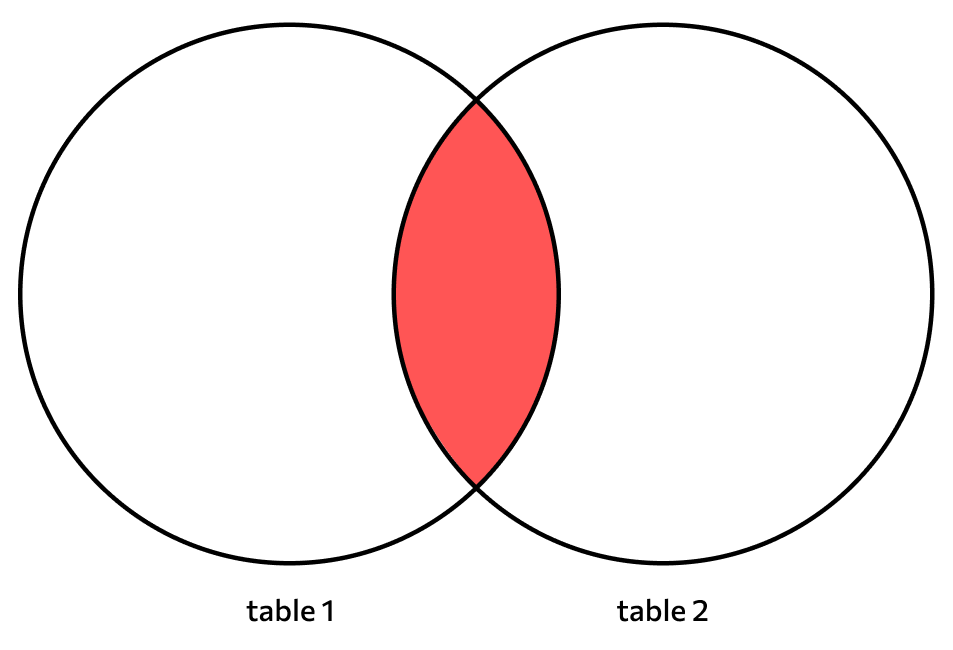
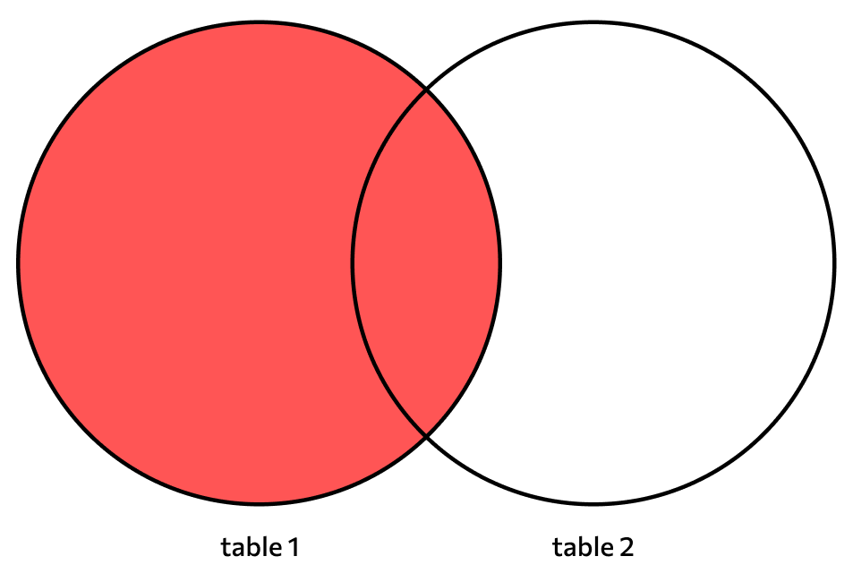
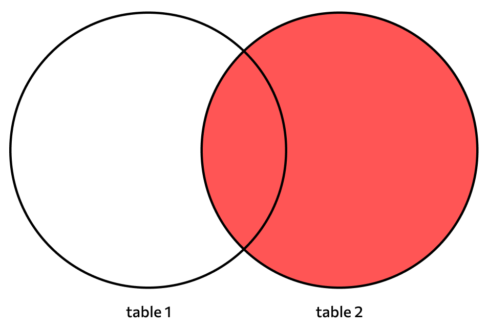
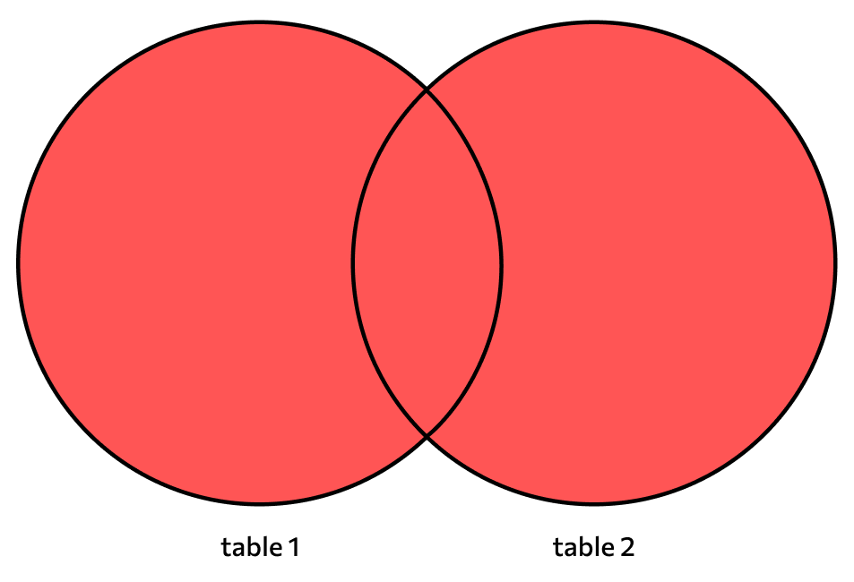
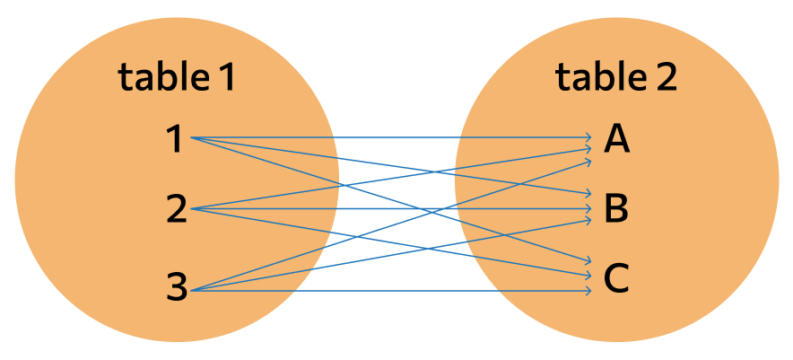

# 1. Что такое DDL? Какие операции в него входят?

**DDL (Data Definition Language)** - это подмножество языка SQL, используемое для определения и управления структурами базы данных, такими как таблицы, индексы, представления и другие объекты. Основная задача DDL - создание, изменение и удаление схем базы данных и ее объектов. В отличие от других типов SQL-запросов, таких как DML (Data Manipulation Language), которые изменяют данные, DDL работает с метаданными и структурой самой базы данных.

## Основные операции DDL

В DDL входят следующие основные команды:

1. **CREATE** - создание объектов базы данных.
2. **ALTER** - изменение структуры существующих объектов базы данных.
3. **DROP** - удаление объектов базы данных.
4. **TRUNCATE** - удаление всех данных из таблицы без удаления самой таблицы.
5. **RENAME** - изменение имени объектов базы данных (например, таблиц).

### 1. CREATE

Команда **CREATE** используется для создания новых объектов базы данных, таких как таблицы, индексы, представления, процедуры и схемы.

#### Пример создания таблицы:

```sql
CREATE TABLE Employees (
    EmployeeID INT PRIMARY KEY,
    FirstName VARCHAR(50),
    LastName VARCHAR(50),
    BirthDate DATE,
    Salary DECIMAL(10, 2)
);
```

### Объяснение:

- **CREATE TABLE Employees** - создает таблицу с именем `Employees`.
- **EmployeeID INT PRIMARY KEY** - создает столбец `EmployeeID` типа `INT` и делает его первичным ключом.
- Остальные столбцы определяются с соответствующими типами данных.

### 2. ALTER

Команда **ALTER** используется для изменения структуры уже существующих объектов базы данных. Она позволяет добавлять, изменять или удалять столбцы в таблицах, а также изменять другие свойства объектов.

#### Примеры использования:

- **Добавление столбца:**

```sql
ALTER TABLE Employees ADD Email VARCHAR(100);
```

- **Изменение типа данных столбца:**

```sql
ALTER TABLE Employees MODIFY Salary DECIMAL(15, 2);
```

- **Удаление столбца:**

```sql
ALTER TABLE Employees DROP COLUMN BirthDate;
```

### 3. DROP

Команда **DROP** используется для удаления объектов базы данных. В отличие от команды `DELETE`, которая удаляет данные, `DROP` удаляет всю структуру объекта.

#### Пример удаления таблицы:

```sql
DROP TABLE Employees;
```

### Объяснение:

- Эта команда удаляет таблицу `Employees` из базы данных вместе со всей ее структурой и данными.

### 4. TRUNCATE

Команда **TRUNCATE** удаляет все строки из таблицы, но сохраняет структуру таблицы для дальнейшего использования. Она работает быстрее, чем `DELETE`, так как не ведет запись в журнал транзакций для каждой удаляемой строки.

#### Пример использования:

```sql
TRUNCATE TABLE Employees;
```

### Объяснение:

- Все данные из таблицы `Employees` будут удалены, но сама таблица остается. Структура таблицы сохраняется, и счетчики автоинкремента сбрасываются.

### 5. RENAME

Команда **RENAME** используется для переименования объектов базы данных, например, таблиц или индексов.

#### Пример переименования таблицы:

```sql
ALTER TABLE Employees RENAME TO Staff;
```

### Объяснение:

- Таблица `Employees` будет переименована в `Staff`.

## Особенности DDL

1. **Автоматическая фиксация (Autocommit):** DDL-команды автоматически фиксируются в базе данных после выполнения, и откатить их невозможно (без использования резервного копирования).

2. **Изменение структуры:** Основное предназначение DDL - изменение схемы базы данных, а не данных. Операции DDL могут изменить структуру таблиц, схем и других объектов.

3. **Модификация индексов и связей:** С помощью DDL можно управлять индексами, внешними ключами и другими связями между таблицами.

4. **Блокировки:** В большинстве систем управления базами данных (СУБД) операции DDL могут блокировать таблицы, чтобы избежать конфликтов во время изменения структуры.

## Заключение

**DDL** - это мощный инструмент для управления структурой базы данных. Основные команды DDL (`CREATE`, `ALTER`, `DROP`, `TRUNCATE`, `RENAME`) позволяют разработчикам создавать и модифицировать объекты базы данных, а также управлять их жизненным циклом. Понимание DDL является ключевым для эффективного проектирования и администрирования баз данных.

# 2. Что такое DML? Какие операции в него входят?

**DML (Data Manipulation Language)** - это подмножество языка SQL, предназначенное для работы с данными внутри объектов базы данных, таких как таблицы. DML-команды используются для выполнения операций добавления, обновления, удаления и выборки данных. В отличие от DDL, которое работает со структурой базы данных, DML оперирует непосредственно данными, находящимися в этих структурах.

## Основные операции DML

К основным операциям DML относятся следующие команды:

1. **SELECT** - выборка данных из базы данных.
2. **INSERT** - добавление новых записей в таблицу.
3. **UPDATE** - обновление существующих записей в таблице.
4. **DELETE** - удаление записей из таблицы.

### 1. SELECT

Команда **SELECT** используется для извлечения данных из одной или нескольких таблиц. Это наиболее часто используемая команда SQL, которая позволяет фильтровать, сортировать и агрегировать данные по определенным условиям.

#### Пример использования:

```sql
SELECT FirstName, LastName, Salary
FROM Employees
WHERE Salary > 50000
ORDER BY Salary DESC;
```

### Объяснение:

- **SELECT FirstName, LastName, Salary** - выбирает столбцы `FirstName`, `LastName` и `Salary`.
- **FROM Employees** - указывает, что данные берутся из таблицы `Employees`.
- **WHERE Salary > 50000** - фильтрует данные, выбирая только записи с зарплатой выше 50,000.
- **ORDER BY Salary DESC** - сортирует результаты по зарплате в порядке убывания.

### 2. INSERT

Команда **INSERT** добавляет новые строки в таблицу. Она позволяет вставлять данные как для всех столбцов таблицы, так и для выбранных столбцов.

#### Пример вставки данных:

```sql
INSERT INTO Employees (FirstName, LastName, BirthDate, Salary)
VALUES ('John', 'Doe', '1980-05-15', 60000);
```

### Объяснение:

- **INSERT INTO Employees (FirstName, LastName, BirthDate, Salary)** - указывает таблицу и столбцы, в которые будут вставлены данные.
- **VALUES ('John', 'Doe', '1980-05-15', 60000)** - указывает значения для вставки в соответствующие столбцы.

#### Пример вставки с указанием всех столбцов:

```sql
INSERT INTO Employees
VALUES (1, 'Jane', 'Smith', '1990-07-20', 55000);
```

- Здесь перечислены все значения для вставки во все столбцы в порядке их определения в таблице.

### 3. UPDATE

Команда **UPDATE** используется для изменения существующих данных в одной или нескольких строках таблицы. Она позволяет изменять значения столбцов на основе условий, определяемых в `WHERE`-классе.

#### Пример обновления данных:

```sql
UPDATE Employees
SET Salary = Salary * 1.1
WHERE LastName = 'Doe';
```

### Объяснение:

- **UPDATE Employees** - указывает, что изменения вносятся в таблицу `Employees`.
- **SET Salary = Salary * 1.1** - обновляет значение столбца `Salary`, увеличивая его на 10%.
- **WHERE LastName = 'Doe'** - применяет изменения только к записям, у которых фамилия `Doe`.

### 4. DELETE

Команда **DELETE** удаляет строки из таблицы на основе заданных условий. Важно отметить, что `DELETE` удаляет только данные, но не саму структуру таблицы.

#### Пример удаления данных:

```sql
DELETE FROM Employees
WHERE Salary < 30000;
```

### Объяснение:

- **DELETE FROM Employees** - указывает таблицу, из которой будут удалены данные.
- **WHERE Salary < 30000** - удаляет записи с зарплатой ниже 30,000. Если условие `WHERE` не указано, будут удалены все строки таблицы.

## Особенности DML

1. **Транзакционность:** Команды DML могут быть частью транзакций, что позволяет контролировать внесение изменений и выполнять откаты в случае ошибок. Например, если в процессе выполнения нескольких DML-команд что-то пошло не так, можно отменить изменения с помощью команды `ROLLBACK`.

2. **Изменение данных, а не структуры:** В отличие от DDL, который управляет структурой базы данных, DML работает непосредственно с данными, обеспечивая добавление, изменение, удаление и выборку записей.

3. **Изменения с фиксацией:** DML-команды обычно требуют явной или неявной фиксации (`COMMIT`), чтобы изменения вступили в силу. Без фиксации внесенные изменения могут быть откатаны.

4. **Воздействие на производительность:** Неправильное использование DML-команд, например, массовое обновление или удаление данных без индексов, может негативно сказаться на производительности базы данных.

## Заключение

DML - это важный компонент языка SQL, который позволяет управлять данными в базе данных. Понимание и правильное использование команд DML, таких как `SELECT`, `INSERT`, `UPDATE` и `DELETE`, являются ключевыми для работы с данными в реляционных базах данных. Эти операции позволяют гибко и эффективно управлять информацией, обеспечивая полноценное взаимодействие с хранилищем данных на уровне приложения.

# 3. Что такое TCL? Какие операции в него входят?

**TCL (Transaction Control Language)** - это подмножество SQL, предназначенное для управления транзакциями в базах данных. Команды TCL позволяют контролировать выполнение групп операций над данными, обеспечивая их целостность и согласованность. Основная задача TCL - управление транзакциями, что важно для гарантии корректности выполнения операций в многопользовательской среде.

Транзакция - это последовательность операций, которые выполняются как единое целое. Если одна из операций не может быть выполнена, все изменения отменяются, чтобы база данных вернулась в состояние, в котором она была до начала транзакции.

## Основные операции TCL

В TCL входят следующие команды:

1. **COMMIT** - фиксация изменений, сделанных в рамках транзакции.
2. **ROLLBACK** - отмена всех изменений, сделанных в рамках текущей транзакции.
3. **SAVEPOINT** - создание точки сохранения внутри транзакции для частичного отката.
4. **SET TRANSACTION** - настройка параметров транзакции, таких как уровень изоляции.

### 1. COMMIT

Команда **COMMIT** используется для фиксации всех изменений, сделанных в рамках текущей транзакции. После выполнения `COMMIT` все изменения становятся постоянными и видимыми другим пользователям.

#### Пример использования:

```sql
BEGIN;

UPDATE Employees SET Salary = Salary + 1000 WHERE EmployeeID = 1;
INSERT INTO Logs (Action, Timestamp) VALUES ('Salary Updated', NOW());

COMMIT;
```

### Объяснение:

- **BEGIN;** - начало транзакции.
- Выполняются две операции: увеличение зарплаты и запись в лог.
- **COMMIT;** - фиксация изменений, сделанных в транзакции. Теперь эти изменения будут видны всем пользователям базы данных.

### 2. ROLLBACK

Команда **ROLLBACK** используется для отмены изменений, сделанных в текущей транзакции. Она возвращает базу данных в состояние, которое было до начала транзакции.

#### Пример использования:

```sql
BEGIN;

UPDATE Employees SET Salary = Salary + 1000 WHERE EmployeeID = 1;
INSERT INTO Logs (Action, Timestamp) VALUES ('Salary Updated', NOW());

ROLLBACK;
```

### Объяснение:

- В данном примере изменения, сделанные в транзакции, будут отменены командой `ROLLBACK`. Это полезно в случае ошибок или при необходимости отменить операцию.

### 3. SAVEPOINT

Команда **SAVEPOINT** используется для создания точек сохранения внутри транзакции. Это позволяет откатиться только до определенного момента внутри транзакции, не отменяя всю транзакцию целиком.

#### Пример использования:

```sql
BEGIN;

SAVEPOINT sp1;

UPDATE Employees SET Salary = Salary + 1000 WHERE EmployeeID = 1;

SAVEPOINT sp2;

INSERT INTO Logs (Action, Timestamp) VALUES ('Salary Updated', NOW());

ROLLBACK TO sp1;

COMMIT;
```

### Объяснение:

- **SAVEPOINT sp1;** - создается точка сохранения.
- **ROLLBACK TO sp1;** - откат изменений до точки `sp1`, отменяя только те изменения, которые были выполнены после этой точки. Транзакция завершится фиксацией оставшихся изменений.

### 4. SET TRANSACTION

Команда **SET TRANSACTION** используется для настройки параметров транзакции, таких как уровень изоляции. Это позволяет управлять тем, как транзакция взаимодействует с другими транзакциями.

#### Пример использования:

```sql
SET TRANSACTION ISOLATION LEVEL READ COMMITTED;

BEGIN;

UPDATE Employees SET Salary = Salary + 1000 WHERE EmployeeID = 1;

COMMIT;
```

### Объяснение:

- **SET TRANSACTION ISOLATION LEVEL READ COMMITTED;** - задает уровень изоляции транзакции, чтобы она читала только те данные, которые уже зафиксированы другими транзакциями.

## Особенности TCL

1. **Управление целостностью данных:** TCL обеспечивает целостность данных при выполнении множества связанных операций.

2. **Контроль согласованности:** Транзакции помогают поддерживать согласованное состояние базы данных, даже в условиях сбоя или ошибки.

3. **Уровни изоляции:** С помощью TCL можно управлять изоляцией транзакций, чтобы контролировать взаимодействие параллельных транзакций и избежать проблем, таких как грязное чтение или фантомные записи.

4. **Многопользовательская среда:** TCL играет ключевую роль в многопользовательских системах, предотвращая конфликты и обеспечивая корректность выполнения операций.

## Заключение

**TCL** - это важный инструмент для управления транзакциями в базах данных. Основные команды (`COMMIT`, `ROLLBACK`, `SAVEPOINT`, `SET TRANSACTION`) позволяют разработчикам контролировать выполнение групп операций и обеспечивать целостность данных. Использование TCL помогает создавать надежные и устойчивые к ошибкам приложения, работающие с базами данных.

# 4. Что такое DCL? Какие операции в него входят?

**DCL (Data Control Language)** - это подмножество SQL, предназначенное для управления доступом к данным в базе данных, обеспечивая безопасность и контроль прав пользователей. Основная задача DCL - предоставление и отзыв прав доступа к объектам базы данных, таким как таблицы, представления и процедуры, что помогает поддерживать безопасность данных и контролировать, кто и как может взаимодействовать с данными.

## Основные операции DCL

В DCL входят две ключевые команды:

1. **GRANT** - предоставляет пользователям права доступа к объектам базы данных.
2. **REVOKE** - отзывает ранее предоставленные права доступа.

### 1. GRANT

Команда **GRANT** используется для предоставления прав доступа пользователям или ролям на различные объекты базы данных, такие как таблицы, представления, процедуры и функции. С помощью этой команды администраторы могут управлять правами на чтение, запись, изменение и выполнение объектов базы данных.

#### Пример использования:

```sql
GRANT SELECT, INSERT ON Employees TO user1;
```

### Объяснение:

- **GRANT SELECT, INSERT** - предоставляет права на выполнение операций `SELECT` и `INSERT`.
- **ON Employees** - указывает, что эти права предоставляются на таблицу `Employees`.
- **TO user1** - указывает, что права назначаются пользователю `user1`.

#### Другие примеры:

- **Предоставление права на выполнение процедуры:**

  ```sql
  GRANT EXECUTE ON PROCEDURE updateSalary TO hr_manager;
  ```

- **Предоставление всех прав на таблицу:**

  ```sql
  GRANT ALL PRIVILEGES ON Sales TO admin_user;
  ```

### 2. REVOKE

Команда **REVOKE** используется для отзыва прав доступа, которые ранее были предоставлены пользователям или ролям. Она позволяет ограничить доступ, если права больше не нужны или если необходимо усилить безопасность.

#### Пример использования:

```sql
REVOKE INSERT ON Employees FROM user1;
```

### Объяснение:

- **REVOKE INSERT** - отзывает право на выполнение операции `INSERT`.
- **ON Employees** - указывает, что право отзывается для таблицы `Employees`.
- **FROM user1** - указывает, что право отзывается у пользователя `user1`.

#### Другие примеры:

- **Отзыв права на выполнение процедуры:**

  ```sql
  REVOKE EXECUTE ON PROCEDURE updateSalary FROM hr_manager;
  ```

- **Отзыв всех прав на таблицу:**

  ```sql
  REVOKE ALL PRIVILEGES ON Sales FROM admin_user;
  ```

## Особенности DCL

1. **Управление безопасностью:** DCL обеспечивает безопасность данных, позволяя контролировать, кто имеет доступ к различным объектам базы данных и каким образом этот доступ осуществляется.

2. **Гибкость в управлении правами:** Используя DCL, администраторы могут предоставлять права на уровне отдельных операций (чтение, запись, выполнение и т.д.) и для различных объектов базы данных.

3. **Уровни доступа:** DCL позволяет управлять доступом на разных уровнях - от отдельных столбцов до целых баз данных, что дает гибкость в настройке безопасности.

4. **Управление пользователями и ролями:** Команды DCL работают не только с отдельными пользователями, но и с ролями, что упрощает управление правами в крупных системах.

## Заключение

**DCL** является важным инструментом для управления доступом к данным и объектам в базе данных. Основные команды (`GRANT` и `REVOKE`) позволяют администраторам настраивать права доступа, обеспечивая необходимый уровень безопасности. Это критически важно для защиты данных от несанкционированного доступа и обеспечения работы приложений в соответствии с политиками безопасности организации.

# 5. Нюансы работы с NULL в SQL. Как проверить поле на NULL?

**NULL** в SQL представляет собой отсутствие значения или неизвестное значение в базе данных. Это специальное значение, которое отличается от нуля, пустой строки или любого другого значения, и имеет ряд особенностей, которые необходимо учитывать при работе с данными.

## Особенности и нюансы работы с NULL

1. **NULL не является значением:** NULL означает отсутствие значения. Оно не является числом, строкой или датой, поэтому NULL нельзя напрямую сравнивать с другими значениями, включая другие NULL.

2. **Операции с NULL:** Любая арифметическая или логическая операция с NULL возвращает NULL. Например, `5 + NULL` вернет NULL, а выражение `NULL = NULL` вернет NULL, а не `TRUE` или `FALSE`.

3. **Сравнение с NULL:** Нельзя использовать обычные операторы сравнения (`=`, `!=`, `<`, `>`) для проверки на NULL. Для этого используются специальные операторы: `IS NULL` и `IS NOT NULL`.

4. **NULL в агрегационных функциях:** Агрегационные функции, такие как `SUM`, `AVG`, `MAX`, `MIN`, игнорируют значения NULL. Например, при вычислении среднего значения NULL не учитывается, но при этом функции, такие как `COUNT(*),` учитывают NULL.

5. **Условия в WHERE:** NULL в условиях WHERE требует специальных проверок, так как стандартные логические операторы не работают с NULL.

6. **Объединение строк с NULL:** При объединении строк (конкатенации) с NULL результатом будет NULL.

## Как проверить поле на NULL?

Для проверки значения поля на NULL используются операторы **`IS NULL`** и **`IS NOT NULL`**.

### Пример использования `IS NULL`

```sql
SELECT * FROM Employees WHERE BirthDate IS NULL;
```

### Объяснение:

- Этот запрос выбирает все записи из таблицы `Employees`, у которых поле `BirthDate` имеет значение NULL.

### Пример использования `IS NOT NULL`

```sql
SELECT * FROM Employees WHERE BirthDate IS NOT NULL;
```

### Объяснение:

- Этот запрос выбирает все записи, у которых поле `BirthDate` не равно NULL (имеет значение).

## Дополнительные аспекты работы с NULL

### 1. Использование функции COALESCE

Функция **`COALESCE`** позволяет заменять значения NULL на указанные значения. Она возвращает первое ненулевое значение из списка аргументов.

#### Пример использования COALESCE:

```sql
SELECT FirstName, COALESCE(BirthDate, '1900-01-01') AS BirthDate
FROM Employees;
```

### Объяснение:

- Если `BirthDate` равно NULL, то вместо NULL будет возвращена дата `'1900-01-01'`.

### 2. Использование функции IFNULL (или ISNULL)

Функции **`IFNULL`** (MySQL) и **`ISNULL`** (SQL Server) заменяют NULL на указанное значение.

#### Пример использования IFNULL:

```sql
SELECT FirstName, IFNULL(LastName, 'Unknown') AS LastName
FROM Employees;
```

### Объяснение:

- Если `LastName` равно NULL, вместо NULL будет возвращено значение `'Unknown'`.

### 3. Особенности при сортировке

При сортировке значений с NULL, NULL обычно считается наименьшим значением, поэтому строки с NULL часто оказываются в начале или в конце списка в зависимости от направления сортировки.

#### Пример сортировки:

```sql
SELECT * FROM Employees ORDER BY BirthDate ASC;
```

### Объяснение:

- Записи с `NULL` в `BirthDate` будут первыми при сортировке по возрастанию.

### 4. Сравнение NULL с помощью CASE

Использование `CASE` позволяет обрабатывать NULL значения внутри логики запросов.

#### Пример использования CASE:

```sql
SELECT FirstName,
       CASE
           WHEN BirthDate IS NULL THEN 'Дата не указана'
           ELSE 'Дата указана'
       END AS BirthDateStatus
FROM Employees;
```

### Объяснение:

- Возвращает `'Дата не указана'`, если значение `BirthDate` равно NULL, иначе - `'Дата указана'`.

## Заключение

Работа с NULL в SQL требует специального подхода, поскольку это значение представляет отсутствие данных, а не просто пустое значение. Для корректной проверки и работы с NULL важно использовать операторы `IS NULL` и `IS NOT NULL`, а также функции обработки NULL, такие как `COALESCE`, `IFNULL`, и другие. Понимание особенностей NULL помогает избежать логических ошибок и обеспечивает корректное поведение запросов к базе данных.

# 6. Виды Join'ов

**JOIN** - это ключевая операция в SQL, которая используется для объединения строк из двух или более таблиц на основе связанных между ними столбцов. Существует несколько видов `JOIN`, каждый из которых имеет свою специфику и используется в зависимости от того, какие данные необходимо получить.

## Основные виды JOIN

1. **INNER JOIN**
2. **LEFT JOIN (LEFT OUTER JOIN)**
3. **RIGHT JOIN (RIGHT OUTER JOIN)**
4. **FULL JOIN (FULL OUTER JOIN)**
5. **CROSS JOIN**
6. **SELF JOIN**
7. **NATURAL JOIN**

### 1. INNER JOIN

**INNER JOIN** возвращает строки, которые имеют совпадающие значения в обеих таблицах. Это самый распространенный вид соединения, который используется для выборки только тех записей, которые соответствуют критерию соединения.



#### Пример использования INNER JOIN:

```sql
SELECT Employees.EmployeeID, Employees.Name, Departments.DepartmentName
FROM Employees
INNER JOIN Departments ON Employees.DepartmentID = Departments.DepartmentID;
```

### Объяснение:

- Соединяет таблицы `Employees` и `Departments`, возвращая только те строки, где `DepartmentID` совпадает в обеих таблицах.

### 2. LEFT JOIN (LEFT OUTER JOIN)

**LEFT JOIN** возвращает все строки из левой таблицы и соответствующие строки из правой таблицы. Если совпадений нет, то вместо значений из правой таблицы будут NULL.



#### Пример использования LEFT JOIN:

```sql
SELECT Employees.EmployeeID, Employees.Name, Departments.DepartmentName
FROM Employees
LEFT JOIN Departments ON Employees.DepartmentID = Departments.DepartmentID;
```

### Объяснение:

- Возвращает все строки из таблицы `Employees` и соответствующие строки из `Departments`. Если у сотрудника нет департамента, то вместо `DepartmentName` будет NULL.

### 3. RIGHT JOIN (RIGHT OUTER JOIN)

**RIGHT JOIN** работает аналогично LEFT JOIN, но возвращает все строки из правой таблицы и соответствующие строки из левой таблицы. Если совпадений нет, значения из левой таблицы будут NULL.



#### Пример использования RIGHT JOIN:

```sql
SELECT Employees.EmployeeID, Employees.Name, Departments.DepartmentName
FROM Employees
RIGHT JOIN Departments ON Employees.DepartmentID = Departments.DepartmentID;
```

### Объяснение:

- Возвращает все строки из `Departments` и соответствующие строки из `Employees`. Если департамент не имеет сотрудников, то значения из `Employees` будут NULL.

### 4. FULL JOIN (FULL OUTER JOIN)

**FULL JOIN** возвращает все строки, когда есть совпадения либо в левой, либо в правой таблице. Если совпадений нет, строки будут дополнены NULL с противоположной стороны.



#### Пример использования FULL JOIN:

```sql
SELECT Employees.EmployeeID, Employees.Name, Departments.DepartmentName
FROM Employees
FULL JOIN Departments ON Employees.DepartmentID = Departments.DepartmentID;
```

### Объяснение:

- Возвращает все строки как из `Employees`, так и из `Departments`. Если строка не имеет совпадения с другой таблицей, то соответствующие значения будут NULL.

### 5. CROSS JOIN

**CROSS JOIN** возвращает декартово произведение двух таблиц. Каждая строка из первой таблицы соединяется с каждой строкой из второй таблицы.



#### Пример использования CROSS JOIN:

```sql
SELECT Employees.Name, Departments.DepartmentName
FROM Employees
CROSS JOIN Departments;
```

### Объяснение:

- Возвращает все возможные комбинации строк из `Employees` и `Departments`.

### 6. SELF JOIN

**SELF JOIN** - это соединение таблицы с самой собой. Используется, когда нужно связать строки одной таблицы друг с другом.

#### Пример использования SELF JOIN:

```sql
SELECT A.EmployeeID, A.Name, B.Name AS ManagerName
FROM Employees A
LEFT JOIN Employees B ON A.ManagerID = B.EmployeeID;
```

### Объяснение:

- Таблица `Employees` соединяется сама с собой для получения имен менеджеров сотрудников.

### 7. NATURAL JOIN

**NATURAL JOIN** автоматически соединяет таблицы на основе всех столбцов с одинаковыми именами и типами данных. Это упрощенная форма JOIN, но не всегда рекомендуется из-за возможных неоднозначностей.

#### Пример использования NATURAL JOIN:

```sql
SELECT *
FROM Employees
NATURAL JOIN Departments;
```

### Объяснение:

- Соединяет `Employees` и `Departments` по всем одинаковым столбцам. Рекомендуется использовать с осторожностью, так как результат может быть неожиданным, если таблицы имеют много одинаковых столбцов.

## Заключение

Различные виды JOIN позволяют гибко управлять выборкой данных из нескольких таблиц, объединяя их на основе условий. Каждый тип JOIN имеет свои особенности и используется в зависимости от задачи, будь то выборка только совпадающих строк (INNER JOIN), получение всех строк из одной из таблиц (LEFT или RIGHT JOIN), или объединение всех строк независимо от совпадений (FULL JOIN). Понимание этих видов соединений позволяет эффективно работать с реляционными базами данных и извлекать необходимые данные с учетом их взаимосвязей.

# 7. Что лучше использовать: JOIN или подзапросы? Почему?

Использование `JOIN` или подзапросов в SQL зависит от конкретного сценария и требований к выполнению запросов. Оба подхода имеют свои преимущества и недостатки, и их выбор влияет на производительность, читаемость и поддерживаемость SQL-кода.

## JOIN vs Подзапросы: Основные отличия

- **JOIN** используется для соединения нескольких таблиц в одном запросе на основе заданных условий.
- **Подзапросы** (subqueries) - это вложенные запросы, которые используются внутри основного запроса и могут возвращать одно значение, строку или целую таблицу.

## Преимущества и недостатки JOIN

### Преимущества JOIN:

1. **Высокая производительность:** `JOIN` чаще всего работает быстрее, так как оптимизаторы баз данных лучше справляются с обработкой соединений таблиц, особенно если заданы соответствующие индексы.

2. **Читаемость и логичность:** `JOIN` часто делает запрос более читаемым, так как сразу видно, как связаны таблицы и по каким условиям выполняется соединение.

3. **Меньшая нагрузка на память:** `JOIN` обычно использует меньше оперативной памяти, поскольку работает на уровне строк и выполняет операции непосредственно с соединенными данными.

4. **Гибкость:** `JOIN` позволяет легко комбинировать и фильтровать данные с использованием различных типов соединений (`INNER JOIN`, `LEFT JOIN`, `RIGHT JOIN`, и т.д.).

### Недостатки JOIN:

1. **Сложность при работе с многослойными условиями:** Когда необходимо фильтровать данные на нескольких уровнях, запросы с JOIN могут становиться громоздкими и сложными для понимания.

2. **Потенциальные проблемы с дубликатами:** При неправильных условиях соединения возможны неожиданные дубликаты строк.

## Преимущества и недостатки подзапросов

### Преимущества подзапросов:

1. **Удобство для фильтрации:** Подзапросы могут быть удобны, когда нужно использовать результаты одного запроса в другом, например, для фильтрации данных (`WHERE`, `IN`, `EXISTS`).

2. **Логическая группировка:** Подзапросы могут логически сгруппировать сложные фильтрации, делая основной запрос чище и более управляемым.

3. **Упрощение сложных вычислений:** Вложенные подзапросы позволяют разбивать сложные операции на более мелкие шаги.

4. **Возможность выполнения независимых вычислений:** Подзапросы могут выполнять вычисления, которые невозможно реализовать через прямое соединение с помощью JOIN.

### Недостатки подзапросов:

1. **Медленная производительность:** Подзапросы могут быть менее эффективными, особенно если они вложены глубоко, так как оптимизатору базы данных труднее их оптимизировать.

2. **Высокая нагрузка на память:** Подзапросы могут загружать результаты во временные таблицы, увеличивая потребление оперативной памяти и замедляя выполнение.

3. **Ограниченная гибкость:** Подзапросы могут усложнить структуру кода, и их использование для сложных фильтраций и соединений делает запрос менее гибким по сравнению с JOIN.

## Когда использовать JOIN?

1. **Объединение данных из нескольких таблиц:** JOIN лучше подходит, когда необходимо объединить данные из разных таблиц с целью их дальнейшей фильтрации, сортировки или агрегации.

2. **Высокая производительность:** Если важна скорость выполнения запроса и низкое использование ресурсов, JOIN обычно предпочтительнее.

3. **Ясность связей:** Если необходимо показать четкие связи между данными таблиц, JOIN делает запросы более понятными и логически структурированными.

## Когда использовать подзапросы?

1. **Фильтрация и вычисления:** Подзапросы полезны для фильтрации на основании результатов других запросов, особенно когда они используются в конструкции `WHERE`, `IN`, или `EXISTS`.

2. **Независимые вычисления:** Когда нужно выполнить независимое от основного запроса вычисление или агрегирование данных.

3. **Упрощение сложных запросов:** Подзапросы могут помочь разбить сложные вычисления на логически отдельные части, особенно при работе с агрегированием или при необходимости применения фильтраций на разных уровнях.

## Пример сравнения JOIN и подзапроса

### Пример с использованием JOIN:

```sql
SELECT Employees.Name, Departments.DepartmentName
FROM Employees
JOIN Departments ON Employees.DepartmentID = Departments.DepartmentID;
```

### Пример с использованием подзапроса:

```sql
SELECT Name 
FROM Employees 
WHERE DepartmentID IN (
    SELECT DepartmentID 
    FROM Departments 
    WHERE DepartmentName = 'IT'
);
```

### Объяснение:

- В первом случае, `JOIN` напрямую соединяет две таблицы на основе общего столбца и возвращает связанные строки.
- Во втором случае, подзапрос сначала находит нужные `DepartmentID`, а затем используется для фильтрации данных из основной таблицы.

## Заключение

- **JOIN** предпочтительнее, когда необходимо быстро и эффективно объединить данные из нескольких таблиц, особенно если заданы индексы.
- **Подзапросы** более полезны, когда нужно выполнять независимые фильтрации или вычисления.
- В большинстве случаев **JOIN** будет работать быстрее и предпочтительнее с точки зрения производительности, но подзапросы могут упростить логику запросов и быть более интуитивными для сложных вычислений. 

Оптимальный подход - тестировать оба метода в конкретных сценариях и выбирать тот, который лучше подходит с учетом производительности и читаемости кода.

# 8. Что делает UNION?

**UNION** - это оператор в SQL, который используется для объединения результатов двух или более `SELECT` запросов в одну результирующую таблицу. Он позволяет комбинировать строки из разных запросов, при этом удаляя дубликаты (по умолчанию), что делает его полезным для работы с данными, полученными из разных источников или таблиц.

## Как работает UNION?

- **Синтаксис**: 
  ```sql
  SELECT column1, column2, ...
  FROM table1
  UNION
  SELECT column1, column2, ...
  FROM table2;
  ```

- **Общие условия**:
  - Количество и порядок столбцов в каждом запросе должны совпадать.
  - Типы данных соответствующих столбцов должны быть совместимыми.

## Основные виды UNION

1. **UNION (без указания DISTINCT)**:
   - По умолчанию удаляет дубликаты строк из объединенных результатов.
   - Полезен, когда важны уникальные записи из разных запросов.

2. **UNION ALL**:
   - Объединяет результаты запросов, сохраняя все строки, включая дубликаты.
   - Быстрее, чем `UNION`, так как не выполняет проверку на уникальность.

## Пример использования UNION

### Пример с UNION:

```sql
SELECT Name, Country FROM Customers_US
UNION
SELECT Name, Country FROM Customers_Europe;
```

### Ожидаемый вывод:
```
| Name          | Country   |
|---------------|-----------|
| John Doe      | USA       |
| Jane Smith    | UK        |
| Alice Johnson | USA       |
```

- В данном примере `UNION` объединяет результаты запросов из таблиц `Customers_US` и `Customers_Europe`, удаляя дубликаты.

### Пример с UNION ALL:

```sql
SELECT Name, Country FROM Customers_US
UNION ALL
SELECT Name, Country FROM Customers_Europe;
```

### Ожидаемый вывод:
```
| Name          | Country   |
|---------------|-----------|
| John Doe      | USA       |
| Jane Smith    | UK        |
| John Doe      | USA       |  -- Дубликат сохранен
| Alice Johnson | USA       |
```

- В этом случае `UNION ALL` объединяет все строки, включая дубликаты.

## Когда использовать UNION и UNION ALL?

- **UNION** полезен, когда нужно получить уникальные строки без повторений, но это требует дополнительной проверки на уникальность и может замедлить выполнение запроса.
- **UNION ALL** предпочтителен, когда важна производительность и нет необходимости удалять дубликаты. Он быстрее за счет отсутствия проверки на уникальность.

## Примеры практического использования

1. **Объединение данных из нескольких источников**: Когда необходимо комбинировать данные из разных таблиц или представлений с одинаковыми структурами.
   
2. **Слияние результатов разных фильтраций**: Для получения общих результатов, например, объединение данных по разным критериям поиска.

3. **Работа с распределенными данными**: В сценариях, где данные хранятся в разных базах данных или таблицах, и необходимо собрать все данные в одном месте.

## Заключение

Оператор `UNION` - это мощный инструмент для объединения данных из нескольких источников в SQL. Он позволяет гибко комбинировать результаты запросов, устраняя дубликаты (или сохраняя их с помощью `UNION ALL`), что делает его полезным в широком спектре задач, от простого слияния данных до сложной агрегации результатов из разных таблиц.

# 9. Чем WHERE отличается от HAVING?

Операторы `WHERE` и `HAVING` в SQL используются для фильтрации данных в запросах, но они выполняют фильтрацию на разных этапах выполнения запроса и предназначены для разных целей. Основное различие между ними заключается в том, что `WHERE` фильтрует строки **до** группировки данных, а `HAVING` - **после** группировки.

## Основные отличия между WHERE и HAVING

### 1. WHERE

- **Фильтрация данных перед группировкой:** `WHERE` используется для фильтрации строк на этапе предварительной обработки данных, то есть **до** выполнения агрегатных функций и группировки.
- **Не работает с агрегатными функциями:** Условие `WHERE` не может содержать агрегатные функции (`SUM`, `AVG`, `COUNT`, `MAX`, `MIN` и т.д.), поскольку оно применяется к данным до их агрегации.
- **Применяется к строкам таблицы:** Используется для фильтрации отдельных строк данных таблицы на этапе выборки.

**Пример использования WHERE:**

```sql
SELECT Name, Age 
FROM Employees
WHERE Age > 30;
```

- В этом запросе `WHERE` фильтрует строки таблицы `Employees`, отбирая только те, у которых `Age` больше 30.

### 2. HAVING

- **Фильтрация после группировки:** `HAVING` используется для фильтрации результатов **после** выполнения группировки данных с помощью `GROUP BY`.
- **Работает с агрегатными функциями:** `HAVING` поддерживает использование агрегатных функций, что позволяет применять фильтры к результатам группировки.
- **Применяется к сгруппированным данным:** Фильтрует группы строк после выполнения агрегации.

**Пример использования HAVING:**

```sql
SELECT Department, COUNT(*)
FROM Employees
GROUP BY Department
HAVING COUNT(*) > 5;
```

- В этом запросе сначала выполняется группировка сотрудников по департаментам, а затем `HAVING` фильтрует только те департаменты, в которых количество сотрудников больше 5.

## Сравнительный пример WHERE и HAVING

Рассмотрим ситуацию, когда необходимо отобрать департаменты с более чем 5 сотрудниками старше 30 лет.

### Пример с WHERE и HAVING вместе:

```sql
SELECT Department, COUNT(*)
FROM Employees
WHERE Age > 30
GROUP BY Department
HAVING COUNT(*) > 5;
```

### Объяснение:

1. **WHERE Age > 30**: Сначала выполняется фильтрация строк - отбираются сотрудники старше 30 лет.
2. **GROUP BY Department**: Затем данные группируются по департаментам.
3. **HAVING COUNT(*) > 5**: Наконец, `HAVING` фильтрует департаменты, в которых после группировки осталось более 5 сотрудников.

## Важные различия и особенности

1. **Последовательность применения:**
   - `WHERE` - используется до `GROUP BY`, фильтрует исходные данные.
   - `HAVING` - используется после `GROUP BY`, фильтрует агрегированные результаты.

2. **Использование с агрегатными функциями:**
   - `WHERE` не поддерживает агрегатные функции.
   - `HAVING` поддерживает, так как применяется к уже агрегированным данным.

3. **Производительность:**
   - `WHERE` обычно быстрее, так как работает с необработанными данными.
   - `HAVING` применяется после группировки и агрегации, что делает его менее производительным на больших объемах данных.

## Когда использовать WHERE и HAVING?

- **Используйте `WHERE`**, когда вам нужно отфильтровать строки на начальном этапе выборки, до выполнения агрегации или группировки.
- **Используйте `HAVING`**, когда необходимо фильтровать данные на основе агрегированных значений или групп.

## Заключение

Операторы `WHERE` и `HAVING` являются важными инструментами для фильтрации данных в SQL, но их различия в порядке применения и поддержке агрегатных функций делают их подходящими для различных задач. `WHERE` используется для фильтрации исходных строк данных, а `HAVING` - для фильтрации уже сгруппированных и агрегированных данных, что делает их дополняющими друг друга инструментами для сложных SQL-запросов.

# 10. Что такое ORDER BY?

**`ORDER BY`** - это оператор в SQL, который используется для сортировки результатов запроса по одному или нескольким столбцам. С его помощью можно упорядочить строки в результирующем наборе данных в возрастающем (`ASC`) или убывающем (`DESC`) порядке. Сортировка может выполняться по числовым, строковым, датам или любым другим типам данных, которые поддерживают сравнение.

## Как работает ORDER BY?

`ORDER BY` применяет сортировку к результатам запроса и позволяет контролировать порядок строк в выводе. Оператор используется в конце SQL-запроса после всех других условий, таких как `SELECT`, `FROM`, `WHERE`, `GROUP BY` и `HAVING`.

### Синтаксис ORDER BY

```sql
SELECT column1, column2, ...
FROM table_name
[WHERE condition]
ORDER BY column1 [ASC|DESC], column2 [ASC|DESC], ...;
```

- **`ASC`** (Ascending): Сортировка по возрастанию (по умолчанию).
- **`DESC`** (Descending): Сортировка по убыванию.

## Примеры использования ORDER BY

### 1. Сортировка по одному столбцу

```sql
SELECT Name, Age
FROM Employees
ORDER BY Age ASC;
```

**Ожидаемый вывод:**

```
| Name         | Age |
|--------------|-----|
| Alice        | 24  |
| Bob          | 28  |
| Charlie      | 35  |
```

- В этом примере данные сортируются по столбцу `Age` в порядке возрастания.

### 2. Сортировка по одному столбцу в убывающем порядке

```sql
SELECT Name, Age
FROM Employees
ORDER BY Age DESC;
```

**Ожидаемый вывод:**

```
| Name         | Age |
|--------------|-----|
| Charlie      | 35  |
| Bob          | 28  |
| Alice        | 24  |
```

- Здесь данные сортируются по столбцу `Age` в порядке убывания.

### 3. Сортировка по нескольким столбцам

```sql
SELECT Name, Department, Salary
FROM Employees
ORDER BY Department ASC, Salary DESC;
```

**Ожидаемый вывод:**

```
| Name         | Department | Salary |
|--------------|------------|--------|
| Alice        | HR         | 60000  |
| Bob          | HR         | 55000  |
| Charlie      | IT         | 80000  |
| Dave         | IT         | 75000  |
```

- В этом примере данные сначала сортируются по `Department` в алфавитном порядке, а внутри каждого департамента - по `Salary` в порядке убывания.

## Особенности использования ORDER BY

1. **Сортировка по выражениям и функциями:**
   - Можно сортировать по результатам выражений или функций, например:
     ```sql
     SELECT Name, Salary * 1.2 AS NewSalary
     FROM Employees
     ORDER BY NewSalary DESC;
     ```
   - Здесь сортировка идет по вычисляемому значению `Salary * 1.2`.

2. **Сортировка по порядковым номерам столбцов:**
   - `ORDER BY` можно использовать с порядковыми номерами столбцов в выводе:
     ```sql
     SELECT Name, Age, Salary
     FROM Employees
     ORDER BY 2;  -- Сортировка по второму столбцу, т.е. Age
     ```
   - Этот подход менее читаемый и не рекомендуется, так как может стать источником ошибок при изменении запроса.

3. **NULL в ORDER BY:**
   - В SQL поведение `NULL` при сортировке может варьироваться в зависимости от СУБД: в некоторых базах данных `NULL` сортируется как минимальное значение, в других - как максимальное.
   - Для управления положением `NULL` можно использовать `NULLS FIRST` или `NULLS LAST`:
     ```sql
     SELECT Name, Age
     FROM Employees
     ORDER BY Age ASC NULLS LAST;
     ```

## Применение ORDER BY

1. **Упорядочивание отчетов:** Позволяет выводить отчеты с данными в удобном порядке, например, от самых старших сотрудников до младших или по размеру зарплаты.
2. **Сортировка результатов поиска:** Сортировка результатов поиска товаров по цене, рейтингу и другим параметрам.
3. **Построение аналитических запросов:** Сортировка данных для дальнейшей работы в аналитических инструментах или представления данных пользователю.

## Заключение

`ORDER BY` - это мощный инструмент для управления порядком отображения данных в SQL. Он позволяет гибко сортировать результаты по одному или нескольким столбцам, поддерживая как возрастание, так и убывание. Правильное использование `ORDER BY` улучшает читаемость и полезность выводимых данных, особенно в отчетах и аналитических приложениях.

# 11. Что такое DISTINCT?

**`DISTINCT`** - это ключевое слово в SQL, используемое для удаления дубликатов из результирующего набора данных, возвращаемого запросом. Оно позволяет выбрать только уникальные строки по заданным столбцам, исключая повторяющиеся значения. `DISTINCT` применяется после `SELECT` и действует на все указанные столбцы, на основе которых производится фильтрация дубликатов.

## Как работает DISTINCT?

`DISTINCT` проверяет значения указанных столбцов и возвращает только уникальные строки, игнорируя повторяющиеся записи. Это полезно, когда нужно получить уникальные комбинации значений, например, уникальные имена, города, департаменты и т.д.

### Синтаксис DISTINCT

```sql
SELECT DISTINCT column1, column2, ...
FROM table_name;
```

- **`column1, column2, ...`** - столбцы, по которым нужно определить уникальность строк.

## Примеры использования DISTINCT

### 1. Удаление дубликатов из одного столбца

```sql
SELECT DISTINCT City
FROM Customers;
```

**Ожидаемый вывод:**

```
| City       |
|------------|
| New York   |
| Los Angeles|
| Chicago    |
```

- В этом примере выводятся уникальные города из таблицы `Customers`, исключая повторяющиеся значения.

### 2. Удаление дубликатов из нескольких столбцов

```sql
SELECT DISTINCT FirstName, LastName
FROM Employees;
```

**Ожидаемый вывод:**

```
| FirstName | LastName |
|-----------|----------|
| John      | Smith    |
| Jane      | Doe      |
| John      | Doe      |
```

- Здесь `DISTINCT` действует на комбинации `FirstName` и `LastName`. Только уникальные пары имени и фамилии включаются в результат.

### 3. Использование DISTINCT с функциями

`DISTINCT` также можно использовать внутри агрегатных функций, чтобы получить уникальные значения перед выполнением функции:

```sql
SELECT COUNT(DISTINCT Department)
FROM Employees;
```

**Ожидаемый вывод:**

```
| COUNT(DISTINCT Department) |
|----------------------------|
| 3                          |
```

- В этом случае `DISTINCT` применяется к столбцу `Department`, и `COUNT` подсчитывает количество уникальных департаментов.

## Особенности и ограничения DISTINCT

1. **Работа с NULL:** `DISTINCT` считает `NULL` значением, и при наличии нескольких `NULL` в столбце они считаются одинаковыми, то есть будет возвращено только одно `NULL`.
   
2. **Производительность:** Использование `DISTINCT` может замедлить выполнение запросов, особенно на больших таблицах, так как требует дополнительной обработки данных для исключения дубликатов.

3. **Применение к нескольким столбцам:** Когда `DISTINCT` применяется к нескольким столбцам, уникальность определяется на основе комбинации значений этих столбцов. Если все значения в указанной комбинации совпадают, строка считается дубликатом.

4. **Порядок строк:** Использование `DISTINCT` не гарантирует порядок строк в результирующем наборе. Для управления порядком следует использовать `ORDER BY`.

## Применение DISTINCT

1. **Выбор уникальных записей:** Например, выбор уникальных городов, стран или категорий из таблицы.
   
2. **Уменьшение дубликатов:** Используется для уменьшения дублирования данных в отчетах или при анализе данных.

3. **Подсчет уникальных значений:** В сочетании с агрегатными функциями для подсчета количества уникальных элементов в наборе данных.

## Заключение

`DISTINCT` - важный инструмент в SQL, используемый для выборки уникальных строк из таблицы. Он позволяет легко устранять дубликаты и управлять качеством данных в результатах запросов. При правильном применении `DISTINCT` упрощает работу с большими объемами данных, делая результаты запросов более осмысленными и точными.

# 11. Что такое DISTINCT?

**`DISTINCT`** - это ключевое слово в SQL, используемое для удаления дубликатов из результирующего набора данных, возвращаемого запросом. Оно позволяет выбрать только уникальные строки по заданным столбцам, исключая повторяющиеся значения. `DISTINCT` применяется после `SELECT` и действует на все указанные столбцы, на основе которых производится фильтрация дубликатов.

## Как работает DISTINCT?

`DISTINCT` проверяет значения указанных столбцов и возвращает только уникальные строки, игнорируя повторяющиеся записи. Это полезно, когда нужно получить уникальные комбинации значений, например, уникальные имена, города, департаменты и т.д.

### Синтаксис DISTINCT

```sql
SELECT DISTINCT column1, column2, ...
FROM table_name;
```

- **`column1, column2, ...`** - столбцы, по которым нужно определить уникальность строк.

## Примеры использования DISTINCT

### 1. Удаление дубликатов из одного столбца

```sql
SELECT DISTINCT City
FROM Customers;
```

**Ожидаемый вывод:**

```
| City       |
|------------|
| New York   |
| Los Angeles|
| Chicago    |
```

- В этом примере выводятся уникальные города из таблицы `Customers`, исключая повторяющиеся значения.

### 2. Удаление дубликатов из нескольких столбцов

```sql
SELECT DISTINCT FirstName, LastName
FROM Employees;
```

**Ожидаемый вывод:**

```
| FirstName | LastName |
|-----------|----------|
| John      | Smith    |
| Jane      | Doe      |
| John      | Doe      |
```

- Здесь `DISTINCT` действует на комбинации `FirstName` и `LastName`. Только уникальные пары имени и фамилии включаются в результат.

### 3. Использование DISTINCT с функциями

`DISTINCT` также можно использовать внутри агрегатных функций, чтобы получить уникальные значения перед выполнением функции:

```sql
SELECT COUNT(DISTINCT Department)
FROM Employees;
```

**Ожидаемый вывод:**

```
| COUNT(DISTINCT Department) |
|----------------------------|
| 3                          |
```

- В этом случае `DISTINCT` применяется к столбцу `Department`, и `COUNT` подсчитывает количество уникальных департаментов.

## Особенности и ограничения DISTINCT

1. **Работа с NULL:** `DISTINCT` считает `NULL` значением, и при наличии нескольких `NULL` в столбце они считаются одинаковыми, то есть будет возвращено только одно `NULL`.
   
2. **Производительность:** Использование `DISTINCT` может замедлить выполнение запросов, особенно на больших таблицах, так как требует дополнительной обработки данных для исключения дубликатов.

3. **Применение к нескольким столбцам:** Когда `DISTINCT` применяется к нескольким столбцам, уникальность определяется на основе комбинации значений этих столбцов. Если все значения в указанной комбинации совпадают, строка считается дубликатом.

4. **Порядок строк:** Использование `DISTINCT` не гарантирует порядок строк в результирующем наборе. Для управления порядком следует использовать `ORDER BY`.

## Применение DISTINCT

1. **Выбор уникальных записей:** Например, выбор уникальных городов, стран или категорий из таблицы.
   
2. **Уменьшение дубликатов:** Используется для уменьшения дублирования данных в отчетах или при анализе данных.

3. **Подсчет уникальных значений:** В сочетании с агрегатными функциями для подсчета количества уникальных элементов в наборе данных.

## Заключение

`DISTINCT` - важный инструмент в SQL, используемый для выборки уникальных строк из таблицы. Он позволяет легко устранять дубликаты и управлять качеством данных в результатах запросов. При правильном применении `DISTINCT` упрощает работу с большими объемами данных, делая результаты запросов более осмысленными и точными.

# 12. Что такое GROUP BY?

**`GROUP BY`** - это ключевое слово в SQL, которое используется для группировки строк в результирующем наборе данных на основе значений одного или нескольких столбцов. После группировки данные могут быть обработаны с использованием агрегатных функций, таких как `SUM()`, `COUNT()`, `AVG()`, `MAX()`, `MIN()` и других. `GROUP BY` позволяет выполнять операции над сгруппированными данными, например, подсчитывать количество записей в каждой группе, вычислять суммы или средние значения.

## Как работает GROUP BY?

`GROUP BY` группирует строки с одинаковыми значениями указанных столбцов в одну группу. Каждая группа содержит уникальную комбинацию значений этих столбцов. Агрегатные функции затем применяются к каждой группе отдельно, а не ко всем строкам целиком.

### Синтаксис GROUP BY

```sql
SELECT column1, column2, ..., AGGREGATE_FUNCTION(column)
FROM table_name
[WHERE condition]
GROUP BY column1, column2, ...;
```

- **`column1, column2, ...`** - столбцы, по которым выполняется группировка.
- **`AGGREGATE_FUNCTION(column)`** - агрегатная функция, применяемая к каждой группе, например, `COUNT()`, `SUM()`, `AVG()`.

## Примеры использования GROUP BY

### 1. Группировка данных по одному столбцу

```sql
SELECT Department, COUNT(*)
FROM Employees
GROUP BY Department;
```

**Ожидаемый вывод:**

```
| Department | COUNT(*) |
|------------|----------|
| HR         | 5        |
| IT         | 8        |
| Sales      | 10       |
```

- В этом примере данные сгруппированы по департаментам, и для каждой группы подсчитано количество сотрудников.

### 2. Группировка по нескольким столбцам

```sql
SELECT Department, Position, AVG(Salary)
FROM Employees
GROUP BY Department, Position;
```

**Ожидаемый вывод:**

```
| Department | Position      | AVG(Salary) |
|------------|---------------|-------------|
| HR         | Manager       | 75000       |
| HR         | Assistant     | 50000       |
| IT         | Developer     | 80000       |
| IT         | Analyst       | 70000       |
| Sales      | Salesperson   | 60000       |
```

- Здесь строки группируются по `Department` и `Position`, и для каждой группы вычисляется средняя зарплата.

### 3. Использование GROUP BY с HAVING

```sql
SELECT Department, SUM(Salary)
FROM Employees
GROUP BY Department
HAVING SUM(Salary) > 300000;
```

**Ожидаемый вывод:**

```
| Department | SUM(Salary) |
|------------|-------------|
| IT         | 400000      |
| Sales      | 350000      |
```

- В этом примере данные сначала группируются по департаментам, а затем фильтруются с помощью `HAVING`, чтобы оставить только те департаменты, где суммарная зарплата больше 300000.

## Особенности использования GROUP BY

1. **Агрегатные функции:** `GROUP BY` работает в паре с агрегатными функциями. Эти функции выполняются над каждой группой, а не над всей таблицей. Например, `COUNT()` подсчитывает количество строк в группе, `SUM()` вычисляет сумму значений в группе.

2. **HAVING vs WHERE:** Условие `WHERE` фильтрует строки до выполнения группировки, в то время как `HAVING` фильтрует группы после выполнения группировки. `HAVING` часто используется с агрегатными функциями.

3. **NULL и группировка:** `NULL` значения обрабатываются как отдельные группы. Все `NULL` значения в указанном столбце объединяются в одну группу.

4. **Неподдерживаемые столбцы в SELECT:** Все столбцы, не входящие в агрегатные функции, должны быть указаны в `GROUP BY`. В противном случае возникнет ошибка, так как SQL не знает, как обрабатывать такие данные.

## Применение GROUP BY

1. **Анализ данных:** Используется для подведения итогов по категориям, например, расчет суммарных продаж по каждому продукту или количества заказов по регионам.

2. **Отчеты и статистика:** Генерация сводок, таких как средний доход по департаментам или количество клиентов в каждом сегменте.

3. **Бизнес-анализ:** Группировка данных по критериям, важным для принятия решений, например, по датам, регионам или типам транзакций.

## Заключение

`GROUP BY` - это мощный оператор, позволяющий структурировать данные в SQL и получать полезную информацию из больших наборов данных. Он широко используется в аналитических запросах для создания сводок и агрегатов, что делает его неотъемлемой частью анализа данных и построения отчетов.

# 13. Что быстрее убирает дубликаты: DISTINCT или GROUP BY?

Операторы `DISTINCT` и `GROUP BY` в SQL могут использоваться для удаления дубликатов из результирующего набора данных, однако между ними есть различия как в целях использования, так и в производительности. Чтобы ответить на вопрос, какой из них быстрее, нужно рассмотреть их назначение и особенности работы с точки зрения оптимизации.

## Основные различия DISTINCT и GROUP BY

1. **Цель использования:**
   - **`DISTINCT`** используется исключительно для удаления дубликатов и возвращает уникальные строки на основе указанных столбцов.
   - **`GROUP BY`** используется для группировки строк и часто применяется вместе с агрегатными функциями (например, `SUM`, `COUNT`, `AVG`), чтобы получить агрегированные результаты по группам.

2. **Принцип работы:**
   - **`DISTINCT`** просматривает строки и исключает дубликаты, оставляя только уникальные значения.
   - **`GROUP BY`** группирует строки на основе значений указанных столбцов и может выполнять дополнительные вычисления с помощью агрегатных функций.

## Производительность DISTINCT vs GROUP BY

### DISTINCT

- **Оптимизация:** `DISTINCT` оптимизирован под удаление дубликатов и обычно использует алгоритмы сортировки или хеширования для эффективного поиска уникальных строк.
- **Скорость:** `DISTINCT` выполняется быстрее, так как его основная цель - найти и убрать дубликаты без дополнительных операций, как у `GROUP BY`.
  
### GROUP BY

- **Оптимизация:** `GROUP BY` выполняет группировку данных, и, хотя он тоже удаляет дубликаты, его производительность может быть ниже, так как он выполняет дополнительные операции, например, сортировку и выполнение агрегатных функций.
- **Скорость:** `GROUP BY` часто работает медленнее, особенно когда используется вместе с агрегатными функциями, так как требует больше вычислений и ресурсов.

### Пример сравнения DISTINCT и GROUP BY

#### Пример с DISTINCT

```sql
SELECT DISTINCT City
FROM Customers;
```

#### Пример с GROUP BY

```sql
SELECT City
FROM Customers
GROUP BY City;
```

### Производительность на практике

На практике `DISTINCT` обычно работает быстрее `GROUP BY`, если задача сводится к удалению дубликатов без дополнительных вычислений. Это связано с тем, что:

1. **Сортировка и Хеширование:** `DISTINCT` может использовать более эффективные алгоритмы сортировки или хеширования для удаления дубликатов.
2. **Минимум вычислений:** `DISTINCT` не выполняет дополнительные операции по группировке данных или вычислению агрегатов.
3. **План выполнения запроса:** Оптимизатор запросов обычно генерирует более простой и быстрый план выполнения для `DISTINCT`, чем для `GROUP BY`.

### Когда использовать DISTINCT и GROUP BY?

- **Используйте `DISTINCT`**, когда вам нужно просто удалить дубликаты и получить уникальные значения, без необходимости в агрегатных функциях.
  
- **Используйте `GROUP BY`**, когда требуется не только убрать дубликаты, но и произвести операции агрегирования над сгруппированными данными.

## Заключение

В целом, `DISTINCT` чаще всего работает быстрее `GROUP BY`, когда нужно просто убрать дубликаты, поскольку он менее ресурсоемкий и лучше оптимизирован для этой задачи. Однако выбор между `DISTINCT` и `GROUP BY` зависит от контекста запроса и задач, которые нужно решить: если нужно просто получить уникальные строки - лучше `DISTINCT`, если требуется группировка и агрегация - применяйте `GROUP BY`.

# 14. Что такое LIMIT?

**`LIMIT`** - это ключевое слово в SQL, используемое для ограничения количества строк, возвращаемых в результате выполнения запроса. Оно позволяет извлечь только заданное число строк из набора данных, что полезно при работе с большими таблицами, пагинации результатов и оптимизации производительности запросов.

## Синтаксис LIMIT

```sql
SELECT column1, column2, ...
FROM table_name
[WHERE condition]
[ORDER BY column1, column2, ...]
LIMIT number_of_rows;
```

- **`number_of_rows`** - количество строк, которые необходимо вернуть в результате запроса.

## Примеры использования LIMIT

### 1. Извлечение первых N строк

```sql
SELECT * 
FROM Employees
LIMIT 5;
```

**Ожидаемый вывод:**

```
| EmployeeID | Name   | Department |
|------------|--------|------------|
| 1          | Alice  | HR         |
| 2          | Bob    | IT         |
| 3          | Carol  | Sales      |
| 4          | Dave   | HR         |
| 5          | Eve    | IT         |
```

- В этом примере возвращаются первые 5 строк из таблицы `Employees`.

### 2. Использование LIMIT с ORDER BY

```sql
SELECT * 
FROM Orders
ORDER BY OrderDate DESC
LIMIT 10;
```

**Ожидаемый вывод:**

```
| OrderID | Customer | OrderDate  |
|---------|----------|------------|
| 120     | John     | 2024-09-01 |
| 119     | Alice    | 2024-08-30 |
| 118     | Bob      | 2024-08-29 |
| ...     | ...      | ...        |
```

- Запрос возвращает последние 10 заказов по дате в обратном порядке, начиная с самого нового.

### 3. Пагинация с использованием LIMIT и OFFSET

```sql
SELECT * 
FROM Products
ORDER BY ProductName
LIMIT 10 OFFSET 20;
```

**Ожидаемый вывод:**

```
| ProductID | ProductName | Price |
|-----------|-------------|-------|
| 21        | ItemX       | 15.00 |
| 22        | ItemY       | 18.00 |
| ...       | ...         | ...   |
| 30        | ItemZ       | 25.00 |
```

- Запрос извлекает 10 строк, начиная с 21-й строки (используется для реализации пагинации).

## Роль LIMIT в оптимизации

1. **Улучшение производительности:** `LIMIT` позволяет уменьшить количество данных, возвращаемых запросом, что особенно полезно при работе с большими таблицами, когда необходимо только ограниченное количество строк.
   
2. **Пагинация:** Используется для реализации пагинации данных в приложениях, когда данные делятся на страницы, каждая из которых отображает фиксированное количество строк.

3. **Тестирование и отладка:** `LIMIT` помогает разработчикам тестировать запросы и проверять выборку данных без получения большого количества строк.

4. **Защита от перегрузки:** Предотвращает случайное извлечение слишком большого количества данных, что может негативно сказаться на производительности приложения.

## Заключение

`LIMIT` - мощный инструмент для управления объемом данных, возвращаемых в SQL-запросах. Его использование упрощает работу с большими наборами данных, улучшает производительность и помогает эффективно реализовывать такие функции, как пагинация и ограничение результата запросов.

# 15. Что такое EXISTS?

**`EXISTS`** - это логический оператор в SQL, который используется в подзапросах для проверки существования строк, удовлетворяющих указанным условиям. Он возвращает `TRUE`, если подзапрос возвращает хотя бы одну строку, и `FALSE`, если не возвращает ни одной строки. `EXISTS` часто применяется для выполнения условной логики в запросах, когда важно знать, существуют ли связанные данные.

## Синтаксис EXISTS

```sql
SELECT column1, column2, ...
FROM table_name
WHERE EXISTS (subquery);
```

- **`subquery`** - подзапрос, результат которого проверяется на существование строк.

## Особенности работы EXISTS

- **Проверка на существование:** `EXISTS` не возвращает данные из подзапроса, а лишь проверяет, возвращает ли подзапрос строки.
- **Оптимизация:** СУБД оптимизирует выполнение `EXISTS`, часто останавливая выполнение подзапроса, как только будет найдена первая строка, что делает `EXISTS` очень быстрым для проверки наличия данных.
- **Использование с подзапросами:** Подзапросы в `EXISTS` могут ссылаться на внешние таблицы и использовать их данные в условиях.

## Примеры использования EXISTS

### 1. Проверка существования связанных данных

```sql
SELECT CustomerName
FROM Customers
WHERE EXISTS (
    SELECT 1
    FROM Orders
    WHERE Orders.CustomerID = Customers.CustomerID
);
```

**Ожидаемый вывод:**

```
| CustomerName |
|--------------|
| John         |
| Alice        |
| Bob          |
```

- В этом примере запрос возвращает имена клиентов, у которых есть заказы. Если подзапрос находит хотя бы одну запись в таблице `Orders`, связанной с текущим клиентом, оператор `EXISTS` возвращает `TRUE`.

### 2. Использование EXISTS для фильтрации данных

```sql
SELECT ProductName
FROM Products
WHERE EXISTS (
    SELECT 1
    FROM Suppliers
    WHERE Suppliers.SupplierID = Products.SupplierID
    AND Suppliers.Country = 'USA'
);
```

**Ожидаемый вывод:**

```
| ProductName |
|-------------|
| ProductA    |
| ProductB    |
```

- В данном случае `EXISTS` проверяет, есть ли поставщики из США, которые связаны с продуктами, и возвращает только те продукты, у которых поставщик находится в США.

### 3. Пример использования с NOT EXISTS

```sql
SELECT EmployeeName
FROM Employees
WHERE NOT EXISTS (
    SELECT 1
    FROM Projects
    WHERE Projects.EmployeeID = Employees.EmployeeID
);
```

**Ожидаемый вывод:**

```
| EmployeeName |
|--------------|
| Sarah        |
| Mike         |
```

- `NOT EXISTS` возвращает строки, для которых подзапрос не нашел ни одной записи. В этом примере выбираются сотрудники, которые не участвуют ни в одном проекте.

## Преимущества использования EXISTS

1. **Высокая производительность:** `EXISTS` часто работает быстрее, чем альтернативы, такие как `IN`, особенно когда подзапрос возвращает большое количество строк.
   
2. **Четкость логики:** `EXISTS` четко указывает на проверку наличия данных, делая запросы проще и понятнее.

3. **Использование для сложных проверок:** `EXISTS` позволяет легко интегрировать условия проверки в более сложные запросы, что затруднительно при использовании других операторов.

4. **Ленивая проверка:** `EXISTS` завершает выполнение подзапроса после первой найденной строки, что экономит ресурсы.

## Заключение

`EXISTS` - это мощный оператор SQL, позволяющий проверять существование записей по определенным критериям без необходимости извлекать сами данные из подзапроса. Он часто используется в сложных запросах для условного отбора данных и является важным инструментом для оптимизации запросов и проверки существования связей между таблицами.

# 16. Операторы IN, BETWEEN, LIKE

Операторы **`IN`**, **`BETWEEN`**, и **`LIKE`** в SQL используются для фильтрации данных по условиям. Каждый из них имеет свои особенности и предназначен для работы с различными типами данных и условий, что делает их незаменимыми инструментами при написании SQL-запросов.

## Оператор IN

**`IN`** используется для проверки того, что значение столбца совпадает с одним из значений в указанном списке. Этот оператор удобен для упрощения условий с множественными проверками на равенство.

### Синтаксис

```sql
SELECT column1, column2, ...
FROM table_name
WHERE column_name IN (value1, value2, ...);
```

### Пример использования IN

```sql
SELECT Name, Country
FROM Customers
WHERE Country IN ('USA', 'Canada', 'UK');
```

**Ожидаемый вывод:**

```
| Name   | Country |
|--------|---------|
| John   | USA     |
| Alice  | Canada  |
| Bob    | UK      |
```

- В этом примере возвращаются строки, где столбец `Country` содержит значения "USA", "Canada" или "UK".

### Особенности

- **Удобство записи:** Упрощает запросы с множественными условиями `OR`, делая их компактными и читаемыми.
- **Подзапросы:** `IN` также может использоваться с подзапросами, что позволяет динамически проверять значения.

## Оператор BETWEEN

**`BETWEEN`** используется для проверки диапазона значений, включающего начальное и конечное значение. Он работает как с числовыми, так и с датами и текстовыми данными.

### Синтаксис

```sql
SELECT column1, column2, ...
FROM table_name
WHERE column_name BETWEEN value1 AND value2;
```

### Пример использования BETWEEN

```sql
SELECT ProductName, Price
FROM Products
WHERE Price BETWEEN 50 AND 100;
```

**Ожидаемый вывод:**

```
| ProductName | Price |
|-------------|-------|
| ItemA       | 55    |
| ItemB       | 75    |
| ItemC       | 90    |
```

- В этом примере выбираются товары, цена которых находится в диапазоне от 50 до 100 включительно.

### Особенности

- **Границы включены:** `BETWEEN` включает в проверку обе границы диапазона (`value1` и `value2`).
- **Порядок значений:** Начальное значение должно быть меньше или равно конечному; иначе запрос не вернет результатов.

## Оператор LIKE

**`LIKE`** используется для поиска строк по шаблону. Он позволяет находить строки, соответствующие частичным совпадениям с помощью специальных символов (`%` и `_`).

### Синтаксис

```sql
SELECT column1, column2, ...
FROM table_name
WHERE column_name LIKE pattern;
```

- **`%`** - заменяет любое количество символов (включая ноль символов).
- **`_`** - заменяет ровно один символ.

### Пример использования LIKE

```sql
SELECT Name
FROM Employees
WHERE Name LIKE 'A%';
```

**Ожидаемый вывод:**

```
| Name   |
|--------|
| Alice  |
| Alan   |
| Andrew |
```

- Запрос выбирает имена сотрудников, начинающиеся на букву "A".

### Особенности

- **Гибкость поиска:** `LIKE` позволяет искать данные по сложным шаблонам, используя комбинацию `%` и `_`.
- **Регистрозависимость:** В некоторых СУБД поиск с `LIKE` может учитывать регистр, что нужно учитывать при написании запросов.

## Заключение

- **`IN`** удобен для проверок в списках значений и подзапросах.
- **`BETWEEN`** идеален для диапазонов и включает граничные значения.
- **`LIKE`** полезен для поиска по шаблонам с использованием специальных символов.

Эти операторы помогают строить эффективные и гибкие запросы для выборки данных в соответствии с заданными условиями, улучшая читабельность и упрощая работу с SQL-запросами.

# 17. Что делает оператор MERGE? Какие у него есть ограничения?

**`MERGE`** - это оператор в SQL, который используется для выполнения операции **вставки, обновления или удаления** данных в одной таблице на основе сравнения с другой таблицей или результатом подзапроса. Основная цель оператора `MERGE` - объединить данные из двух источников, эффективно управляя синхронизацией и изменениями данных.

## Основная идея работы MERGE

Оператор `MERGE` позволяет объединить действия `INSERT`, `UPDATE` и `DELETE` в один SQL-запрос, избегая необходимости выполнения нескольких операций последовательно. Он сравнивает строки целевой таблицы с данными из источника на основе условия совпадения (join condition) и выполняет заданные действия в зависимости от результатов сравнения.

## Синтаксис MERGE

```sql
MERGE INTO target_table AS target
USING source_table AS source
ON target.matching_column = source.matching_column
WHEN MATCHED THEN
    UPDATE SET target.column1 = source.column1
WHEN NOT MATCHED THEN
    INSERT (column1, column2) VALUES (source.column1, source.column2)
WHEN NOT MATCHED BY SOURCE THEN
    DELETE;
```

### Ключевые элементы синтаксиса:
- **`MERGE INTO target_table`** - указывает целевую таблицу, в которую будут применяться изменения.
- **`USING source_table`** - определяет источник данных, с которым производится сравнение.
- **`ON`** - условие соединения, определяющее соответствие строк в целевой и исходной таблицах.
- **`WHEN MATCHED THEN`** - действия, которые выполняются, если строки соответствуют условию соединения (например, обновление).
- **`WHEN NOT MATCHED THEN`** - действия, которые выполняются, если строка в целевой таблице не найдена (например, вставка).
- **`WHEN NOT MATCHED BY SOURCE THEN`** - действия, выполняемые для строк, отсутствующих в исходных данных (например, удаление).

## Пример использования MERGE

### Сценарий: Синхронизация данных между таблицами

```sql
MERGE INTO Inventory AS target
USING Sales AS source
ON target.ProductID = source.ProductID
WHEN MATCHED THEN
    UPDATE SET target.Quantity = target.Quantity - source.SoldQuantity
WHEN NOT MATCHED THEN
    INSERT (ProductID, Quantity) VALUES (source.ProductID, source.SoldQuantity)
WHEN NOT MATCHED BY SOURCE THEN
    DELETE;
```

**Объяснение:**
- **`WHEN MATCHED`**: Обновляет количество на складе, если продукт уже существует.
- **`WHEN NOT MATCHED`**: Вставляет новый продукт, если его нет в таблице `Inventory`.
- **`WHEN NOT MATCHED BY SOURCE`**: Удаляет продукт из `Inventory`, если его нет в таблице `Sales`.

## Ограничения и особенности MERGE

1. **Неопределенное поведение при дублировании:** Если исходный набор данных содержит дубликаты, это может привести к неоднозначности и непредсказуемым результатам. СУБД может по-разному обрабатывать такие случаи, что приводит к ошибкам или неожиданному поведению.

2. **Проблемы с блокировками:** `MERGE` может приводить к блокировкам на уровне строк или таблиц, что особенно заметно при большом объеме данных. Это может повлиять на производительность и вызвать конкуренцию за ресурсы.

3. **Триггеры и ограничения:** При использовании `MERGE` могут сработать триггеры или ограничения, установленные на целевой таблице, что может вызвать дополнительные сложности в обработке данных.

4. **Ограничения на использование в некоторых СУБД:** Не все системы управления базами данных (СУБД) поддерживают `MERGE`, и его синтаксис может различаться в зависимости от реализации (например, в Oracle, SQL Server и других).

5. **Отсутствие гибкости:** Оператор `MERGE` не всегда подходит для более сложных логик обработки данных, где требуется сложная бизнес-логика, выходящая за рамки стандартных операций `INSERT`, `UPDATE` и `DELETE`.

6. **Ошибки из-за несогласованных данных:** Если данные в целевой и исходной таблицах не согласованы, это может вызвать ошибки при выполнении `MERGE`.

## Заключение

`MERGE` - мощный инструмент для синхронизации данных, позволяющий объединить множество операций в одном запросе. Он упрощает и ускоряет процессы интеграции данных, но требует внимательного использования из-за ограничений и возможных проблем с производительностью и логикой обработки данных.

# 18. Какие агрегатные функции вы знаете?

**Агрегатные функции** - это функции в SQL, которые выполняют вычисления над набором значений и возвращают единичное значение. Они используются для получения сводной информации из данных, таких как суммы, средние значения, количество записей и другие обобщенные показатели. Ниже приведены наиболее распространенные агрегатные функции в SQL.

## Основные агрегатные функции

1. **`COUNT()`**
   - **Описание:** Считает количество строк в наборе данных, которые соответствуют указанному критерию.
   - **Пример использования:**
     ```sql
     SELECT COUNT(*) FROM orders;
     ```
   - **Вывод:** Возвращает общее количество строк в таблице `orders`.

2. **`SUM()`**
   - **Описание:** Суммирует значения в указанной колонке. Обычно используется для работы с числовыми данными.
   - **Пример использования:**
     ```sql
     SELECT SUM(total_amount) FROM orders;
     ```
   - **Вывод:** Возвращает общую сумму значений в колонке `total_amount`.

3. **`AVG()`**
   - **Описание:** Вычисляет среднее значение набора данных. Работает только с числовыми столбцами.
   - **Пример использования:**
     ```sql
     SELECT AVG(price) FROM products;
     ```
   - **Вывод:** Возвращает среднюю цену всех товаров.

4. **`MIN()`**
   - **Описание:** Находит минимальное значение в наборе данных. Может использоваться как для числовых, так и для строковых данных.
   - **Пример использования:**
     ```sql
     SELECT MIN(age) FROM employees;
     ```
   - **Вывод:** Возвращает минимальный возраст сотрудника.

5. **`MAX()`**
   - **Описание:** Находит максимальное значение в наборе данных.
   - **Пример использования:**
     ```sql
     SELECT MAX(salary) FROM employees;
     ```
   - **Вывод:** Возвращает максимальную зарплату среди всех сотрудников.

6. **`VARIANCE()` / `VAR_POP()` / `VAR_SAMP()`**
   - **Описание:** Вычисляет дисперсию значений в наборе данных. `VAR_POP()` используется для всей популяции, а `VAR_SAMP()` для выборки.
   - **Пример использования:**
     ```sql
     SELECT VARIANCE(score) FROM test_results;
     ```
   - **Вывод:** Возвращает дисперсию оценок.

7. **`STDDEV()` / `STDDEV_POP()` / `STDDEV_SAMP()`**
   - **Описание:** Вычисляет стандартное отклонение значений в наборе данных. `STDDEV_POP()` - для всей популяции, `STDDEV_SAMP()` - для выборки.
   - **Пример использования:**
     ```sql
     SELECT STDDEV(salary) FROM employees;
     ```
   - **Вывод:** Возвращает стандартное отклонение зарплат сотрудников.

8. **`GROUP_CONCAT()`** (в некоторых СУБД, таких как MySQL)
   - **Описание:** Объединяет строки в группу в одну строку с разделителем.
   - **Пример использования:**
     ```sql
     SELECT GROUP_CONCAT(name) FROM employees;
     ```
   - **Вывод:** Возвращает строку, содержащую все имена сотрудников, разделенные запятыми.

9. **`STRING_AGG()`** (в SQL Server, PostgreSQL)
   - **Описание:** Объединяет значения в строку с указанным разделителем, аналогично `GROUP_CONCAT()`.
   - **Пример использования:**
     ```sql
     SELECT STRING_AGG(name, ', ') FROM employees;
     ```
   - **Вывод:** Возвращает объединенную строку имен сотрудников.

## Заключение

Агрегатные функции широко используются в SQL для анализа и обработки данных, помогая создавать сводные отчеты и получать обобщенную информацию. Их применение включает вычисление статистик, таких как суммы, средние значения, подсчет строк и другие важные метрики.

# 19. Что такое ограничения (constraints)? Какие вы знаете?

**Ограничения (constraints)** ? это правила, устанавливаемые на столбцы таблиц в базе данных для обеспечения целостности, точности и надежности данных. Они помогают управлять поведением данных, поддерживать правильность значений и предотвращать недопустимые операции. Ограничения применяются на уровне столбцов или всей таблицы и активно используются для поддержки целостности базы данных.

## Основные типы ограничений

1. **PRIMARY KEY**
   - **Описание:** Определяет уникальный идентификатор для каждой строки в таблице. Столбец с `PRIMARY KEY` не может содержать `NULL` и должен быть уникальным.
   - **Пример:**
     ```sql
     CREATE TABLE employees (
         employee_id INT PRIMARY KEY,
         name VARCHAR(100)
     );
     ```
   - **Роль:** Гарантирует уникальность идентификатора в таблице, используется для ссылок из других таблиц.

2. **FOREIGN KEY**
   - **Описание:** Создает связь между двумя таблицами, обеспечивая целостность ссылочной целостности. Столбец с `FOREIGN KEY` ссылается на `PRIMARY KEY` или `UNIQUE` другой таблицы.
   - **Пример:**
     ```sql
     CREATE TABLE orders (
         order_id INT PRIMARY KEY,
         employee_id INT,
         FOREIGN KEY (employee_id) REFERENCES employees(employee_id)
     );
     ```
   - **Роль:** Поддерживает целостность данных между связанными таблицами.

3. **UNIQUE**
   - **Описание:** Гарантирует, что все значения в столбце или группе столбцов уникальны. В отличие от `PRIMARY KEY`, допускает наличие `NULL`.
   - **Пример:**
     ```sql
     CREATE TABLE users (
         user_id INT PRIMARY KEY,
         email VARCHAR(255) UNIQUE
     );
     ```
   - **Роль:** Предотвращает дублирование значений, например, в столбцах с уникальными идентификаторами.

4. **NOT NULL**
   - **Описание:** Запрещает вставку `NULL` значений в столбец.
   - **Пример:**
     ```sql
     CREATE TABLE products (
         product_id INT PRIMARY KEY,
         name VARCHAR(100) NOT NULL
     );
     ```
   - **Роль:** Обеспечивает наличие значений в обязательных полях.

5. **CHECK**
   - **Описание:** Определяет условие, которому должны удовлетворять значения в столбце. Используется для проверки значений при вставке и обновлении данных.
   - **Пример:**
     ```sql
     CREATE TABLE employees (
         employee_id INT PRIMARY KEY,
         age INT CHECK (age > 18)
     );
     ```
   - **Роль:** Гарантирует соблюдение бизнес-правил, например, ограничение диапазона значений.

6. **DEFAULT**
   - **Описание:** Определяет значение по умолчанию для столбца, если при вставке не указано значение.
   - **Пример:**
     ```sql
     CREATE TABLE orders (
         order_id INT PRIMARY KEY,
         status VARCHAR(20) DEFAULT 'Pending'
     );
     ```
   - **Роль:** Упрощает вставку данных и обеспечивает наличие дефолтных значений.

7. **INDEX** (не является строго ограничением, но связан)
   - **Описание:** Ускоряет выполнение запросов к таблице, создавая структуру для быстрого поиска данных.
   - **Пример:**
     ```sql
     CREATE INDEX idx_employee_name ON employees(name);
     ```
   - **Роль:** Улучшает производительность, но не гарантирует целостности данных.

## Роль ограничений в базе данных

1. **Обеспечение целостности данных:** Ограничения гарантируют, что данные соответствуют бизнес-правилам и сохраняются корректно.
2. **Управление связями между таблицами:** `FOREIGN KEY` помогает поддерживать связи между таблицами, обеспечивая целостность данных.
3. **Предотвращение ошибок данных:** Ограничения, такие как `NOT NULL` и `CHECK`, помогают предотвратить недопустимые или отсутствующие значения.
4. **Оптимизация производительности:** `INDEX` улучшает скорость выполнения запросов и выборок данных.

## Заключение

Ограничения играют ключевую роль в обеспечении целостности и надежности данных в базе данных. Они предотвращают ввод некорректных данных, управляют связями между таблицами и помогают соблюдать правила, определенные бизнес-логикой.

# 20. Что такое суррогатные ключи?

**Суррогатные ключи** ? это искусственные, уникальные идентификаторы, которые используются в таблицах баз данных в качестве первичных ключей (`PRIMARY KEY`). В отличие от естественных ключей, которые основаны на реальных данных (например, номер паспорта, e-mail), суррогатные ключи не имеют никакого бизнес-смысла и генерируются системой.

## Основные характеристики суррогатных ключей

1. **Искусственно генерируемые значения:** Суррогатные ключи не связаны с реальными атрибутами данных, они создаются автоматически (например, с помощью автоинкрементных полей, GUID или UUID).
   
2. **Уникальность:** Они обеспечивают уникальность каждой строки в таблице, не зависят от значений других полей.

3. **Неизменяемость:** Суррогатные ключи остаются неизменными в течение всего жизненного цикла записи, что делает их надежным средством для идентификации записей.

4. **Отсутствие бизнес-смысла:** В отличие от естественных ключей, суррогатные ключи не несут никакой информации о записи и используются только для идентификации.

## Примеры суррогатных ключей

1. **Автоинкрементные числа:** В большинстве реляционных СУБД (например, MySQL, PostgreSQL) используются автоинкрементные целочисленные значения как суррогатные ключи.
   
   ```sql
   CREATE TABLE employees (
       employee_id SERIAL PRIMARY KEY,  -- Суррогатный ключ
       name VARCHAR(100),
       position VARCHAR(50)
   );
   ```

2. **UUID (Universally Unique Identifier):** Универсальные уникальные идентификаторы, генерируемые системой. Подходят для распределенных систем, где требуется высокая уникальность.
   
   ```sql
   CREATE TABLE orders (
       order_id UUID DEFAULT uuid_generate_v4() PRIMARY KEY,  -- Суррогатный ключ
       order_date DATE,
       customer_id INT
   );
   ```

3. **GUID (Globally Unique Identifier):** Подобен UUID, но чаще используется в средах Microsoft SQL Server и других аналогичных системах.

## Преимущества суррогатных ключей

1. **Упрощение управления ключами:** Суррогатные ключи упрощают создание и поддержку связей между таблицами, поскольку они всегда уникальны и неизменны.
   
2. **Изоляция от изменений данных:** Поскольку суррогатные ключи не зависят от данных, любые изменения в бизнес-данных не повлияют на ключ, обеспечивая стабильность ссылок.

3. **Совместимость с ORM:** Суррогатные ключи хорошо работают с объектно-реляционными мапперами (ORM), такими как Hibernate, поскольку не требуют сложной логики генерации ключей на основе данных.

4. **Улучшение производительности:** Автоинкрементные значения и другие методы генерации суррогатных ключей могут быть оптимизированы для быстрого поиска и индексации.

## Недостатки суррогатных ключей

1. **Лишение данных смысловой нагрузки:** Суррогатные ключи не несут информации о записи, что иногда может затруднить интерпретацию данных.
   
2. **Увеличение числа индексов:** Суррогатные ключи добавляют дополнительный индекс, что может потребовать больше ресурсов для хранения и обработки.

3. **Дополнительная зависимость:** Использование суррогатных ключей может приводить к дублированию данных, если бизнес-логика требует уникальности по другим атрибутам (например, email).

## Заключение

Суррогатные ключи являются мощным инструментом для идентификации записей в базе данных, обеспечивая уникальность и стабильность данных. Их использование особенно актуально, когда естественные ключи сложны в управлении или подвержены изменениям.

# 21. Что такое индексы? Какие они бывают?

**Индексы** в базах данных ? это специальные структуры данных, которые используются для ускорения операций поиска и выборки записей в таблицах. Они работают аналогично указателям, позволяя быстро находить нужные строки без необходимости полного сканирования всей таблицы. Индексы создаются на одном или нескольких столбцах таблицы и могут значительно улучшить производительность запросов, особенно в больших объемах данных.

## Основные типы индексов

1. **B-tree индекс (балансированное дерево)**
   - **Описание:** Наиболее распространенный тип индекса, поддерживаемый практически всеми реляционными СУБД. Индекс на основе B-tree обеспечивает сбалансированное дерево, которое позволяет выполнять операции поиска, вставки и удаления с логарифмической сложностью.
   - **Применение:** Используется для поиска по равенству (`=`), диапазону (`BETWEEN`), сортировки (`ORDER BY`) и других стандартных операций.
   - **Пример создания:**
     ```sql
     CREATE INDEX idx_employee_name ON employees(name);
     ```

2. **Hash индекс**
   - **Описание:** Основан на хэш-таблице, которая обеспечивает быстрый доступ к данным по точному совпадению. Однако такой индекс не поддерживает диапазонные запросы и сортировку.
   - **Применение:** Эффективен для операций точного поиска (`=`), но не подходит для диапазонных и упорядоченных запросов.
   - **Пример создания (поддерживается не всеми СУБД):**
     ```sql
     CREATE INDEX idx_employee_id_hash ON employees(employee_id) USING HASH;
     ```

3. **Bitmap индекс**
   - **Описание:** Используется для индексации столбцов с небольшим числом уникальных значений (например, `true/false`, `male/female`). Индекс хранит битовые карты, где каждый бит представляет наличие или отсутствие значения.
   - **Применение:** Подходит для аналитических запросов, где часто используются `AND`, `OR`, `NOT` операции. Применяется в OLAP системах.
   - **Пример создания:**
     ```sql
     CREATE BITMAP INDEX idx_gender ON employees(gender);
     ```

4. **Full-text индекс (полнотекстовый индекс)**
   - **Описание:** Специальный тип индекса, предназначенный для быстрого поиска текстовой информации в больших текстовых полях (например, статьи, документы).
   - **Применение:** Используется для полнотекстового поиска (`MATCH`, `CONTAINS`) и поддерживает сложные текстовые запросы.
   - **Пример создания:**
     ```sql
     CREATE FULLTEXT INDEX idx_article_content ON articles(content);
     ```

5. **Spatial индекс**
   - **Описание:** Предназначен для работы с геометрическими данными, такими как точки, линии и полигоны. Используется в геоинформационных системах (ГИС).
   - **Применение:** Поддерживает операции с пространственными объектами, такие как поиск ближайших точек и геометрических пересечений.
   - **Пример создания (для MySQL):**
     ```sql
     CREATE SPATIAL INDEX idx_location ON locations(coordinates);
     ```

6. **Clustered индекс (кластерный индекс)**
   - **Описание:** Определяет физический порядок строк в таблице. В таблице может быть только один кластерный индекс, так как данные упорядочиваются по значению ключа.
   - **Применение:** Используется для таблиц, где важно хранить данные в определенном порядке. Ускоряет запросы с диапазонными операциями и упорядоченными выборками.
   - **Пример создания (SQL Server):**
     ```sql
     CREATE CLUSTERED INDEX idx_order_date ON orders(order_date);
     ```

7. **Non-clustered индекс (некластерный индекс)**
   - **Описание:** Индекс, который хранится отдельно от данных таблицы и указывает на строки, содержащие искомые значения. В таблице может быть несколько некластерных индексов.
   - **Применение:** Широко используется для ускорения выборок по различным столбцам.
   - **Пример создания:**
     ```sql
     CREATE INDEX idx_employee_salary ON employees(salary);
     ```

## Преимущества использования индексов

1. **Ускорение поиска данных:** Индексы значительно сокращают время выполнения запросов, позволяя быстрее находить нужные строки.
2. **Улучшение производительности при сортировке и группировке:** Индексы помогают ускорить операции `ORDER BY` и `GROUP BY`.
3. **Повышение эффективности JOIN:** Индексы, особенно на столбцах, используемых для объединения таблиц, значительно улучшают производительность `JOIN` операций.

## Недостатки и ограничения индексов

1. **Затраты на создание и обновление:** Индексы требуют дополнительных ресурсов для создания и поддержания, особенно при вставке, обновлении и удалении данных.
2. **Использование дополнительного пространства:** Индексы занимают дополнительное дисковое пространство, что может быть критичным при больших объемах данных.
3. **Сложность выбора правильного индекса:** Неудачно выбранные индексы могут негативно влиять на производительность, усложняя оптимизацию запросов.

## Заключение

Индексы играют ключевую роль в оптимизации производительности баз данных, обеспечивая эффективный доступ к данным и ускоряя выполнение сложных запросов. Однако необходимо тщательно выбирать тип и стратегию использования индексов, чтобы сбалансировать преимущества с затратами на их поддержку.

# 22. Как индексы реализованы в PostgreSQL

Индексы в PostgreSQL являются мощным средством для ускорения поиска данных и выполнения запросов. PostgreSQL поддерживает несколько типов индексов, каждый из которых реализован по-своему и имеет свою область применения. Основной механизм реализации индексов базируется на структуре данных, таких как B-деревья, хэш-таблицы, битовые карты и другие.

## Основные типы индексов в PostgreSQL и их реализация

### 1. B-tree индексы

**Описание:**  
Наиболее используемый тип индекса в PostgreSQL, реализующий сбалансированное дерево. B-tree индексы обеспечивают эффективный доступ к данным по равенству, диапазонным запросам и сортировке.

**Реализация:**  
B-tree индекс в PostgreSQL представляет собой дерево, где каждая ветвь содержит ключи, упорядоченные по значению. Каждая операция поиска, вставки или удаления выполняется с логарифмической сложностью O(log n). Индексные страницы обновляются и балансируются, чтобы поддерживать равномерное распределение данных.

**Пример создания:**

```sql
CREATE INDEX idx_name ON employees(name);
```

### 2. Hash индексы

**Описание:**  
Hash индексы используют хэш-таблицы для быстрого поиска значений по точному совпадению. Они полезны для равенства (`=`) запросов, но не поддерживают диапазонные операции.

**Реализация:**  
Hash индекс хранит значения в хэш-таблице, которая разбивается на страницы, называемые ?блоками?. Каждое значение хэшируется в определенный блок, что позволяет быстро находить нужные записи. Однако такие индексы не могут быть использованы для сортировки или диапазонных запросов.

**Пример создания:**

```sql
CREATE INDEX idx_employee_id_hash ON employees(employee_id) USING HASH;
```

### 3. GiST (Generalized Search Tree) индексы

**Описание:**  
GiST индексы предоставляют возможность реализации пользовательских индексов и поддерживают поиск по любым критериям. Они часто используются для геометрических данных, текстовых поисков и многомерных данных.

**Реализация:**  
GiST индексы позволяют создать деревья произвольной структуры с гибкими функциями сравнения. В PostgreSQL реализованы такие деревья, как R-деревья для пространственных данных, что делает GiST одним из самых универсальных типов индексов.

**Пример создания:**

```sql
CREATE INDEX idx_geom ON locations USING GiST(geom);
```

### 4. GIN (Generalized Inverted Index) индексы

**Описание:**  
GIN индексы предназначены для индексации коллекций элементов, таких как массивы, JSONB данные и полнотекстовые поиски. GIN индекс позволяет быстро находить вхождения подстрок или элементов.

**Реализация:**  
GIN индексы используют инвертированную структуру, где каждый элемент коллекции указывает на строки, в которых он встречается. Это аналогично индексам, используемым для полнотекстового поиска, где слова ассоциируются с документами.

**Пример создания:**

```sql
CREATE INDEX idx_tags ON articles USING GIN(tags);
```

### 5. SP-GiST (Space-partitioned Generalized Search Tree) индексы

**Описание:**  
SP-GiST используется для индексации редко заполненных данных или данных с большим количеством пустых областей, таких как геометрические координаты.

**Реализация:**  
SP-GiST индексы реализуют иерархию пространственного деления, аналогичную Quad-деревьям или K-d деревьям, что делает их полезными для индексации данных с разреженными распределениями.

**Пример создания:**

```sql
CREATE INDEX idx_point ON spatial_data USING SPGIST(point);
```

### 6. BRIN (Block Range INdexes) индексы

**Описание:**  
BRIN индексы работают с большими объемами данных, когда данные в таблице отсортированы по определенному столбцу. BRIN индексы создают метаданные на основе блоков страниц, что делает их легкими и быстрыми при выборках из больших наборов данных.

**Реализация:**  
BRIN индекс разбивает таблицу на диапазоны блоков и хранит минимальные и максимальные значения индексов внутри этих блоков. Это позволяет эффективно фильтровать данные на основе диапазона значений, что делает их идеальными для больших таблиц.

**Пример создания:**

```sql
CREATE INDEX idx_date_brin ON orders USING BRIN(order_date);
```

## Заключение

Индексы в PostgreSQL реализуются с использованием различных структур данных, каждая из которых оптимизирована под определенные задачи и типы запросов. Выбор правильного индекса позволяет существенно улучшить производительность базы данных, однако его необходимо делать осознанно, исходя из требований приложения и характера данных.

# 23. Чем TRUNCATE отличается от DELETE?

Операции `TRUNCATE` и `DELETE` в SQL используются для удаления данных из таблиц, но работают они по-разному и имеют разные последствия для структуры таблицы, транзакций и производительности. Разберем, чем они отличаются, и когда стоит использовать каждую из них.

## Основные различия между TRUNCATE и DELETE

### 1. **Природа операции**

- **`TRUNCATE`**: 
  - Является операцией DDL (Data Definition Language), которая сбрасывает все строки в таблице, освобождая пространство на диске без сохранения информации о каждой отдельной строке.
  - Не вызывает триггеры и не поддерживает условия удаления.
  
- **`DELETE`**: 
  - Относится к операциям DML (Data Manipulation Language), которая удаляет строки таблицы одну за другой и записывает каждую операцию удаления в журнал транзакций.
  - Поддерживает использование `WHERE`, что позволяет удалять данные выборочно.
  - Вызывает триггеры, связанные с таблицей.

### 2. **Производительность**

- **`TRUNCATE`**: 
  - Быстрее, чем `DELETE`, так как не логирует каждую строку, а работает на уровне освобождения страниц таблицы в памяти. Подходит для удаления всех данных сразу.
  
- **`DELETE`**: 
  - Медленнее, поскольку удаляет строки по одной, с записью каждой операции в журнал транзакций. Это делает `DELETE` более медленной операцией при большом количестве данных.

### 3. **Журнал транзакций**

- **`TRUNCATE`**: 
  - Минимально журналирует действия, записывая только метаинформацию об изменениях структуры таблицы (освобождение страниц), что уменьшает нагрузку на транзакционное логирование.
  
- **`DELETE`**: 
  - Полностью журналирует каждую удаленную строку, что делает `DELETE` транзакционно безопасной операцией, но увеличивает объем журнала транзакций.

### 4. **Транзакционная безопасность и откат**

- **`TRUNCATE`**: 
  - Не является безопасной транзакционной операцией, если не используется в рамках транзакции. После выполнения команды невозможно откатить удаленные данные, если она была выполнена вне транзакции.
  
- **`DELETE`**: 
  - Полностью транзакционно безопасен. Операцию `DELETE` можно откатить с помощью `ROLLBACK`, возвращая удаленные строки в таблицу.

### 5. **Работа с внешними ключами и ограничениями**

- **`TRUNCATE`**: 
  - Не может быть выполнен, если таблица имеет внешние ключи, ссылающиеся на нее. Требуется временно отключить ограничения или использовать `CASCADE`.
  
- **`DELETE`**: 
  - Работает с внешними ключами и может удалить строки, на которые есть ссылки, если использовать `ON DELETE CASCADE`.

### 6. **Сброс идентификаторов (AUTO_INCREMENT)**

- **`TRUNCATE`**: 
  - Сбрасывает счетчики `AUTO_INCREMENT`, начиная их с начального значения после выполнения команды.
  
- **`DELETE`**: 
  - Не сбрасывает значение `AUTO_INCREMENT`. Счетчик продолжается с последнего значения, даже если все строки удалены.

### 7. **Вызов триггеров**

- **`TRUNCATE`**: 
  - Не вызывает триггеры `BEFORE` и `AFTER`, что может быть важным при работе с зависимостями и логикой в базе данных.
  
- **`DELETE`**: 
  - Вызывает все соответствующие триггеры, что позволяет выполнять связанные действия при удалении строк.

## Примеры использования

### Пример использования `TRUNCATE`

```sql
TRUNCATE TABLE employees;
```

- Удаляет все строки из таблицы `employees` мгновенно и освобождает пространство.

### Пример использования `DELETE`

```sql
DELETE FROM employees WHERE department = 'Sales';
```

- Удаляет все строки, где отдел = 'Sales', сохраняя возможность отката транзакции.

## Когда использовать TRUNCATE и DELETE

- **Используйте `TRUNCATE`**, когда нужно быстро очистить таблицу и вам не важны триггеры, а также не требуется выборочное удаление строк или соблюдение внешних ключей.
- **Используйте `DELETE`**, когда требуется удаление с условиями, полная поддержка транзакций, триггеров и внешних ключей.

## Заключение

Обе команды имеют свои особенности и ограничения. `TRUNCATE` обеспечивает высокую производительность для очистки всей таблицы, но не предоставляет гибкости в условиях и безопасности, как `DELETE`. Выбор между ними должен основываться на конкретных требованиях к данным и структуре базы данных.
