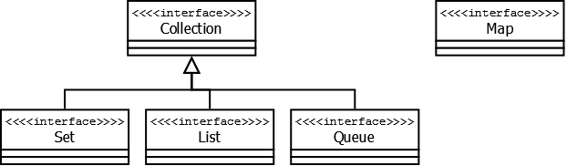
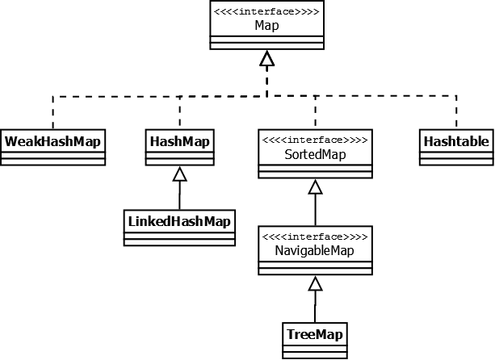
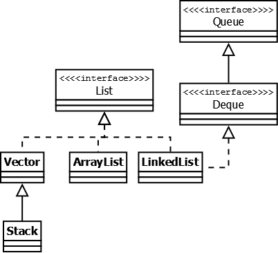
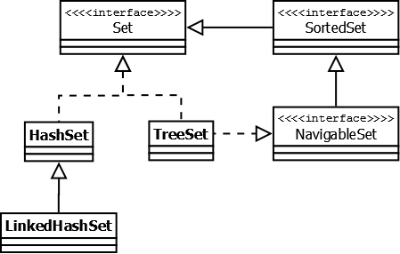
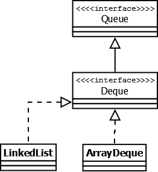
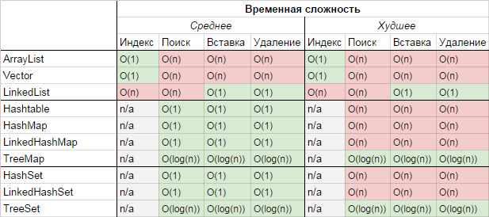

# 1. Что представляют собой дженерики в Java?

Дженерики (Generics) в Java — это механизм, позволяющий создавать классы, интерфейсы и методы с параметризованными типами. Они обеспечивают безопасность типов во время компиляции и позволяют писать более гибкий и переиспользуемый код. Дженерики были введены в Java начиная с версии 5.0.

## Основные аспекты дженериков:

### 1. **Параметризация типов**

Дженерики позволяют создавать классы, интерфейсы и методы, которые могут работать с различными типами данных без необходимости писать код для каждого типа отдельно. Типы данных указываются как параметры в угловых скобках `<>`. Например:

```java
// Обобщенный класс с параметром типа T
class Box<T> {
    private T value;

    public void setValue(T value) {
        this.value = value;
    }

    public T getValue() {
        return value;
    }
}
```

### 2. **Безопасность типов**

Дженерики позволяют обнаруживать ошибки типов на этапе компиляции, а не во время выполнения. Это делает код более безопасным и позволяет избежать ошибок, связанных с неправильными преобразованиями типов.

```java
Box<Integer> intBox = new Box<>();
intBox.setValue(123); // Корректно

// intBox.setValue("Hello"); // Ошибка компиляции: несоответствие типов
```

### 3. **Параметризация методов**

Методы также могут быть параметризованы. Это означает, что типы данных могут быть указаны как параметры метода:

```java
public <T> void printArray(T[] array) {
    for (T element : array) {
        System.out.println(element);
    }
}
```

### 4. **Wildcards (подстановочные знаки)**

Wildcards используются, когда точный тип параметра неизвестен. Существует три вида wildcard'ов:
- `?` — любой тип (unbounded wildcard).
- `? extends T` — тип T или его подтипы (bounded wildcard).
- `? super T` — тип T или его супертипы (lower bounded wildcard).

Пример использования wildcard'ов:

```java
public void processElements(List<? extends Number> list) {
    for (Number n : list) {
        System.out.println(n);
    }
}
```

### 5. **Стирание типов (Type Erasure)**

Java использует механизм стирания типов, что означает, что информация о типах дженериков удаляется во время компиляции. Это необходимо для обеспечения совместимости с версиями Java, существовавшими до появления дженериков. В результате после компиляции дженерики не имеют явной информации о типе, с которым они работают.

```java
List<String> list = new ArrayList<>();
List<Integer> intList = new ArrayList<>();

// Во время выполнения они оба представляют собой просто List:
if (list.getClass() == intList.getClass()) {
    System.out.println("Типы одинаковы");
}
```

### 6. **Ограничения дженериков**

Из-за стирания типов дженерики имеют определенные ограничения, например:
- Нельзя создать экземпляр параметризованного типа: `T obj = new T();` — ошибка компиляции.
- Нельзя использовать примитивные типы в дженериках: `List<int> list = new ArrayList<>();` — ошибка компиляции.
- Нельзя создавать массивы параметризованных типов: `List<String>[] listArray = new List<String>[10];` — ошибка компиляции.

## Заключение

Дженерики в Java предоставляют мощный инструмент для написания универсального, безопасного и повторно используемого кода. Они помогают избегать ошибок, связанных с преобразованием типов, и делают код более читаемым и поддерживаемым.

# 2. Какова цель использования дженериков?

Цель использования дженериков в Java заключается в повышении безопасности типов, улучшении читаемости кода и создании более универсальных и переиспользуемых компонентов. Дженерики помогают разработчикам писать код, который может работать с различными типами данных, обеспечивая при этом строгую типизацию и предотвращая множество ошибок, связанных с преобразованием типов.

## Основные цели использования дженериков:

### 1. **Безопасность типов во время компиляции**

Дженерики обеспечивают проверку типов во время компиляции, что позволяет избежать ошибок, связанных с неправильными преобразованиями типов, которые могли бы проявиться только на этапе выполнения программы. Это делает код более надежным.

Пример:
```java
List<String> strings = new ArrayList<>();
strings.add("Hello");
// strings.add(123); // Ошибка компиляции: типы не соответствуют
```

### 2. **Повторное использование кода**

С помощью дженериков можно создавать универсальные классы, методы и интерфейсы, которые могут работать с любыми типами данных. Это способствует повторному использованию кода и уменьшает дублирование.

Пример:
```java
class Box<T> {
    private T value;

    public void setValue(T value) {
        this.value = value;
    }

    public T getValue() {
        return value;
    }
}

// Класс Box можно использовать для различных типов:
Box<Integer> intBox = new Box<>();
Box<String> strBox = new Box<>();
```

### 3. **Улучшение читаемости и поддерживаемости кода**

Дженерики делают код более читаемым, так как явно указывают на тип данных, с которым работает тот или иной класс или метод. Это облегчает понимание кода, что особенно важно в крупных проектах.

Пример:
```java
Map<String, Integer> map = new HashMap<>();
// Легко понять, что карта хранит строки в качестве ключей и целые числа в качестве значений
```

### 4. **Избежание явных преобразований типов**

Без дженериков разработчики вынуждены были использовать явные преобразования типов, что могло приводить к ошибкам времени выполнения. Дженерики позволяют избежать таких преобразований, делая код более безопасным.

Пример:
```java
// Без дженериков:
List list = new ArrayList();
list.add("Hello");
String str = (String) list.get(0); // Явное приведение типа

// С дженериками:
List<String> list = new ArrayList<>();
list.add("Hello");
String str = list.get(0); // Приведение типа не требуется
```

## Заключение

Использование дженериков в Java направлено на создание более безопасного, универсального и удобного в использовании кода. Дженерики повышают надежность программ за счет строгой проверки типов на этапе компиляции и делают код более чистым и понятным.

# 3. Что такое сырые типы (raw type)?

**Сырые типы** (*raw types*) в Java — это типы, используемые в обобщенных классах и интерфейсах без указания параметров типа. Они представляют собой возможность использования обобщений (дженериков) без фактической типизации.

## Пример сырого типа

Рассмотрим пример обобщенного класса `Box`:

```java
class Box<T> {
    private T value;

    public void setValue(T value) {
        this.value = value;
    }

    public T getValue() {
        return value;
    }
}
```

В нормальной ситуации вы бы использовали этот класс с конкретным типом:

```java
Box<String> stringBox = new Box<>();
stringBox.setValue("Hello");
String value = stringBox.getValue();
```

Однако, вы можете использовать `Box` без указания типа, как показано ниже:

```java
Box rawBox = new Box(); // Сырой тип
rawBox.setValue("Hello");
Object value = rawBox.getValue();
```

В этом случае `rawBox` является экземпляром `Box` с сырым типом.

## Проблемы использования сырых типов

Использование сырых типов может привести к следующим проблемам:

### 1. **Потеря безопасности типов**

Сырые типы позволяют обойти проверку типов на этапе компиляции, что увеличивает вероятность возникновения ошибок времени выполнения. Например:

```java
Box rawBox = new Box();
rawBox.setValue("Hello");
rawBox.setValue(123); // Компилятор не предупреждает о смешении типов
```

Здесь нет предупреждений компилятора о том, что в `rawBox` сначала добавлена строка, а затем целое число, что может привести к неожиданным ошибкам.

### 2. **Неявные преобразования типов**

Поскольку сырые типы не знают о конкретных типах данных, с которыми они работают, возвращаемые значения приходится приводить к нужному типу вручную:

```java
Box rawBox = new Box();
rawBox.setValue("Hello");
String value = (String) rawBox.getValue(); // Необходимо приведение типа
```

Такое приведение типов может привести к исключениям `ClassCastException` на этапе выполнения.

### 3. **Предупреждения компилятора**

При использовании сырых типов компилятор Java обычно генерирует предупреждения (*unchecked warnings*), указывающие на то, что использование обобщенного типа без указания типа небезопасно:

```java
Box rawBox = new Box(); // Предупреждение: unchecked assignment
```

## Когда использовать сырые типы?

Использование сырых типов настоятельно не рекомендуется, так как они снижают безопасность типов и делают код менее понятным и поддерживаемым. Однако, в некоторых случаях, например, при работе с устаревшим кодом или библиотеками, не использующими дженерики, использование сырых типов может быть неизбежным.

## Заключение

Сырые типы в Java позволяют использовать обобщенные классы и интерфейсы без указания конкретных параметров типа. Однако их использование сопряжено с рисками, связанными с потерей безопасности типов и возможными ошибками времени выполнения. Поэтому в современном коде рекомендуется избегать использования сырых типов и всегда указывать параметры типов при работе с дженериками.

# 4. Что такое стирание типов?

**Стирание типов** (*type erasure*) — это процесс, при котором информация о типах дженериков (обобщений) удаляется или "стирается" во время компиляции в Java. Это позволяет сохранить обратную совместимость с кодом, написанным до появления дженериков.

## Основная идея стирания типов

Когда вы используете обобщения (дженерики) в Java, типы, указанные в коде (например, `T` в `List<T>`), существуют только на этапе компиляции. Однако, когда код компилируется в байт-код, JVM не сохраняет информацию о конкретных типах. Вместо этого дженерики заменяются своим основным типом (обычно это `Object`), а при необходимости добавляются проверки типов и приведения.

## Пример стирания типов

Рассмотрим следующий обобщенный класс:

```java
class Box<T> {
    private T value;

    public void setValue(T value) {
        this.value = value;
    }

    public T getValue() {
        return value;
    }
}
```

После компиляции класс `Box<T>` может выглядеть примерно так:

```java
class Box {
    private Object value;

    public void setValue(Object value) {
        this.value = value;
    }

    public Object getValue() {
        return value;
    }
}
```

Тип `T` заменяется на `Object`, что позволяет использовать класс `Box` для любых типов данных. Однако информация о конкретном типе, указанном при создании объекта, теряется.

## Последствия стирания типов

### 1. **Отсутствие информации о типе во время выполнения**

После стирания типов невозможно узнать, с каким конкретным типом работал обобщенный класс или метод. Например:

```java
List<String> stringList = new ArrayList<>();
List<Integer> intList = new ArrayList<>();
```

После компиляции оба списка будут представлены как `List`, и JVM не сможет различить их во время выполнения.

### 2. **Ограничения на использование дженериков с примитивными типами**

Поскольку стирание типов приводит к замене дженериков на объектные типы, вы не можете использовать примитивные типы (например, `int`, `char`) в качестве параметров типа:

```java
List<int> intList = new ArrayList<>(); // Ошибка компиляции
```

### 3. **Ограничения на перегрузку методов**

Из-за стирания типов перегрузка методов с разными параметрами типа может быть невозможна, так как они будут компилироваться в методы с одинаковой сигнатурой:

```java
public void printList(List<String> list) { ... }
public void printList(List<Integer> list) { ... } 
```

Оба метода будут представлены как `printList(List list)`, что приведет к ошибке компиляции.

### 4. **Реализация ограничений на типы (Bounded Types)**

Java поддерживает ограниченные типы, например:

```java
class NumberBox<T extends Number> {
    private T value;
}
```

В этом случае после стирания типов `T` будет заменен на `Number`, что ограничит типы данных, с которыми можно работать.

## Заключение

Стирание типов в Java — это механизм, позволяющий дженерикам сохранять совместимость с устаревшим кодом, не использующим обобщения. Несмотря на преимущества, такие как обратная совместимость, стирание типов приводит к некоторым ограничениям и нюансам, которые необходимо учитывать при разработке. Например, вы не можете получить информацию о типе во время выполнения и должны быть осторожны при перегрузке методов и использовании примитивных типов.

# 5. Как работают вайлдкарды в контексте дженериков?

**Вайлдкарды** (*wildcards*) в дженериках Java — это специальные символы, которые позволяют работать с различными типами параметров обобщенных классов или методов, не указывая конкретный тип. Основной символ вайлдкарда — `?` (вопросительный знак), который означает "любой тип".

## Типы вайлдкардов

### 1. **Неограниченный вайлдкард (`?`)**

Неограниченный вайлдкард `?` позволяет параметризовать тип любым объектным типом. Это удобно, когда конкретный тип значения не важен, но важно, чтобы он был объектным.

Пример использования:

```java
public void printList(List<?> list) {
    for (Object elem : list) {
        System.out.println(elem);
    }
}
```

В данном случае метод `printList` может принимать любой тип списка: `List<String>`, `List<Integer>`, `List<Object>` и так далее.

### 2. **Ограниченный сверху вайлдкард (`? extends Type`)**

Ограниченный сверху вайлдкард `? extends Type` означает, что параметр типа должен быть либо `Type`, либо его подклассом. Это полезно, когда метод должен работать с типами, которые являются наследниками определенного класса или реализуют определенный интерфейс.

Пример использования:

```java
public void processNumbers(List<? extends Number> list) {
    for (Number number : list) {
        System.out.println(number.doubleValue());
    }
}
```

В данном случае метод `processNumbers` может принимать список любых подклассов `Number`, таких как `List<Integer>`, `List<Double>`, `List<Float>` и так далее. Но вы не сможете добавлять элементы в этот список, так как конкретный тип неизвестен.

### 3. **Ограниченный снизу вайлдкард (`? super Type`)**

Ограниченный снизу вайлдкард `? super Type` означает, что параметр типа должен быть либо `Type`, либо его суперклассом. Это полезно, когда нужно добавить элементы в коллекцию, но важно, чтобы все добавляемые элементы были как минимум экземплярами указанного типа.

Пример использования:

```java
public void addIntegers(List<? super Integer> list) {
    list.add(1);
    list.add(2);
    list.add(3);
}
```

Здесь метод `addIntegers` может работать со списками типа `List<Integer>`, `List<Number>`, `List<Object>`, так как `Integer` — это подкласс `Number`, а `Number` — это подкласс `Object`. Можно безопасно добавлять элементы типа `Integer`, так как гарантируется, что список принимает этот тип или его суперклассы.

## Когда использовать вайлдкарды

### 1. **Производство и потребление (PECS)**

Правило **PECS** (*Producer Extends, Consumer Super*) помогает определить, какой тип вайлдкарда использовать:

- Если параметр типа **производит** объекты для вас (например, из него можно получить элементы), используйте `? extends`.
- Если параметр типа **потребляет** объекты от вас (например, вы добавляете элементы в него), используйте `? super`.

### 2. **Гибкость методов**

Вайлдкарды делают методы более гибкими, позволяя использовать их с более широким набором типов. Например, метод `List<? extends Number>` будет работать с любым типом числа, не ограничиваясь конкретным типом `Number`.

## Заключение

Вайлдкарды позволяют работать с дженериками более гибко, предоставляя возможность использовать обобщенные методы и классы с различными типами. Используя неограниченные, ограниченные сверху и ограниченные снизу вайлдкарды, можно создавать методы, которые могут обрабатывать широкий спектр типов, обеспечивая при этом безопасность типов и простоту использования.

# 6. Объясните принцип PECS в контексте дженериков.

**PECS** — это акроним, который расшифровывается как **Producer Extends, Consumer Super**. Этот принцип помогает правильно выбирать типы дженериков с использованием вайлдкардов (`? extends T` и `? super T`), когда создаются обобщенные методы или классы.

## Основная идея PECS

- **Producer Extends** (`? extends T`) — если параметр типа **производит** данные, то используйте ограничение сверху `extends`. Это означает, что метод или класс предоставляет (возвращает) элементы типа `T` или его подтипов.

- **Consumer Super** (`? super T`) — если параметр типа **потребляет** данные, то используйте ограничение снизу `super`. Это означает, что метод или класс принимает (добавляет) элементы типа `T` или его супертипов.

## Примеры использования PECS

### 1. **Producer Extends** (`? extends T`)

Предположим, что у нас есть метод, который возвращает элементы из коллекции:

```java
public static void copy(List<? extends Number> source, List<? super Number> dest) {
    for (Number num : source) {
        dest.add(num);
    }
}
```

В этом примере `source` — это производитель (Producer), и он использует `? extends Number`. Это значит, что мы можем передать `List<Integer>`, `List<Double>`, `List<Float>` и любые другие списки, содержащие подклассы `Number`, чтобы получить элементы из этой коллекции.

### 2. **Consumer Super** (`? super T`)

Предположим, что у нас есть метод, который добавляет элементы в коллекцию:

```java
public static void addNumbers(List<? super Integer> list) {
    list.add(1);
    list.add(2);
    list.add(3);
}
```

В этом примере `list` — это потребитель (Consumer), и он использует `? super Integer`. Это значит, что мы можем передать `List<Integer>`, `List<Number>`, `List<Object>` и любые другие списки, в которые можно добавлять объекты типа `Integer`.

## Почему PECS важен?

PECS помогает избежать ошибок компиляции и неправильного использования типов, делая код с дженериками более безопасным и понятным. Например:

- **Producer Extends** (`? extends T`) гарантирует, что мы не будем пытаться добавить элемент в коллекцию, так как конкретный тип неизвестен.
- **Consumer Super** (`? super T`) гарантирует, что мы можем безопасно добавлять элементы в коллекцию, так как она принимает типы `T` или их суперклассы.

## Заключение

Принцип PECS — это простой, но мощный инструмент для правильного использования дженериков и вайлдкардов в Java. Он помогает определить, какие типы должны использоваться в обобщенных методах или классах, в зависимости от того, являются ли параметры типа производителями или потребителями данных. Соблюдение этого принципа позволяет писать более безопасный и гибкий код.

### 7. Что означает термин "коллекция" в Java?

В Java термин "коллекция" (`Collection`) обозначает структуру данных, которая представляет собой группу объектов, называемых элементами. Коллекции предоставляют стандартный способ работы с группами объектов, позволяя добавлять, удалять, перебирать элементы и выполнять другие операции.

Коллекции являются частью Java Collections Framework, которая предоставляет унифицированную архитектуру для хранения и манипуляции группами объектов. Коллекции в Java делятся на несколько категорий, таких как списки (`List`), множества (`Set`), очереди (`Queue`) и карты (`Map`), каждая из которых служит для разных задач и реализует различные интерфейсы.

#### Основные интерфейсы коллекций:
- **`Collection<E>`**: Основной интерфейс, от которого наследуются большинство других коллекций.
  - **`List<E>`**: Интерфейс для коллекций, упорядоченных в виде последовательности элементов, которые могут дублироваться. Примеры: `ArrayList`, `LinkedList`.
  - **`Set<E>`**: Интерфейс для коллекций, которые не содержат повторяющихся элементов. Примеры: `HashSet`, `TreeSet`.
  - **`Queue<E>`**: Интерфейс для коллекций, организованных по принципу очереди. Примеры: `LinkedList`, `PriorityQueue`.

#### Карты:
- **`Map<K, V>`**: Интерфейс, представляющий отображение (ассоциативный массив) ключей на значения. Примеры: `HashMap`, `TreeMap`.

Коллекции облегчают работу с данными, предоставляя стандартные операции и методы для управления группами объектов, такими как добавление, удаление, поиск, сортировка и фильтрация.

# 8. Расскажите про иерархию коллекций в Java.

Источник: https://habr.com/ru/articles/237043/

## Что такое Java Collections Framework?

Java Collection Framework — иерархия интерфейсов и их реализаций, которая является частью JDK и позволяет разработчику пользоваться большим количесвом структур данных из «коробки».

## Базовые понятия

На вершине иерархии JCF располагаются два интерфейса: `Collection` и `Map`. Эти интерфейсы разделяют все коллекции на две группы:

1. **Простые последовательные наборы элементов**
2. **Наборы пар "ключ — значение" (словари)**

### Интерфейс `Collection`



- **Описание:** Этот интерфейс находится в составе JDK c версии **Java 1.2** и определяет основные методы работы с простыми наборами элементов, которые будут общими для всех его реализаций (например `size()`, `isEmpty()`, `add(E e)` и др.). Интерфейс был слегка доработан с приходом дженериков в **Java 1.5**. Также, в версии **Java 8**, было добавлено несколько новых методов для работы с лямбдами (такие как `stream()`, `parallelStream()`, `removeIf(Predicate<? super E> filter)` и др.).

Важно также отметить, что эти методы были реализованы непосредственно в интерфейсе как `default`-методы.

### Интерфейс `Map`



- **Описание:** Данный интерфейс также находится в составе JDK c версии **Java 1.2** и предоставляет разработчику базовые методы для работы с данными вида «ключ — значение».Также как и `Collection`, он был дополнен дженериками в версии **Java 1.5** и в версии **Java 8** появились дополнительные методы для работы с лямбдами, а также методы, которые зачастую реализовались в логике приложения (`getOrDefault(Object key, V defaultValue)`, `putIfAbsent(K key, V value)`).

## Реализации интерфейса `Map`

### `Hashtable`

- **Описание:** Реализация такой структуры данных, как хэш-таблица. Она не позволяет использовать `null` в качестве значения или ключа. Эта коллекция была реализована раньше, чем **Java Collection Framework**, но в последствии была включена в его состав. Как и другие коллекции из **Java 1.0**, `Hashtable` является синхронизированной (почти все методы помечены как `synchronized`). Из-за этой особенности у неё имеются существенные проблемы с производительностью и, начиная с **Java 1.2**, в большинстве случаев рекомендуется использовать другие реализации интерфейса `Map` ввиду отсутствия у них синхронизации.

### `HashMap`

- **Описание:** Коллекция является альтернативой `Hashtable`. Двумя основными отличиями от `Hashtable` являются то, что `HashMap` не синхронизирована и `HashMap` позволяет использовать `null` как в качестве ключа, так и значения. Так же как и `Hashtable`, данная коллекция не является упорядоченной: порядок хранения элементов зависит от хэш-функции. Добавление элемента выполняется за константное время `O(1)`, но время удаления, получения зависит от распределения хэш-функции. В идеале является константным, но может быть и линейным `O(n)`.

### `LinkedHashMap`

- **Описание:** Это упорядоченная реализация хэш-таблицы. Здесь, в отличии от `HashMap`, порядок итерирования равен порядку добавления элементов. Данная особенность достигается благодаря двунаправленным связям между элементами (аналогично `LinkedList`). Но это преимущество имеет также и недостаток — увеличение памяти, которое занимет коллекция. 

### `TreeMap`

- **Описание:** Реализация `Map` основанная на **красно-чёрных деревьях**. Как и `LinkedHashMap` является упорядоченной. По-умолчанию, коллекция сортируется по ключам с использованием принципа **"natural ordering"**, но это поведение может быть настроено под конкретную задачу при помощи объекта `Comparator`, который указывается в качестве параметра при создании объекта `TreeMap`.

### `WeakHashMap`

- **Описание:** Реализация хэш-таблицы, которая организована с использованием **weak references**. Другими словами, **Garbage Collector** автоматически удалит элемент из коллекции при следующей сборке мусора, если на ключ этого элеметна нет жёстких ссылок. 

## Реализации интерфейса `List`



Реализации этого интерфейса представляют собой упорядоченные коллекции. Кроме того, разработчику предоставляется возможность доступа к элементам коллекции по индексу и по значению (так как реализации позволяют хранить дубликаты, результатом поиска по значению будет первое найденное вхождение).

### `Vector`

- **Описание:** Реализация динамического массива объектов. Позволяет хранить любые данные, включая `null` в качестве элемента. `Vector` появился в JDK версии **Java 1.0**, но как и `Hashtable`, эту коллекцию не рекомендуется использовать, если не требуется достижения потокобезопасности. Потому как в `Vector`, в отличии от других реализаций `List`, все операции с данными являются синхронизированными. В качестве альтернативы часто применяется аналог — `ArrayList`.

### `Stack`

- **Описание:** Данная коллекция является расширением коллекции `Vector`. Была добавлена в **Java 1.0** как реализация стека **LIFO (last-in-first-out)**. Является частично синхронизированной коллекцией (кроме метода добавления `push()`). После добавления в **Java 1.6** интерфейса `Deque`, рекомендуется использовать именно реализации этого интерфейса, например `ArrayDeque`.

### `ArrayList`

- **Описание:** Как и `Vector` является реализацией динамического массива объектов. Позволяет хранить любые данные, включая `null` в качестве элемента. Как можно догадаться из названия, его реализация основана на обычном массиве. Данную реализацию следует применять, если в процессе работы с коллекцией предплагается частое обращение к элементам по индексу. Из-за особенностей реализации поиндексное обращение к элементам выполняется за константное время `O(1)`. Но данную коллекцию рекомендуется избегать, если требуется частое удаление/добавление элементов в середину коллекции.

### `LinkedList`

- **Описание:** Ещё одна реализация `List`. Позволяет хранить любые данные, включая `null`. Особенностью реализации данной коллекции является то, что в её основе лежит двунаправленный связный список (каждый элемент имеет ссылку на предыдущий и следующий). Благодаря этому, добавление и удаление из середины, доступ по индексу, значению происходит за линейное время `O(n)`, а из начала и конца за константное `O(1)`. Так же, ввиду реализации, данную коллекцию можно использовать как стек или очередь. Для этого в ней реализованы соответствующие методы. 

## Реализации интерфейса `Set`



Представляет собой неупорядоченную коллекцию, которая не может содержать дублирующиеся данные. Является программной моделью математического понятия «множество».

### `HashSet`

- **Описание:** Реализация интерфейса `Set`, базирующаяся на `HashMap`. Внутри использует объект `HashMap` для хранения данных. В качестве ключа используется добавляемый элемент, а в качестве значения — объект-пустышка (`new Object()`). Из-за особенностей реализации порядок элементов не гарантируется при добавлении.

### `LinkedHashSet`

- **Описание:** Отличается от `HashSet` только тем, что в основе лежит `LinkedHashMap` вместо `HashMap`. Благодаря этому отличию порядок элементов при обходе коллекции является идентичным порядку добавления элементов.

### `TreeSet`

- **Описание:** Аналогично другим классам-реализациям интерфейса `Set` содержит в себе объект `NavigableMap`, что и обуславливает его поведение. Предоставляет возможность управлять порядком элементов в коллекции при помощи объекта `Comparator`, либо сохраняет элементы с использованием **"natural ordering"**.

## Реализации интерфейса `Queue`



Этот интерфейс описывает коллекции с предопределённым способом вставки и извлечения элементов, а именно — очереди **FIFO (first-in-first-out)**. Помимо методов, определённых в интерфейсе `Collection`, определяет дополнительные методы для извлечения и добавления элементов в очередь. Большинство реализаций данного интерфейса находится в пакете `java.util.concurrent`.

### `PriorityQueue`

- **Описание:** Является единственной прямой реализацией интерфейса `Queue` (была добавлена, как и интерфейс `Queue`, в **Java 1.5**), не считая класса `LinkedList`, который так же реализует этот интерфейс, но был реализован намного раньше. Особенностью данной очереди является возможность управления порядком элементов. По-умолчанию, элементы сортируются с использованием **«natural ordering»**, но это поведение может быть переопределено при помощи объекта `Comparator`, который задаётся при создании очереди. Данная коллекция не поддерживает `null` в качестве элементов.

### `ArrayDeque`

- **Описание:** Реализация интерфейса `Deque`, который расширяет интерфейс `Queue` методами, позволяющими реализовать конструкцию вида **LIFO (last-in-first-out)**. Интерфейс `Deque` и реализация `ArrayDeque` были добавлены в **Java 1.6**. Эта коллекция представляет собой реализацию с использованием массивов, подобно `ArrayList`, но не позволяет обращаться к элементам по индексу и хранение `null`. Как заявлено в документации, коллекция работает быстрее чем `Stack`, если используется как **LIFO** коллекция, а также быстрее чем `LinkedList`, если используется как **FIFO**.

## Заключение

**Java Collections Framework** содержит большое количество различных структур данных, доступных в JDK «из коробки», которые в большинстве случаев покрывают все потребности при реализации логики приложения. Сравнение временных характеристик основных коллекций, которые зачастую используются в разработке приложений приведено в таблице:



При необходимости, разработчик может создать собственную реализацию, расширив или переопределив существующую логику, либо создав свою собственную реализацию подходящего интерфейса с нуля. Также существует некоторое количество готовых решений, которые являются альтернативой или дополнением к **Java Collections Framework**. Наиболее популярными являются **Google Guava** и **Commons Collections**.

Для создания собственных реализаций или использования альтернативных решений можно рассмотреть библиотеки, такие как **Google Guava** и **Commons Collections**.

# 9. Почему Map не является подтипом Collection, в отличие от List и Set?

Интерфейс `Map<K, V>` в Java не является подтипом интерфейса `Collection<E>` по нескольким важным причинам, связанным с различиями в структуре данных и их предназначением.

## 1. **Различие в структуре данных**

- **`Collection<E>`**: 
  - Интерфейс `Collection` представляет собой набор элементов (объектов), где каждый элемент имеет единственное значение. Примеры подтипов `Collection` включают `List`, `Set` и `Queue`. Эти коллекции оперируют над отдельными объектами, и ключевым понятием является "элемент".
  
- **`Map<K, V>`**: 
  - Интерфейс `Map` представляет собой набор пар "ключ-значение", где каждый ключ сопоставлен с одним значением. В отличие от `Collection`, ключевым понятием здесь является "пара ключ-значение". В `Map` важен не только объект, но и его связь с другим объектом через ключ.

## 2. **Отсутствие общей структуры**

- В интерфейсе `Collection` предусмотрены методы, такие как `add`, `remove`, `contains`, которые работают с единичными элементами. Однако эти методы не применимы к `Map`, так как операции над `Map` включают манипуляции с парами "ключ-значение", а не с отдельными объектами.
- В `Map`, например, операции `put`, `get`, `remove` требуют ключа для выполнения операции, что фундаментально отличается от работы с коллекциями, которые оперируют над одиночными элементами.

## 3. **Разные интерфейсы для разных задач**

- **`Collection`**: Основная цель — предоставление унифицированного интерфейса для работы с группами объектов, где каждый объект независим.
- **`Map`**: Основная цель — предоставление интерфейса для работы с ассоциативными массивами, где каждый объект связан с другим через ключ.

## Заключение

Интерфейсы `Map<K, V>` и `Collection<E>` решают разные задачи и имеют различные модели работы с данными. Это структурное различие делает невозможным реализацию `Map` как подтипа `Collection`, так как это привело бы к некорректным или неопределенным операциям над данными.

# 10. Какие различия между `java.util.Collection` и `java.util.Collections`?

`java.util.Collection` и `java.util.Collections` — это два разных компонента в Java, которые выполняют различные функции и играют разные роли в работе с коллекциями. Рассмотрим их отличия:

## 1. **`java.util.Collection`**

### Описание
- **`Collection`** — это интерфейс, который является основой для всех коллекций в Java. Он определяет методы для работы с наборами объектов.

### Основные характеристики:
- **Часть иерархии коллекций**: `Collection` является базовым интерфейсом для других интерфейсов коллекций, таких как `List`, `Set`, и `Queue`.
- **Методы интерфейса**: Интерфейс `Collection` определяет основные методы, такие как `add()`, `remove()`, `size()`, `contains()`, `isEmpty()` и другие, которые реализуются всеми коллекциями.
- **Реализация коллекций**: Конкретные коллекции, такие как `ArrayList`, `HashSet`, и `LinkedList`, реализуют интерфейс `Collection` или его подтипы (`List`, `Set`, и т.д.).

### Пример:
```java
Collection<String> list = new ArrayList<>();
list.add("Hello");
list.add("World");
```

## 2. **`java.util.Collections`**

### Описание
- **`Collections`** — это класс утилит, который предоставляет статические методы для работы с коллекциями. Этот класс не содержит данных и не может быть использован для хранения элементов, а только для выполнения операций над коллекциями.

### Основные характеристики:
- **Методы-утилиты**: Класс `Collections` предоставляет множество статических методов, таких как `sort()`, `reverse()`, `shuffle()`, `min()`, `max()`, `synchronizedList()`, и другие.
- **Модификация и создание коллекций**: С помощью методов класса `Collections` можно выполнять операции над коллекциями, такие как сортировка, обратный порядок, синхронизация и создание неизменяемых коллекций (`unmodifiableList()`).
- **Обеспечение безопасности потоков**: Некоторые методы в классе `Collections` предоставляют потоко-безопасные версии коллекций, такие как `synchronizedList()` или `synchronizedMap()`.

### Пример:
```java
List<String> list = new ArrayList<>();
list.add("Hello");
list.add("World");

// Сортировка списка
Collections.sort(list);

// Создание неизменяемого списка
List<String> unmodifiableList = Collections.unmodifiableList(list);
```

## Заключение

- **`Collection`** — это интерфейс, определяющий поведение коллекций, таких как `List`, `Set`, и `Queue`. Он служит основой для всех коллекций в Java.
- **`Collections`** — это класс утилит, предоставляющий статические методы для работы с коллекциями, такими как сортировка, синхронизация, создание неизменяемых коллекций и другие операции.

Эти два компонента, хотя и связаны с коллекциями, выполняют совершенно разные роли в языке Java.

# 11. Как отличается итератор с `fail-fast` от итератора с `fail-safe` поведением? Приведите примеры.

В Java существуют два типа поведения итераторов при изменении коллекции во время итерации: `fail-fast` и `fail-safe`. Они отличаются тем, как они реагируют на изменения коллекции (например, добавление или удаление элементов) во время итерации.

## 1. **Итератор с поведением `fail-fast`**

### Описание
- Итераторы с `fail-fast` поведением бросают исключение `ConcurrentModificationException`, если во время итерации по коллекции структура коллекции изменяется. Под "изменением структуры" понимаются такие операции, как добавление, удаление или изменение элементов коллекции.

### Характеристики
- **Высокая производительность**: Эти итераторы очень быстры, так как они работают напрямую с коллекцией без создания её копии.
- **Не потокобезопасны**: Эти итераторы не безопасны для использования в многопоточной среде без внешней синхронизации.
- **Примеры коллекций**: Все коллекции из `java.util`, такие как `ArrayList`, `HashSet`, `HashMap`, используют `fail-fast` итераторы.

### Пример использования:
```java
List<String> list = new ArrayList<>();
list.add("A");
list.add("B");
list.add("C");

Iterator<String> iterator = list.iterator();
while (iterator.hasNext()) {
    String value = iterator.next();
    System.out.println(value);

    // Попытка изменения коллекции во время итерации
    if (value.equals("B")) {
        list.remove(value); // Это вызовет ConcurrentModificationException
    }
}
```

### Поведение:
- В приведенном примере будет выброшено исключение `ConcurrentModificationException`, когда программа попытается удалить элемент `B` из списка во время его итерации.

## 2. **Итератор с поведением `fail-safe`**

### Описание
- Итераторы с `fail-safe` поведением не бросают исключение при изменении коллекции во время итерации. Вместо этого они работают с копией оригинальной коллекции, что позволяет избежать проблем с модификацией.

### Характеристики
- **Низкая производительность**: Из-за создания копии коллекции такие итераторы менее эффективны по сравнению с `fail-fast` итераторами.
- **Потокобезопасность**: Эти итераторы безопасны для использования в многопоточной среде.
- **Примеры коллекций**: Коллекции из `java.util.concurrent`, такие как `CopyOnWriteArrayList`, `ConcurrentHashMap`, используют `fail-safe` итераторы.

### Пример использования:
```java
CopyOnWriteArrayList<String> list = new CopyOnWriteArrayList<>();
list.add("A");
list.add("B");
list.add("C");

Iterator<String> iterator = list.iterator();
while (iterator.hasNext()) {
    String value = iterator.next();
    System.out.println(value);

    // Попытка изменения коллекции во время итерации
    if (value.equals("B")) {
        list.remove(value); // Это не вызовет исключение
    }
}
```

### Поведение:
- В этом примере удаление элемента `B` из списка не вызовет исключение, и итерация будет продолжена без каких-либо проблем, так как итератор работает с копией списка.

## Заключение

- **Итераторы с `fail-fast` поведением** бросают исключение `ConcurrentModificationException` при попытке модификации коллекции во время итерации. Это поведение характерно для большинства стандартных коллекций в Java.
- **Итераторы с `fail-safe` поведением** работают с копией коллекции и позволяют модифицировать коллекцию во время итерации без выбрасывания исключений. Такие итераторы обычно используются в многопоточных коллекциях из пакета `java.util.concurrent`.

# 12. В чем разница между `Enumeration` и `Iterator`?

`Enumeration` и `Iterator` — это интерфейсы, используемые для обхода элементов коллекций в Java. Несмотря на то, что они служат схожей цели, они обладают различиями как в функциональности, так и в применении. Ниже приведено сравнение этих двух интерфейсов:

## 1. **Происхождение и использование**
- **`Enumeration`**:
  - Введен в JDK 1.0.
  - Используется в основном в старых коллекциях, таких как `Vector` и `Hashtable`.
  - Считается устаревшим в современном программировании на Java, хотя все еще используется в некоторых специфических сценариях.
  
- **`Iterator`**:
  - Введен в JDK 1.2 как часть фреймворка коллекций Java.
  - Поддерживается всеми современными коллекциями, такими как `ArrayList`, `HashSet`, и `HashMap`.
  - Рекомендуется для использования в новых разработках.

## 2. **Функциональность**
- **`Enumeration`**:
  - Предоставляет две основные операции:
    - `hasMoreElements()`: проверяет, есть ли еще элементы для итерации.
    - `nextElement()`: возвращает следующий элемент.
  - **Не поддерживает** операции модификации коллекции (например, удаление элементов) во время итерации.

- **`Iterator`**:
  - Предоставляет три основные операции:
    - `hasNext()`: проверяет, есть ли еще элементы для итерации.
    - `next()`: возвращает следующий элемент.
    - `remove()`: удаляет последний возвращенный элемент из коллекции.
  - Поддерживает безопасное удаление элементов во время итерации (если коллекция поддерживает удаление).

## 3. **Безопасность**
- **`Enumeration`**:
  - **Не является `fail-fast`**: не бросает исключение, если коллекция изменяется во время итерации.
  - Это делает `Enumeration` менее безопасным в многопоточной среде, так как изменения в коллекции могут привести к непредсказуемым результатам.
  
- **`Iterator`**:
  - **`fail-fast` механизм**: бросает `ConcurrentModificationException`, если коллекция изменяется структурно во время итерации, что делает итерацию более безопасной.
  - Этот механизм помогает выявить ошибки на этапе разработки, если коллекция модифицируется неправомерным образом во время итерации.

## 4. **Пример использования**

### Пример использования `Enumeration`:
```java
Vector<String> vector = new Vector<>();
vector.add("A");
vector.add("B");
vector.add("C");

Enumeration<String> enumeration = vector.elements();
while (enumeration.hasMoreElements()) {
    System.out.println(enumeration.nextElement());
}
```

### Пример использования `Iterator`:
```java
List<String> list = new ArrayList<>();
list.add("A");
list.add("B");
list.add("C");

Iterator<String> iterator = list.iterator();
while (iterator.hasNext()) {
    String element = iterator.next();
    System.out.println(element);
    
    if (element.equals("B")) {
        iterator.remove();  // Удаляет текущий элемент
    }
}
```

## 5. **Совместимость**
- **`Enumeration`**:
  - Применяется в старых API и для обхода элементов `Vector` и `Hashtable`.
  - Менее функционален и удобен, по сравнению с `Iterator`.

- **`Iterator`**:
  - Совместим со всеми новыми коллекциями и используется в современном фреймворке коллекций.
  - Предоставляет более гибкий и безопасный способ итерации по коллекциям.

## Заключение

- `Enumeration` — это устаревший интерфейс, предоставляющий базовую функциональность для итерации по элементам коллекций, без поддержки удаления элементов и механизмов защиты от изменений коллекции.
- `Iterator` — это современный и более функциональный интерфейс, поддерживающий безопасное удаление элементов во время итерации и включающий механизм `fail-fast` для обнаружения изменений коллекции. В новых разработках рекомендуется использовать `Iterator`, а не `Enumeration`.

Интерфейсы `Iterable`, `Iterator` и конструкция "for-each" в Java связаны между собой и играют ключевую роль в обеспечении удобного и безопасного перебора элементов коллекций. Рассмотрим, как они взаимодействуют.

### 1. **Интерфейс `Iterable`**

- **Описание:**  
  Интерфейс `Iterable` был введен в Java 5 и является частью пакета `java.lang`. Классы, реализующие этот интерфейс, могут быть использованы в цикле "for-each".
  
- **Метод:**  
  `Iterable` определяет один метод:  
  ```java
  Iterator<T> iterator();
  ```
  Этот метод возвращает объект `Iterator`, который будет использоваться для перебора элементов коллекции.

- **Реализация:**  
  Любой класс, который реализует интерфейс `Iterable`, обязуется предоставить реализацию метода `iterator()`. Например, коллекции в Java (такие как `ArrayList`, `HashSet` и другие) реализуют `Iterable`, что позволяет им быть использованными в "for-each" циклах.

### 2. **Интерфейс `Iterator`**

- **Описание:**  
  Интерфейс `Iterator` предоставляет методы для перебора элементов коллекции. Это позволяет не только получать элементы коллекции, но и удалять их во время итерации (если это поддерживается коллекцией).

- **Методы:**  
  Интерфейс `Iterator` определяет следующие методы:
  ```java
  boolean hasNext();
  T next();
  void remove();
  ```
  - `hasNext()`: проверяет, есть ли еще элементы для итерации.
  - `next()`: возвращает следующий элемент коллекции.
  - `remove()`: удаляет последний возвращенный элемент (необязательная операция).

- **Реализация:**  
  Любая коллекция, которая реализует `Iterable`, должна обеспечить итератор, предоставляемый методом `iterator()`. Этот итератор затем используется для перебора элементов.

### 3. **Конструкция "for-each"**

- **Описание:**  
  Цикл "for-each" (или enhanced for-loop) был введен в Java 5 и является удобным синтаксическим сахаром для перебора коллекций и массивов.

- **Синтаксис:**  
  ```java
  for (ElementType element : collection) {
      // Используйте элемент
  }
  ```
  Где `collection` — это объект, реализующий `Iterable` (или массив), а `element` — переменная, через которую поочередно передаются элементы коллекции.

- **Как это работает:**  
  Под капотом цикл "for-each" использует метод `iterator()` интерфейса `Iterable` для получения итератора. Затем с помощью методов `hasNext()` и `next()` происходит перебор элементов коллекции. Этот процесс является более простым и безопасным по сравнению с ручным использованием итератора.

### 4. **Связь между `Iterable`, `Iterator` и "for-each"**

- **`Iterable` обеспечивает базовый интерфейс для коллекций, которые могут быть итерированы, обязуясь предоставить метод `iterator()` для получения `Iterator`.**

- **`Iterator` предоставляет методы для последовательного перебора элементов коллекции, а также, при необходимости, удаления элементов.**

- **Конструкция "for-each" упрощает итерацию, используя `Iterator` под капотом, что позволяет программистам писать более читаемый и компактный код.**

### Пример использования

```java
import java.util.ArrayList;
import java.util.Iterator;
import java.util.List;

public class Example {
    public static void main(String[] args) {
        List<String> list = new ArrayList<>();
        list.add("A");
        list.add("B");
        list.add("C");

        // Использование Iterator
        Iterator<String> iterator = list.iterator();
        while (iterator.hasNext()) {
            System.out.println(iterator.next());
        }

        // Использование "for-each"
        for (String element : list) {
            System.out.println(element);
        }
    }
}
```

### Заключение
- **`Iterable`**: базовый интерфейс, который должен быть реализован коллекцией для поддержки итерации.
- **`Iterator`**: инструмент, обеспечивающий механизмы итерации и удаления элементов.
- **"for-each"**: удобный синтаксический сахар, который использует `Iterator` для простого и безопасного перебора элементов коллекций или массивов.

Эта взаимосвязь обеспечивает удобство и безопасность при работе с коллекциями в Java.

# 13. Как связаны между собой интерфейсы Iterable, Iterator и "for-each"?

В Java интерфейсы `Iterable`, `Iterator` и конструкция "for-each" тесно связаны между собой и используются для упрощения перебора элементов коллекций.

### 1. Интерфейс `Iterable`

Интерфейс `Iterable` является фундаментальным интерфейсом, который должен реализовать любой класс, чтобы его объекты могли быть использованы в конструкции "for-each". `Iterable` определяет один метод:

```java
public interface Iterable<T> {
    Iterator<T> iterator();
}
```

Этот метод возвращает объект `Iterator`, который предоставляет средства для последовательного перебора элементов коллекции.

### 2. Интерфейс `Iterator`

Интерфейс `Iterator` определяет методы для итерации по элементам коллекции:

```java
public interface Iterator<E> {
    boolean hasNext();  // Проверяет, есть ли следующий элемент
    E next();           // Возвращает следующий элемент
    void remove();      // Удаляет текущий элемент (необязательный метод)
}
```

- **`hasNext()`**: Проверяет, есть ли в коллекции следующий элемент для итерации.
- **`next()`**: Возвращает следующий элемент в коллекции.
- **`remove()`**: Удаляет текущий элемент, который был возвращен методом `next()`. Этот метод является необязательным и может не поддерживаться итератором.

### 3. Конструкция "for-each"

Конструкция "for-each" (`enhanced for-loop`) является синтаксическим сахаром в Java, который позволяет упростить перебор элементов коллекции. Она работает с любым объектом, реализующим интерфейс `Iterable`.

Пример:

```java
List<String> list = new ArrayList<>();
list.add("A");
list.add("B");
list.add("C");

for (String element : list) {
    System.out.println(element);
}
```

Под капотом конструкция "for-each" используется следующим образом:

1. Вызов метода `iterator()` на объекте, который реализует `Iterable`.
2. Последовательный вызов методов `hasNext()` и `next()` на возвращаемом итераторе.
3. Автоматическая обработка исключений и правильное завершение итерации.

Этот цикл эквивалентен следующему коду:

```java
for (Iterator<String> iterator = list.iterator(); iterator.hasNext(); ) {
    String element = iterator.next();
    System.out.println(element);
}
```

### Связь между `Iterable`, `Iterator` и "for-each"

- **`Iterable`**: Интерфейс, который должны реализовать коллекции, чтобы поддерживать "for-each". Он предоставляет метод `iterator()`, который возвращает `Iterator`.
- **`Iterator`**: Интерфейс, который предоставляет методы для итерации по коллекции. Этот интерфейс используется внутри конструкции "for-each".
- **"for-each"**: Синтаксический сахар, который автоматически использует `Iterator` для упрощения перебора коллекций.

### Заключение

- **`Iterable`**: Делает коллекцию итерируемой, предоставляя метод `iterator()`.
- **`Iterator`**: Предоставляет средства для последовательного доступа к элементам коллекции.
- **"for-each"**: Упрощает перебор элементов коллекции, скрывая детали работы с итератором.

# 14. Можно ли удалить элемент, итерируясь по ArrayList? Какая исключительная ситуация может возникнуть?

Да, в Java можно удалять элементы из `ArrayList` во время итерации, но для этого необходимо соблюдать определенные правила, чтобы избежать исключительных ситуаций.

### Удаление элементов с помощью `Iterator`

Если вы хотите удалять элементы из `ArrayList` во время итерации, рекомендуется использовать итератор (`Iterator`). Это единственный безопасный способ удалить элементы из коллекции во время итерации, так как `Iterator` предоставляет метод `remove()` специально для этой цели.

Пример:

```java
import java.util.ArrayList;
import java.util.Iterator;

public class Example {
    public static void main(String[] args) {
        ArrayList<String> list = new ArrayList<>();
        list.add("A");
        list.add("B");
        list.add("C");

        Iterator<String> iterator = list.iterator();
        while (iterator.hasNext()) {
            String element = iterator.next();
            if (element.equals("B")) {
                iterator.remove(); // Удаление элемента
            }
        }

        System.out.println(list); // [A, C]
    }
}
```

### Исключение `ConcurrentModificationException`

Если вы попытаетесь удалить элемент из `ArrayList` во время итерации другим способом, например, напрямую через метод `remove()` у списка, это приведет к выбросу исключения `ConcurrentModificationException`.

Пример кода, который вызывает исключение:

```java
import java.util.ArrayList;

public class Example {
    public static void main(String[] args) {
        ArrayList<String> list = new ArrayList<>();
        list.add("A");
        list.add("B");
        list.add("C");

        for (String element : list) {
            if (element.equals("B")) {
                list.remove(element); // Это вызовет ConcurrentModificationException
            }
        }
    }
}
```

### Причина возникновения `ConcurrentModificationException`

Исключение `ConcurrentModificationException` возникает, когда коллекция изменяется во время итерации над ней обычным циклом, "for-each" или вручную через `Iterator`, но без использования метода `remove()` итератора. Это происходит потому, что большинство коллекций в Java используют механизм fail-fast, который предназначен для обнаружения несогласованных изменений в коллекции и выброса исключения, чтобы предотвратить непредсказуемое поведение.

### Заключение

- **Удаление с помощью `Iterator.remove()`:** Безопасный и рекомендуемый способ удаления элементов во время итерации.
- **Удаление с помощью методов коллекции (например, `remove()`):** Может вызвать `ConcurrentModificationException`, если это происходит во время итерации, поэтому использовать такие методы во время итерации не рекомендуется.

Следуя этим правилам, вы можете безопасно модифицировать коллекции во время их перебора.

# 15. Как ведет себя коллекция при использовании метода `iterator.remove()`?

Метод `iterator.remove()` позволяет удалить текущий элемент из коллекции во время итерации с использованием итератора. Однако его использование требует осторожности, поскольку неправильное применение может привести к исключениям или некорректному поведению коллекции.

### Как работает `iterator.remove()`

Когда вы вызываете метод `iterator.remove()`, он удаляет из коллекции элемент, который был возвращен последним вызовом метода `next()`. Таким образом, порядок вызова методов должен быть следующим:

1. Вызов метода `next()` для получения элемента.
2. Вызов метода `remove()` для удаления этого элемента.

Пример:

```java
List<String> list = new ArrayList<>(Arrays.asList("A", "B", "C"));
Iterator<String> iterator = list.iterator();

while (iterator.hasNext()) {
    String element = iterator.next();
    if (element.equals("B")) {
        iterator.remove();  // Удаление элемента "B" из коллекции
    }
}

System.out.println(list);  // Вывод: [A, C]
```

### Поведение коллекции при вызове `remove()`

- **Удаление элемента**: Метод `remove()` удаляет элемент, который был возвращен последним вызовом метода `next()`. После этого вызов `remove()` больше нельзя использовать до следующего вызова `next()`, иначе будет выброшено исключение `IllegalStateException`.

- **Обновление коллекции**: В зависимости от типа коллекции и реализации итератора, удаление элемента может изменять внутреннее состояние коллекции. Например, в `ArrayList` элементы, находящиеся справа от удаленного, будут смещены влево.

- **Fail-fast поведение**: В некоторых коллекциях (например, в `ArrayList` или `HashSet`) итераторы обладают fail-fast поведением. Это означает, что если структура коллекции изменится после создания итератора (например, добавление или удаление элементов), за исключением метода `remove()` самого итератора, итератор выбросит `ConcurrentModificationException`. Однако удаление элемента с использованием `iterator.remove()` является допустимым изменением, так как оно синхронизировано с итератором.

### Пример:

```java
List<String> list = new ArrayList<>(Arrays.asList("A", "B", "C", "D"));
Iterator<String> iterator = list.iterator();

while (iterator.hasNext()) {
    String element = iterator.next();
    if (element.equals("C")) {
        iterator.remove();  // Удаление элемента "C"
    }
}

// Попытка удалить элемент без вызова next()
try {
    iterator.remove();
} catch (IllegalStateException e) {
    System.out.println("Ошибка: Нельзя вызвать remove() дважды подряд без вызова next().");
}

System.out.println(list);  // Вывод: [A, B, D]
```

### Заключение

Метод `iterator.remove()` предоставляет безопасный способ удаления элементов из коллекции во время итерации. Однако важно правильно соблюдать порядок вызова методов `next()` и `remove()`, чтобы избежать исключений и корректно управлять состоянием коллекции.

# 16. Какие существуют реализации интерфейса Map в Java?

Интерфейс `Map` в Java представляет собой коллекцию пар "ключ-значение", где каждый ключ уникален. Существует несколько реализаций `Map`, каждая из которых обладает своими особенностями и используется в зависимости от конкретных требований.

## Основные реализации Map

### 1. **HashMap**
   - **Описание**: Одна из наиболее часто используемых реализаций `Map`, основанная на хэш-таблице. Обеспечивает быструю вставку, удаление и поиск элементов.
   - **Особенности**:
     - **Порядок элементов не гарантирован**: Вставленные элементы могут располагаться в произвольном порядке.
     - **Поддержка `null` ключей и значений**: В `HashMap` можно использовать `null` в качестве ключа, а также в качестве значения.
     - **Высокая производительность**: Основные операции (`put`, `get`, `remove`) выполняются за время `O(1)` в среднем случае.
   - **Пример использования**:
     ```java
     Map<String, Integer> phoneBook = new HashMap<>();
     phoneBook.put("John", 5551234);
     phoneBook.put("Jane", 5555678);
     phoneBook.put("Alice", null);  // null как значение
     phoneBook.put(null, 5550000);  // null как ключ
     
     System.out.println(phoneBook.get("John")); // Вывод: 5551234
     System.out.println(phoneBook.get(null));   // Вывод: 5550000
     ```

### 2. **LinkedHashMap**
   - **Описание**: Расширение `HashMap`, которое сохраняет порядок вставки элементов.
   - **Особенности**:
     - **Порядок вставки сохраняется**: Элементы возвращаются в порядке их вставки.
     - **Умеренно высокая производительность**: Несколько медленнее, чем `HashMap`, из-за необходимости поддерживать порядок элементов.
     - **Использование в кешах**: LinkedHashMap часто применяется для реализации кешей, например, с алгоритмом LRU (Least Recently Used).
   - **Пример использования**:
     ```java
     Map<String, Integer> accessOrderMap = new LinkedHashMap<>(16, 0.75f, true);
     accessOrderMap.put("First", 1);
     accessOrderMap.put("Second", 2);
     accessOrderMap.put("Third", 3);

     accessOrderMap.get("First"); // Доступ к первому элементу
     System.out.println(accessOrderMap); // Порядок будет изменен на ["Second", "Third", "First"]
     ```

### 3. **TreeMap**
   - **Описание**: Реализация `Map`, основанная на красно-черном дереве, которая сортирует ключи по их естественному порядку или по заданному компаратору.
   - **Особенности**:
     - **Отсортированный порядок ключей**: Гарантирует упорядоченность элементов по ключам.
     - **Не допускает `null` ключи**: Попытка вставить `null` ключ вызовет `NullPointerException`.
     - **Операции выполняются за время `O(log n)`**: Из-за использования дерева, операции такие как вставка, удаление и поиск работают медленнее, чем в `HashMap`.
   - **Пример использования**:
     ```java
     Map<String, Integer> sortedContacts = new TreeMap<>();
     sortedContacts.put("Charlie", 5551122);
     sortedContacts.put("Alice", 5553344);
     sortedContacts.put("Bob", 5555566);

     System.out.println(sortedContacts); // Вывод: {Alice=5553344, Bob=5555566, Charlie=5551122}
     ```

### 4. **Hashtable**
   - **Описание**: Потокобезопасная реализация `Map`, которая, как и `HashMap`, основана на хэш-таблице.
   - **Особенности**:
     - **Потокобезопасность**: Все методы синхронизированы, что позволяет использовать `Hashtable` в многопоточной среде.
     - **Не допускает `null` ключи и значения**: Попытка вставить `null` вызовет `NullPointerException`.
     - **Устаревшая реализация**: `Hashtable` редко используется в современных приложениях из-за своей низкой производительности по сравнению с `ConcurrentHashMap`.
   - **Пример использования**:
     ```java
     Map<String, String> environment = new Hashtable<>();
     environment.put("OS", "Windows");
     environment.put("Version", "10");
     
     System.out.println(environment.get("OS")); // Вывод: Windows
     ```

### 5. **ConcurrentHashMap**
   - **Описание**: Современная потокобезопасная реализация `Map`, предназначенная для использования в многопоточной среде.
   - **Особенности**:
     - **Высокая производительность в многопоточной среде**: Использует сегментацию для уменьшения блокировок и повышения производительности.
     - **Не допускает `null` ключи и значения**.
     - **Преимущества перед `Hashtable`**: Более эффективная и гибкая реализация для многопоточных приложений.
   - **Пример использования**:
     ```java
     Map<String, Integer> concurrentMap = new ConcurrentHashMap<>();
     concurrentMap.put("Task1", 1);
     concurrentMap.put("Task2", 2);

     concurrentMap.computeIfAbsent("Task3", key -> 3); // Вычисление значения, если ключ отсутствует
     System.out.println(concurrentMap); // Вывод: {Task1=1, Task2=2, Task3=3}
     ```

### 6. **WeakHashMap**
   - **Описание**: Реализация `Map`, использующая слабые ссылки для ключей, что позволяет сборщику мусора удалять объекты, если на них нет других сильных ссылок.
   - **Особенности**:
     - **Использование слабых ссылок**: Ключи могут быть автоматически удалены сборщиком мусора, если на них нет других ссылок.
     - **Идеально подходит для кешей**: Полезна для реализации кешей, где объекты должны автоматически удаляться при отсутствии необходимости.
   - **Пример использования**:
     ```java
     Map<Object, String> weakMap = new WeakHashMap<>();
     Object key = new Object();
     weakMap.put(key, "WeakReference");
     
     key = null; // Сбрасываем сильную ссылку на ключ
     System.gc(); // Вызываем сборщик мусора
     
     // Если сборщик мусора удалил ключ, карта будет пустой
     System.out.println(weakMap.size()); // Вывод может быть 0 или 1 в зависимости от того, был ли вызван сборщик мусора
     ```

### 7. **IdentityHashMap**
   - **Описание**: Реализация `Map`, которая использует сравнение ключей по ссылке (`==`), а не по методу `equals()`.
   - **Особенности**:
     - **Сравнение по ссылке**: Два разных объекта с одинаковым содержимым считаются различными ключами.
     - **Применение в специфических случаях**: Используется там, где важно учитывать идентичность объектов, а не их логическое равенство.
   - **Пример использования**:
     ```java
     Map<String, String> identityMap = new IdentityHashMap<>();
     identityMap.put(new String("key"), "value1");
     identityMap.put(new String("key"), "value2");

     System.out.println(identityMap.size()); // Вывод: 2, так как два разных объекта "key" считаются разными ключами
     ```

### 8. **EnumMap**
   - **Описание**: Специализированная реализация `Map`, оптимизированная для использования с ключами типа `enum`.
   - **Особенности**:
     - **Очень высокая производительность**: Основана на массиве, поэтому работает очень быстро.
     - **Отсутствие `null` ключей**: Не допускает `null` в качестве ключей.
     - **Идеально подходит для использования с `enum`**: Упрощает работу с перечислениями и их отображениями.
   - **Пример использования**:
     ```java
     enum Day { MONDAY, TUESDAY, WEDNESDAY, THURSDAY, FRIDAY }

     Map<Day, String> enumMap = new EnumMap<>(Day.class);
     enumMap.put(Day.MONDAY, "Start of the week");
     enumMap.put(Day.FRIDAY, "End of the week");

     System.out.println(enumMap); // Вывод: {MONDAY=Start of the week, FRIDAY=End of the week}
     ```

## Заключение

Различные реализации интерфейса `Map` в Java предоставляют широкий спектр возможностей для хранения и управления данными. Каждая из них имеет свои сильные стороны и подходит для решения конкретных задач, от высокопроизводительных операций до специфических сценариев многопоточной среды или работы с ограниченными ресурсами памяти.
