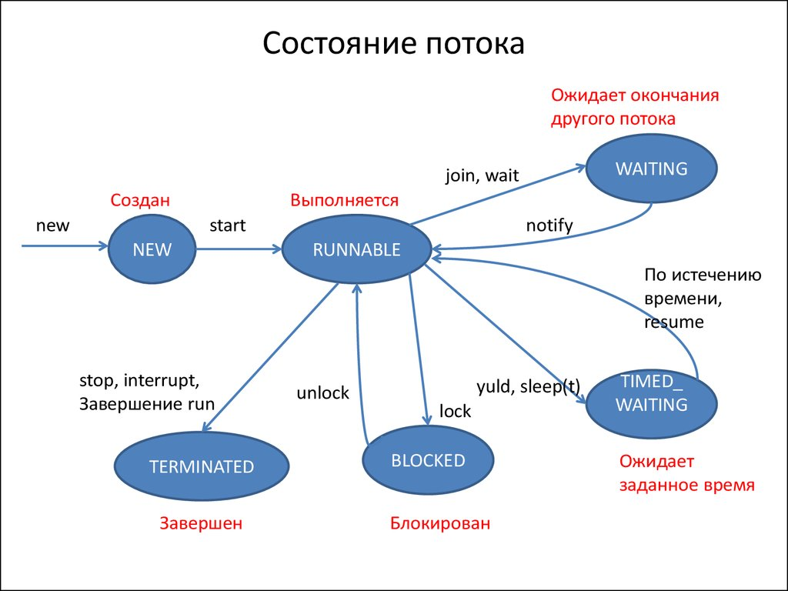

# 1. Чем отличается процесс от потока?

Процессы и потоки (или нити) — это фундаментальные концепции в операционных системах и программировании, которые используются для выполнения программ. Несмотря на то, что оба они представляют собой единицы выполнения, между ними есть несколько ключевых различий.

## 1. **Определение**

- **Процесс (Process):**
  - Это независимая программа, выполняющаяся в операционной системе. Каждый процесс имеет свое собственное адресное пространство (виртуальную память), ресурсы (например, открытые файлы, файловые дескрипторы), и обычно выполняется независимо от других процессов.
  - Процессы могут взаимодействовать друг с другом через механизмы межпроцессного взаимодействия (IPC), такие как очереди сообщений, пайпы или сокеты, но это взаимодействие обычно сложнее и медленнее, чем взаимодействие между потоками.

- **Поток (Thread):**
  - Поток — это наименьшая единица выполнения в процессе. Потоки внутри одного процесса разделяют одно и то же адресное пространство и ресурсы процесса, такие как память, открытые файлы и другие данные. Однако каждый поток имеет собственный стек, регистры процессора и программный счетчик (PC).
  - Потоки часто называют "легковесными процессами" из-за их меньших накладных расходов и быстрой смены контекста по сравнению с процессами.

## 2. **Изоляция и безопасность**

- **Процесс:**
  - Процессы изолированы друг от друга, что означает, что ошибки в одном процессе (например, некорректный доступ к памяти) обычно не влияют на другие процессы. Это изоляция делает процессы безопаснее, но также увеличивает накладные расходы на взаимодействие между ними.
  
- **Поток:**
  - Потоки внутри одного процесса не изолированы друг от друга и разделяют память и ресурсы. Это делает их более эффективными в плане взаимодействия, но также приводит к рискам, связанным с параллельным доступом к общим данным (например, условия гонки или мертвая блокировка).

## 3. **Создание и управление**

- **Процесс:**
  - Создание нового процесса обычно требует значительных системных ресурсов. Время на создание процесса включает копирование данных процесса (например, адресного пространства), создание таблиц страниц, инициализацию дескрипторов и т.д.
  - Управление процессами также связано с большими накладными расходами, поскольку операционная система должна поддерживать полную информацию о каждом процессе.

- **Поток:**
  - Создание потока требует меньше ресурсов, так как потоки разделяют память и ресурсы процесса. Создание и переключение контекста потоков происходит быстрее, чем у процессов.
  - Потоки более гибкие для выполнения задач, требующих параллелизма и многозадачности в пределах одного процесса.

## 4. **Пример использования**

- **Процесс:**
  - Каждый процесс может быть использован для выполнения отдельной программы или независимой задачи, например, веб-браузер, текстовый редактор, серверная служба.
  - Процессы полезны, когда нужно выполнить задачи в строгой изоляции друг от друга, например, запуск разных приложений в операционной системе.

- **Поток:**
  - Потоки часто используются внутри одного процесса для выполнения параллельных задач. Например, в веб-браузере один поток может заниматься загрузкой веб-страниц, другой — рендерингом, третий — обработкой пользовательского ввода.
  - Потоки полезны, когда нужно выполнять несколько задач одновременно в одном и том же контексте, например, многопоточная обработка данных.

## 5. **Переключение контекста**

- **Процесс:**
  - Переключение контекста между процессами включает переключение всего состояния процесса, включая его адресное пространство, регистры процессора, таблицы страниц и т.д. Это достаточно ресурсоемкий процесс.

- **Поток:**
  - Переключение контекста между потоками включает только переключение регистров и стека, поскольку потоки разделяют адресное пространство процесса. Это делает переключение контекста между потоками быстрее и менее затратным по ресурсам.

## Заключение

- Процесс — это более изолированная и независимая единица выполнения, которая требует больше ресурсов для создания и управления, но обеспечивает безопасность и изоляцию.
- Поток — это легковесная единица выполнения, которая делит ресурсы с другими потоками в том же процессе, что делает его более эффективным для многозадачности, но требует более тщательной синхронизации для предотвращения проблем, связанных с параллельным доступом к общим данным.

# 2. В чем разница между классом Thread и интерфейсом Runnable? В каких случаях предпочтительно использовать Thread, а в каких Runnable?

В Java классы `Thread` и интерфейс `Runnable` играют важную роль при работе с многопоточностью. Хотя оба способа позволяют выполнять код в отдельном потоке, они имеют свои особенности и предназначены для разных сценариев использования.

## 1. **Основные различия между `Thread` и `Runnable`**

### **Класс `Thread`:**

- **Наследование:** `Thread` — это класс, который расширяет (`extends`) класс `Object` и реализует интерфейс `Runnable`. Когда вы создаете класс, который наследуется от `Thread`, он становится полноценным потоком.
  
- **Наследование от другого класса:** В Java вы можете наследоваться только от одного класса, поэтому если ваш класс уже наследуется от другого класса, вы не сможете наследоваться от `Thread`.

- **Прямое управление потоком:** Класс `Thread` предоставляет больше возможностей для управления потоком, таких как методы `start()`, `sleep()`, `join()`, `interrupt()`, `setPriority()` и т.д. 

### **Интерфейс `Runnable`:**

- **Интерфейс:** `Runnable` — это функциональный интерфейс с единственным методом `run()`, который должен быть реализован в классе, чтобы его объекты могли быть выполнены в потоке. 

- **Наследование от другого класса:** Использование `Runnable` позволяет вам наследоваться от другого класса, так как вы реализуете интерфейс, а не наследуетесь от класса. Это особенно полезно, если ваш класс уже расширяет другой класс, но вы хотите добавить возможность работы в потоке.

- **Разделение логики и потока:** Использование `Runnable` отделяет логику задачи (то, что выполняется в методе `run()`) от механизма управления потоком, что делает код более гибким и модульным.

## 2. **Примеры использования**

### **Класс `Thread`:**

Пример создания потока, наследуясь от класса `Thread`:

```java
class MyThread extends Thread {
    @Override
    public void run() {
        System.out.println("MyThread is running");
    }
}

public class Main {
    public static void main(String[] args) {
        MyThread thread = new MyThread();
        thread.start(); // Запуск потока
    }
}
```

### **Интерфейс `Runnable`:**

Пример создания потока с использованием интерфейса `Runnable`:

```java
class MyRunnable implements Runnable {
    @Override
    public void run() {
        System.out.println("MyRunnable is running");
    }
}

public class Main {
    public static void main(String[] args) {
        MyRunnable myRunnable = new MyRunnable();
        Thread thread = new Thread(myRunnable);
        thread.start(); // Запуск потока
    }
}
```

## 3. **Когда использовать `Thread`, а когда `Runnable`?**

### **Использование `Thread`:**

- **Простые сценарии:** Если вы создаете простое многопоточное приложение, и ваш класс не требует наследования от другого класса, вы можете напрямую наследоваться от `Thread`.
- **Контроль над потоком:** Если вам нужно больше контроля над потоком, например, изменение его приоритета, использование методов `interrupt()`, `join()`, и т.д., вы можете использовать класс `Thread`.

### **Использование `Runnable`:**

- **Гибкость и модульность:** Если ваш класс уже наследуется от другого класса или если вы хотите отделить логику выполнения от управления потоком, лучше использовать `Runnable`. Это обеспечивает большую гибкость и делает код более читаемым и поддерживаемым.
- **Переиспользование кода:** Если вам нужно повторно использовать класс в различных контекстах, где многопоточность является опцией, а не необходимостью, `Runnable` предпочтительнее, так как его можно использовать с разными механизмами выполнения потоков, такими как `ThreadPoolExecutor`.
- **Работа с пулами потоков:** В современных приложениях часто используются пулы потоков, такие как `ExecutorService`, которые принимают объекты `Runnable`. Использование `Runnable` в таких сценариях позволяет вам лучше управлять ресурсами и масштабируемостью приложения.

## 4. **Заключение**

- **Используйте `Thread`,** когда вам нужно быстро создать поток без сложных требований к наследованию и управлению потоками.
- **Используйте `Runnable`,** когда вам нужно больше гибкости, модульности, или если ваш класс уже наследуется от другого класса. `Runnable` также предпочтителен для работы с пулами потоков и другими высокоуровневыми механизмами управления потоками.

Оба подхода имеют свои плюсы и минусы, и выбор между ними зависит от архитектуры и требований вашего приложения.

# 3. Что представляет собой монитор? Как в Java реализован монитор?

## Что такое монитор?

Монитор — это механизм синхронизации, который используется для управления доступом к общим ресурсам в многопоточных программах. Он обеспечивает взаимное исключение (mutex), гарантируя, что только один поток может выполнять определенный блок кода или метод в любой момент времени. Это помогает предотвратить состояния гонки и другие проблемы, связанные с параллельным доступом к общим данным.

## Как работает монитор?

Монитор включает в себя три основных компонента:

1. **Взаимное исключение (Mutex):** Обеспечивает доступ к общему ресурсу только одному потоку за раз.
2. **Состояние (Condition):** Определяет, какие потоки могут быть запущены, и управляет порядком их запуска.
3. **Ожидание и уведомление (Wait/Notify):** Потоки могут быть приостановлены и ожидать определенного условия, и затем уведомлены, когда это условие выполнено.

Когда поток входит в монитор (т.е. пытается выполнить синхронизированный код), он блокирует монитор. Если монитор уже занят другим потоком, поток будет помещен в очередь ожидания, пока монитор не освободится.

## Мониторы в Java

В Java монитор реализован на уровне языка через ключевые слова и встроенные методы:

### 1. **Ключевое слово `synchronized`:**

- **Синхронизированный метод:** В Java любой метод может быть объявлен как `synchronized`. Это означает, что только один поток может одновременно выполнять этот метод для данного экземпляра объекта. Внутри метода монитор захватывается при его вызове и освобождается, когда метод завершает выполнение.

  ```java
  public synchronized void synchronizedMethod() {
      // Код, который может выполнять только один поток за раз
  }
  ```

- **Синхронизированный блок:** Более тонкий контроль над синхронизацией обеспечивается с помощью синхронизированных блоков, которые позволяют синхронизировать доступ к определенному коду внутри метода, используя монитор определенного объекта.

  ```java
  public void someMethod() {
      synchronized(this) {  // Монитор захватывается для текущего объекта
          // Код, который может выполнять только один поток за раз
      }
  }
  ```

  Можно синхронизировать блоки кода с использованием монитора любого объекта:

  ```java
  public void someMethod() {
      Object lock = new Object();
      synchronized(lock) {
          // Код защищен монитором объекта lock
      }
  }
  ```

### 2. **Методы `wait()`, `notify()`, `notifyAll()`:**

Эти методы определены в классе `Object` и позволяют потокам взаимодействовать друг с другом через монитор.

- **`wait()`:** Вызывает ожидание потока, освобождая монитор до тех пор, пока другой поток не вызовет `notify()` или `notifyAll()` на том же мониторе.
  
  ```java
  synchronized(lock) {
      lock.wait();  // Поток освобождает монитор и ждет уведомления
  }
  ```

- **`notify()`:** Будит один поток, ожидающий на мониторе. Тот поток, который первым захватит монитор после пробуждения, продолжит выполнение.

  ```java
  synchronized(lock) {
      lock.notify();  // Уведомляем один поток, ожидающий на мониторе lock
  }
  ```

- **`notifyAll()`:** Будит все потоки, ожидающие на мониторе, но только один из них сможет захватить монитор и продолжить выполнение, остальные снова будут ждать.

  ```java
  synchronized(lock) {
      lock.notifyAll();  // Уведомляем все потоки, ожидающие на мониторе lock
  }
  ```

### 3. **Статическая синхронизация:**

Вы также можете синхронизировать доступ к статическим методам и блокам кода. В этом случае монитор захватывается на уровне класса, а не экземпляра объекта.

```java
public static synchronized void staticSynchronizedMethod() {
    // Синхронизировано для всего класса
}

public static void someMethod() {
    synchronized(MyClass.class) {
        // Синхронизированный блок на уровне класса
    }
}
```

## Пример использования монитора в Java

Рассмотрим пример, где несколько потоков пытаются увеличить общий счетчик:

```java
public class Counter {
    private int count = 0;

    public synchronized void increment() {
        count++;
    }

    public synchronized int getCount() {
        return count;
    }
}

public class Main {
    public static void main(String[] args) {
        Counter counter = new Counter();

        Runnable task = () -> {
            for (int i = 0; i < 1000; i++) {
                counter.increment();
            }
        };

        Thread thread1 = new Thread(task);
        Thread thread2 = new Thread(task);

        thread1.start();
        thread2.start();

        try {
            thread1.join();
            thread2.join();
        } catch (InterruptedException e) {
            e.printStackTrace();
        }

        System.out.println("Final count: " + counter.getCount());
    }
}
```

В этом примере методы `increment()` и `getCount()` синхронизированы, что гарантирует, что доступ к счетчику будет корректно управляться мониторами, и оба потока не смогут одновременно изменить значение счетчика.

## Заключение

Монитор в Java обеспечивает механизм синхронизации, предотвращающий одновременный доступ нескольких потоков к критическим секциям кода. Использование ключевого слова `synchronized` и методов `wait()`, `notify()`, `notifyAll()` позволяет легко управлять многопоточными программами, минимизируя риск возникновения ошибок, связанных с параллельным доступом к общим ресурсам.

# 4. Что такое синхронизация? Какие методы синхронизации существуют в Java?

## Что такое синхронизация?

Синхронизация — это механизм, который используется в многопоточном программировании для управления доступом к общим ресурсам. Она гарантирует, что только один поток может одновременно получить доступ к определенному блоку кода или объекту, тем самым предотвращая ошибки, такие как состояния гонки, когда несколько потоков пытаются одновременно изменить один и тот же ресурс.

Синхронизация необходима для обеспечения корректного выполнения программы, когда несколько потоков работают с общими данными. Без синхронизации могут возникнуть непредсказуемые ошибки, такие как некорректные данные, повреждение состояния объекта или нарушения последовательности выполнения кода.

## Методы синхронизации в Java

В Java существует несколько способов достижения синхронизации:

### 1. **Ключевое слово `synchronized`**

#### a. **Синхронизированные методы**

Метод может быть объявлен как `synchronized`, чтобы гарантировать, что он может быть выполнен только одним потоком в одно и то же время. 

- **Синхронизированные экземплярные методы:**
  
  Когда метод синхронизирован на уровне объекта (`this`), только один поток может выполнить его для данного экземпляра класса. Если другой поток пытается выполнить любой другой синхронизированный метод того же экземпляра, он будет блокирован, пока первый поток не завершит выполнение метода.

  ```java
  public class Example {
      public synchronized void synchronizedMethod() {
          // Код, который может выполнить только один поток в данный момент
      }
  }
  ```

- **Синхронизированные статические методы:**

  Синхронизированный статический метод блокирует доступ ко всем другим синхронизированным статическим методам класса. Это происходит потому, что монитор захватывается на уровне класса, а не конкретного объекта.

  ```java
  public class Example {
      public static synchronized void staticSynchronizedMethod() {
          // Код, который может выполнить только один поток для всего класса
      }
  }
  ```

#### b. **Синхронизированные блоки**

Синхронизированный блок дает более гибкий контроль над синхронизацией, позволяя синхронизировать доступ только к определенным частям метода. Это позволяет улучшить производительность, так как не весь метод блокируется.

- **Синхронизация на уровне объекта:**
  
  В этом случае монитор захватывается для конкретного объекта.

  ```java
  public void someMethod() {
      synchronized(this) {
          // Код внутри блока защищен от одновременного доступа
      }
  }
  ```

- **Синхронизация на уровне класса или другого объекта:**

  Можно использовать любой объект в качестве монитора для синхронизации, например, строку, объект другого класса или статический объект.

  ```java
  public void someMethod() {
      Object lock = new Object();
      synchronized(lock) {
          // Доступ к этому блоку кода синхронизирован на объекте lock
      }
  }
  ```

### 2. **Библиотека `java.util.concurrent`**

Java предоставляет высокоуровневые механизмы синхронизации в библиотеке `java.util.concurrent`, которые предлагают большую гибкость и возможности.

#### a. **ReentrantLock**

`ReentrantLock` — это альтернатива синхронизированным блокам и методам. Он предоставляет больше возможностей, таких как возможность проверки состояния блокировки, опциональная попытка блокировки и возможность справедливой блокировки.

```java
import java.util.concurrent.locks.ReentrantLock;

public class Example {
    private final ReentrantLock lock = new ReentrantLock();

    public void method() {
        lock.lock();  // Захват блокировки
        try {
            // Код, который должен быть синхронизирован
        } finally {
            lock.unlock();  // Обязательно освобождаем блокировку в блоке finally
        }
    }
}
```

#### b. **ReadWriteLock**

`ReadWriteLock` позволяет разделить блокировку на чтение и запись. Это полезно, когда несколько потоков могут безопасно читать данные одновременно, но только один поток должен иметь возможность записывать данные.

```java
import java.util.concurrent.locks.ReentrantReadWriteLock;

public class Example {
    private final ReentrantReadWriteLock rwLock = new ReentrantReadWriteLock();

    public void readMethod() {
        rwLock.readLock().lock();  // Захват блокировки на чтение
        try {
            // Код для чтения данных
        } finally {
            rwLock.readLock().unlock();  // Освобождение блокировки на чтение
        }
    }

    public void writeMethod() {
        rwLock.writeLock().lock();  // Захват блокировки на запись
        try {
            // Код для записи данных
        } finally {
            rwLock.writeLock().unlock();  // Освобождение блокировки на запись
        }
    }
}
```

#### c. **CountDownLatch**

`CountDownLatch` позволяет одному или нескольким потокам ждать завершения набора операций, выполняемых другими потоками. Этот класс полезен для координации выполнения потоков.

```java
import java.util.concurrent.CountDownLatch;

public class Example {
    private final CountDownLatch latch = new CountDownLatch(3);

    public void someMethod() throws InterruptedException {
        latch.await();  // Ожидание до тех пор, пока счетчик не станет 0
    }

    public void taskCompleted() {
        latch.countDown();  // Уменьшение счетчика на 1
    }
}
```

#### d. **CyclicBarrier**

`CyclicBarrier` позволяет группе потоков ожидать друг друга до тех пор, пока все не достигнут определенной точки. Полезно для задач, где необходимо координировать выполнение группы потоков.

```java
import java.util.concurrent.CyclicBarrier;

public class Example {
    private final CyclicBarrier barrier = new CyclicBarrier(3, () -> System.out.println("All threads reached the barrier"));

    public void someMethod() throws InterruptedException {
        barrier.await();  // Ожидание всех потоков перед продолжением
    }
}
```

### 3. **Волатильные переменные (`volatile`)**

Переменная, помеченная ключевым словом `volatile`, гарантирует, что изменения переменной, произведенные одним потоком, будут немедленно видны другим потокам. Это снижает вероятность работы с устаревшими данными в многопоточном окружении, но не обеспечивает полной синхронизации.

```java
public class Example {
    private volatile boolean flag = true;

    public void someMethod() {
        while (flag) {
            // Выполняется пока flag равен true
        }
    }

    public void stopMethod() {
        flag = false;  // Поток, выполняющий someMethod, видит это изменение немедленно
    }
}
```

### 4. **Методы `wait()`, `notify()`, `notifyAll()`**

Эти методы, определенные в классе `Object`, позволяют потокам взаимодействовать через мониторы:

- **`wait()`:** Ожидание освобождения монитора.
- **`notify()`:** Пробуждение одного ожидающего потока.
- **`notifyAll()`:** Пробуждение всех ожидающих потоков.

Пример использования:

```java
public class Example {
    private final Object lock = new Object();

    public void waitingMethod() throws InterruptedException {
        synchronized (lock) {
            lock.wait();  // Ожидание уведомления
        }
    }

    public void notifyingMethod() {
        synchronized (lock) {
            lock.notify();  // Уведомление одного потока
        }
    }
}
```

## Заключение

Синхронизация в Java необходима для безопасного доступа к общим ресурсам в многопоточных приложениях. Java предоставляет различные методы для достижения синхронизации, начиная с базовых (`synchronized`) и заканчивая более продвинутыми механизмами из пакета `java.util.concurrent`, такими как `ReentrantLock`, `CountDownLatch`, и другие. Выбор подходящего метода зависит от конкретной задачи и уровня контроля, необходимого для обеспечения корректной работы программы.

# 5. Какое значение имеет ключевое слово `synchronized`? Где и для каких целей его следует использовать?

## Значение ключевого слова `synchronized`

Ключевое слово `synchronized` в Java используется для обеспечения синхронизации потоков, что предотвращает одновременное выполнение критических секций кода несколькими потоками. Это ключевое слово гарантирует, что только один поток может выполнить синхронизированный блок кода или метод в конкретный момент времени, тем самым защищая общие ресурсы от одновременного доступа и предотвращая состояния гонки.

## Где и для каких целей следует использовать `synchronized`?

### 1. **Синхронизация методов**

Когда метод объявляется как `synchronized`, монитор (блокировка) захватывается для объекта, на котором вызывается этот метод (если метод нестатический), или для всего класса (если метод статический). Это гарантирует, что только один поток может выполнить этот метод для данного объекта или класса.

#### a. **Нестатические методы:**

Если метод нестатический, синхронизация происходит на уровне конкретного экземпляра объекта. Это означает, что два потока не могут одновременно выполнять синхронизированный метод для одного и того же объекта, но они могут выполнять этот метод для разных объектов.

```java
public class Example {
    public synchronized void syncMethod() {
        // Только один поток может одновременно выполнять этот метод
    }
}
```

#### b. **Статические методы:**

Если метод статический, синхронизация происходит на уровне класса. Это означает, что все потоки синхронизируются на уровне класса, и только один поток может одновременно выполнять этот метод для всех экземпляров этого класса.

```java
public class Example {
    public static synchronized void syncStaticMethod() {
        // Только один поток может выполнять этот метод для всех экземпляров класса
    }
}
```

### 2. **Синхронизация блоков кода**

Синхронизированные блоки дают возможность синхронизировать только часть метода, что позволяет повысить производительность, так как не весь метод блокируется, а только его критическая секция.

#### a. **Синхронизация на уровне объекта:**

Вы можете синхронизировать доступ к определенному коду, используя в качестве монитора конкретный объект. В этом случае монитор захватывается только на время выполнения синхронизированного блока.

```java
public void someMethod() {
    synchronized(this) {  // Блокировка на уровне текущего объекта
        // Код, защищенный от одновременного доступа
    }
}
```

#### b. **Синхронизация на уровне класса или другого объекта:**

Синхронизировать можно не только на уровне текущего объекта (`this`), но и на уровне любого другого объекта, который используется в качестве монитора. Это полезно, если требуется синхронизация на определенных объектах или группах объектов.

```java
public void someMethod() {
    Object lock = new Object();
    synchronized(lock) {  // Блокировка на уровне объекта lock
        // Код, защищенный от одновременного доступа
    }
}
```

### 3. **Использование `synchronized` для предотвращения состояний гонки**

Состояния гонки (race conditions) возникают, когда несколько потоков одновременно изменяют общие данные, и результат выполнения зависит от порядка их выполнения. Использование `synchronized` предотвращает такие проблемы, обеспечивая последовательный доступ к ресурсам.

#### Пример:

Рассмотрим пример с общим счетчиком, который увеличивается несколькими потоками:

```java
public class Counter {
    private int count = 0;

    public synchronized void increment() {
        count++;
    }

    public synchronized int getCount() {
        return count;
    }
}
```

Здесь оба метода синхронизированы, что гарантирует корректную работу счетчика при одновременном доступе из нескольких потоков.

### 4. **Когда следует использовать `synchronized`?**

#### a. **При работе с общими ресурсами:**

Если несколько потоков работают с общими переменными, объектами или другими ресурсами, `synchronized` помогает защитить эти ресурсы от одновременного доступа и некорректного изменения.

#### b. **Для защиты критических секций:**

Когда часть кода может повлиять на общие данные и должна быть выполнена атомарно, т.е. как единое целое без прерываний другими потоками, синхронизация необходима.

#### c. **Для обеспечения корректности данных:**

Синхронизация обеспечивает согласованность и целостность данных, предотвращая одновременные изменения и некорректное состояние объектов.

### 5. **Проблемы, связанные с использованием `synchronized`**

#### a. **Заблокированность (Deadlock):**

Если два или более потоков ожидают захвата ресурсов, удерживаемых друг другом, это может привести к состоянию взаимной блокировки (deadlock). Поэтому при использовании `synchronized` нужно тщательно продумывать порядок захвата блокировок.

#### b. **Снижение производительности:**

Чрезмерное использование `synchronized` может привести к снижению производительности, так как потоки будут часто блокироваться и ждать освобождения ресурсов.

## Заключение

Ключевое слово `synchronized` в Java является мощным инструментом для управления многопоточностью. Оно позволяет избежать состояний гонки и обеспечивает корректный и согласованный доступ к общим ресурсам в многопоточных приложениях. Однако его использование требует тщательного планирования, чтобы избежать таких проблем, как взаимные блокировки и снижение производительности.

# 6. Какой объект является монитором для статического synchronized-метода?

Для статического `synchronized`-метода монитором является **класс** (`Class` object) самого класса, в котором этот метод объявлен. В отличие от нестатических `synchronized`-методов, где монитором является конкретный экземпляр объекта (`this`), в случае статических методов синхронизация происходит на уровне класса, а не объекта.

## Объяснение

Когда статический метод объявляется как `synchronized`, Java блокирует выполнение этого метода на уровне класса. Это означает, что при вызове статического `synchronized`-метода захватывается монитор (блокировка) класса, представленного объектом `Class`. Таким образом, одновременно может быть выполнен только один статический `synchronized`-метод этого класса для всех потоков.

### Пример использования статического `synchronized`-метода

```java
public class Example {
    // Статический синхронизированный метод
    public static synchronized void staticSyncMethod() {
        // Код, который может выполняться только одним потоком для этого класса
        System.out.println("Static synchronized method is running...");
    }
}
```

### Как работает монитор для статического метода?

В приведенном примере, когда какой-либо поток вызывает `staticSyncMethod()`, JVM захватывает монитор для класса `Example`, который является объектом типа `Class<Example>`. Пока этот метод выполняется, никакие другие потоки не могут вызвать другие статические `synchronized`-методы этого же класса, так как монитор уже захвачен.

### Подтверждение: использование `Example.class`

Чтобы понять, что именно объект класса используется как монитор, можно использовать синхронизированный блок с классом:

```java
public class Example {
    public static void staticSyncMethod() {
        synchronized (Example.class) { // Монитором является объект класса Example
            // Код, защищенный от одновременного доступа
            System.out.println("Static synchronized block is running...");
        }
    }
}
```

В этом примере `synchronized (Example.class)` выполняет ту же функцию, что и `synchronized` в статическом методе: синхронизирует выполнение кода на уровне класса.

## Заключение

Таким образом, монитором для статического `synchronized`-метода является объект `Class` самого класса. Это означает, что синхронизация работает на уровне всего класса, а не конкретного экземпляра, что ограничивает доступ ко всем статическим `synchronized`-методам класса одновременно.

# 7. Какой объект является монитором для нестатического synchronized-метода?

Для нестатического `synchronized`-метода монитором является **экземпляр объекта** (то есть `this`), на котором был вызван этот метод. Это означает, что когда поток вызывает нестатический `synchronized`-метод, он захватывает монитор конкретного экземпляра объекта, к которому этот метод относится. 

## Объяснение

Когда метод объявляется как `synchronized`, синхронизация выполняется на уровне конкретного объекта, а не класса в целом. Только один поток может выполнять этот метод или любой другой `synchronized`-метод данного экземпляра объекта одновременно. Однако другие экземпляры того же класса могут выполнять свои `synchronized`-методы параллельно.

### Пример использования нестатического `synchronized`-метода

```java
public class Example {
    // Нестатический синхронизированный метод
    public synchronized void syncMethod() {
        // Код, который может выполняться только одним потоком для конкретного объекта
        System.out.println("Synchronized method is running...");
    }
}
```

### Как работает монитор для нестатического метода?

В приведенном примере, когда поток вызывает `syncMethod()` на каком-то объекте `example`, монитор захватывается на этом конкретном объекте `example`. Пока этот метод выполняется, никакой другой поток не может выполнить этот или любой другой `synchronized`-метод для того же объекта `example`.

### Подтверждение: использование `this` для синхронизации

Чтобы лучше понять, что монитором является конкретный экземпляр, можно использовать синхронизированный блок с `this`:

```java
public class Example {
    public void syncMethod() {
        synchronized (this) {  // Монитором является текущий объект
            // Код, защищенный от одновременного доступа
            System.out.println("Synchronized block is running...");
        }
    }
}
```

В данном примере `synchronized (this)` выполняет ту же функцию, что и ключевое слово `synchronized` в объявлении метода: синхронизирует выполнение кода на уровне текущего объекта.

## Заключение

Таким образом, монитором для нестатического `synchronized`-метода является объект `this` — конкретный экземпляр класса, на котором вызван метод. Синхронизация работает на уровне этого экземпляра, предотвращая одновременное выполнение синхронизированных методов для одного и того же объекта несколькими потоками, но не ограничивая выполнение синхронизированных методов на других экземплярах этого же класса.

# 8. Как действуют методы `wait()`, `notify()` и `notifyAll()` в контексте многопоточности?

Методы `wait()`, `notify()` и `notifyAll()` являются частью механизма взаимодействия между потоками (inter-thread communication) в Java. Они используются для управления синхронизацией и координацией потоков, работающих с общими ресурсами. Эти методы определены в классе `Object`, так как любой объект в Java может использоваться в качестве монитора (блокировки).

## Как работают методы `wait()`, `notify()` и `notifyAll()`?

### 1. **Метод `wait()`**

Метод `wait()` заставляет текущий поток, который держит монитор объекта, временно освободить его и перейти в состояние ожидания до тех пор, пока другой поток не вызовет `notify()` или `notifyAll()` на этом же объекте.

- **Синтаксис:** `void wait()`  
- **Использование:** Вызов метода `wait()` должен происходить внутри `synchronized` блока или метода; иначе возникает `IllegalMonitorStateException`.
- **Действие:** Освобождает монитор и переводит поток в состояние ожидания (waiting).

#### Пример использования `wait()`:

```java
public class Example {
    public synchronized void waitMethod() throws InterruptedException {
        System.out.println("Thread is waiting...");
        wait();  // Поток переходит в состояние ожидания и освобождает монитор
        System.out.println("Thread resumed after wait.");
    }
}
```

### 2. **Метод `notify()`**

Метод `notify()` пробуждает один из потоков, который находится в состоянии ожидания на том же мониторе объекта. Какой именно поток будет пробужден, заранее не определено — это зависит от реализации JVM. Если нет ожидающих потоков, вызов `notify()` не имеет эффекта.

- **Синтаксис:** `void notify()`
- **Использование:** Этот метод также должен вызываться внутри `synchronized` блока или метода.
- **Действие:** Пробуждает один случайный поток, ожидающий на данном мониторе.

#### Пример использования `notify()`:

```java
public class Example {
    public synchronized void notifyMethod() {
        System.out.println("Notifying one waiting thread...");
        notify();  // Пробуждает один поток, ожидающий на этом объекте
    }
}
```

### 3. **Метод `notifyAll()`**

Метод `notifyAll()` пробуждает все потоки, которые находятся в состоянии ожидания на том же мониторе объекта. Все пробужденные потоки будут снова конкурировать за монитор, и только один из них сможет его захватить и продолжить выполнение.

- **Синтаксис:** `void notifyAll()`
- **Использование:** Также должен вызываться только внутри `synchronized` блока или метода.
- **Действие:** Пробуждает все ожидающие потоки на данном мониторе.

#### Пример использования `notifyAll()`:

```java
public class Example {
    public synchronized void notifyAllMethod() {
        System.out.println("Notifying all waiting threads...");
        notifyAll();  // Пробуждает все потоки, ожидающие на этом объекте
    }
}
```

## Как взаимодействуют `wait()`, `notify()` и `notifyAll()`?

Эти методы используются для координации действий потоков. Например, один поток может ожидать определенного состояния (например, когда данные готовы), а другой поток может сигнализировать об изменении этого состояния.

### Пример взаимодействия:

Рассмотрим задачу с производителем и потребителем, где один поток производит данные, а другой их потребляет.

```java
public class SharedResource {
    private boolean available = false;

    // Метод, вызываемый потребителем
    public synchronized void consume() throws InterruptedException {
        while (!available) {  // Если данные недоступны, ждать
            wait();
        }
        System.out.println("Consumed data.");
        available = false;
        notify();  // Уведомить производителя
    }

    // Метод, вызываемый производителем
    public synchronized void produce() throws InterruptedException {
        while (available) {  // Если данные доступны, ждать, пока они не будут потреблены
            wait();
        }
        System.out.println("Produced data.");
        available = true;
        notify();  // Уведомить потребителя
    }
}
```

### Взаимодействие в этом примере:

1. Потребитель вызывает `wait()`, если данные еще не готовы.
2. Производитель производит данные и вызывает `notify()`, чтобы разбудить потребителя.
3. После этого потребитель потребляет данные и вызывает `notify()`, чтобы разбудить производителя, который затем может снова начать производство.

## Важные моменты:

- Методы `wait()`, `notify()`, и `notifyAll()` всегда должны вызываться внутри синхронизированного контекста (внутри `synchronized` блока или метода), чтобы избежать `IllegalMonitorStateException`.
- После вызова `wait()` поток освобождает монитор и переходит в состояние ожидания.
- Пробужденные потоки не начинают немедленное выполнение — они должны снова захватить монитор, прежде чем продолжить.
- Использование `notify()` и `notifyAll()` требует осторожности, чтобы не вызвать нежелательные состояния гонки или взаимные блокировки.

## Заключение

Методы `wait()`, `notify()`, и `notifyAll()` позволяют организовать взаимодействие между потоками на уровне мониторов объектов, обеспечивая координацию и правильную последовательность выполнения в многопоточных приложениях. Эти методы необходимы для создания сложных синхронизированных систем, где потоки должны взаимодействовать, ожидая определенных событий или условий.

# 9. В каких состояниях может находиться поток?

Дополнительно есть статья на хабре: https://habr.com/ru/articles/776914/

В Java поток может находиться в одном из нескольких состояний, которые отражают его текущий жизненный цикл. Эти состояния определяют, что именно происходит с потоком в данный момент и каким образом он взаимодействует с остальными потоками и ресурсами системы. Понимание этих состояний важно для эффективного управления многопоточностью.

## Основные состояния потока в Java

1. **NEW (Новое)**  
   Поток находится в состоянии NEW после создания, но до вызова метода `start()`. В этом состоянии поток еще не выполняет никакой задачи и не запущен.

   ```java
   Thread thread = new Thread(); // Поток создан, но не запущен
   ```

2. **RUNNABLE (Выполняется)**  
   После вызова метода `start()` поток переходит в состояние RUNNABLE. В этом состоянии поток готов к выполнению и выполняется, если ему выделено время процессора. Это состояние объединяет в себе как выполнение потока (running), так и нахождение в очереди на выполнение (ready to run).

   ```java
   thread.start(); // Поток запущен и готов к выполнению
   ```

3. **BLOCKED (Заблокирован)**  
   Поток находится в состоянии BLOCKED, если он пытается войти в синхронизированный блок или метод, но монитор (блокировка) недоступен, так как удерживается другим потоком. Поток остается в этом состоянии до тех пор, пока монитор не освободится.

   ```java
   // Пример состояния BLOCKED:
   // Один поток удерживает монитор, другой пытается войти в синхронизированный блок
   synchronized (sharedObject) {
       // Код, выполняющийся первым потоком
   }
   ```

4. **WAITING (Ожидание)**  
   Поток находится в состоянии WAITING, когда он ждет сигнала от другого потока, чтобы продолжить выполнение. Это состояние вызывается методами `wait()`, `join()` или `LockSupport.park()`. В этом состоянии поток освобождает монитор и не активен до тех пор, пока не получит уведомление (`notify()`, `notifyAll()`) или пока не завершится ожидаемый поток (если вызван `join()`).

   ```java
   synchronized (object) {
       object.wait(); // Поток переходит в состояние WAITING
   }
   ```

5. **TIMED_WAITING (Ожидание с таймаутом)**  
   Поток находится в состоянии TIMED_WAITING, если он ждет с таймаутом. Это происходит при вызове методов `wait(long timeout)`, `join(long timeout)`, `sleep(long)` или `LockSupport.parkNanos()` / `parkUntil()`. Поток остается в этом состоянии до тех пор, пока не истечет время ожидания или не произойдет событие (например, `notify()`).

   ```java
   Thread.sleep(1000); // Поток находится в состоянии TIMED_WAITING на 1 секунду
   ```

6. **TERMINATED (Завершен)**  
   Поток переходит в состояние TERMINATED после завершения своего выполнения. Это может произойти естественным путем, когда поток заканчивает выполнение своего метода `run()`, либо из-за возникновения необработанного исключения.

   ```java
   // Поток завершился после выполнения метода run()
   ```

## Жизненный цикл потока с изменением состояний

Понимание переходов между состояниями помогает управлять потоками:



1. **NEW → RUNNABLE:** вызов `start()`.
2. **RUNNABLE → BLOCKED:** попытка войти в занятый синхронизированный блок.
3. **RUNNABLE → WAITING:** вызов `wait()`, `join()`, или `LockSupport.park()`.
4. **RUNNABLE → TIMED_WAITING:** вызов `sleep()`, `wait(long)`, `join(long)`.
5. **BLOCKED → RUNNABLE:** освобождение монитора.
6. **WAITING → RUNNABLE:** вызов `notify()` или `notifyAll()`.
7. **TIMED_WAITING → RUNNABLE:** истечение времени ожидания.
8. **RUNNABLE → TERMINATED:** завершение метода `run()` или возникновение исключения.

## Заключение

Состояния потока отображают его текущую деятельность и взаимодействие с остальными потоками и ресурсами. Правильное понимание этих состояний и их переходов помогает эффективно использовать многопоточность, избегать ошибок, таких как взаимные блокировки, и правильно управлять жизненным циклом потоков в Java.

# 10. Что такое семафор? Как его можно реализовать в Java?

**Семафор** — это синхронизирующий примитив, который используется для управления доступом к общим ресурсам в многопоточных приложениях. Семафор ограничивает количество потоков, которые могут одновременно использовать ресурс или выполнять определенный блок кода. Он действует как счетчик, который увеличивается и уменьшается при поступлении запросов на доступ к ресурсу.

## Основные принципы работы семафора

1. **Семафор с одним разрешением (бинарный семафор)**: работает как простой флаг или блокировка, позволяя доступ только одному потоку в одно и то же время. Бинарный семафор аналогичен `ReentrantLock`.

2. **Семафор с несколькими разрешениями (счетный семафор)**: позволяет ограниченному количеству потоков одновременно использовать ресурс. Счетчик семафора уменьшается, когда поток получает доступ к ресурсу, и увеличивается, когда поток освобождает ресурс.

## Как работает семафор?

- **`acquire()`**: метод, используемый для запроса доступа к ресурсу. Если счетчик семафора больше нуля, он уменьшается, и поток получает доступ. Если счетчик равен нулю, поток блокируется до освобождения ресурса.
  
- **`release()`**: метод, используемый для освобождения ресурса и увеличения счетчика семафора. После вызова `release()` один из ожидающих потоков может получить доступ к ресурсу.

## Реализация семафора в Java

Java предоставляет класс `Semaphore`, который входит в пакет `java.util.concurrent` и реализует описанную выше функциональность.

### Пример использования семафора в Java

```java
import java.util.concurrent.Semaphore;

public class SemaphoreExample {
    // Семафор с двумя разрешениями (максимум два потока могут одновременно получить доступ)
    private static final Semaphore semaphore = new Semaphore(2);

    public static void main(String[] args) {
        // Создание и запуск трех потоков
        for (int i = 1; i <= 3; i++) {
            new Thread(new Task(i)).start();
        }
    }

    static class Task implements Runnable {
        private final int taskId;

        public Task(int taskId) {
            this.taskId = taskId;
        }

        @Override
        public void run() {
            try {
                System.out.println("Поток " + taskId + " пытается получить доступ к ресурсу...");
                semaphore.acquire(); // Запрос разрешения у семафора

                System.out.println("Поток " + taskId + " получил доступ к ресурсу.");
                // Симуляция работы с ресурсом
                Thread.sleep(2000);

            } catch (InterruptedException e) {
                Thread.currentThread().interrupt();
            } finally {
                System.out.println("Поток " + taskId + " освобождает ресурс.");
                semaphore.release(); // Освобождение ресурса
            }
        }
    }
}
```

### Объяснение примера

1. **Создание семафора:** `Semaphore semaphore = new Semaphore(2);` — инициализируется семафор с двумя разрешениями, что означает, что максимум два потока могут одновременно выполнять критическую секцию.

2. **Запрос разрешения:** `semaphore.acquire();` — поток запрашивает разрешение на выполнение критической секции. Если разрешение недоступно (счетчик семафора равен нулю), поток будет заблокирован, пока другой поток не вызовет `release()`.

3. **Освобождение ресурса:** `semaphore.release();` — поток освобождает ресурс и увеличивает счетчик семафора, позволяя другому ожидающему потоку продолжить выполнение.

Вот возможный результат вывода в консоль при выполнении приведенного кода с семафором. Поскольку запуск потоков асинхронный и порядок их выполнения не определен, вывод может немного отличаться при каждом запуске. Однако, общая структура и логика останутся неизменными:

### Ожидаемый вывод в консоль:

```
Поток 1 пытается получить доступ к ресурсу...
Поток 2 пытается получить доступ к ресурсу...
Поток 1 получил доступ к ресурсу.
Поток 2 получил доступ к ресурсу.
Поток 3 пытается получить доступ к ресурсу...
Поток 1 освобождает ресурс.
Поток 3 получил доступ к ресурсу.
Поток 2 освобождает ресурс.
Поток 3 освобождает ресурс.
```

### Объяснение вывода:

1. **Первоначальные попытки:** Потоки 1 и 2 пытаются получить доступ к ресурсу и получают его, так как семафор был инициализирован с двумя разрешениями.
   
2. **Третий поток:** Поток 3 также пытается получить доступ, но вынужден ждать, так как все разрешения семафора заняты потоками 1 и 2.

3. **Освобождение ресурсов:** После завершения работы поток 1 освобождает ресурс, и поток 3 немедленно получает доступ.

4. **Завершение:** Потоки последовательно освобождают ресурсы, завершая выполнение.

Этот вывод показывает, как семафор контролирует доступ к общему ресурсу, позволяя только ограниченному числу потоков выполнять критическую секцию одновременно.

## Заключение

Семафор является мощным инструментом для управления доступом к ресурсам в многопоточных приложениях. Он помогает предотвратить состояния гонок и обеспечивает контроль над количеством потоков, работающих с общим ресурсом, поддерживая баланс между параллелизмом и безопасностью данных.

# 11. Какое значение имеет ключевое слово `volatile`? Почему операции с `volatile` переменными не являются атомарными?

Ключевое слово `volatile` в Java используется для обозначения переменных, значение которых может изменяться несколькими потоками. Оно гарантирует, что чтение и запись в такую переменную происходят напрямую из основной памяти, а не из кэша процессора каждого потока, что предотвращает проблемы, связанные с кэшированием значений.

## Значение и использование ключевого слова `volatile`

1. **Гарантия видимости:** Переменная, объявленная как `volatile`, обеспечивает, что все операции чтения и записи происходят из основной памяти. Таким образом, изменения, внесенные одним потоком, становятся немедленно видимыми для других потоков.
   
2. **Запрет оптимизаций:** Компилятор и виртуальная машина Java (JVM) не могут оптимизировать доступ к `volatile` переменной (например, путем кэширования значений в регистрах процессора), что предотвращает переупорядочивание операций с этой переменной.

3. **Обеспечение "happens-before":** Запись в `volatile` переменную в одном потоке "происходит до" (happens-before) всех последующих чтений этой переменной в других потоках. Это обеспечивает согласованность данных между потоками.

### Пример использования `volatile`:

```java
public class VolatileExample {
    private static volatile boolean flag = false;

    public static void main(String[] args) {
        Thread writer = new Thread(() -> {
            try {
                Thread.sleep(1000); // Имитируем задержку
                flag = true; // Изменение volatile переменной
                System.out.println("Флаг установлен в true");
            } catch (InterruptedException e) {
                Thread.currentThread().interrupt();
            }
        });

        Thread reader = new Thread(() -> {
            while (!flag) { // Ожидание изменения переменной
                // Бесконечный цикл до изменения флага
            }
            System.out.println("Флаг изменен, поток завершен");
        });

        writer.start();
        reader.start();
    }
}
```

### Ожидаемый вывод:

```
Флаг установлен в true
Флаг изменен, поток завершен
```

### Объяснение примера:

1. **Изменение флага:** Поток `writer` изменяет значение `volatile` переменной `flag`.
2. **Синхронизация потоков:** Поток `reader` немедленно замечает изменение `flag` и завершает выполнение. Без `volatile` изменение флага могло бы остаться невидимым для потока `reader`.

## Почему операции с `volatile` переменными не являются атомарными?

Операции с `volatile` переменными, такие как инкремент (`++`) или декремент (`--`), не являются атомарными, потому что они состоят из нескольких шагов: чтения, модификации и записи.

### Пример: неатомарность инкремента

```java
volatile int counter = 0;

// Поток 1
counter++; // Операция включает чтение, увеличение и запись

// Поток 2
counter++; // Может произойти между шагами потока 1
```

### Проблема:

1. **Чтение и запись раздельны:** Поток 1 читает значение `counter`, увеличивает его и затем записывает. Поток 2 может в этот момент прочитать то же значение `counter` до записи потоком 1.
2. **Потенциальная потеря данных:** В результате, обе операции могут записать одно и то же значение, теряя одно из увеличений.

### Пример работы:

1. Поток 1: `counter = 0; read -> increment (0+1) -> write (1)`
2. Поток 2: `counter = 0; read -> increment (0+1) -> write (1)`
   
Итог: `counter = 1`, хотя ожидалось `counter = 2`.

## Заключение

Ключевое слово `volatile` обеспечивает видимость изменений между потоками, но не гарантирует атомарность операций. Для достижения атомарности следует использовать другие синхронизирующие механизмы, такие как `synchronized`, `AtomicInteger`, или другие классы из пакета `java.util.concurrent.atomic`, которые обеспечивают атомарные операции над переменными.

# 12. Зачем нужны атомарные (Atomic) типы данных? В чем отличие от переменных с ключевым словом `volatile`?

Атомарные типы данных в Java, такие как `AtomicInteger`, `AtomicLong`, `AtomicBoolean`, и другие классы из пакета `java.util.concurrent.atomic`, предназначены для обеспечения безопасных атомарных операций над переменными в многопоточной среде. Они предоставляют методы, которые выполняются как неделимые, то есть операции над такими переменными выполняются полностью без возможности прерывания другими потоками, что гарантирует корректность их выполнения.

## Зачем нужны атомарные типы данных?

1. **Атомарность операций:** Атомарные типы данных обеспечивают выполнение операций, таких как инкремент, декремент, присваивание и сравнение, как единое действие. Это предотвращает проблемы, связанные с некорректными результатами при конкурентном доступе к переменной.

2. **Повышение производительности:** Атомарные типы данных предоставляют более высокую производительность по сравнению с `synchronized`, так как они используют низкоуровневые механизмы процессора, такие как CAS (Compare-And-Swap), для обеспечения атомарности без блокировок.

3. **Безопасность в многопоточности:** Атомарные типы данных гарантируют, что изменения переменной, выполненные одним потоком, будут безопасно наблюдаемы другими потоками, предотвращая состояние гонки.

### Пример использования `AtomicInteger`

```java
import java.util.concurrent.atomic.AtomicInteger;

public class AtomicExample {
    private static final AtomicInteger counter = new AtomicInteger(0);

    public static void main(String[] args) throws InterruptedException {
        Thread t1 = new Thread(() -> {
            for (int i = 0; i < 1000; i++) {
                counter.incrementAndGet(); // Атомарное увеличение на 1
            }
        });

        Thread t2 = new Thread(() -> {
            for (int i = 0; i < 1000; i++) {
                counter.incrementAndGet(); // Атомарное увеличение на 1
            }
        });

        t1.start();
        t2.start();
        t1.join();
        t2.join();

        System.out.println("Итоговое значение счетчика: " + counter.get());
    }
}
```

### Ожидаемый вывод:

```
Итоговое значение счетчика: 2000
```

### Объяснение:

- Оба потока безопасно увеличивают значение `counter`, так как метод `incrementAndGet()` является атомарным и неделимым.
- Атомарная операция обеспечивает правильное выполнение инкремента, даже если оба потока выполняются одновременно.

## Отличие атомарных типов данных от переменных с ключевым словом `volatile`

1. **Атомарность:**  
   - **`volatile`:** гарантирует видимость изменений между потоками, но не обеспечивает атомарность операций. Операции, такие как инкремент, состоят из нескольких шагов (чтение, изменение, запись), и `volatile` не защищает от вмешательства других потоков между этими шагами.
   - **Атомарные типы данных:** гарантируют, что операции выполняются как единое, неделимое действие, что защищает от состояний гонки.

2. **Синхронизация и производительность:**  
   - **`volatile`:** не использует синхронизацию и поэтому более легковесен, но не безопасен для сложных операций.
   - **Атомарные типы данных:** используют низкоуровневые механизмы, такие как CAS, которые обеспечивают безопасность выполнения операций без традиционной синхронизации, что повышает производительность по сравнению с `synchronized` блоками.

3. **Область применения:**  
   - **`volatile`:** подходит для ситуаций, когда нужна только гарантия видимости изменений (например, флаг остановки потока).
   - **Атомарные типы данных:** применяются, когда требуется как атомарность операций, так и видимость, например, для счетчиков, флагов и других общих данных, которые изменяются конкурентно.

## Заключение

Атомарные типы данных обеспечивают безопасное выполнение операций в многопоточной среде, предотвращая состояния гонки и гарантируя корректность результатов. Они являются более мощным инструментом по сравнению с `volatile`, поскольку обеспечивают атомарность, а не только видимость изменений, что делает их незаменимыми в задачах, где переменные должны корректно обновляться при параллельной работе потоков.

# 13. Что представляют собой демон-потоки? Какова их роль и как создать демон-поток?

**Демон-потоки** (Daemon Threads) — это особый тип потоков в Java, которые работают в фоновом режиме и обслуживают основные (недемон) потоки. Они предназначены для выполнения вспомогательных задач, таких как мониторинг, фоновые вычисления или обслуживание, и автоматически завершают работу, когда все основные потоки приложения заканчивают выполнение.

## Роль демон-потоков

1. **Фоновые задачи:** Демон-потоки часто используются для выполнения задач, которые должны продолжаться, пока приложение работает, но не являются критическими для завершения основного потока выполнения. Примером может быть сборка мусора в JVM, которая выполняется фоновым демон-потоком.

2. **Автоматическое завершение:** Демон-потоки завершаются автоматически, когда все недемон-потоки завершили свою работу. JVM не будет ждать завершения демон-потоков перед завершением своей работы.

3. **Обслуживающие процессы:** Демон-потоки могут использоваться для выполнения задач, не требующих немедленного завершения, например, для автоматической очистки данных, записи логов и т.д.

## Как создать демон-поток?

Создание демон-потока в Java осуществляется путем вызова метода `setDaemon(true)` для объекта `Thread` перед его запуском. Это указывает JVM, что поток является демон-потоком.

### Пример создания демон-потока

```java
public class DaemonThreadExample {
    public static void main(String[] args) {
        Thread daemonThread = new Thread(() -> {
            try {
                while (true) {
                    System.out.println("Демон-поток выполняется...");
                    Thread.sleep(1000); // Симуляция работы демон-потока
                }
            } catch (InterruptedException e) {
                Thread.currentThread().interrupt();
            }
        });

        daemonThread.setDaemon(true); // Устанавливаем поток как демон
        daemonThread.start();

        // Основной поток выполняет задачу и завершается
        try {
            Thread.sleep(3000); // Основной поток спит 3 секунды
        } catch (InterruptedException e) {
            Thread.currentThread().interrupt();
        }
        System.out.println("Основной поток завершен.");
    }
}
```

### Ожидаемый вывод:

```
Демон-поток выполняется...
Демон-поток выполняется...
Демон-поток выполняется...
Основной поток завершен.
```

### Объяснение работы:

1. **Создание демон-потока:** Поток `daemonThread` создается и помечается как демон с помощью метода `setDaemon(true)`.
2. **Запуск демон-потока:** Демон-поток начинает выполняться в фоновом режиме, выводя сообщения каждые секунду.
3. **Завершение основного потока:** После того как основной поток завершает свою работу через 3 секунды, JVM автоматически завершает демон-поток, даже если он еще выполняется.

## Особенности и предостережения при использовании демон-потоков

1. **Неопределенное завершение:** Поскольку демон-потоки завершаются при завершении всех основных потоков, они могут быть прерваны в любой момент, что может привести к неполной обработке данных или незавершенным задачам.
   
2. **Использование для некритичных задач:** Демон-потоки подходят для задач, которые не требуют строгого завершения, таких как периодическая очистка ресурсов или логгирование. Важно не использовать их для задач, где необходимо гарантированное выполнение до конца.

3. **Не блокируйте демон-потоки:** Не рекомендуется использовать методы, которые могут заблокировать выполнение демон-потока на длительное время, так как это может привести к неожиданному завершению при завершении JVM.

## Заключение

Демон-потоки являются полезным инструментом для выполнения фоновых задач, которые должны работать пока работает приложение, но не являются критическими для завершения. Они обеспечивают поддержку основным потокам и автоматически завершаются при остановке всех основных потоков, что делает их удобными для использования в роли служебных потоков.

# 14. Что такое приоритет потока? Как он влияет на выполнение потока? Какой приоритет у потоков по умолчанию?

**Приоритет потока** (Thread Priority) — это концепция в Java, которая позволяет управлять относительным порядком выполнения потоков в многопоточном приложении. Приоритет потока определяет, насколько важен поток по сравнению с другими потоками и влияет на вероятность того, что данный поток получит доступ к процессорному времени по сравнению с другими потоками.

## Как приоритет потока влияет на выполнение потока?

1. **Управление планированием:** Приоритет потока влияет на планировщик потоков, который решает, какой поток должен быть выполнен следующим. Потоки с более высоким приоритетом могут получить больше процессорного времени, чем потоки с более низким приоритетом. Однако, это не гарантирует, что потоки с высоким приоритетом всегда будут выполняться первыми, так как планирование может зависеть от реализации JVM и операционной системы.

2. **Балансировка нагрузки:** В некоторых реализациях JVM и операционных системах, приоритет потока используется для балансировки нагрузки между потоками. Потоки с более высоким приоритетом могут чаще получать процессорное время, что может повысить их производительность по сравнению с потоками с более низким приоритетом.

3. **Не абсолютное правило:** Важно отметить, что приоритет потока — это только рекомендация для планировщика потоков, и фактическое поведение может варьироваться в зависимости от реализации JVM и ОС. Приоритеты потоков не всегда обеспечивают строгое соблюдение порядка выполнения.

## Как установить приоритет потока?

Приоритет потока устанавливается с помощью метода `setPriority(int newPriority)` класса `Thread`, где `newPriority` должен быть в диапазоне от `Thread.MIN_PRIORITY` до `Thread.MAX_PRIORITY`. Приоритет по умолчанию для потоков — `Thread.NORM_PRIORITY`.

### Пример установки приоритета потока

```java
public class ThreadPriorityExample {
    public static void main(String[] args) {
        Thread highPriorityThread = new Thread(() -> {
            System.out.println("Поток с высоким приоритетом запущен");
        });
        highPriorityThread.setPriority(Thread.MAX_PRIORITY); // Устанавливаем высокий приоритет

        Thread lowPriorityThread = new Thread(() -> {
            System.out.println("Поток с низким приоритетом запущен");
        });
        lowPriorityThread.setPriority(Thread.MIN_PRIORITY); // Устанавливаем низкий приоритет

        lowPriorityThread.start();
        highPriorityThread.start();
    }
}
```

### Ожидаемый вывод:

```
Поток с высоким приоритетом запущен
Поток с низким приоритетом запущен
```

### Объяснение работы:

1. **Создание потоков:** Два потока создаются — один с высоким приоритетом, другой с низким.
2. **Установка приоритета:** Приоритеты потоков устанавливаются с помощью метода `setPriority`.
3. **Запуск потоков:** Потоки запускаются. В этом примере, несмотря на установку приоритета, вывод может быть разным, так как планировщик потоков может выполнять их в любом порядке.

## Приоритеты по умолчанию

- **Минимальный приоритет:** `Thread.MIN_PRIORITY` (значение `1`)
- **Нормальный приоритет:** `Thread.NORM_PRIORITY` (значение `5`)
- **Максимальный приоритет:** `Thread.MAX_PRIORITY` (значение `10`)

По умолчанию, все потоки создаются с нормальным приоритетом (`Thread.NORM_PRIORITY`), что означает, что они имеют среднее значение приоритета в диапазоне от `1` до `10`.

## Заключение

Приоритет потока позволяет задавать относительный порядок выполнения потоков, однако фактическое влияние на выполнение может зависеть от реализации планировщика потоков JVM и операционной системы. Установка приоритета является рекомендацией, а не строгим требованием, и не гарантирует абсолютное поведение потоков в плане их выполнения.

# 15. Как работает метод Thread.join()? Для чего он используется?

Метод `Thread.join()` в Java используется для того, чтобы заставить один поток ожидать завершения другого потока перед продолжением своего выполнения. Это обеспечивает синхронизацию потоков и позволяет управлять порядком выполнения многопоточных операций.

## Как работает метод Thread.join()?

Метод `join()` при вызове на одном потоке заставляет текущий поток (тот, который вызвал метод `join()`) ждать, пока указанный поток (тот, на котором был вызван `join()`) завершит своё выполнение. Это может быть полезно, когда нужно дождаться завершения одного или нескольких потоков перед тем, как продолжить выполнение основной логики программы.

### Основные варианты использования метода join():

1. **Без параметров:** `join()` без параметров ожидает завершения потока до тех пор, пока он не завершится.

2. **С параметром:** `join(long millis)` ожидает завершения потока в течение заданного времени в миллисекундах. Если поток не завершается за это время, ожидание прекращается, и выполнение продолжается.

3. **С параметром и временем:** `join(long millis, int nanos)` ожидает завершения потока в течение указанного времени с дополнительной точностью до наносекунд.

### Пример использования метода join()

```java
public class ThreadJoinExample {
    public static void main(String[] args) {
        Thread thread1 = new Thread(() -> {
            try {
                Thread.sleep(2000); // Имитируем работу потока
                System.out.println("Поток 1 завершен");
            } catch (InterruptedException e) {
                Thread.currentThread().interrupt();
            }
        });

        Thread thread2 = new Thread(() -> {
            try {
                Thread.sleep(1000); // Имитируем работу потока
                System.out.println("Поток 2 завершен");
            } catch (InterruptedException e) {
                Thread.currentThread().interrupt();
            }
        });

        thread1.start();
        thread2.start();

        try {
            thread1.join(); // Ожидаем завершения потока 1
            thread2.join(); // Ожидаем завершения потока 2
        } catch (InterruptedException e) {
            Thread.currentThread().interrupt();
        }

        System.out.println("Оба потока завершены, основной поток продолжает выполнение.");
    }
}
```

### Ожидаемый вывод:

```
Поток 2 завершен
Поток 1 завершен
Оба потока завершены, основной поток продолжает выполнение.
```

### Объяснение работы:

1. **Создание потоков:** Создаются два потока, каждый из которых выполняет свою работу и засыпает на определённое время.

2. **Запуск потоков:** Оба потока запускаются.

3. **Ожидание завершения:** В основном потоке вызывается метод `join()` для каждого из потоков. Это заставляет основной поток ожидать завершения `thread1` и `thread2` перед продолжением выполнения.

4. **Продолжение выполнения:** После завершения всех ожидаемых потоков основной поток продолжает выполнение и выводит сообщение.

## Для чего используется метод Thread.join()?

1. **Синхронизация потоков:** `join()` позволяет синхронизировать выполнение потоков, что особенно полезно, когда необходимо, чтобы один поток завершил свою работу до того, как другой поток продолжит выполнение. Это важно для корректного завершения операций, например, при сборе результатов от нескольких потоков.

2. **Порядок завершения:** Метод `join()` помогает контролировать порядок завершения потоков. Например, можно гарантировать, что основной поток завершится только после того, как все дочерние потоки завершат свою работу.

3. **Управление зависимостями:** В ситуациях, когда результат работы одного потока зависит от завершения другого, `join()` обеспечивает надёжное ожидание.

## Заключение

Метод `Thread.join()` является важным инструментом для синхронизации потоков и управления порядком их завершения. Он позволяет основному потоку ожидать завершения других потоков, что способствует более предсказуемому и контролируемому поведению многопоточных приложений.

# 16. В чем разница между методами wait() и sleep()?

Методы `wait()` и `sleep()` в Java используются для управления временем выполнения потоков, но у них есть существенные различия в их функциональности и поведении.

## Метод `wait()`

Метод `wait()` используется для того, чтобы приостановить выполнение текущего потока до тех пор, пока другой поток не вызовет метод `notify()` или `notifyAll()` на том же объекте синхронизации. Этот метод применяется в контексте многопоточности для координации потоков, когда один поток должен ждать, пока другой поток не выполнит определенную работу.

### Основные характеристики `wait()`:

1. **Объект синхронизации:** Метод `wait()` должен быть вызван из синхронизированного блока или метода на объекте синхронизации. Этот объект управляет доступом к критической секции кода и уведомляет ожидающие потоки о том, что они могут продолжить выполнение.

2. **Реализация:** `wait()` освобождает монитор объекта, на котором он был вызван, и приостанавливает выполнение текущего потока до тех пор, пока другой поток не вызовет `notify()` или `notifyAll()` на том же объекте.

3. **Возвращение к выполнению:** Поток возвращается к выполнению только после того, как другой поток вызовет `notify()` или `notifyAll()`, либо когда поток прерывается.

4. **Использование:** Метод `wait()` обычно используется для реализации механизмов синхронизации и ожидания в многопоточных приложениях.

### Пример использования `wait()`:

```java
public class WaitNotifyExample {
    private static final Object lock = new Object();
    private static boolean ready = false;

    public static void main(String[] args) {
        Thread waitingThread = new Thread(() -> {
            synchronized (lock) {
                try {
                    while (!ready) {
                        lock.wait(); // Ожидание изменения состояния
                    }
                    System.out.println("Поток продолжает выполнение.");
                } catch (InterruptedException e) {
                    Thread.currentThread().interrupt();
                }
            }
        });

        Thread notifyingThread = new Thread(() -> {
            synchronized (lock) {
                ready = true;
                lock.notify(); // Уведомление ожидающего потока
            }
        });

        waitingThread.start();
        notifyingThread.start();
    }
}
```

### Ожидаемый вывод:

```
Поток продолжает выполнение.
```

## Метод `sleep()`

Метод `sleep()` используется для того, чтобы приостановить выполнение текущего потока на заданное количество времени. В отличие от `wait()`, `sleep()` не требует синхронизации и не освобождает монитор объекта.

### Основные характеристики `sleep()`:

1. **Не связан с объектом синхронизации:** Метод `sleep()` является статическим методом класса `Thread` и не требует синхронизации или использования объекта монитора.

2. **Реализация:** `sleep()` приостанавливает выполнение текущего потока на заданное количество времени, указанное в миллисекундах (и, опционально, в наносекундах). При этом поток остается в состоянии "спящего", и другие потоки могут продолжать выполнение.

3. **Возвращение к выполнению:** После истечения заданного времени поток возобновляет выполнение. `sleep()` не требует вызова других методов для возобновления работы.

4. **Использование:** Метод `sleep()` используется для создания задержек в выполнении потока или для имитации времени ожидания в простых сценариях многопоточности.

### Пример использования `sleep()`:

```java
public class SleepExample {
    public static void main(String[] args) {
        Thread sleeperThread = new Thread(() -> {
            try {
                System.out.println("Поток спит...");
                Thread.sleep(2000); // Задержка на 2 секунды
                System.out.println("Поток проснулся.");
            } catch (InterruptedException e) {
                Thread.currentThread().interrupt();
            }
        });

        sleeperThread.start();
    }
}
```

### Ожидаемый вывод:

```
Поток спит...
Поток проснулся.
```

## Сравнение `wait()` и `sleep()`

1. **Контекст использования:**
   - `wait()` используется для ожидания изменения состояния, зависящего от другого потока, и требует синхронизации.
   - `sleep()` используется для создания задержек в выполнении потока и не требует синхронизации.

2. **Монитор объекта:**
   - `wait()` освобождает монитор объекта и позволяет другим потокам получить доступ к синхронизированному блоку.
   - `sleep()` не освобождает монитор объекта и не влияет на другие потоки.

3. **Возобновление выполнения:**
   - `wait()` возобновляет выполнение потока после вызова `notify()` или `notifyAll()` другим потоком.
   - `sleep()` возобновляет выполнение после истечения заданного времени.

4. **Синхронизация:**
   - `wait()` работает в рамках механизма синхронизации, что делает его подходящим для координации между потоками.
   - `sleep()` не связан с механизмами синхронизации и просто делает поток "спящим" на заданное время.

## Заключение

Методы `wait()` и `sleep()` служат для приостановки выполнения потоков, но имеют разные цели и способы реализации. `wait()` предназначен для координации и синхронизации потоков, в то время как `sleep()` используется для создания временных задержек. Понимание этих различий важно для эффективного управления многопоточностью в Java.

# 17. Можно ли вызвать `start()` для одного потока дважды?

В Java метод `start()` класса `Thread` используется для запуска потока. Однако, его можно вызвать только один раз для каждого потока. После того как поток был запущен с помощью `start()`, его состояние переходит в состояние "RUNNABLE" и поток выполняется. Попытка повторно вызвать `start()` на одном и том же объекте потока приведет к исключению.

## Почему нельзя вызывать `start()` дважды?

### Состояние потока

1. **Состояние после запуска:** После того как поток вызвал метод `start()`, он переходит в одно из активных состояний (`RUNNABLE`, `WAITING`, `TIMED_WAITING`, или `BLOCKED`). После завершения выполнения метода `run()` поток переходит в состояние "TERMINATED". В этих состояниях метод `start()` больше не может быть вызван, так как поток уже был запущен и завершил свою работу.

2. **Исключение при повторном запуске:** Попытка вызвать `start()` на уже запущенном или завершенном потоке вызывает исключение `IllegalThreadStateException`. Это исключение указывает на то, что поток находится в недопустимом состоянии для повторного запуска.

### Пример кода

```java
public class ThreadStartExample {
    public static void main(String[] args) {
        Thread thread = new Thread(() -> {
            System.out.println("Поток выполняется");
        });

        thread.start(); // Первый вызов start() - успешно

        try {
            thread.start(); // Попытка второго вызова start() - вызовет исключение
        } catch (IllegalThreadStateException e) {
            System.out.println("Исключение: " + e.getMessage());
        }
    }
}
```

### Ожидаемый вывод:

```
Поток выполняется
Исключение: Thread already started.
```

## Как правильно работать с потоками

1. **Создание новых потоков:** Если требуется повторно запустить поток, необходимо создать новый объект `Thread`. Каждый объект `Thread` может быть запущен только один раз.

2. **Повторное использование:** Если нужно повторно выполнять определённую работу, рассмотрите возможность создания нового потока или использования повторно используемых задач, таких как `Runnable` или `Callable`, вместе с конструкторами потоков.

### Пример создания нового потока

```java
public class NewThreadExample {
    public static void main(String[] args) {
        Runnable task = () -> {
            System.out.println("Поток выполняется");
        };

        Thread thread1 = new Thread(task);
        Thread thread2 = new Thread(task);

        thread1.start(); // Запуск первого потока
        thread2.start(); // Запуск второго потока
    }
}
```

### Ожидаемый вывод:

```
Поток выполняется
Поток выполняется
```

## Заключение

Метод `start()` класса `Thread` можно вызвать только один раз для каждого объекта `Thread`. Попытка вызвать его повторно вызовет исключение `IllegalThreadStateException`, так как поток уже находится в состоянии выполнения или завершения. Для повторного выполнения задач необходимо создавать новые объекты `Thread` или использовать другие подходы, такие как повторное создание задач для потоков.

# 18. Как правильно остановить поток? Какие методы `.stop()`, `.interrupt()`, `.interrupted()`, `.isInterrupted()` используются и для каких целей?

В Java существует несколько методов для управления и остановки потоков, но они имеют разные цели и уровни безопасности. Основные методы для управления состоянием потоков — это `.stop()`, `.interrupt()`, `.interrupted()`, и `.isInterrupted()`. Ниже рассмотрим каждый из них и их предназначение.

## Метод `.stop()`

### Описание

Метод `Thread.stop()` был предназначен для немедленного завершения выполнения потока. Однако, этот метод является устаревшим и небезопасным.

### Проблемы с использованием

- **Небезопасность:** Использование `stop()` может привести к непредсказуемому поведению приложения, так как поток может быть прерван в любой момент, что может оставить ресурсы в неустойчивом состоянии или вызвать сбои в работе с данными.
- **Неправильная очистка:** Поток может завершиться без надлежащей очистки ресурсов, таких как закрытие файлов, освобождение блокировок и т.д.

### Пример использования

Этот метод не рекомендуется к использованию в современных приложениях из-за его небезопасности, поэтому вместо этого рекомендуется использовать `interrupt()`.

## Метод `.interrupt()`

### Описание

Метод `Thread.interrupt()` используется для установки флага прерывания на поток. Этот метод не останавливает поток немедленно, а сигнализирует ему, что он должен завершить свою работу, если это возможно.

### Как работает

- **Установка флага прерывания:** При вызове `interrupt()` на потоке устанавливается флаг прерывания. Поток должен проверять этот флаг и корректно реагировать на него.
- **Проверка флага прерывания:** Поток может проверять свой флаг прерывания с помощью методов `Thread.interrupted()` и `Thread.isInterrupted()`.

### Пример использования

```java
public class InterruptExample {
    public static void main(String[] args) {
        Thread worker = new Thread(() -> {
            while (!Thread.currentThread().isInterrupted()) {
                try {
                    Thread.sleep(1000); // Имитируем работу
                } catch (InterruptedException e) {
                    Thread.currentThread().interrupt(); // Сброс флага прерывания
                    System.out.println("Поток прерван");
                }
            }
            System.out.println("Поток завершен");
        });

        worker.start();

        try {
            Thread.sleep(3000); // Основной поток спит 3 секунды
        } catch (InterruptedException e) {
            Thread.currentThread().interrupt();
        }

        worker.interrupt(); // Прерывание потока
    }
}
```

### Ожидаемый вывод:

```
Поток прерван
Поток завершен
```

## Метод `.interrupted()`

### Описание

Метод `Thread.interrupted()` является статическим методом, который проверяет, был ли прерван текущий поток, и затем сбрасывает флаг прерывания.

### Как работает

- **Проверка и сброс флага:** Метод возвращает значение флага прерывания для текущего потока и сбрасывает его. Если текущий поток был прерван, флаг будет установлен в `true`; если нет — в `false`.
- **Использование:** Обычно используется для получения состояния прерывания и обработки его.

### Пример использования

```java
public class InterruptedExample {
    public static void main(String[] args) {
        Thread worker = new Thread(() -> {
            if (Thread.interrupted()) {
                System.out.println("Поток был прерван при запуске.");
            }
        });

        worker.start();
    }
}
```

### Ожидаемый вывод:

```
Поток был прерван при запуске.
```

## Метод `.isInterrupted()`

### Описание

Метод `Thread.isInterrupted()` проверяет, был ли поток прерван, но не сбрасывает флаг прерывания.

### Как работает

- **Проверка флага:** Метод возвращает текущее состояние флага прерывания для данного потока, не изменяя его состояния.
- **Использование:** Обычно используется для проверки, был ли поток прерван, при необходимости реагировать на это.

### Пример использования

```java
public class IsInterruptedExample {
    public static void main(String[] args) {
        Thread worker = new Thread(() -> {
            if (Thread.currentThread().isInterrupted()) {
                System.out.println("Поток был прерван.");
            } else {
                System.out.println("Поток не был прерван.");
            }
        });

        worker.start();
    }
}
```

### Ожидаемый вывод:

```
Поток не был прерван.
```

## Заключение

- **Метод `.stop()`** является устаревшим и небезопасным. Он не рекомендуется к использованию в современных приложениях.
- **Метод `.interrupt()`** используется для установки флага прерывания и требует от потока корректной обработки прерывания.
- **Метод `.interrupted()`** проверяет и сбрасывает флаг прерывания текущего потока.
- **Метод `.isInterrupted()`** проверяет флаг прерывания потока без его сброса.

Правильный подход к остановке потока в Java включает использование `interrupt()` для установки флага прерывания и корректную обработку этого флага в методе `run()` потока.
